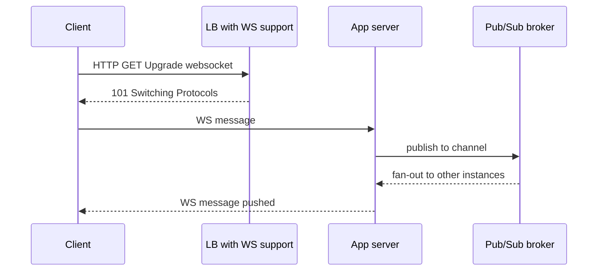

# WebSockets

## 1. One-Line Definition
WebSockets is a protocol that upgrades a normal HTTP connection (via the `Upgrade` handshake) into a single, full-duplex, long-lived TCP socket over which client and server can send messages to each other in real time.

## 2. Why Do We Need It?
HTTP is request/response: the server cannot push data without the client first asking. Real-time applications — chat, notifications, live cursors, gaming, dashboards — need the server to *initiate* delivery, and they need it with low latency and no per-message request overhead. WebSockets provides that persistent bidirectional channel with a message frame protocol built for exactly this.

## 3. Simple Intuition
HTTP is a phone call you make and hang up for every message — for chat you'd be dialing and redialing constantly, and you can't call *yourself* to hear updates anyway. WebSockets is a phone line you keep off-hook: both parties can talk anytime, and each small message travels on the already-open line. The cost is that the line stays busy — it's one connection held for the whole session.

## 4. What Happens Without It?
Without a push channel you resort to polling: clients re-ask the server on a timer (short polling) or hold HTTP requests open (long polling). Both waste bandwidth and latency budget on repeated handshakes and empty responses, and long-polling's per-message overhead makes a chat app with 1M concurrent users brutal on servers. Real-time correctness also degrades — messages arrive seconds late, and "live" is really "just checked."

## 5. Core Idea
- **Handshake:** client sends an HTTP GET with `Upgrade: websocket`; server responds `101 Switching Protocols` — the same TCP connection becomes a WebSocket.
- **Full duplex:** both directions flow asynchronously at any time, not request/response-bound.
- **Framing:** messages are small frames (text or binary) with minimal headers — no HTTP header per message.
- **Lifecycle:** ping/pong keepalive frames keep the connection warm and detect dead connections; either side can close (1000 normal, 1001 going away, etc.).
- **Subprotocols:** negotiate an app-level contract over the socket (e.g., `chat`, `graphql-ws`).
- **Statefulness:** a connection is a persistent channel, so it's a network slot that must be routed, held, load-balanced, and failed over — the state lives in the infrastructure, not just the app.
- **Where it fits:** the real-time *transport*; app-level ordering, fan-out, and history usually delegate to a pub/sub behind the socket (see event-driven-architecture).

## 6. Important Terminology

| Term | Simple Meaning |
|------|----------------|
| Upgrade handshake | HTTP request asking to switch to WebSocket; `101` confirms |
| Full duplex | Both directions can send at any time |
| Frame | The basic message unit (text/binary, few bytes of overhead) |
| Ping/Pong | Keepalive + liveness check frames |
| Close code | Reason for closing (1000 normal, 1001 going-away) |
| Subprotocol | Negotiated app contract on top of the socket |
| Reconnect | Client logic to re-establish after drops |
| Sticky session | Pin a connection to one backend so state stays local (see session-management) |
| Backpressure | Slowing a producer when the consumer can't keep up |

## 7. Basic Architecture



## 8. Request or Data Flow
1. Client upgrades: `GET /ws` with `Upgrade: websocket`; the LB accepts and routes the connection to an app node (with affinity/sticky routing so the node persists).
2. Client sends a message; the server processes it (auth, business logic).
3. Server pushes updates to the client — anytime, not in reply — over the same held connection.
4. If server instances may each hold different connections, fan-out happens via a pub/sub channel: instance A publishes, all instances (incl. the one holding the target client's socket) deliver.
5. Either side closes with a close code; client reconnects with backoff if it can.

## 9. Practical Example
**Chat app (assumptions):** 1M DAU, ~200k concurrent sockets, up to 100 instances.
- Each connection costs memory + a TCP socket: ~5-20KB of overhead each, so 200k sockets are a real but manageable footprint — you size for memory-per-socket, not requests-per-second.
- Messages: client → websocket → chat service → Kafka-esque pub/sub → every other instance → target clients' sockets. Ordering comes from the broker's partition; the sockets stay dumb pipes.
- Reconnect: on network flap, clients reconnect with exponential backoff; missed-history is recovered from a DB using a cursor, so no message is lost to the disconnected socket.

## 10. Scaling
- **Connection-heavy, not request-heavy:** scaling law is *concurrent open sockets × memory per socket*, not RPS. One box with a fixed thread budget hosts a fixed max sockets.
- **Load balancing:** LBs must support WebSocket upgrade, long-lived connections, and connection draining (planned) — otherwise idle timeouts kill live sockets. Sticky routing (or shared-stateless socket routers) is needed because the client's socket is pinned to a node.
- **Fan-out:** with N nodes and sockets distributed across them, one published message must reach all relevant sockets — a pub/sub/streaming bus per room/channel/zone is the standard answer. Also see [[consumer-lag|Consumer Lag]] for per-instance delivery backpressure.
- **Horizontal statelessness:** if you can keep *identity/topology* in the bus and only the socket in the node, adding nodes is just memory capacity.

## 11. Reliability and Failure Scenarios

| Failure | What Happens | Detection | Recovery | Trade-off |
|---------|--------------|-----------|----------|-----------|
| Node dies | Every socket it held dies; clients reconnect | Connection-count drop alert | Clients reconnect (backoff), replayed history | reconnect logic needed |
| LB idle-timeout | Quiet sockets silently killed | Drop diagnostics | Heartbeat/ping tuning; WS-aware LB config | — |
| Network blip | Half-open connections still "open" | Missing pong | Ping/pong liveness → close + reconnect | keepalive traffic |
| Broker lag | Messages delayed behind consumers | Consumer-lag metric | Scale consumers, shed | latency on fan-out |

## 12. Consistency and Correctness
WebSockets gives *ordered frames per connection* (TCP ordering); it does not promise app-level delivery guarantees. Robust designs treat the socket as an *unreliable pipe with reconnect*: maintain an explicit cursor/sequence for the client's last-delivered message, recover missed messages on reconnect (idempotent by message ID), and let the pub/sub layer own ordering guarantees — never assume "the socket is up" means "nothing missed."

## 13. Performance
- No per-message handshake: after the upgrade, per-message overhead is frame-only (a few bytes) — orders cheaper than HTTP polling.
- Use case-fit: WebSockets wins when messages are frequent and latency-sensitive; it loses to plain HTTP for rare, coarse updates (you hold an expensive wire open for nothing).
- Watch `concurrent connections`, `messages/sec`, and p99 end-to-end delivery; connection count is the capacity unit and the thing that tips a box.

## 14. Security
- Use `wss://` (TLS over websockets) — plain `ws://` leaks everything just like `http://`.
- **Origin checking:** verify the `Origin` header at handshake to stop cross-site WebSocket hijacking (CSWSH) — a malicious site opening a socket to your API with the victim's cookies.
- Authenticate at the upgrade: token in a header/query, not ambient cookies alone where possible; re-validate identity for every meaningful action, not just the handshake.
- Restriction: inputs are not "HTTP requests" — treat frames as untrusted payloads with the same injection/XSS discipline.

## 15. Trade-Offs

| Choice | Advantages | Disadvantages | When to Use |
|--------|------------|---------------|-------------|
| WebSockets | Full duplex, lowest per-message cost | One connection held per client, stateful infra | Chat, games, live cursors |
| SSE (server→client) | HTTP-compatible, auto-reconnect | One-way only (see server-sent-events) | Notifications, feeds |
| Long polling | Works over plain HTTP | Per-message handshake overhead | Compat/legacy realtime |
| Short polling | Dead simple | Wasteful, latency bound by interval | Rare, coarse updates |
| WebRTC/QUIC (planned) | P2P / UDP-friendly transport | More complex stacks | Video, low-loss tolerance |

## 16. Common Mistakes
- Forgetting the LB/ALB must support the Upgrades, ping timeouts, and connection draining — default LBs kill long-lived sockets.
- No heartbeat: idle sockets get reaped by middleboxes and nobody knows.
- Scaling math in RPS instead of concurrent connections and memory-per-socket.
- A message-ack gap: reconnect assumes the socket guarantees delivery, losing frames that were in flight.
- Treating every socket's state as node-local → failover and scaling become impossible without a shared bus.

## 17. HLD vs LLD Boundary
HLD: handshake/transport choice vs HTTP, connection-capacity plan (boxes = sockets), LB/WS-aware routing, fan-out architecture via pub/sub, reconnect + cursor design, keepalive policy. LLD: a specific frame handler, the reconnect library config, one channel's delivery cursor code in an app service.

## 18. Interview Questions

### Beginner
- What does the WebSocket handshake actually change between client and server?
- When is WebSockets the wrong tool compared to plain HTTP?

### Intermediate
- 1M users chat: how do you route and fan out messages when sockets live on different instances?
- What breaks if clients hold sockets through a load balancer that doesn't support WebSockets?

### Advanced
- Design reconnect logic that guarantees no missed messages during a node's failover.
- Design a backpressure mechanism for a node whose concurrency budget is exceeded by new sockets.

## 19. Interview Memory Summary

> [!abstract]- Interview Memory Summary

### Remember

- WebSocket = HTTP upgrade (101) → one full-duplex TCP channel.
- Trade-off: persistent bidirectional pipe vs one held connection per client.
- Scale by concurrent sockets × memory-per-socket; LB needs WS support + draining.
- Fan-out across instances goes through a pub/sub/streaming bus; sockets stay dumb.
- Reconnect is mandatory; treat delivery as at-least-once with a cursor/history.
- wss://, origin check, token auth at handshake.

### 30-Second Explanation

WebSockets upgrades HTTP into one persistent full-duplex socket: the client requests an upgrade, the server replies 101, and both sides push frames any time with negligible overhead. Scale is connection-bound (sockets × memory per socket), the load balancer must tolerate long-lived connections, multi-instance fan-out runs through a pub/sub bus, and clients must reconnect on drop with an explicit cursor because the socket is at-least-once, not exactly-once.

### Interview Traps

- Scaling in RPS for a connection-based protocol.
- Claiming the socket gives delivery guarantees or ordering beyond TCP frames.
- Designing with node-local state and no shared bus, then claiming horizontal scaling.
- Forgetting the LB/ALB's role in killing idle or upgrade-unsupported sockets.

### Key Trade-Off

WebSockets buys the lowest-latency bidirectional pipe at the cost of per-client long-lived state in the infrastructure — you swap cheap messages for expensive connections, and the architecture must remember a socket is a lease, not a promise.

## 20. Related Concepts

### Prerequisites

- [[http-and-https|HTTP and HTTPS]] — the handshake rides HTTP and borrows its security posture
- [[dns|DNS]] — resolving the host the upgrade request is sent to

### Commonly Used Together

- [[server-sent-events|SSE / Long Polling / Short Polling]] — the one-way and HTTP-compatible alternatives
- [[load-balancing|Load Balancing]] — how LB/ALB can and must handle long-lived connections
- [[reverse-proxy|Reverse Proxy]] — termination/upgrade pass-through at the edge
- [[session-management|Session Management]] — sticky affinity and identity over long-lived sockets
- [[message-queue|Message Queue]] / [[publish-subscribe|Publish-Subscribe]] — the fan-out bus behind the sockets
- [[event-driven-architecture|Event-Driven Architecture]] — the pattern the realtime layer fits into

### Alternatives

- [[webhooks|Webhooks]] — push in the other direction (server tells a client's endpoint), no open socket

### Advanced Concepts

- [[consumer-lag|Consumer Lag]] — per-instance delivery falling behind on the fan-out bus
- [[retry-and-timeout|Retry and Timeout]] — reconnect backoff and heartbeat deadlines

Related planned topics (not authored yet): tcp, network-latency, network-partition.

## 21. References
RFC 6455 (The WebSocket Protocol). The upgrade handshake and close codes are specified there; reuse guidance and HTTP-overlaps live in RFC 9110. Verify LB/proxy upgrade and draining behavior with vendor docs.

## 22. Active Recall

Test yourself before revealing each answer.

> [!question]- Basic understanding: what exactly does the upgrade handshake change?
> The client sends an HTTP GET with an `Upgrade: websocket` header; the server replies `101 Switching Protocols`, and the same TCP connection stops being HTTP and becomes a bidirectional WebSocket pipe — no new TCP connection is opened.

> [!question]- Design decision: 200k concurrent sockets on 100 nodes. What is the real capacity unit?
> Concurrent connections, not RPS: each socket holds TCP state plus app buffers (~5-20KB), so node capacity = memory/buffer-per-socket × thread/concurrency limits. You size boxes for simultaneous open sockets and plan reconnection storms when one node fails.

> [!question]- Trade-off: WebSockets vs long polling for the same chat feed.
> WebSockets: one persistent pipe, per-message overhead of a few bytes, but every client holds an open connection and infra must support long-lived/stateful routing. Long polling: works over plain HTTP and every proxy, but re-establishes the request per message — latency and handshake overhead scale with message rate. Choose sockets when messages are frequent and latency-critical.

> [!question]- Failure scenario: the LB kills idle sockets with a 60s idle timeout. Diagnose and fix.
> Symptom: clients "disconnect" silently after quiet periods. Cause: default LBs reap long-lived connections; plus without heartbeats the client can't tell. Fix: WS-aware LB with long/disabled idle timeout + connection draining, client/server ping/pong keepalive, and reconnect-with-backoff so the rare kill is a blip, not a log error.

> [!question]- Interview scenario: design reconnect logic so users miss no chat messages during a node failover.
> The socket is at-least-once delivery: on disconnect, reconnect with exponential backoff, then replay from the client's persisted cursor — asking the server for messages after that sequence — and dedup by message ID on any overlap. History lives in the DB/broker, not the socket, so reconnect is just a cursor catch-up.

> [!question]- Interview scenario: your realtime system fans one message to sockets distributed across 100 instances. Walk the design.
> The publishing instance writes to a pub/sub bus partitioned by room/channel; every instance consumes and delivers only to the sockets it holds for that channel; ordering per room comes from the bus partition; delivery is at-least-once so the client dedups/replays by cursor. The sockets never talk to each other — the bus is the meeting point.

## 23. When Should I Use This?

### Use it when

- The server must send frequent updates to many clients in near-real time (chat, live cursors, trading, gaming).
- Bidirectional messaging is the primary interaction pattern.
- Proxies/keyed route to nodes that lock in dedicated connections accept the statefulness cost.

### Avoid it when

- One-way updates suffice — SSE (in the same batch) is HTTP-compatible and auto-reconnects.
- Update rates are rare and coarse — plain HTTP polling or webhooks are cheaper than a held socket.
- Your infra/LB chain can't carry long-lived connections with draining.

### What problem does it solve?

Problem: HTTP is request/response, so the server can't push and per-message setup is expensive. Bottleneck: handshake overhead + latency for realtime traffic. Solution: a persistent full-duplex frame-based socket with minimal per-message cost, wired through a WS-aware edge and a pub/sub fan-out bus so any instance can reach any client.

### What problem does it NOT solve?

It doesn't provide delivery guarantees (that's your cursor/idempotency design), doesn't scale without a shared bus for multi-instance fan-out, and hiding behind NAT/firewalls can break inbound connects (see nat traversal) — the socket solves the transport, never the architecture around it.

## 24. Decision Connections

Decisions that go together with WebSockets:

- [[http-and-https|HTTP and HTTPS]] — the upgrade rides HTTP; TLS is the handshake's security floor (wss://).
- [[server-sent-events|SSE / Long Polling / Short Polling]] — the one-way alternatives when full duplex isn't needed.
- [[load-balancing|Load Balancing]] — must support upgrades, long-lived connections, and draining.
- [[reverse-proxy|Reverse Proxy]] — where the upgrade/termination often happens at the edge.
- [[session-management|Session Management]] — affinity, identity, and state over long-lived sockets.
- [[publish-subscribe|Publish-Subscribe]] / [[message-queue|Message Queue]] — the fan-out bus connecting all instances' sockets.
- [[event-driven-architecture|Event-Driven Architecture]] — the architectural pattern this slot fills.
- [[retry-and-timeout|Retry and Timeout]] — reconnect backoff and ping/pong deadlines.

Decision tree:

```
Server must push updates to clients in real time
    |
    +-- Bidirectional, frequent, latency-critical?
    |      → [[websockets|WebSockets]] (upgrade + pub/sub fan-out)
    |         |
    |         +-- One-way server-to-client only?  → [[server-sent-events|SSE / Long Polling / Short Polling]]
    |         +-- Reconnect-safe delivery?         → explicit cursor + at-least-once ([[retry-and-timeout|Retry and Timeout]])
    |         +-- Many instances, many sockets?    → [[publish-subscribe|Publish-Subscribe]] fan-out
    |         +-- Edge/LB must survive long-lived? → WS-aware [[load-balancing|Load Balancing]] + draining
    |
    +-- Rare, coarse updates or poor infra for sockets?
    |      → pattern polling or [[webhooks|Webhooks]]
    |
    +-- Async fire-and-forget with no socket?
           → [[message-queue|Message Queue]]
```