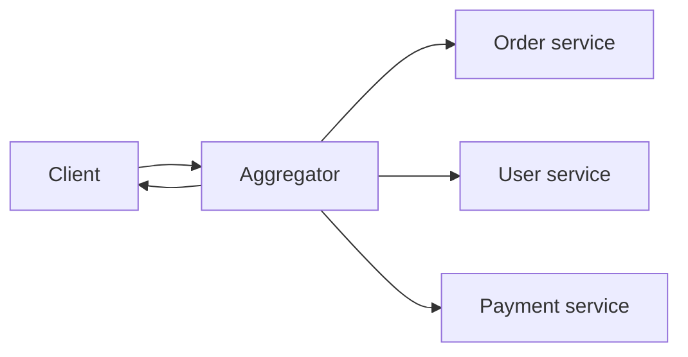

# API Composition

## 1. One-Line Definition
API composition is the pattern of building a single, ready-to-use response for a client by combining data from multiple backend services or upstream APIs — either on the client, in a dedicated aggregator, at the API gateway, or schema-driven through GraphQL.

## 2. Why Do We Need It?
Microservices fragment the data a single screen needs. An order-details page wants user info, order rows, payment status, and shipping — each living in a different service. Asking the client to call four services, in series, across the network is slow, chatty, and couples the client to internal topology. Composition moves that fan-out and merge somewhere smarter so the client gets one compact response.

## 3. Simple Intuition
A newspaper's front page. Reporters file stories from different desks — sports, finance, foreign — but the reader doesn't phone each desk. The editor assembles the pieces into one front page (fan-out), cuts each story to fit (shaping), and hands over one paper on schedule. The aggregator is that editor; the desks are the services.

## 4. What Happens Without It?
Every client speaks directly to every service: N round trips per screen, serialized — an order page in a 150ms-per-call world takes 600ms of pure network time. Payloads over-fetch (mobile clients download everything), and modest service renames or splits force every client app to change. Chatty, fragile, and slow, with the client holding the merge logic and partial-failure logic in its own code.

## 5. Core Idea
- **Client-side composition:** the mobile/web app calls each service in parallel and merges locally. Simplest, but eats device bandwidth, needs every service client-accessible, and pushes merge + failure logic into devices.
- **Aggregator service (server-side composition):** one dedicated service fans out to N downstream services, merges, shapes, and returns a single payload. The client does one call; the merge logic lives where it can be cached and tested. This is the classic "aggregation layer."
- **Gateway composition:** the API gateway stitches responses at the edge for cross-cutting needs (auth-bundled request, minimal reshaping) but stays product-agnostic — no business logic.
- **BFF composition:** each client type gets its own dedicated backend that composes for *that* client ([[backend-for-frontend|Backend for Frontend]]) — the sharpest shaping.
- **GraphQL:** schema-driven composition where the client declares exactly which fields of which entities it wants; resolvers fan out per field, batched via data loaders.
- **Parallelism and partial failure are the design:** fan-out in parallel (not serial), each with its own timeout, and a stated policy for when one upstream fails — fail whole, or return the good parts with degraded markers.

## 6. Important Terminology

| Term | Simple Meaning |
|------|----------------|
| Aggregator | Single service that merges data from several services |
| Fan-out | Sending one request to several backends in parallel |
| Fan-in / merge | Combining their responses into one payload |
| N+1 problem | One screen triggering one request per child item |
| GraphQL resolver | Function that fetches one slice of the schema |
| Data loader | Batches resolver calls within a request window |
| Payload shaping | Trimming/transforming response fields per client |
| BFF | Per-client-type composition backend ([[backend-for-frontend|Backend for Frontend]]) |

## 7. Basic Architecture



## 8. Request or Data Flow
1. Client submits one request to the aggregator for "order details for id 42."
2. Aggregator fans out in parallel: order metadata, user profile, payment status — each with its own timeout.
3. Fastest case: all three return; the aggregator merges and shapes the response.
4. Partial failure: an upstream times out → policy decides (all-or-nothing, or degrade with `"paymentUnavailable": true`), traced with a correlation id.
5. Client renders from one payload — one round trip, one error surface.

## 9. Practical Example
An order-details screen needs three services: order (50ms), user (30ms), payment (70ms).
- No composition: three serial calls ≈ 150ms + three round trips + client merge.
- Client-side parallel composition: max(50,30,70) = 70ms, but mobile still hits three endpoints and merges on-device.
- Aggregator: 70ms + merge overhead ≈ 80ms in one round trip; the merge code is server-side, cacheable, and testable; a $0.01-precision timeout on each fan-out bounds the case where one upstream tarpits.

## 10. Scaling
- The aggregator is on every screen's hot path — it must scale like your most-viewed API and stay stateless ([[stateless-vs-stateful-services|Stateless vs Stateful Services]]).
- Fan-out multiplies downstream load by the fan-out factor: 1 order-page request = 3 downstream calls. Keep that in capacity math and co-running QoS (bulkheads).
- Cache composed responses per resource+version ([[caching|Caching]]); invalidate on the underlying data change to keep the aggregate coherent.
- Avoid N+1: never compose by looping per item — batch item lookups into one downstream call, or the three-service example becomes 3×items calls.

## 11. Reliability and Failure Scenarios

| Failure | What Happens | Detection | Recovery | Trade-off |
|---------|--------------|-----------|----------|-----------|
| One upstream down | Aggregated response degraded | Per-upstream error rate | Degrade partial data, mark fields | partial vs failed |
| Upstream tarpit | Fan-out held hostage | Per-call timeout ([[api-timeouts|API Timeouts]]) | Cap each branch with its own budget | tight timeouts |
| Three upstreams flapping | Aggregator flaps 3x | Error-rate + circuit state | [[circuit-breaker|Circuit Breaker]] per upstream | breaker complexity |
| Downstream change | Aggregator breaks silently | Contract tests | Contract-first discipline ([[contract-first-design|Contract-First Design]]) | schema governance |

## 12. Consistency and Correctness
**Temporal skew is inherent:** the three fields were read at slightly different times — an order that just shipped can pair with a payment snapshot from milliseconds earlier. Decide and document the acceptable skew.
- Aggregates that must never show mixed state (e.g. cart vs cart prices) need a single source of truth, or move that read to one service.
- Caching makes skew worse: invalidate the aggregate when any member data changes, or accept bounded staleness with a TTL ([[strong-vs-eventual-consistency|Strong vs Eventual Consistency]]).

## 13. Performance
- Parallel fan-out dominates latency: total ≈ slowest branch + merge, not the sum.
- Payload shaping cuts bandwidth on mobile. Over-fetch is the silent cost of unshaped composition.
- Data loaders (GraphQL) enable dedup within a request — 100 order items resolved as one batched query instead of 100.
- Each merged call adds serialization/deserialization overhead; keep the merge cheap and cache hot aggregates.

## 14. Security
- The aggregator is a choke point — apply authorization once per aggregate (the client shouldn't need per-service credentials), and see [[authentication-vs-authorization|Authentication vs Authorization]].
- Never pass the client's request blindly to N services: validate, then map a minimal internal token per downstream (least privilege).
- The composed response must not leak one tenant's data into another's via a careless fan-out keyed on unvalidated input.

## 15. Trade-Offs

| Pattern | Advantages | Disadvantages | When to Use |
|---------|------------|---------------|-------------|
| Client-side composition | No new service, flexible | Bandwidth, merge logic on devices, service exposure | Small apps, few services, no mobile constraint |
| Aggregator service | One call, testable merge, cacheable | Extra hop + service to run | Multi-service reads on hot paths |
| Gateway composition | Edge location, auth/ratelimit integrated | No business logic allowed, gets bloated | Cross-cutting stitch, not product shaping |
| BFF | Best per-client shaping ([[backend-for-frontend|Backend for Frontend]]) | One backend per client type | Multiple distinct client apps |
| GraphQL | Client-declared fields, batched resolvers | N+1 hides in resolvers, caching hard, complexity | Rapidly evolving heterogeneous clients |

## 16. Common Mistakes
- Serial fan-out — killing the parallelism the pattern exists for.
- One slow upstream blocking the whole aggregate (no per-branch timeout).
- Ignoring partial failure: no policy, so a good 2/3 of the data is thrown away when one service blips.
- N+1 loops: composing a list by one request per item — the classic GraphQL and aggregator bug.
- Business logic in a gateway that belongs in a BFF or service.
- No caching and no contract tests, so the aggregate is slow and breakage is silent.

## 17. HLD vs LLD Boundary
HLD: which pattern (client/aggregator/gateway/GraphQL), fan-out strategy, per-branch timeout budgets, partial-failure policy, aggregate caching, which service owns the merge. LLD: the resolver function, the parallel-call code, the merge serializers, the data-loader batch window.

## 18. Interview Questions

### Beginner
- What problem does API composition solve and where does the merge happen in each pattern?
- Why is fan-out-before-merge usually parallel rather than serial?

### Intermediate
- An order page needs four services. Walk the choice between an aggregator and a GraphQL layer, with the trade-offs.
- One of the four services is down. What should the composed response do?

### Advanced
- Design to kill the N+1 problem in a GraphQL "orders → items" resolver at high QPS.
- The aggregated view mixes data read at different times. How do you define and bound acceptable skew, and what breaks if you cache it?

## 19. Interview Memory Summary

> [!abstract]- Interview Memory Summary

### Remember

- Composition = fan out + merge + shape into one response.
- Patterns: client-side, aggregator, gateway, BFF, GraphQL — choose by who holds the merge.
- Parallel fan-out ≈ slowest branch, not the sum, so the client waits ~80ms, not ~200ms.
- Partial failure needs an explicit policy — degrade gracefully or fail whole.
- The aggregator is on every hot path: it must scale, cache, and stay stateless.
- N+1 is the #1 correctness/performance trap in composition.
- Skew (data read at different times) is inherent; bound and document it.

### 30-Second Explanation

A composite API takes one client request and fans it out to the services that own the data, merging and shaping the results into a single payload. Run the fan-out in parallel so latency tracks the slowest branch; give each branch its own timeout so one tarpit can't hold the aggregate hostage; state a partial-failure policy; cache hot aggregates. Pick client-side for tiny apps, an aggregator for hot server-side reads, BFF for per-client shaping, and GraphQL when clients need to self-select fields — and never write an N+1 loop.

### Interview Traps

- Serial fan-out (defeats the whole point) or no per-branch timeout.
- No partial-failure policy: an 80%-good response thrown away.
- N+1 — resolving a list one item at a time.
- Claiming the aggregate is consistent when its fields were read milliseconds apart.
- Business logic smuggled into the API gateway.

### Key Trade-Off

You trade a round-trip and merge complexity for the client's benefit of one shaped payload; the price is a new hot-path service (or GraphQL's resolver complexity), so cache hard and bound each fan-out leg.

## 20. Related Concepts

### Prerequisites

- [[latency-vs-throughput|Latency vs Throughput]]
- [[reverse-proxy|Reverse Proxy]]

### Commonly Used Together

- [[backend-for-frontend|Backend for Frontend]] — composition specialized per client type
- [[stateless-vs-stateful-services|Stateless vs Stateful Services]] — the aggregator stays stateless
- [[circuit-breaker|Circuit Breaker]] and [[api-timeouts|API Timeouts]] — bounding fan-out legs
- [[caching|Caching]] — caching the merged view
- [[contract-first-design|Contract-First Design]] — the aggregate's response is a contract

### Alternatives

- Letting the client compose directly (no aggregator, more bandwidth/chattiness)
- GraphQL schema-driven composition (RPC/GraphQL, planned)

Related planned topics (not authored yet): API gateway, RPC / gRPC / GraphQL, fan-out and aggregation, microservices.

## 21. References
Martin Fowler, "Patterns for microservices: Aggregator" (aggregation); the GraphQL specification; Google Cloud API design guide (composition and resource design). All real, verifiable sources.

## 22. Active Recall

Test yourself before revealing each answer.

> [!question]- Basic: what exactly does "composition" add compared with the client calling services directly?
> A single seam that fans out, merges, and shapes — so the client makes one round trip instead of N, the merge logic is server-side (testable, cacheable, shareable across clients), and clients don't couple to internal service topology or payloads. The composition seam owns parallelization and partial-failure policy too.

> [!question]- Design: four services, each p50 40ms and p99 300ms. What latency should the aggregator promise?
> Synchronous sequential ≈ 160ms p50 and 1200ms p99; parallel ≈ 40–300ms plus merge. Design for the parallel path: total ≈ slowest branch + merge overhead, so promise ~350-400ms at p99 with per-branch timeouts, and cache the hot aggregates to flatten peaks. The sum-of-latencies number is precisely what you're eliminating.

> [!question]- Trade-off: aggregator service vs API gateway composition — who does what?
> The aggregator is a real service with product logic: it knows order+user+payment semantics, holds the merge code, and can cache. The gateway composes at the edge without business meaning — auth, routing, minimal stitching. Putting business merge logic in the gateway bloats it and duplicates the aggregator; putting nothing in the gateway loses the edge benefits.

> [!question]- Failure: one upstream is flapping; the other two are healthy. What should the aggregate return, and how do you keep the flapper from spreading?
> Apply a per-branch timeout so the flapper can't stretch the aggregate latency, and a circuit breaker so attempts stop accumulating on the dead service; then apply the stated partial-failure policy — common choice: return the healthy fields with an explicit "paymentsUnavailable" flag, trace id in tow. Never let one leg destroy a response worth 2/3 of its data.

> [!question]- Interview scenario: order list renders one request per item and everyone is complaining about latency. What's wrong and the fix?
> It's the N+1 problem: the screen fan-out multiplied by item count, so 100 items = 100+ merged calls. Fix: batch item lookups into one or a few downstream calls; for GraphQL, use data loaders so resolvers share a batched query within the request window; for REST aggregators, add a list endpoint on the deep service and compose one call at list level.

> [!question]- Design: how do you keep a cached aggregated view from showing stale membership?
> Cache the aggregate keyed by subject + version and invalidate on any member's data change, or bound staleness with a TTL and declare it. When mixed-time reads must look coherent (cart vs prices), route that read to a single source of truth instead of composing it — composition is for view data, not for the data you transact on.

> [!question]- Basic: why is parallel fan-out latency roughly the slowest branch rather than the sum?
> Because the branches run concurrently: the wall-clock time of a parallel wait is the maximum of the branch times, plus merge. Only serial calls accumulate. The fastest leg finishes and idles (or starts merge-shaping) while the slowest leg completes — that's the entire point of the pattern.

## 23. When Should I Use This?

### Use it when

- A single client screen genuinely needs data from several services and one round trip materially improves the experience.
- The merge logic (shape, defaults, failure policy) is worth putting where it can be tested, cached, and reused rather than duplicated per client.
- Different client types need different subsets of the same composition (pair with BFF).
- Clients can't or shouldn't reach internal services directly.

### Avoid it when

- One service already returns everything needed — composition is pure overhead.
- The composed data must be transactionally consistent — build the transaction in the owning service, don't stitch it.
- Your only problem is latency inside one service; fix the service first, then decide if an aggregator helps.
- The "aggregator" would simply pass through with no merge or shaping — that's a proxy, not composition.

### What problem does it solve?

One client screen, many services: it cuts chatty N-round-trip access to one shaped response, keeps merge and failure logic server-side, and stops clients from coupling to internal service topology.

### What problem does it NOT solve?

It cannot make data from different systems transactionally consistent — the read-time skew is inherent and must be bounded, documented, or routed to a single source of truth. It doesn't write: composition is a read-side aggregation, not a replacement for distributed write coordination.

## 24. Decision Connections

Decisions that go together with API composition:

- [[backend-for-frontend|Backend for Frontend]] — the composition seam specialized per client type.
- [[api-timeouts|API Timeouts]] — every fan-out leg needs its own budget or one tarpit owns the aggregate.
- [[circuit-breaker|Circuit Breaker]] — stop fan-out attempts to a dead upstream.
- [[caching|Caching]] — the merged view is the single most cacheable object in the system.
- [[stateless-vs-stateful-services|Stateless vs Stateful Services]] — the aggregator must stay horizontally stateless.
- [[latency-vs-throughput|Latency vs Throughput]] — why parallel beats serial in the math.
- [[contract-first-design|Contract-First Design]] — the aggregate's response contract changes for everyone at once.
- [[error-handling|Error Handling]] — partial-failure policy is expressed through the error contract.

Decision tree:

```
Client needs data from several services for one screen
    |
    +-- One service already has it all?
    |      → no composition; call it directly
    |
    +-- Needs transactional consistency across the data?
    |      → compose in the owning service or async; don't stitch writes
    |
    +-- Multiple distinct client apps with different needs?
    |      → [[backend-for-frontend|Backend for Frontend]]
    |
    +-- Clients need to self-select fields?
    |      → GraphQL (planned: RPC/gRPC/GraphQL) with data loaders
    |
    +-- Few clients, small payloads?
    |      → client-side composition
    |
    +-- Hot server-side reads, many services?
    |      → aggregator service
    |         +-- Cross-cutting (auth/routing) only?  → API gateway (planned)
    |         +-- Fan-out in parallel, per-leg timeouts, partial-failure policy
```