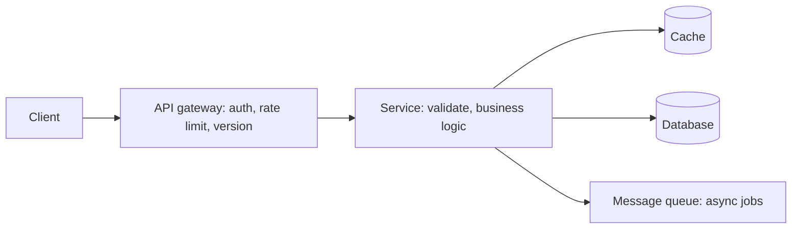

# API Design Principles

## 1. One-Line Definition
API design principles are the rules for shaping an interface between systems — resource modeling, naming, method usage, error behavior, and evolution strategy — so the API is predictable, easy to consume, and safe to change.

## 2. Why Do We Need It?
An API is a contract: every consumer writes code against it, and consumers far outnumber the team that owns the interface. A badly shaped contract generates integration bugs, support tickets, security slips, and breaking changes that ripple to every client. Good principles keep the surface small, consistent, and extension-friendly so the API can grow without rewriting the world.

## 3. Simple Intuition
Think of a restaurant menu. The dish names are nouns, the options are uniform ("make it spicy"), the price is predictable, and you can swap a side without the kitchen redesigning. A menu with unclear names (is "House Salad" v1 or v2?) and surprise errors ("we don't serve that") produces confused customers and angry kitchen staff. The menu is your public contract; the kitchen is your service.

## 4. What Happens Without It?
Endpoints get invented ad hoc: one team exposes `getUsers`, another `/users/fetch_all`, errors return "Error 123" with a different meaning per resource. Clients hard-code workarounds, retries double-charge because POST is assumed safe, responses with no pagination time out, and every internal rename breaks strangers. The cost is paid twice: once during integration, once forever during evolution.

## 5. Core Idea
- **Resources as nouns + methods as verbs.** Model the domain as addressable resources (`/users/42`); use HTTP methods for actions. Avoid `/users/getUser`.
- **Uniform interface and consistent conventions.** Same pagination, filtering, error, and naming style on every endpoint. Consistency is what makes an API learnable.
- **Meaningful status codes.** 2xx success, 4xx client fault, 5xx server fault. Errors carry a stable code and a machine-readable body, not a wall of text.
- **Design for evolution.** Assume every endpoint will change. Prefer additive changes, version the contract, and keep old behavior until consumers migrate.
- **Safe mutation semantics.** Idempotent operations for retry-friendly writes; explicit POST for creates and actions.
- **Security and throttling by default.** Authentication and authorization on every route, TLS everywhere, rate limiting at the edge, never leak internals.
- **Document the contract.** OpenAPI-style specs turn the API into a typed, testable artifact rather than tribal knowledge.

## 6. Important Terminology

| Term | Simple Meaning |
|------|----------------|
| Contract | The agreed shape of requests and responses between systems |
| Resource | A named entity you can address, e.g. a user or order |
| Endpoint | One method + path combination on a resource |
| Payload | The request or response body |
| Status code | Three-digit result: 2xx, 4xx, 5xx |
| Idempotent operation | Repeating it yields the same effect as doing it once |
| Pagination | Splitting a large result set across responses |
| Versioning | A scheme for evolving the contract without breaking consumers |
| OpenAPI spec | A documented, machine-readable API contract |

## 7. Basic Architecture



## 8. Request or Data Flow
1. Client sends a well-formed request over HTTPS to the gateway.
2. Gateway authenticates the caller, checks rate limits, and routes to the right service version.
3. Service validates the payload, applies business rules, and reads or writes storage.
4. Expensive side effects fan out to a queue; the synchronous path returns a fast result.
5. On failure the service returns a structured error: correct status class, stable code, no stack traces.

## 9. Practical Example
**Video service:** `POST /videos` (multipart upload) returns `201 Created` plus a `Location: /videos/abc123` header. `GET /videos/abc123` returns status fields. List comes back as `GET /videos?cursor=...&limit=20` with a next-cursor. Failures return a JSON error body `{"code":"video_too_large","message":"..."}` with a 4xx/5xx status. Every mutating call accepts an `Idempotency-Key` header so retries are safe.

## 10. Scaling
- **Stateless services scale horizontally** behind a [[load-balancing|Load Balancing]] and [[reverse-proxy|Reverse Proxy]] layer — keep session state out of the API.
- **Limit work per request.** Pagination bounds payload size; without it one listing request can melt a database.
- **Cache aggressively on GET** (see [[caching|Caching]] and [[cdn|CDN]]) since reads dominate most systems.
- **Offload cross-cutting concerns** — authn, rate limiting, TLS, canary routing — to the [[api-gateway|API Gateway]] so services stay thin.
- **Long work becomes async.** Video encoding, reports, and batch exports move to a [[message-queue|Message Queue]]; the API returns a job id and a status endpoint.

## 11. Reliability and Failure Scenarios

| Failure | What Happens | Detection | Recovery | Trade-off |
|---------|--------------|-----------|----------|-----------|
| Backend timeout | Request hangs or 504s | Timeout + tracing | Retry with backoff via [[retry-and-timeout|Retry and Timeout]] | added latency |
| Duplicate write on retry | Side effect applied twice | Duplicate key observed | [[idempotency|Idempotency]] keys | storage + logic |
| Data corruption in error path | Bad payload silently saved | Validation + schema checks | Reject early, code errors, not strings | stricter contract |
| Downstream dependency down | Partial responses, confusion | Circuit breaker | Import [[circuit-breaker|Circuit Breaker]], degrade gracefully | complexity |

## 12. Consistency and Correctness
- Mutations must be **idempotent or guarded** so retries cannot corrupt state; [[idempotency|Idempotency]] keys cover the ambiguous "did it commit?" window.
- Reads may be eventually consistent behind replicas — the API must say so or provide read-your-writes when it matters (see [[replication-lag|Replication Lag]]).
- Error schemas must be stable: consumers switch on error codes, so codes must not be cosmetic and should never change meaning.

## 13. Performance
- GET caching, pagination, and gzip keep payloads small; with base64-heavy uploads prefer chunking.
- Avoid N+1: provide batch or composed endpoints rather than forcing clients to issue many round trips — every extra call costs a LAN/RTT at best.
- Reuse connections (keep-alive, [[database-connection-pooling|Database Connection Pooling]] style) and keep the hot path single-round-trip.
- Keep the CPU-per-request budget small; estimate with [[capacity-estimation|Capacity Estimation]] and watch [[latency-vs-throughput|Latency vs Throughput]].

## 14. Security
- TLS for everything in transit; see [[encryption-and-keys|Encryption and Keys]].
- Authenticate callers and authorize per route — [[authentication-vs-authorization|Authentication vs Authorization]]; token-based flows across systems are the norm ([[oauth-oidc-jwt|OAuth 2.0 / OIDC / JWT]]).
- Validate and escape all input (see [[web-vulnerabilities|Web Vulnerabilities]]); reject unknown fields instead of silently ignoring them.
- Enforce rate limits ([[rate-limiter|Rate Limiter]]) and never leak stack traces, internal paths, or secrets in error bodies.

## 15. Trade-Offs

| Choice | Advantages | Disadvantages | When to Use |
|--------|------------|---------------|-------------|
| Fine-grained endpoints | Simple, focused | Chattier, more round trips | Internal services |
| Coarse/batch endpoints | Fewer round trips | Complex contract, caching harder | Mobile, BFF-style consumers |
| Strict typed errors | Predictable handling | More spec work | Public APIs |
| Loose string errors | Fast to ship | Clients can't automate recovery | Internal prototypes |
| Strict versioning | Safe evolution | Version sprawl, support load | Public APIs with many consumers |

## 16. Common Mistakes
- Verbs in URLs (`/users/get`, `/users/delete`) instead of nouns + HTTP methods.
- Meaningless status codes (always 200 with a "success:false" body) that break caches, proxies, and error handling.
- No pagination on list endpoints, causing unbounded responses and timeouts at scale.
- Treating POST as retry-safe — double-charges and duplicate side effects.
- Leaking internal identifiers, stack traces, and framework errors to consumers.

## 17. HLD vs LLD Boundary
HLD: the resource model, method-to-operation mapping, status code semantics, error schema, versioning strategy, and pagination/filtering conventions. LLD: the framework routes, DTOs, validator rules, and middleware wired to implement that contract in a specific service.

## 18. Interview Questions

### Beginner
- What makes an API "good" from the caller's perspective?
- Why should mutating operations aim for idempotency?

### Intermediate
- You're designing a public REST API. Walk through your naming, error, and pagination conventions.
- When would you add a coarse/batch endpoint even though fine-grained APIs are simpler?

### Advanced
- Design the versioning and deprecation policy for an API with 500 external consumers.
- How does enforcing strict error codes change how clients, SDKs, and monitoring evolve?

## 19. Interview Memory Summary

> [!abstract]- Interview Memory Summary

### Remember

- An API is a contract; consumers outnumber the owner.
- Resources are nouns; HTTP methods are verbs; no verbs in URLs.
- Consistent conventions (naming, errors, pagination) make an API learnable.
- Status codes carry meaning: 2xx, 4xx, 5xx — and error bodies are structured.
- Design for evolution: additive first, versioning when it breaks.
- Mutations are idempotent or guarded so retries are safe.
- Authn, rate limiting, TLS, caching are defaults, not afterthoughts.
- Scale via stateless services + gateway + pagination + async.

### 30-Second Explanation

Model your domain as addressable resources, act on them with HTTP methods, and keep every convention (naming, errors, pagination, versioning) uniform across the whole API. Make mutations safe against retries, guard the API with authn/rate-limiting/TLS, and design the contract to evolve additively so consumers never break.

### Interview Traps

- Saying "200 means success" with errors smuggled in the body.
- Inventing RESTable paths like `/users/getUser` and calling it REST.
- Ignoring the retry problem until the payments system double-charges.
- Claiming you'll "just version it later" without a policy.

### Key Trade-Off

An expressive, predictable contract costs upfront design and stricter discipline; the payoff is dramatically cheaper integration, evolution, and debugging across all consumers.

## 20. Related Concepts

### Prerequisites

- [[http-and-https|HTTP and HTTPS]]
- [[system-design-fundamentals|System Design Fundamentals]]

### Commonly Used Together

- [[rest|REST]]
- [[api-gateway|API Gateway]]
- [[api-versioning|API Versioning]]
- [[pagination|Pagination]]
- [[idempotency|Idempotency]]

### Alternatives

- [[rpc-grpc-graphql|RPC / gRPC / GraphQL]] (other interface styles for the same contract problem)

### Advanced Concepts

- [[rate-limiter|Rate Limiter]]
- [[reverse-proxy|Reverse Proxy]]
- [[load-balancing|Load Balancing]]

Related planned topics (not authored yet): contract-first design, error handling and retryable vs non-retryable errors, request deduplication.

## 21. References
Fielding's REST dissertation (UC Irvine) for the architectural roots. Google Cloud API Design Guide for practical naming and versioning rules. OpenAPI spec documentation for contract-first tooling. Verify conventions against your platform's API guidelines.

## 22. Active Recall

Test yourself before revealing each answer.

> [!question]- Basic Understanding: What is an API contract and why does it matter?
> A contract is the agreed shape of requests and responses. It matters because consumers compile, test, and operate against it; changing it silently breaks strangers, so the contract must be stable and evolve deliberately.

> [!question]- Design Decision: Restful or not, what is the first decision you make when shaping a new API?
> The **resource model** — the nouns and their relationships (`/users/42/orders`). Everything else (methods, status codes, pagination, versioning) hangs off that model; wrong nouns produce wrong endpoints no matter how clean the plumbing is.

> [!question]- Trade-Off: Fine-grained vs coarse endpoints — what do you actually trade?
> Latency and complexity. Fine-grained endpoints are simple and cacheable but chatty (many round trips); coarse endpoints cut trips but bundle semantics, complicate caching, and make the contract harder to evolve.

> [!question]- Failure Scenario: A retry of a payment POST double-charges a customer. What principle was violated?
> Idempotency of mutations. A correct design accepts an [[idempotency|Idempotency]] key so duplicate requests carry the same key and the server applies the effect once, returning the original result.

> [!question]- Interview Scenario: An interviewer asks you to design the user-facing API for a social app in two minutes. What do you enumerate?
> 1. Resources and nesting (users, posts, comments).
> 2. Canonical endpoints and the HTTP method per operation.
> 3. Error schema and status code classes.
> 4. List convention: pagination style, filtering, sorting.
> 5. Versioning and idempotency policy, then authn/authz and rate limiting at the gateway.

> [!question]- Design Decision: Why push authn, rate limiting, and TLS to a gateway instead of each service?
> Cross-cutting concerns are orthogonal to business logic; centralizing them keeps services thin, consistent, and independently scalable, and gives one choke point for enforcement and auditing.

> [!question]- Trade-Off: Strict typed error codes vs loose human-readable errors.
> Strict codes let clients automate handling and tests stay meaningful, at the cost of more spec and governance. Loose errors ship faster but force every consumer to parse prose — they rot the moment the API grows.

> [!question]- Failure Scenario: Your list endpoint returns 1M rows because nobody paginated. What breaks, in order?
> Response size and latency grow linearly, the client times out or OOMs, the database runs a huge scan under one request, and a spike of such calls creates an outage — pagination and bounded defaults prevent the whole chain.

> [!question]- Interview Scenario: "Should we version a private internal API?" Give a nuanced answer.
> Internal APIs can often afford additive-change-only policy and skip explicit versioning, but the moment your internal consumers stop deploying in lockstep — a common growth failure — you need a versioning story anyway. Treat versioning as a tool for decoupling consumers, not a badge.

## 23. When Should I Use This?

### Use it when

- You are exposing an interface to consumers you do not control.
- The API will be a long-lived contract (public, partner, or cross-team).
- Multiple teams build clients and servers independently.
- You need security, caching, and throttling applied uniformly.

### Avoid it when

- The interface is a temporary internal shim with a single caller — principles still apply but skip the ceremony.
- You need client-driven queries over many shapes of data (prefer [[rpc-grpc-graphql|GraphQL]]).
- The interaction is one-off streaming or binary-heavy (prefer gRPC).

### What problem does it solve?

It makes an interface predictable, consistent, secure, cacheable, and evolvable so many consumers can integrate once and stay integrated as the system grows.

### What problem does it NOT solve?

It doesn't fix throughput (that needs architecture and scaling), it doesn't guarantee correctness under retries (that needs explicit idempotency and consistency design), and it doesn't choose the interface style for you — REST, gRPC, and GraphQL each have their own trade-offs.

## 24. Decision Connections

Decisions that go together with API design principles:

- [[rest|REST]] — the dominant style realizing these principles over HTTP.
- [[rpc-grpc-graphql|RPC / gRPC / GraphQL]] — alternative styles; principles travel but conventions differ.
- [[api-gateway|API Gateway]] — where cross-cutting requirements (auth, rate, versioning) are enforced.
- [[api-versioning|API Versioning]] — the evolution policy your contract needs.
- [[pagination|Pagination]] and [[filtering-sorting-searching|Filtering / Sorting / Searching]] — the list conventions every resource establishes.
- [[idempotency|Idempotency]] — how you make mutations safe against retries.
- [[http-and-https|HTTP and HTTPS]] — the transport the whole contract sits on.
- [[stateless-vs-stateful-services|Stateless vs Stateful Services]] — statelessness is a prerequisite for scaling the API layer.

Decision tree:

```
Shaping a new API
    |
    +-- Many client-shaped queries, flexible fields?
    |      → [[rpc-grpc-graphql|RPC / gRPC / GraphQL]]
    |
    +-- High-throughput binary/streaming RPC?
    |      → [[rpc-grpc-graphql|RPC / gRPC / GraphQL]]
    |
    +-- Standard request/response CRUD over HTTP?
    |      → [[rest|REST]]
    |         |
    |         +-- Consumers outside your org?  → formal versioning, strict errors
    |         +-- Lists on every resource?     → [[pagination|Pagination]]
    |         +-- Mutations retried?           → [[idempotency|Idempotency]]
    |
    +-- Cross-cutting concerns everywhere?
           → put them in the [[api-gateway|API Gateway]], not the services
```