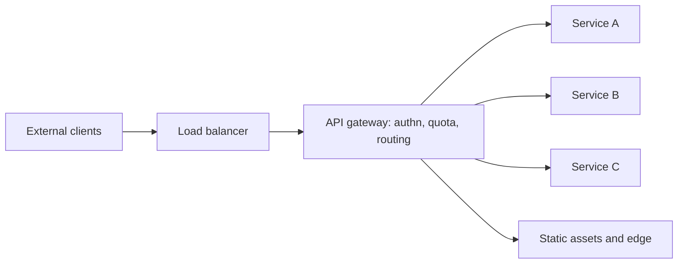

# API Gateway

## 1. One-Line Definition
An API gateway is a single, dedicated entry point in front of a set of services that terminates external traffic and centralizes cross-cutting concerns — routing, authentication, rate limiting, versioning, aggregation, and protocol translation.

## 2. Why Do We Need It?
With many services, clients would otherwise talk to each one directly: every consumer reimplements authn, retries, and URL handling; APIs leak inconsistent versions; and internal topology (hostnames, ports, canary deployments) is exposed publicly. A gateway gives you one address to operate, one place to enforce policy, and a decoupling seam between the outside world and a fast-moving internal architecture.

## 3. Simple Intuition
The gateway is the front desk of a company. Visitors don't wander office corridors (they shouldn't know where accounting sits); they check in at one desk, prove who they are, get pointed to the right department, and are limited by what their badge allows. The company can shuffle offices around freely as long as the front desk routes correctly.

## 4. What Happens Without It?
Clients hard-code service URLs and hostnames that leak internals; every service implements its own authentication, rate limiting, and versioning inconsistently — or not at all; each new service means every client updates everywhere; and a canary or failing service becomes instantly visible to the world. You get a brittle, inconsistent, insecure surface.

## 5. Core Idea
- **Single entry point** → one public address, one TLS terminator, one place to enforce policy.
- **Routing:** path/header-based dispatch to the right service — `GET /api/orders/*` → orders-svc, `GET /api/users/*` → users-svc.
- **Cross-cutting concerns, centralized:** authentication and header injection ([[authentication-vs-authorization|Authentication vs Authorization]]), [[rate-limiter|Rate Limiting]], request validation, CORS, logging, request id generation for [[distributed-tracing|Distributed Tracing]].
- **Traffic shaping:** canary/shadow routing, canary % via traffic weight, circuit-breaking and retries toward backends ([[circuit-breaker|Circuit Breaker]]).
- **Protocol and format translation:** external REST/HTTP/JSON in, internal gRPC or Thrift out (see [[rpc-grpc-graphql|RPC / gRPC / GraphQL]]).
- **Aggregation / BFF:** fan-in several services into one tailored response for a client type; distinct per-frontend gateways (BFF pattern).
- **Tension to manage:** the gateway is a new bottleneck, a new failure mode, and a place policy calcifies — route fat vs thin deliberately.

## 6. Important Terminology

| Term | Simple Meaning |
|------|----------------|
| Gateway | One public entry that fronts many services |
| Reverse proxy | Low-level forward of traffic to backends |
| Edge | The boundary between external clients and your network |
| Routing | Mapping request paths/headers to backend services |
| Protocol translation | Converting external format to internal (e.g. REST↔gRPC) |
| Aggregation | Fan-in many backends into one response |
| BFF | Backend for Frontend — a per-client-type gateway |
| Canary / shadow | Routing tiny real traffic to a new version |
| Request id | Traceable correlation header per request |
| Throttling / quota | Per-identity limits on calls |

## 7. Basic Architecture



## 8. Request or Data Flow
1. Client calls `https://api.example.com/v1/orders/42` with a token.
2. Load balancer terminates TLS and forwards to a gateway instance.
3. Gateway authenticates the token, checks rate/quota for the caller, injects identity headers.
4. It rewrites/forwards the request to `orders-svc` per the routing table (possibly translating protocol).
5. On failure or slow backend it applies retry/circuit-breaker policy; on success it streams the response back, logging a request id.

## 9. Practical Example
**E-commerce platform, 40 microservices, 3 device types.**
- One public host `api.example.com` fronts order, catalog, auth, and inventory services; `/v1/*` maps by path.
- Gateway authn means ciphering lives in one place; mobile gets a per-client BFF that aggregates product+inventory in one response (1 call instead of 3).
- Launch of catalog v2: gateway sends 5% of traffic to the canary; on a spike of 5xx it immediately reverts and returns the circuit breaker's fallback.
- Numbers: gateway caches catalog GETs at the edge ([[cdn|CDN]]), absorbing 70% of read traffic before any service is touched (see [[caching|Caching]]).

## 10. Scaling
- **Stateless gateway scales horizontally** behind the LB: any instance handles any request — cache local routing tables, keep quota state in a shared datastore so instances are interchangeable.
- **The gateway is a new bottleneck.** Thousands of concurrent long-lived streams, TLS termination, and auth checks cost CPU; shard by tenant, or split edge/ingress (TLS+L4) from the app gateway (L7) which does the policy (see [[load-balancing|Load Balancing]]).
- **Scale the control plane separately** — config pushes, token verification, and quota checks shouldn't block the data plane.
- **Avoid fan-in limits:** aggregation endpoints multiply backend load; give them budget, caches, and async fallbacks.

## 11. Reliability and Failure Scenarios

| Failure | What Happens | Detection | Recovery | Trade-off |
|---------|--------------|-----------|----------|-----------|
| Gateway dies | Whole API surface down | LB health checks | Replicas, auto-restart | one layer to babysit |
| Backend slow downstream | Clients wait, hooks pile up | Latency percentiles | [[circuit-breaker|Circuit Breaker]], timeout budget | degraded features |
| Quota datastore fails | Can't enforce limits | Datastore health | Cache + relaxed local limits | enforcement lag |
| Canary misbehaves | Small slice of traffic errors | SLO error rate | Automatic route revert | setup cost |
| Config push gone wrong | Wrong routes served | Canary config rollout | Rollback, prior-version store | config ceremony |

## 12. Consistency and Correctness
- The gateway is **stateless by design** — session state moves out to tokens/DB, so any instance can serve any request and routing decisions are idempotent per request.
- Aggregation must handle partial failures: one backend down shouldn't fail the whole composed response — return what you have plus an explicit error field.
- Versioning at the gateway (`/v1/`, `/v2/`) is bookkeeping, not correctness: backend compatibility still follows [[api-versioning|API Versioning]] rules.

## 13. Performance
- Gateway hop adds one RTT and decoding cost — measured in hundreds of microseconds to low ms; keep it out of the way via cache/edge for hot reads.
- TLS termination at the edge respects the cost; keep keep-alive to backends and reuse [[database-connection-pooling|Database Connection Pooling]]-style pools.
- Prefer streaming passthrough over buffering whole bodies for large uploads/downloads.
- Watch p50/p99 at the gateway as the canary for the whole API health — it's the natural [[observability|Observability]] choke point.

## 14. Security
- Central TLS, token verification ([[oauth-oidc-jwt|OAuth 2.0 / OIDC / JWT]]), and identity header injection kill whole classes of inconsistent-auth bugs.
- Per-route authn/authz and quota before any backend sees the request — reject cheaply at the edge ([[rate-limiter|Rate Limiter]]).
- **The gateway is a high-value target**: keep it hardened, patched, WAF-ed ([[web-vulnerabilities|Web Vulnerabilities]]), least-privileged internals, and avoid logging secrets in its request logs.

## 15. Trade-Offs

| Choice | Advantages | Disadvantages | When to Use |
|--------|------------|---------------|-------------|
| Fat gateway (policy+aggregation) | Centralized power, fast delivery | Bottleneck, single failure, coupling | Small/medium systems, BFF |
| Thin gateway (routing only) | Simple, fast, fewer risks | Policy spread back into services | Large microservice estates |
| One big gateway vs BFF per client | Consistent, fewer parts | Client-specific logic clutters | One dominant client type |
| Managed (cloud) vs self-hosted | ops-free, tuned | Cost, vendor lock-in, less control | Most teams |

## 16. Common Mistakes
- Making the gateway the *smartest* system (business logic migrating into it) — it becomes hard to scale, and a second "monolith."
- Treating it as fully stateless while quota/session state lives only in gateway memory.
- Forgetting timeout/retry budget on fan-out aggregation — a slow service doubles gateway failure latency.
- One gateway for everything without splitting edge (L4) from app-level (L7), stalling TLS-protected static files.
- Pushing config changes directly to prod without canary/rollback discipline.

## 17. HLD vs LLD Boundary
HLD: gateway roles (edge vs app gateway vs BFF), routing table shape, authn/quota policy points, retry/breaker strategy, canary mechanism, and whether aggregation lives here. LLD: specific route rules, middleware order, token validation code, quota implementation, and config pipeline for a chosen gateway product.

## 18. Interview Questions

### Beginner
- What cross-cutting concerns are commonly centralized in an API gateway?
- How does a gateway differ from a plain reverse proxy?

### Intermediate
- Your external API is being hammered. Where, exactly, does the gateway intervene and how?
- Design the routing and versioning scheme for a 40-service API facing three client types.

### Advanced
- The gateway has become a bottleneck and a single point of failure — what does the "split" look like?
- How do you canary a new internal service behind the gateway without risking all traffic?

## 19. Interview Memory Summary

> [!abstract]- Interview Memory Summary

### Remember

- Gateway = one public entry, many internal services.
- It centralizes authn, quota, routing, versioning, TLS, and observability.
- It decouples external consumers from internal topology (canaries, renames).
- It can aggregate (BFF) and translate protocols (REST→gRPC).
- It is also a new bottleneck, failure point, and policy trap — keep it thin-ish and stateless.
- Stateless + shared quota state → scale horizontally behind the LB.
- Edge/L4 and app/L7 splitting keeps TLS heavy traffic off the policy path.

### 30-Second Explanation

Put a stateless gateway in front of your services as the only public address. It authenticates, enforces rate limits, routes paths to services, injects tracing ids, and can aggregate responses or translate to gRPC — while your teams rename, canary, and scale internals freely behind it. Split edge (TLS, static) from app gateway (policy) at scale, keep business logic out of it, and watch it as your API's natural observability window.

### Interview Traps

- Calling the gateway a database or a place for business logic.
- Assuming aggregation fan-out always succeeds — partial failure handling belongs in the design.
- Forgetting the gateway needs its own scaling and HA story.
- Reliving "reverse proxy = gateway" — a proxy forwards; a gateway decides policy.

### Key Trade-Off

Centralizing edge policy gets you one secure, consistent, observable choke point — at the price of a new bottleneck and a layer your whole API can't live without.

## 20. Related Concepts

### Prerequisites

- [[reverse-proxy|Reverse Proxy]]
- [[load-balancing|Load Balancing]]
- [[http-and-https|HTTP and HTTPS]]

### Commonly Used Together

- [[api-versioning|API Versioning]]
- [[rate-limiter|Rate Limiter]]
- [[authentication-vs-authorization|Authentication vs Authorization]]
- [[distributed-tracing|Distributed Tracing]]

### Alternatives

- [[rpc-grpc-graphql|RPC / gRPC / GraphQL]] (service-mesh-ish alternatives for internal traffic)

### Advanced Concepts

- [[observability|Observability]]
- [[circuit-breaker|Circuit Breaker]]
- [[oauth-oidc-jwt|OAuth 2.0 / OIDC / JWT]]

Related planned topics (not authored yet): service mesh running sidecar proxies instead of a central gateway, backend-for-frontend (BFF) pattern, API composition.

## 21. References
Kong, Envoy, and major cloud API-gateway docs (routing, authn, rate limits). Ed Lee's "backends for frontends" pattern write-up. Microservices.io API Gateway pattern description. Verify current policy surfaces against your platform docs.

## 22. Active Recall

Test yourself before revealing each answer.

> [!question]- Basic Understanding: What, in one sentence, is the gateway's reason to exist?
> To be the single policy-bearing front door so clients meet one stable address and internal teams can evolve dozens of services without leaking topology or reimplementing authn/quota/versioning per service.

> [!question]- Design Decision: Where do you put TLS termination, and why does the split matter at scale?
> At the edge (L4 load balancer or gateway), so symmetric-encryption-heavy handshakes never reach app services. At scale, TLS termination and static-asset serving belong at the L4 edge while the L7 app gateway does policy and routing.

> [!question]- Trade-Off: Central gateway vs per-service setups — what do you actually give up?
> You give up a little latency (one hop) and take on one more system to operate — but you buy consistent security, one address, canary ability, and a place for shared policy that direct-to-service topologies simply can't provide.

> [!question]- Failure Scenario: A downstream service degrades and suddenly the gateway's p99 balloons. Trace the cascade.
> The gateway fans out or blocks on the slow service, its connection pool exhausts, healthy routes queue behind the sick one, and timeouts cascade. Fixes: per-route timeouts, [[circuit-breaker|Circuit Breaker]] on the slow backend, bulkhead pools, and fail-fast fallbacks so one service can't drown the door.

> [!question]- Interview Scenario: "Add traffic management without touching service code" — what does the design look like?
> Route the public address to a stateless gateway whose config-as-code describes routes, weights, timeouts, auth rules, and quota. Canary: send X% to the new version behind the gateway; shadow-copy or mirror real traffic for comparison; revert by rewinding the config with prior-version store. Services stay ignorant.

> [!question]- Basic Understanding: How does a gateway make services effectively stateless-friendly at scale?
> It keeps sessions out of memory: authentication becomes tokens ([[oauth-oidc-jwt|OAuth]]) verified per request, and any gateway instance picks up any request. Because the gateway itself is stateless — with policy state in shared stores — it, and the services behind it, scale horizontally behind the [[load-balancing|Load Balancer]].

> [!question]- Failure Scenario: The gateway's quota datastore goes down. What's the safe degradation?
> Serve traffic while relaxing quota enforcement (local cached budgets) rather than failing closed on every request; surface the degradation loudly so it isn't silent unlimited access. The alternative — fail-closed — turns the whole API off, which is usually the worse outage.

> [!question]- Interview Scenario: A junior proposes putting the recommendation computation in the gateway. How do you respond?
> Redirect the business logic into the services; keep the gateway as a routing/policy/plumbing thin layer. Centralizing pros from aggregation are real, but a compute-heavy fat gateway recreates the monolith as an untestable, unscalable front door — the classic "second monolith" anti-pattern.

> [!question]- Design Decision: One gateway or multiple BFF-style gateways?
> Reference the BFF pattern: when client types differ sharply (mobile, web, IoT), per-client gateways keep that specialization from muddying the shared API; but each extra gateway is another surfaced surface to patch, so only add them when the client specialization is real.

## 23. When Should I Use This?

### Use it when

- Many services must be reached by external clients through one address.
- Common policy (authn, quota, versioning, TLS) is being reimplemented inconsistently.
- You need canary/shadows on public traffic and want them config-visible.
- You have distinct client types needing aggregation (BFF).

### Avoid it when

- One service, one client, direct protocol — the gateway is pure overhead.
- Policy is trivial and clients already authenticate cleanly.
- You already run a capability-dense service mesh; the layers must be reconciled, not doubled.

### What problem does it solve?

It gives the outside world one stable, policy-enforced front, and gives internal teams freedom to split, rename, canary, and scale services without leaking or breaking that surface.

### What problem does it NOT solve?

It doesn't make unreliable backends dependable (it can only fail-fast/timeout around them), it doesn't hide business logic, and it doesn't remove the need for per-service safety — a lazy gateway enforcing nothing just adds a hop.

## 24. Decision Connections

Decisions that go together with an API gateway:

- [[reverse-proxy|Reverse Proxy]] — the forwarding mechanism the gateway builds on.
- [[load-balancing|Load Balancing]] — how gateway instances themselves get scaled and placed.
- [[rate-limiter|Rate Limiter]] — quota enforcement centralization the gateway hosts.
- [[authentication-vs-authorization|Authentication vs Authorization]] and [[oauth-oidc-jwt|OAuth 2.0 / OIDC / JWT]] — token flows the gateway verifies.
- [[api-versioning|API Versioning]] — path/media-version routing done at the gateway.
- [[distributed-tracing|Distributed Tracing]] — request-id correlation the gateway spans.
- [[circuit-breaker|Circuit Breaker]] — fail-fast protection between gateway and backend.
- [[rpc-grpc-graphql|RPC / gRPC / GraphQL]] — protocol translation the gateway may perform.

Decision tree:

```
Expose internal services safely
    |
    +-- Single client, direct protocol?
    |      → skip; gateway is overhead
    |
    +-- Many services, external clients, shared policy?
    |      → [[api-gateway|API Gateway]]
    |         |
    |         +-- Distinct client shapes?   → BFF gateways per client
    |         +-- Policy everywhere used?   → authn, quota, TLS here
    |         +-- Backends unreliable?      → timeouts + [[circuit-breaker|Circuit Breaker]]
    |         +-- Slow releases risked?     → canary routes via config
    |
    +-- Scale concerns at the door?
    |      → split edge L4 / app L7, stateless gates behind [[load-balancing|Load Balancing]]
    |
    +-- Internal service-to-service only?
           → protocol translation or service mesh instead
```