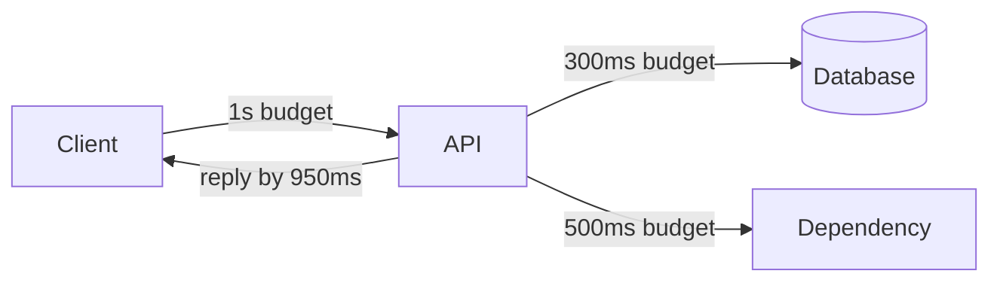

# API Timeouts

## 1. One-Line Definition
An API timeout is the maximum time a caller is willing to wait for a response — or a service for its dependencies — after which the call is treated as failed and the caller proceeds with its fallback instead of waiting forever.

## 2. Why Do We Need It?
Distributed calls can hang: a dead server holding connections open, a slow dependency, a network black hole that drops packets without error. Without timeouts, one stuck dependency pins threads, connections, and memory until the whole instance is exhausted — and clients wait forever. Timeouts turn an unbounded wait into a bounded decision: by this deadline, we are done either way.

## 3. Simple Intuition
A kitchen timer. You do not stare at the pot until dinner is ready; you set a timer and get on with life. When it rings, you know something took longer than it should and you react. Multiply that across a restaurant of 50 cooks: if every cook trusted every pot to finish, a single lousy burner would stall the whole kitchen — precisely the cascade timeouts prevent.

## 4. What Happens Without It?
A single hung dependency slowly owns every free thread; the connection pool starves ([database-connection-pooling|Database Connection Pooling]); steady-state latency climbs as queues back up; users see infinite spinners; and when the hang is finally noticed, every stuck caller releases at once into a stale-backend retry storm. A slow tail becomes a cascade ([[latency-vs-throughput|Latency vs Throughput]]), and availability falls with it ([[availability|Availability]]).

## 5. Core Idea
- **Timeout vs deadline:** a timeout is a relative wait budget from the call's start; a deadline is an absolute wall-clock point. For distributed calls, deadlines stay meaningful across retries (the work must be done by 14:00:05 even if the first attempt burned 1s).
- **Timeout layers:** differentiate *connect* timeout (can I even open the connection?), *read* timeout (is a response arriving?), and *total* timeout (the whole call). Each catches a different failure mode.
- **Budget waterfall:** give the client slightly more time than the sum of downstream budgets plus network. If a call has 1s total, the service's own DB budget is 300ms, and the next-hop budget tighter still — so an upper layer can fail fast rather than wait inside a wait.
- **Timeout at every hop:** a timeout at the front only protects the client, not the service — the service still waits on a dead dependency unless it has its own.
- **Timeout is not cancellation:** timing out frees the caller, but the work may keep running and may complete. This creates the "did it or didn't it?" state, which is exactly why retries need deduplication/idempotency.
- **Queue wait counts:** timeout should include time spent waiting in queues, or a long queue means everyone times out the moment their turn arrives.

## 6. Important Terminology

| Term | Simple Meaning |
|------|----------------|
| Timeout | Relative wait budget before giving up |
| Deadline | Absolute wall-clock time by which work must finish |
| Connect timeout | Max time to open the connection |
| Read timeout | Max time between chunks of response |
| Total timeout | Whole-call budget |
| Budget waterfall | Shrinking time budgets down the call chain |
| Slow tail | The worst few percent of latencies |
| Tarpit | A dependency that accepts connections but never responds |

## 7. Basic Architecture



The client budget (1s) is larger than any single downstream budget, and each hop's budget is smaller than the hop above it, so a slow dependency is abandoned inside the service rather than after the whole call.

## 8. Request or Data Flow
1. Client starts the call with a total budget B.
2. Connect must succeed within a small slice; then reads must produce data within the read timeout.
3. The service applies its own budget to its dependencies: DB call at 300ms, upstream call at 500ms, each with its own smaller internal budget.
4. On any timeout: the layer fails fast, chooses its fallback (circuit-breaker state, cached result, or error envelope [[error-handling|Error Handling]]), and returns.

## 9. Practical Example
An API whose SLO is p99 latency of 200ms. The caller sets its timeout at 1s — roughly 5x the p99, comfortably above normal tail but well below "hung." Inside: DB budget 300ms, upstream catalog 500ms, verdict by 950ms so the response beats the 1s caller budget. If the DB takes 280ms, that's fine; if it takes 1.2s, the DB call itself times out at 300ms, the service returns 503 immediately, and the caller's connection pool stays healthy. A tarpit dependency can no longer consume all 1.2s because the inner timeout cut it off at 300ms.

## 10. Scaling
- **Timeouts must shrink as you go downstream.** A gateway with a 30s timeout passing to a service with a 60s timeout means the gateway waits forever while the service muddles on — always tighter deeper.
- **Fast-fail under load:** when queues lengthen, timeouts plus retries amplify (each retry re-queues work). Include queue time in the budget, or tighten timeouts and fail fast to shed load (backpressure, planned).
- **Timeouts and concurrency interact:** with N threads and a 10s timeout, a dependency taking 9s can buffer N requests behind it; monitor queue depth, not just timeout violations.

## 11. Reliability and Failure Scenarios

| Failure | What Happens | Detection | Recovery | Trade-off |
|---------|--------------|-----------|----------|-----------|
| Dependency tarpit | Callers pile up on dead connections | Read-timeout alerts | Tight read timeout trips [[circuit-breaker|Circuit Breaker]] | breaker thrashes if too tight |
| Timeout but work completes | Result exists, caller gave up | Audit/idempotency store | Retry with dedup key, or reconcile | double application risk |
| Too-tight timeout on slow tail | False failures on work that would succeed | Timeout-cause metrics | Tighten based on observed p99, not gut feel | latency vs false-error trade |
| Retry storm after timeout | N callers retry the same dead call | Error-rate + retry-rate spikes | Retry-After hints, jitter, backoff ([[retry-and-timeout|Retry and Timeout]]) | coordination complexity |

## 12. Consistency and Correctness
- A timed-out request is *unknown*, not *failed*: it may have completed server-side. Retrying blindly can double effects — pair every retry with a dedup key ([[request-deduplication|Request Deduplication]]).
- Deadlines preserve meaning across retries: absolute deadline prevents "retrying past the time the result is useful."
- Cancellation propagation (gRPC-style deadlines, HTTP `RST` or nothing standard) decides whether the server actually stops the work — without it, timed-out work keeps consuming resources.

## 13. Performance
- Tight timeouts protect throughput by releasing resources fast; too-tight timeouts waste work on spurious retries and inflate error rate.
- Set timeouts from *observed* latency distributions (p99, p999), not defaults: a 1x-p99 timeout produces constant false failures; a 20x-p99 timeout is nearly no timeout.
- Measure timeout-induced failures with [[distributed-tracing|Distributed Tracing]]: a timeout at hop 2 visible as latency in hop 1's span is a classic tuning signal.

## 14. Security
- Timeouts are a DDoS countermeasure: slowloris-style clients that connect and trickle bytes must hit read/upload timeouts, or a handful of sockets occupies every connection (see [[web-vulnerabilities|Web Vulnerabilities]]).
- Keep-alive idle timeouts on load balancers and proxies ([[http-and-https|HTTP and HTTPS]], [[load-balancing|Load Balancing]]) bound how long a dead peer pins resources.
- A timeout is also a privilege boundary: keep client-visible waits bounded so a compromised client cannot hold server resources hostage.

## 15. Trade-Offs

| Choice | Advantages | Disadvantages | When to Use |
|--------|------------|---------------|-------------|
| Tight timeouts | Fast fail, resource safety | False failures on tail latency | User-facing interactive paths |
| Loose timeouts | Fewer spurious failures | Slow recovery, queue exhaustion | Batch jobs, slow-but-regular work |
| Per-hop budgets | Fail where the problem is | Configuration complexity | Deep call chains |
| Flat one timeout | Simple to reason about | One slow hop eats the whole budget | Shallow: client → single service |
| Deadline (absolute) | Stays meaningful across retries | Requires clock coordination | Multi-step flows, retries |

## 16. Common Mistakes
- No timeout at all (or only a connect timeout — the classic "accepts but never answers" miss).
- One global timeout value for every call type and every client — retry-heavy clients and streaming clients need different budgets.
- Timeout larger than a dependency's own, so the inner call can outlive the outer wait.
- Retrying on timeout without a dedup key — double effects on the "it actually completed" case.
- Not counting queue time: requests time out after waiting 30s in a queue with a 5s budget.
- Guarding only the client edge, so services still wait on their own tarpits.

## 17. HLD vs LLD Boundary
HLD: budget waterfall values, per-hop allocation, timeout-vs-deadline choice, retry interaction (dedup) and circuit-breaker triggering, queue-time policy, timeout-based load shedding. LLD: the method's `ctx.WithTimeout` call, config values, the specific "reply by X" logic, and metric names.

## 18. Interview Questions

### Beginner
- Why does a connect timeout alone not protect you from a hung service?
- What is the difference between a timeout and a deadline?

### Intermediate
- Design timeout budgets for a 1s-SLO API that calls a database and an upstream service. Where does each budget go?
- A call timed out, but the server completed the work. What's the risk and the mitigation?

### Advanced
- A gateway grants 30s, two downstream services each assume 30s, and a queue sits between them. Walk the amplification and fix it.
- How do timeouts, retries, and circuit breakers interact during a partial dependency outage — and what configuration turns a blip into an outage?

## 19. Interview Memory Summary

> [!abstract]- Interview Memory Summary

### Remember

- A timeout converts unbounded wait into a bounded decision.
- Layers: connect / read / total — each catches a different failure.
- Budgets shrink downstream: client > service > dependency.
- Timeout is not cancellation: the work may have completed.
- A timed-out request is unknown, not failed — retries need dedup.
- Setting tight/loose must come from observed latency (p99/p999), not defaults.
- Queue time counts in the budget.

### 30-Second Explanation

Give every call a total wait budget and enforce smaller budgets at every deeper hop so a tarpit is abandoned at the point where the problem lives, not at the client. Differentiate connect, read, and total timeouts; count queue time; decide timeout vs absolute deadline up front. Because a timed-out call may have succeeded server-side, retries must ship a dedup key, and repeated timeouts should trip a circuit breaker rather than feed a retry storm.

### Interview Traps

- Claiming a single global timeout is fine — it breaks retry-heavy and streaming callers.
- "The client times out, so the service is safe" — the service still waits on its own dependencies.
- Retrying timeouts without idempotency (double effects on completed-but-late work).
- Setting timeouts by guesswork instead of the observed p99 with headroom.
- Forgetting that time spent queued counts inside the budget.

### Key Trade-Off

Tight timeouts protect throughput but fabricate failures from slow tails; loose timeouts avoid false failures but let dead dependencies devour capacity. The correct value is a measured decision, always with idempotency behind the retries.

## 20. Related Concepts

### Prerequisites

- [[retry-and-timeout|Retry and Timeout]]
- [[latency-vs-throughput|Latency vs Throughput]]

### Commonly Used Together

- [[request-deduplication|Request Deduplication]] (retrying after timeout safely)
- [[circuit-breaker|Circuit Breaker]] (a timeout is the event that trips the breaker)
- [[error-handling|Error Handling]] (timeout → 504/503 envelope)
- [[load-balancing|Load Balancing]] (LB-timeouts and connection draining)
- [[observability|Observability]] and [[distributed-tracing|Distributed Tracing]] (where waits actually happen)

### Alternatives

- Shortening the caller's wait by making the work async ([[bulk-and-long-running-apis|Bulk and Long-Running APIs]])
- Hedging (send a second request early, planned)

Related planned topics (not authored yet): hedged requests, latency budget, tail latency, backpressure.

## 21. References
Google SRE Workbook (timeouts, backoff, and the "popsicle stand" deadlock caused by coordinated waiting); Microsoft Azure Architecture Center (timeout-based retry and circuit-breaker guidance); gRPC documentation on deadlines. All real, canonical references.

## 22. Active Recall

Test yourself before revealing each answer.

> [!question]- Basic: why does a connect timeout alone fail to protect you from a hung service?
> A connect timeout only bounds the handshake. A server that accepts the connection and then never sends a byte is a tarpit — connect succeeded instantly, and only a *read* timeout (plus a total budget) catches the hang. Two of the three kinds of timeout are about what happens after the connection opens.

> [!question]- Design: a 1s-SLO API calls a DB and an upstream. Allocate the timeouts.
> The caller's total is ~1s (about 5x the p99 with headroom). Inside: the upstream call gets ~500ms, the DB call ~300ms, verdict assembled by ~950ms and returned before the caller's 1s. The rule: each hop's budget is smaller than its caller's, so an inner tarpit is cut off while the outer wait can still succeed.

> [!question]- Trade-off: tight vs loose total timeouts — what breaks at each extreme?
> Tight (≈p99 with no headroom) spends its life fabricating failures from the natural slow tail — when the p999 work is perfectly healthy but aborts late. Loose timeouts mean a genuinely hung dependency eats threads, queues, and connections before anyone notices. Tight protects resources, loose protects against false errors; both measured, never guessed.

> [!question]- Failure: a call times out, but the server actually completed the work. What could go wrong next?
> If the client blindly retries the same operation, the effect may run twice (double charge, duplicate write). A timed-out request is *unknown*, not *failed*: the safe pattern is retry-with-dedup-key, so the duplicate attempt returns the already-stored outcome instead of re-running the work.

> [!question]- Interview scenario: during a partial dependency outage, error rate spiked and then latency for everything doubled. Diagnose.
> Likely a retry storm: N callers timed out, then simultaneously retried the same dead endpoint, doubling both load and every wait. Fixes: exclusive circuit breaking (stop calling the failing dependency, not just fail fast), Retry-After backoff with jitter, a timeout lower than the queue time, and dedup keys so double-completion can't double-apply.

> [!question]- Design: when do you use an absolute deadline instead of a relative timeout?
> When the result only matters before a wall-clock moment — e.g. a recommended price quote computed at 14:00 is only useful for that window. A deadline survives retries ("we must be done by 14:02:00 even after two failed attempts"), whereas a fresh relative timeout resets purpose on every retry.

> [!question]- Basic: why must downstream timeouts be smaller than upstream ones?
> Because an upstream timeout is a *bound* for the whole chain. If the gateway waits 30s and the service inside waits 60s, the gateway's bound does nothing — it waits forever while the service declares its own deadline. Budgets must shrink toward the leaves so failure surfaces at the edge first.

## 23. When Should I Use This?

### Use it when

- Any call is made over a network or to an external system — that's every distributed system.
- An unbounded wait would pin resources (threads, connections, memory) that are genuinely bounded.
- Clients must never hang forever on a stuck backend, and users need a game-over state to fall back to.
- Retries exist: timeouts mark the boundary where retry-with-dedup takes over.

### Avoid it when

- You genuinely need to wait arbitrarily long for a result — in which case make it async ([[bulk-and-long-running-apis|Bulk and Long-Running APIs]]) instead of stretching the timeout, since a timeout that never fires is no protection.
- The work is fire-and-forget and the result is discarded; then no wait should be imposed at all.

### What problem does it solve?

Bounding the time and resources a possibly-hung dependency can consume, so one slow service cannot exhaust your threads or your users' patience, and so the stack fails fast where the problem is.

### What problem does it NOT solve?

It does not make the hidden work stop (cancellation propagates only if you design it), does not make the outcome known (timeout may conceal success), and does not make the system recover — recovery is retry plus dedup, circuit breakers, and the fallbacks covered in the reliability concepts here.

## 24. Decision Connections

Decisions that go together with API timeouts:

- [[retry-and-timeout|Retry and Timeout]] — timeout decides *when to give up*; retry decides *what to do next*, and dedup decides *whether it's safe*.
- [[request-deduplication|Request Deduplication]] — the retry-after-timeout path is exactly where duplicates are born.
- [[circuit-breaker|Circuit Breaker]] — repeated timeouts are the breaker's input signal; the breaker stops *all* new attempts to a dead dependency.
- [[error-handling|Error Handling]] — a fired timeout becomes a retryable 504/503 with Retry-After.
- [[latency-vs-throughput|Latency vs Throughput]] — where the threshold lives in the observed distribution.
- [[distributed-tracing|Distributed Tracing]] — reveals which hop burned the budget.
- [[availability|Availability]] — correct timeouts keep one page of the book from killing the whole chapter.
- [[bulk-and-long-running-apis|Bulk and Long-Running APIs]] — when work legitimately exceeds any reasonable timeout, go async instead.

Decision tree:

```
A call must wait for work
    |
    +-- Will finish in well under a second of network time?
    |      → synchronous, tight budget (from p99 + headroom)
    |         +-- Multiple hops? → per-hop smaller budgets (waterfall)
    |         +-- Result later?  → deadline, not timeout
    |
    +-- Work is heavy and could take minutes or hours?
    |      → async job ([[bulk-and-long-running-apis|Bulk and Long-Running APIs]])
    |         +-- timeout = the poll/status call, not the work
    |
    +-- Dependency known-flaky?
    |      → short read/total timeouts + dedup-keyed retries
    |      → trip [[circuit-breaker|Circuit Breaker]] after M consecutive timeouts
    |
    +-- Clients lie about waiting?
           → enforce at the gateway/LB; shed load with retryable 503 + Retry-After
```