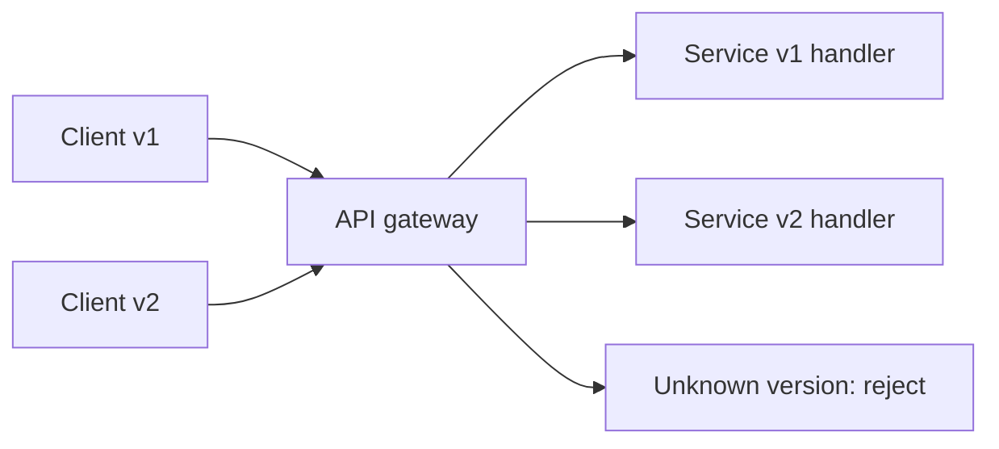

# API Versioning

## 1. One-Line Definition
API versioning is the controlled scheme through which a live API contract changes — additive evolutions when possible, explicitly labeled breaking versions when not — so existing consumers keep working while the interface moves forward.

## 2. Why Do We Need It?
Once an API is published, consumers deploy at their own pace. You cannot rename a field, change semantics, or remove an endpoint and expect nobody to break. Versioning is how you get the freedom to evolve (fix models, add features, pay down design debt) without crossing out of the "if it worked yesterday it works today" promise that keeps integration cheap.

## 3. Simple Intuition
A building has one entrance, but floors get renovated. If you knock down a wall mid-lease, tenants break. So the landlord adds a second entrance for new tenants (v2) while leaving the old one intact (v1) until everyone renovates. Deprecation is the notice period that lets the last tenant move before you finally nail the old door shut.

## 4. What Happens Without It?
The first change (rename a field, change a status code, drop a param) instantly breaks every external consumer at once — support tickets, rollbacks, and broken integrations everywhere. Fear kicks in: teams stop touching the API, and the contract ossifies while the business moves faster. Versioning exists precisely to prevent both the breakage and the paralysis.

## 5. Core Idea
- **Most changes should be additive:** new optional fields, new endpoints, extended enums — they don't break anyone and need no new version.
- **Version when semantics break:** removing/renaming fields, changing meaning of values, tightening rules. Label it explicitly (`/v2`, or a header/media-type marker) so consumers opt in deliberately.
- **Mechanisms:** URI path versioning (`/v1/users`), media-type negotiation (`application/vnd.myapi.v2+json`), header versioning (`X-API-Version: 2`), or query-param versioning (`?v=2`) — each has different caching, tooling, and discipline costs.
- **Backward compatibility is the contract:** new servers must still satisfy old consumers; additive-only policy most of the time, labeled breaking versions only when truly needed.
- **Deprecation lifecycle:** announce, keep serving, set the sunset date, verify migration, then remove — timed, not silent.
- **Semantic versioning (SemVer) on the API-level contract** gives consumers a mental model: majors break, minors extend, patches fix.

## 6. Important Terminology

| Term | Simple Meaning |
|------|----------------|
| Additive change | New field/endpoint; old consumers unaffected |
| Breaking change | Old consumers would fail if unaware |
| Version namespace | How a request declares which contract it speaks |
| Path versioning | `/v1/users` — version lives in the URL |
| Header versioning | `X-API-Version: 2`, or by media type header |
| Query versioning | `?v=2` in the query string |
| Backward compatible | Old client still works against new server |
| Deprecation | Announce + sunset timeline for an old version |
| Sunset date | Hard removal date for a deprecated version |
| SemVer | major.minor.patch with fixed breakage semantics |

## 7. Basic Architecture



## 8. Request or Data Flow
1. Client sends `GET /v2/users/42` with its auth token.
2. Gateway parses the version marker (path/header) and routes accordingly.
3. v2 handler serves the new shape; v1 handler still serves the old shape to v1 clients.
4. New fields in v2 are additive to responses; v2's breaking rules start applying.
5. If a deprecated version is past its sunset date, the gateway returns `410 Gone` with a migration hint, not a 200 with wrong data.

## 9. Practical Example
**User service:**
- v1 returns `{name, email}`. Product wants `email_verified` and a `display_name`. Add them as **new optional fields** — no version bump needed; old clients are unaffected.
- Later, `name` must split into `first_name`/`last_name`. Removing `name` is **breaking** → ship `/v2/users` returning `{first_name, last_name, email_verified}`.
- Timeline: announce v2 while v1 still served for 12 months; log v1 usage; when traffic drops below a threshold and consumers migrate, set `sunset` header, then `410`.
- Numbers: 500 consumer orgs migrate over 9 months; during that window both versions served, zero incidents.

## 10. Scaling
- Versioning itself doesn't *scale*, but it *enables* scaling the availability of the old behavior: the load balancer and gateway can serve v1 and v2 as separate service deployments with independent scaling — v2 greenfield can scale out while deprecated v1 shrinks.
- **Version sprawl is the scaling tax:** each live version means duplicated handlers, tests, and deployments. Retire the dead versions with a release cadence, or the operating cost compounds.
- In a microservices estate, version the *contracts*, not loose per-service — shared client SDK generation from specs keeps the fan-out manageable.

## 11. Reliability and Failure Scenarios

| Failure | What Happens | Detection | Recovery | Trade-off |
|---------|--------------|-----------|----------|-----------|
| Breaking change shipped silently | v1 clients break | Traffic error spikes after release | Rollback, or instant additive patch | release gates |
| Version matrix grows | Duplicated handlers, drift | Duplicated code masks | Deprecation cadence, sunset dates | migration friction |
| Pre-release version routed to some | Mixed responses | Canary/tag inspection | Route strictly by version marker | routing rules |
| v2 bug vs v1 correct | New consumers poisoned | SLO comparison | Rollback v2 routing, keep v1 | dual-path ops |

## 12. Consistency and Correctness
- **Never reuse a version number with different semantics** — `v2` means one fixed contract for its lifetime; offer `v3` for the next break instead.
- Additive drift is healthy; breaking drift (same endpoint, different meaning) is the classic unlabeled footgun — versioning is partly about *making the break explicit*.
- Both versions must serve from consistent data; versioning changes the shape, not the underlying source of truth — keep reads coherent or you'll have v1 and v2 disagreeing about the same order.

## 13. Performance
- Path versioning is the cheapest to route (static string match at the [[api-gateway|API Gateway]]); media-type/negotiation adds parsing per request but is cacheable (a distinct cache key per version).
- Query-param versioning is generally worst for caching/proxies (variation smells) and should be reserved for internal/experimental.
- Serving many versions multiplies deployment+operating cost long before it hurts a single request — budget the version matrix the way you budget infrastructure.

## 14. Security
- Version markers are user input: parse strictly, never let a crafted header fall back to a differing contract than documented.
- Deprecated versions tend to lag security patches — run the old versions behind the same authn/quota and remove them on schedule, because stale handlers are a favorite weak spot ([[web-vulnerabilities|Web Vulnerabilities]]).
- Keep auth at the gateway version-agnostic: **version shapes the data, it must not bypass identity or authorization** ([[authentication-vs-authorization|Authentication vs Authorization]]).

## 15. Trade-Offs

| Choice | Advantages | Disadvantages | When to Use |
|--------|------------|---------------|-------------|
| Path `/v1` | Obvious, cacheable, tool-friendly | URL clutter, redirects | Most public APIs |
| Media type `vnd.+json` | Keeps URL clean, negotiable | Heavier routing/tooling | Mature, standards-driven APIs |
| Header `X-API-Version` | URL stays stable, per-request choice | Hidden from caching, proxies | Internal APIs |
| Query `?v=2` | Trivial to test manually | Poisons cache/proxies | Experiments, internal |
| No explicit versioning | Zero ceremony | Only one contract forever | Single trusted internal consumer |

## 16. Common Mistakes
- Breaking semantics silently in v1 because "it's just a rename" — that *is* the breaking change.
- Never finishing the deprecation: an eternal v1-vs-v2 matrix nobody dares delete.
- Versioning on every trivial additive field — version sprawl without the discipline of Sunsets.
- Mixing mechanisms (path here, header there) so clients can't predict where the contract lives.
- Believing versioning replaces testing — a version bump doesn't warn you that your new field semantics already existed under the old key name.

## 17. HLD vs LLD Boundary
HLD: the version marker mechanism, policy (additive vs breaking), backward-compat bar, deprecation timeline, and rollout/rollback strategy. LLD: the routing rules parsing the version, per-version DTOs and mappers, sunset header code, and the CI cadence driving each release.

## 18. Interview Questions

### Beginner
- What counts as a breaking change?
- Name the three most common versioning mechanisms.

### Intermediate
- Design the versioning and deprecation policy for a public API with 500 consumer orgs.
- When is additive-only policy enough, and when must you bump?

### Advanced
- Compare path vs media-type versioning across caching, tooling, and client migration.
- How do you migrate a huge consumer base from v1 to v2 without a forced cutoff?

## 19. Interview Memory Summary

> [!abstract]- Interview Memory Summary

### Remember

- Versioning is evolution control, not skill decoration: additive when possible.
- Breaking changes get an explicit new version; consumers opt in.
- Path `/v1` is the simplest, most cache-friendly; headers/media-type are cleaner but heavier.
- Backward compatibility is the real promise: old clients keep working against new servers.
- Deprecation = announce, keep serving, sunset date, then remove.
- Version sprawl is a cost; add versions only for genuine breaks.
- Never silently change v1 semantics; bump, or don't.

### 30-Second Explanation

Keep the API additive by default — new optional fields and endpoints never need a version bump. When semantics must break, cut a new explicitly-marked version (`/v2`), serve both behind the gateway, announce deprecation with a sunset date, and remove the old one only after trailing consumers migrate. The version marker is user input: parse strictly, and keep auth/identity in the gateway above the version split.

### Interview Traps

- Calling a field rename "non-breaking."
- Adding a version for every new optional field — sprawl without deprecation discipline.
- Forgetting the sunset: eternal parallel versions become operationally toxic.
- Letting versioning bypass the authn/authz layer.

### Key Trade-Off

You trade a little ceremony and URL/proxy complexity for the freedom to change the contract without breaking the world at once — the alternative is a frozen or explosive API.

## 20. Related Concepts

### Prerequisites

- [[api-design-principles|API Design Principles]]
- [[http-and-https|HTTP and HTTPS]]

### Commonly Used Together

- [[api-gateway|API Gateway]]
- [[rest|REST]]
- [[rpc-grpc-graphql|RPC / gRPC / GraphQL]] (schema evolution by contract tooling instead)

### Alternatives

- [[http-and-https|HTTP and HTTPS]] (media-type negotiation as a version mechanism)

### Advanced Concepts

- [[sli-slo-sla|SLI / SLO / SLA]] (per-version reliability targets)
- [[distributed-tracing|Distributed Tracing]] (per-version observability)
- [[web-vulnerabilities|Web Vulnerabilities]] (stale old-version surface)

Related planned topics (not authored yet): backward compatibility as its own concept, OpenAPI contract-first design, feature flags vs versioning.

## 21. References
Fielding dissertation (media-type negotiation). Stripe API versioning docs. Google Cloud API Design Guide (versioning rules, deprecation). SemVer spec. Verify current best practice against your platform docs.

## 22. Active Recall

Test yourself before revealing each answer.

> [!question]- Basic Understanding: What is the difference between a breaking change and a non-breaking one?
> A non-breaking (additive) change adds capability old consumers don't depend on — new optional fields, endpoints, enum values. A breaking change alters semantics or removes things old consumers rely on: renamed/removed fields, reinterpreted meanings, tightened rules.

> [!question]- Design Decision: New `display_name` field on an existing resource — bump the version?
> No. Adding an optional field is additive; old consumers are unaffected. This is the whole point of versioning restraint — reserve version bumps for genuine semantic breaks, not for every feature.

> [!question]- Trade-Off: Path `/v1` versioning vs `Accept: application/vnd.myapi.v2+json` media-type.
> Path is dead simple, tool- and cache-friendly, self-documented in the URL — but it clutters URLs and makes rewrite rules less elegant. Media type keeps URLs clean (it's negotiation) but demands tighter routing, client cooperation, and readier tooling. For most public APIs path wins; standards-driven APIs can afford the latter.

> [!question]- Failure Scenario: v1 clients start seeing 5xx after a rename. What likely happened and how do you respond?
> Someone shipped a "minor cleanup" that actually removed/renamed a field v1 clients depend on — a silent breaking change. Respond: rollback reverts traffic instantly, then cut a proper v2 instead, and enforce an additive-only policy on v1 with a breaking-change review gate.

> [!question]- Interview Scenario: Migrate 1,000 consumers from v1 to v2 without forced cutoff. Lay out the plan.
> 1. Additive v2 with clear change log and migration guide. 2. Serve both versions; incent migration. 3. Instrument v1 usage; publish a deprecation notice with a sunset date. 4. Communicate at milestones (reminders, partner contacts). 5. At sunset, `410` with a migration hint, and decommission duplicated handlers.

> [!question]- Basic Understanding: Why can't you just "keep compatibility in your head"?
> Because once consumers exceed your attention, what you don't encode is lost: someone renames a field because it "looked better," a new intern reads the shape differently, and compatibility has no single owner. Versioning makes the existence and meaning of each contract explicit and reviewable.

> [!question]- Design Decision: Query-param versioning `?v=2` sounds easiest — when do you actually refuse it?
> Whenever caching or proxying matters, which is most public APIs: caches key on URL+headers, and query variation fragments the cache and can be altered by intermediaries; plus it tempts folks to version per-call rather than per-contract. Keep it to internal/experimental routes.

> [!question]- Failure Scenario: Management asks why v1 handlers and tests are still deployed a year after v2 launched.
> That's version sprawl left unscheduled. The answer is a deprecation timer: measure v1 traffic, set a sunset, and once it drops below a threshold, remove and delete the duplicate handler and tests — the tax is invisible until you audit how many contracts you are actually the custodian of.

> [!question]- Interview Scenario: "Should we version like Docker tags or feed the gateway?" — what's your synthesis?
> Version the *contract*, not the artifact. Run v1 and v2 as separate deployables route-selected by the gateway so they scale and retire independently; match every release against the documented contract and keep the contracts themselves additive-by-default so you're not publishing endless near-identical shapes.

## 23. When Should I Use This?

### Use it when

- The API is public, partner-facing, or widely consumed by third parties.
- Breaking changes are genuinely unavoidable and you need to stay compatible.
- You run planned release cadences and want traffic/rollout discipline.
- You need contract evolution without coordinated redeploys.

### Avoid it when

- A single internal consumer redeploys in lockstep with you — additive-only policy may be enough.
- You're pre-1.0 with a private API: internal contracts can evolve freely without version *namespaces*.
- The change is truly additive — versioning ceremony there is worse than the non-change.

### What problem does it solve?

It lets the contract evolve at the business's pace while keeping every consumer's deployed software working, by making breaks explicit, opt-in, and eventually scheduled for retirement.

### What problem does it NOT solve?

It doesn't fix semantic drift *within* a version, it won't save you from uncoordinated consumer expectations (you still need docs/test infrastructure), and it doesn't remove the migration cost — only lets you spread it out instead of paying it all at once.

## 24. Decision Connections

Decisions that go together with API versioning:

- [[api-design-principles|API Design Principles]] — the contract discipline versioning formalizes.
- [[rest|REST]] — URL/media-type mechanisms that carry versions.
- [[api-gateway|API Gateway]] — the router that serves multiple versions concurrently.
- [[rpc-grpc-graphql|RPC / gRPC / GraphQL]] — contract/schema evolution tooling as an alternative lever.
- [[http-and-https|HTTP and HTTPS]] — headers and status codes (410) you use for sunsetting.
- [[authentication-vs-authorization|Authentication vs Authorization]] — versioning must not bypass identity checks.
- [[distributed-tracing|Distributed Tracing]] — per-version observability for migration metrics.
- [[sli-slo-sla|SLI / SLO / SLA]] — reliability targets can differ per version.

Decision tree:

```
The contract needs to change
    |
    +-- Change is additive only?
    |      → ship without a version bump
    |
    +-- Change is breaking?
    |      → cut an explicit new version
    |         |
    |         +-- Most visible surface?        → path versioning [[rest|REST]]
    |         +-- Standards-driven clients?    → media-type negotiation
    |         +-- Internal/experimental?       → header or query param
    |         +-- Many old consumers?          → deprecate on a calendar, sunset
    |
    +-- Consumers migrate fast?
    |      → short deprecation window, still explicit
    |
    +-- Multiple versions live at once?
           → serve both behind the [[api-gateway|API Gateway]], retire per schedule
```