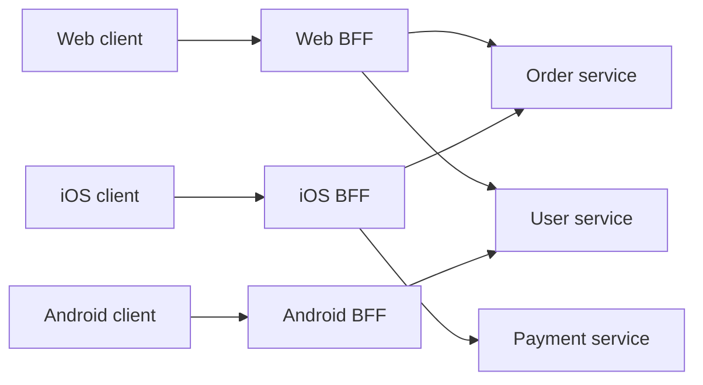

# Backend for Frontend

## 1. One-Line Definition
The Backend for Frontend (BFF) is a dedicated backend service per client type — web, iOS, Android, IoT — exposing an API tailored to exactly what that client needs, and owning the composition, shaping, authentication, and session logic for it.

## 2. Why Do We Need It?
One generic API rarely fits multiple clients. A mobile app needs compact payloads, few round trips, and offline-friendly responses; the web app wants richer data and server-rendered context; an IoT device wants a tiny message surface. Force all of them through one shared API and everyone gets the lowest common denominator: mobile wastes bandwidth on web-shaped payloads, web is stuck with mobile-shaped terseness, and any change ripples across every client simultaneously.

## 3. Simple Intuition
A tourist office with one sign language translator for every visitor would frustrate everyone. Instead each delegation gets its own translator — Japanese, German, Spanish — who knows that *audience*, its questions, and its context, while all translators share the same underlying source of truth (the city's services). Each BFF is the translator for one client family.

## 4. What Happens Without It?
Every client couples directly to a shared internal API: mobile downloads fat payloads, screens do multiple round trips, web and mobile fight over endpoint changes, and UI teams are blocked by backend priorities. The API becomes a pile of compromise endpoints; each new client bends the contract further; breaking changes block all clients at once.

## 5. Core Idea
- **One BFF per client family.** Not per microservice, not one giant BFF for everyone: web → web-BFF, iOS → iOS-BFF, and so on. Each is shaped for that client's product context.
- **BFF does composition and shaping:** it fans out to the real services and returns one response tailored to the client (see [[api-composition|API Composition]]), trimming fields, aggregating calls, adding client-specific defaults.
- **BFF owns the client's auth and session:** token exchange with the identity provider, session cookie for the browser, device token for mobile — the client never talks credentials or internal identity plumbing directly.
- **BFF is a thin layer with product logic, not a data layer:** it calls services, it does not own databases, and it must not re-implement business rules or shard data.
- **Team ownership is the point:** the frontend team owns its BFF and evolves it without coordinating the entire backend — the coupling that used to live in a shared API now lives in one small, owned seam.

## 6. Important Terminology

| Term | Simple Meaning |
|------|----------------|
| BFF | Backend for one client family |
| Client family | A device class sharing needs (web, iOS, Android, TV) |
| Composition | Fan-out + merge into one shaped response |
| Token exchange | Swapping a client credential for scoped service tokens |
| Shared API | One interface serving all clients (the thing BFF avoids) |
| Gateway | Edge layer that can do auth/routing but not product logic |
| Session cookie | The web BFF's way of keeping the browser authenticated |

## 7. Basic Architecture



Each BFF talks only to the services its client needs and shapes the result for that client.

## 8. Request or Data Flow
1. The mobile app calls its BFF with its device token.
2. The BFF validates the token (or exchanges it for scoped tokens), reads the client type from its own config, and fans out to the services the screen needs.
3. The BFF shapes responses: trims unused fields, merges timestamps, adds mobile pagination defaults.
4. It may cache hot aggregates and enforce per-version behavior as the client evolves.
5. Web requests instead arrive with the session cookie that the web BFF set at login — the BFF also owns that session lifecycle ([session-management|Session Management]).

## 9. Practical Example
A streaming app with web and mobile clients.
- iOS BFF: one call returns `{continueWatching: [...], recommendations: [...], counts}` — three backend calls compressed into one payload with thumbnails and no admin fields. Mobile spends ~40KB instead of ~400KB.
- Web BFF: the same underlying data, but returns full metadata, social context, and tracking pixels, SSR-friendly.
- Both BFFs call the same catalog/playback/recs services; neither client ever calls the internal catalog directly. When the iOS team needs a compact "resume hero" endpoint, they change only the iOS BFF — zero coordination with the web team.

## 10. Scaling
- BFFs are stateless front-door services: horizontal scale trivially ([[horizontal-vs-vertical-scaling|Horizontal vs Vertical Scaling]]), with session state pushed out to the shared session store ([session-management|Session Management]).
- Duplication guard: identical logic across BFFs should be pulled down into the shared services — the BFF duplicates *shaping*, not *business rules*; a bug in a rule is a services bug, fixed in one place.
- Per-client BFFs each bear their own load: a viral mobile release fans out to mobile BFF at full rate while the web BFF is uncrowded. Capacity planning is per client.

## 11. Reliability and Failure Scenarios

| Failure | What Happens | Detection | Recovery | Trade-off |
|---------|--------------|-----------|----------|-----------|
| One BFF dies | Only that client type is down | Per-BFF health ([[golden-signals|Golden Signals]]) | Independent redeploy + scale-back | each BFF is its own blast radius |
| Upstream service down | Every BFF point degrades | Upstream error rate | BFF partial-failure policy ([[api-composition|API Composition]]) | degrade vs fail |
| BFF logic drift between clients | One client gets different behavior | Contract tests per BFF | Different shaping per client is the *goal*; shared rules must match | rule duplication |
| Session store outage | Web logins break, mobile tokens persist | Store health | Read-only degrade; tokens keep mobile alive ([[failover|Failover]]) | availability spread |

## 12. Consistency and Correctness
- BFFs introduce no new consistency domain by themselves: the aggregate they return still has read-time skew between services ([[api-composition|API Composition]]), and they should not cache data that must be transactional.
- Validation and authorization must run in the BFF *and* the owning services — the BFF is a convenient gate, not a trust boundary that hides the real checks.
- Versioning: an old app must keep getting old-shaped responses from its BFF while the new app gets the new shape — the per-BFF versioning story is why BFFs beat shared APIs for mobile.

## 13. Performance
- One BFF round trip replaces several client round trips, which is where most mobile wins come from.
- BFFs contribute one hop of processing latency; keeping them thin and caching hot aggregates ([[caching|Caching]]) keeps that hop near-zero.
- Payload trimming is the bandwidth win that no shared API can offer per client.
- Watch fan-out amplification: 1 request → N service calls; pool downstream connections ([[database-connection-pooling|Database Connection Pooling]] for the service-to-service analog).

## 14. Security
- The BFF is the security screen for its client: validate input, do token exchange with scoped downstream tokens, set session cookies properly (HttpOnly/Secure/SameSite — [[session-management|Session Management]]), and see [[authentication-vs-authorization|Authentication vs Authorization]] and [[oauth-oidc-jwt|OAuth 2.0 / OIDC / JWT]].
- Each BFF should get least-privilege credentials to services — a compromise of the web BFF should not hand out mobile tokens.
- The BFF hides internal service topology from clients, shrinking the attack surface exposed to the internet.
- CSRF considerations differ per client: cookie-based web BFF needs SameSite/CSRF care; token-based mobile BFF does not.

## 15. Trade-Offs

| Choice | Advantages | Disadvantages | When to Use |
|--------|------------|---------------|-------------|
| One BFF per client family | Shaped payloads, owned evolution, isolation | Duplicated seams to run and secure | Any multi-client product |
| Single shared API | One service, one cost | Compromise payloads, blocked evolution | Single client, or trivial needs |
| BFF vs API gateway | BFF has product + session context | Gateway needed too for cross-cutting edge | Gateway for auth/routing + BFF for shaping |
| BFF composition vs standalone aggregator | BFF includes client context and shapes | Aggregator reuses across clients | Distinct, evolving client types |
| Business rules in BFF (anti-pattern) | "One more place to put code" | Drift, inconsistent behavior | Never — rules live in services |

## 16. Common Mistakes
- One BFF per *microservice* — you multiply seams and each gets thin and useless; the seam is per *client family*.
- One giant BFF for everyone — then you've rebuilt the shared API with a new name.
- Putting business rules in BFFs, so the same rule means different things in web and mobile.
- Forgetting that the BFF is a gate, not a fence: services must still authenticate and authorize.
- BFFs calling databases directly — the BFF becomes a service and the seam stops being thin.
- No independent capacity/CI/ownership per BFF, so "independent teams" never really materialize.

## 17. HLD vs LLD Boundary
HLD: how many BFFs, which clients, what each BFF composes and shapes, session/token handling per BFF, per-BFF scaling and blast radius, and how rules stay out of the BFF. LLD: the exact fan-out code, response shaping transformers, per-BFF config and feature flags, and the specific token-exchange client.

## 18. Interview Questions

### Beginner
- What problem does the BFF pattern solve that a shared API can't?
- Why one BFF per client family rather than one global BFF?

### Intermediate
- Design BFFs for a web app and a mobile app sharing five services. What does each BFF do differently?
- Where would you draw the line between BFF logic and service logic — give a rule of thumb.

### Advanced
- How do BFFs, an API gateway, and an aggregator layer coexist without overlapping?
- Old mobile clients need old-shaped responses; new ones need new shapes. How does the BFF make that possible and why can't a shared API?

## 19. Interview Memory Summary

> [!abstract]- Interview Memory Summary

### Remember

- BFF = one dedicated backend per client family: web, iOS, Android, IoT.
- It composes and shapes responses for that specific client.
- The BFF owns the client's session and auth flow.
- The BFF couples *shaping and product logic*, never business rules or data.
- Team ownership: the UI team evolves its BFF without backend-wide coordination.
- Each BFF is its own blast radius and its own capacity unit — scale independently.
- Gateway handles cross-cutting edge; BFF handles product context.

### 30-Second Explanation

Instead of all clients sharing one compromise API, give each client family a small owned backend. The web BFF holds the session cookie, composes the page-level data, and trims for the browser; the iOS BFF exchanges the device token, aggregates three services into one compact mobile payload, and lives on a different versioning cadence. BFFs fan out to the real services for data, never hold rules or databases, and stay thin and stateless so each scales and deploys independently with its own blast radius.

### Interview Traps

- A BFF per microservice (the seam is per client, not per service).
- A single mega-BFF for all clients — that's a shared API renamed.
- Business rules drifting into BFFs (services stay the rule owners).
- Treating the BFF's auth gate as the only security — services self-secure too.
- Claiming BFFs make consistency simple — skew between composed services remains.

### Key Trade-Off

You trade duplicated seams, ops, and security per client for payloads and evolution shaped to each client; you keep the duplication from becoming drift by pushing every business rule down to the services.

## 20. Related Concepts

### Prerequisites

- [[reverse-proxy|Reverse Proxy]]
- [[stateless-vs-stateful-services|Stateless vs Stateful Services]]

### Commonly Used Together

- [[api-composition|API Composition]] — the BFF's fan-out and merge are composition specialized per client
- [[session-management|Session Management]] — the BFF owns the client's session lifecycle
- [[oauth-oidc-jwt|OAuth 2.0 / OIDC / JWT]] and [[authentication-vs-authorization|Authentication vs Authorization]] — the BFF's auth screen
- [[load-balancing|Load Balancing]] — BFFs sit behind the balancer like any front door
- [[caching|Caching]] — hot aggregates cached at the BFF

### Alternatives

- [[api-composition|API Composition]] with a shared aggregator (when clients share nearly all needs)
- Gateway-only composition (planned: API gateway) when the shaping is shallow

Related planned topics (not authored yet): API gateway, microservices, authentication and authorization.

## 21. References
Sam Newman, *Building Microservices* (BFF chapter); Phil Calçado, "Pattern: Backend For Frontend" (SoundCloud engineering); ThoughtWorks Technology Radar (BFF is a recurring "Adopt/Trial" pattern). Real, widely cited sources.

## 22. Active Recall

Test yourself before revealing each answer.

> [!question]- Basic: what makes a BFF different from a generic aggregator?
> A generic aggregator composes data for any caller (one source of truth per aggregate). A BFF additionally owns *client context*: the exact shape, pagination, defaults, session, and auth for one client family — and the versioning story for that client. The aggregator serves data; the BFF serves a client.

> [!question]- Design: web needs rich SSR data, mobile needs compact JSON. Where do those differences live?
> Inside their BFFs. The web BFF shapes rich metadata and session context; the iOS BFF trims to essentials and compresses calling patterns into one call. The shared services beneath stay generic. This is the pattern's core value: the divergence lives in small owned seams, not in a bloated shared contract.

> [!question]- Trade-off: BFF per client vs one shared API — why pay for duplicate seams?
> Each BFF is a real deployment to run and secure, so it's real cost. The payoff: no compromise payloads, no cross-client change coordination, per-client versioning, independent blast radius, and UI-team ownership of their own evolution. For a genuinely single-client product the shared API is cheaper; the moment clients diverge, the seams pay for themselves.

> [!question]- Failure: the iOS BFF is down while the web BFF is fine. What does a good design already know?
> That the blast radius is per client: iOS reads fail, web reads continue, because the seams are independent services with their own capacity, CI, and rollouts. The incident is one small deploy, not "all users down." BFF isolation turns one global outage into one per-client outage.

> [!question]- Interview scenario: client apps keep changing and the shared API is a battlefield of per-client params. Recommend a structure.
> Introduce per-client BFFs: iOS and web each get a seam that shapes for their screens, owns sessions and token exchange, and versions independently; the shared API behind shrinks to clean service contracts. Move game-specific parameters out of the shared API into the BFFs, and keep every business rule in the services so the BFFs can't drift apart.

> [!question]- Design: how do you keep a rule like "total = sum of line items" from drifting between BFFs?
> Keep the rule in the owning service — the BFF calls a service method that returns the computed total rather than re-deriving it. BFFs duplicate *shaping*, never *rules*; a rule appears in exactly one place (the service), and the BFF only reorders or trims what it's told. Drift is a symptom of rules leaking into the seams.

> [!question]- Trade-off: when does the BFF pattern actually cost more than it's worth?
> When the product has one client or all clients need virtually identical data, the seams are pure overhead. Also when the team is too small to operate several deployables, or when "per-client" is used as an excuse to bypass the shared services and duplicate rules — you then pay for seams *and* for inconsistency.

## 23. When Should I Use This?

### Use it when

- You have multiple client types with genuinely different payload, round-trip, and session needs.
- Mobile/apps must avoid chatty, high-bandwidth interactions with internal services.
- Frontend teams need to evolve interfaces without coordinating the entire backend.
- Each client needs a different auth/session model (cookie for web, token for mobile).

### Avoid it when

- One client type only — a BFF is an extra deployable for no benefit.
- The "BFF" would have no product logic — that's a pass-through proxy.
- A single shared API already shapes per client acceptably and change is rare.
- The team can't operate N deployables; run one general seam plus careful contracts instead.

### What problem does it solve?

Freeing each client from the compromise of a single shared API: authored tailoring (shape, calls, sessions, versioning) per client type, with independent ownership and blast radius.

### What problem does it NOT solve?

Not cross-service transactional consistency (BFFs read over the same inherently skewed services), not business-rule ownership (services still own rules), and not perf inside one service — a slow catalog is a slow catalog whether or not a BFF sits in front of it.

## 24. Decision Connections

Decisions that go together with the backend for frontend:

- [[api-composition|API Composition]] — the BFF is composition with client context; same fan-out, timeout, partial-failure engineering.
- [[session-management|Session Management]] — web BFF owns cookies; mobile BFF owns device tokens.
- [[api-timeouts|API Timeouts]] — per-fan-out-leg budgets so one slow service can't stall a whole screen's BFF.
- [[authentication-vs-authorization|Authentication vs Authorization]] and [[oauth-oidc-jwt|OAuth 2.0 / OIDC / JWT]] — the BFF is the client's security screen.
- [[reverse-proxy|Reverse Proxy]] — where the BFF sits relative to the edge.
- [[load-balancing|Load Balancing]] — BFFs are front-door services behind the balancer.
- [[caching|Caching]] — hot per-client aggregates belong in the BFF.
- [[stateless-vs-stateful-services|Stateless vs Stateful Services]] — BFFs stay stateless; sessions live in the shared store.

Decision tree:

```
Multiple client types, divergent needs?
    |
    +-- Single client or near-identical clients?
    |      → one shared API; skip BFF
    |
    +-- Divergence is small (params, not shape)?
    |      → shared API + per-client config, or gateway shaping (planned: API gateway)
    |
    +-- Divergence is real (payloads, sessions, cadence)?
    |      → [[backend-for-frontend|Backend for Frontend]] per client family
    |         +-- Rules stay in services; BFF holds only shaping + session
    |         +-- Stateless, scaled per client, own blast radius
    |
    +-- Data must be transactionally consistent across reads?
           → compose in the owning service; BFF can't fix skew
```