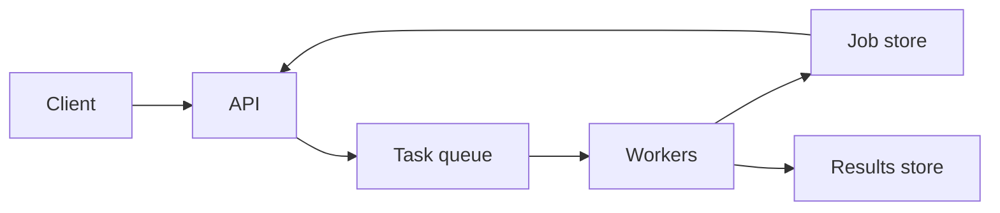

# Bulk and Long-Running APIs

## 1. One-Line Definition
Bulk and long-running APIs let a single call submit heavy work — millions of rows, a report, a video transcode — and return a *job* that progresses asynchronously, instead of holding an HTTP connection open until the work finishes.

## 2. Why Do We Need It?
HTTP was built for requests that complete in milliseconds, and infrastructure (load balancers, proxies, clients) treats multi-minute responses as failures: idle timeouts kill long connections, mobile clients drift to the background, and retries restart whole jobs. Heavy but legitimate work — bulk imports, media conversion, report generation — exceeds any sane request budget. The async job pattern decouples "accepted" from "done," so big work can take minutes or hours without a held connection and without redoing partial progress on every failure.

## 3. Simple Intuition
A catering order. You don't stand at the counter while 200 meals are cooked. You place the order, the kitchen hands you a receipt with an order number (accepted!), and later you call back or get a text when it's ready. If a burner dies mid-cook, the kitchen finishes or restarts the meal — not your problem to babysit. The API's `202 + job id` is that receipt; polling or webhooks are the "text when ready."

## 4. What Happens Without It?
Every heavy operation is forced into a synchronous response: the client times out mid-machine-transcode, the load balancer kills the session, the mobile app is backgrounded, and on any failure the *entire* job restarts from zero. Bulk calls blow request/response timeouts, burn connections, and offer the user no progress or partial results. Eventually someone writes a polling hack with a magic sleep — unmonitored, un-cancellable, unrecoverable.

## 5. Core Idea
- **Three shapes:**
  1. *Async job:* submit → `202 Accepted` + `Location` header with a job id → poll `GET /jobs/{id}` for status, or get a webhook/completion callback (planned: webhooks).
  2. *Bulk endpoint:* one request carries many items (a batch of orders, a CSV) → server processes and returns per-item results — partial success is a first-class outcome.
  3. *Streaming:* work sends incremental results as it goes (server-sent events, websockets, planned: SSE) for first-chunk-latency-sensitive cases.
- **The job lifecycle:** queued → running → succeeded / failed / canceled, with progress; driven by a **task queue + worker pool** ([message-queue|Message Queue], [[event-driven-architecture|Event-Driven Architecture]]).
- **Idempotent submission:** a dedup key on the submit call means client retries create one job, not ten — [[request-deduplication|Request Deduplication]] is the base contract.
- **At-least-once worker processing with per-item dedup:** a worker crash re-processes; item-level idempotency makes replay safe.
- **Partial results and retry of failed items:** a 1000-item bulk job should report 997 succeeded, 3 failed-with-errors, and make the 3 retryable without resubmitting the batch.

## 6. Important Terminology

| Term | Simple Meaning |
|------|----------------|
| 202 Accepted | The request was accepted; work continues elsewhere |
| Job id | Handle for polling status and fetching results |
| Task queue | Queue of units of work for the worker pool |
| Worker | Process that executes queued units of work |
| Polling | Periodically asking "is it done?" |
| Completion callback | Server pushes a notification when done (webhook, planned) |
| Partial success | Some items succeeded, some failed |
| Results store | Where finished job outputs are kept until fetch/expiry |

## 7. Basic Architecture



Submit lands in the queue; workers consume, keep status in the job store, and write results; the API serves status and results from the store, plus optional completion callbacks.

## 8. Request or Data Flow
1. Client submits with a dedup key. API validates, creates a job record (status: queued), enqueues work, returns `202`, `Location: /jobs/{id}`.
2. A worker claims the job → status `running`, stores progress.
3. Worker processes (per-item, idempotently); on failure it retries with backoff before marking items failed.
4. Completion → status `succeeded`, results and per-item summary stored with a TTL.
5. Client polls `GET /jobs/{id}` (or receives a callback), then fetches results; the job is idempotent so a poll-during-processing is safe.

## 9. Practical Example
A bulk email-send API: a client pushes a 500k-recipient campaign in one request.
- Submit: 200ms round trip → `202` job `job_7f3`.
- Queue + 40 workers consume ~50k sends/min → `progress: 60%` at 6 minutes.
- 3% hard-fail (bad addresses) → job status `succeeded` with a 15k-row failure report + a `retry-failed-items` endpoint that re-queues only the bad rows.
- Polling every 30s (or a completion webhook) is ~15 requests for a 9-minute job — versus one connection held for 9 minutes that any proxy would have murdered.

## 10. Scaling
- The queue decouples submit rate from processing rate: a spike enqueues millions of units and workers ramp behind it ([[consumer-lag|Consumer Lag]]).
- Autoscale workers on queue depth — the queue's backlog is the scaling signal.
- Fan-out/many-shards: one job may partition into many queue units (by recipient range, by file chunk) — the job store aggregates their results.
- Hot spots: a single massive job monopolizes the queue — split it into units, cap per-job worker share, and use multiple queues with priority (scheduling QoS like bulkheads).
- The results store grows as fast as jobs complete: TTL results, or write results to object storage and return URLs (planned: chunking and uploads; object storage).

## 11. Reliability and Failure Scenarios

| Failure | What Happens | Detection | Recovery | Trade-off |
|---------|--------------|-----------|----------|-----------|
| Worker crashes mid-item | Unit goes back to the queue | Heartbeat/lease timeout | Re-process (at-least-once) — needs item dedup | replay idempotency |
| Queue down | New jobs rejected or held | Queue health | Replicated broker, retry enqueue | broker infra |
| Job store lost | Status/history gone, results orphaned | Store health | Persist job metadata; rebuild from queue | durability cost |
| Client never polls | Job results sit until TTL | TTL sweeps | Optional callback; expire anyway | feedback vs cost |
| Half the bulk fails | Partial success | Per-item status matrix | Retry-failed-items endpoint | result bookkeeping |

## 12. Consistency and Correctness
- **Exactly-once effect, not exactly-once delivery:** workers get at-least-once; correctness comes from item-level dedup so replays don't double-side-effect ([[delivery-semantics|Delivery Semantics]], [[request-deduplication|Request Deduplication]]).
- **Ordering within a job** (when it matters — e.g. chunked file assembly) is managed by unit metadata, not assumed from queue order ([[kafka-ordering|Kafka Ordering]] is the how).
- **Atomic status transitions:** `queued → running → succeeded` must be guarded per job id so two workers can't both claim one job.
- **Partial-success contract:** the API must define exactly what `succeeded` means — all items, or all-non-failed — and carry per-item status, or clients will misread results.

## 13. Performance
- Bulk + async trades *latency of one request* for *throughput of the whole batch*: per-request overhead collapses, but completion is minutes away — the appropriate point for most DTU-bound work ([[latency-vs-throughput|Latency vs Throughput]]).
- Polling is the efficiency trap: too-frequent polling (1s) on thousands of clients thunders the status endpoint. Use backoff schedules, or callbacks.
- Checkpoint progress (per-N-thousand items) makes long jobs observable and resumable.
- Result size: returning millisecond-expensive giant result bodies via the API is wrong; stream or park in object storage and hand back a URL.

## 14. Security
- Jobs are user data: status/results endpoints must be authorized to the job's owner ([authentication-vs-authorization|Authentication vs Authorization]) — job ids are not authorization tokens.
- Bulk payloads are prime injection/DoS vectors: validate schema and size up front, cap batch size, and rate-limit submissions ([[rate-limiter|Rate Limiter]]).
- Result URLs should be expiring signed URLs so a leaked link does not outlive the job.
- Webhooks/callbacks must be signed/verified to prevent spoofed completions.

## 15. Trade-Offs

| Choice | Advantages | Disadvantages | When to Use |
|--------|------------|---------------|-------------|
| Async job | Accepts giant work, survives failures per unit | Polling/callback complexity, delay | Minutes-to-hours work |
| Bulk single request | One round trip for many items | Payload size limits, all-or-nothing risk | 100s-1000s of simple items |
| Streaming | First result fast | Complex state, backpressure | News feeds, chat, progressive UI |
| Polling | Dead simple, any client | Latency + load per poll | Low-QPS, test clients |
| Completion callback | No thundering polls, instant | Delivery failures, auth to push | B2B, partners, fan-out ready |
| Per-unit retry | Handles partial failure gracefully | More bookkeeping | Bulk with flaky items (email, imports) |

## 16. Common Mistakes
- Implementing "long but synchronous": blocking an HTTP thread for minutes (the firewall and the client both give up on you).
- Only queue, no job store/status/lifecycle — unobservable, unrecoverable jobs.
- Polling too fast ("aggressive poll" hammering status), or never checking back so results expire.
- Re-queuing a whole job because one item failed — throw away an hour of good work for one row.
- No item-level idempotency under at-least-once worker replay — double-sends on retry.
- Unbounded bulk payloads (500MB request bodies) without chunking or caps.

## 17. HLD vs LLD Boundary
HLD: which shape (async/bulk/stream), queue + worker topology, job-lifecycle model, status fields and TTLs, result storage and expiration, per-item retry policy, callback mechanism, dedup of submissions, capacity per job class. LLD: queue library usage, the worker's claim/poll handler, per-item idempotency keys, status-update SQL/Redis ops, and the specific backoff schedule.

## 18. Interview Questions

### Beginner
- Why can't heavy work just stay in a synchronous HTTP response?
- What does `202 Accepted` mean and how does a client follow up?

### Intermediate
- Design a bulk CSV import API: the happy path, a crash mid-batch, and the partial-success contract.
- Polling every second on 100k jobs — what breaks and what do you do instead?

### Advanced
- Design a video transcoding API with at-least-once workers and no duplicated side effects.
- How do you make a 10-hour job resumable, cancelable, and rate-limit-safe — walk the full lifecycle and storage of its state.

## 19. Interview Memory Summary

> [!abstract]- Interview Memory Summary

### Remember

- Long work is a job, not a request: `202` + job id + poll/callback.
- Queue + workers decouples accept-rate from process-rate.
- Workers get at-least-once; correctness needs per-item dedup.
- Status lifecycle: queued → running → succeeded/failed/canceled with progress.
- Partial success is first-class: retry only the failed items.
- Polling needs a backoff schedule or a completion callback.
- Results get TTLs or move to URL-addressed storage.
- Jobs are user data — authorize status/results like any resource.

### 30-Second Explanation

Submit heavy work through the API: validate, create a job record, enqueue units, and return `202` with a `Location` header. Workers claim units, update the job store's status and progress, write idempotent per-item effects, and land results in a store (or object-storage URLs) with a TTL. The client polls on a sane schedule or gets a completion callback, then fetches outputs and retries only genuinely failed items. The queue gives elasticity; the dedup keys and per-item idempotency make the at-least-once world safe.

### Interview Traps

- Blocking an HTTP connection for minutes and calling it long-running.
- A queue with no job store — no status, no recovery, no results.
- One failed item restarts the whole batch.
- No idempotency under worker replay (the double-send).
- Aggressive polling as a band-aid for missing callbacks.

### Key Trade-Off

Async job processing trades immediate results and added infrastructure (queue, workers, job store, callbacks) for the ability to accept arbitrarily large work, survive per-unit failures, and scale processing to the backlog — while the cost is complexity and first-result latency.

## 20. Related Concepts

### Prerequisites

- [[message-queue|Message Queue]]
- [[retry-and-timeout|Retry and Timeout]]

### Commonly Used Together

- [[event-driven-architecture|Event-Driven Architecture]] — completion events and workflows
- [[consumer-lag|Consumer Lag]] — the queue backlog is your scaling and health signal
- [[delivery-semantics|Delivery Semantics]] — at-least-once and the exactly-once effect
- [[request-deduplication|Request Deduplication]] — one job per submit, no matter the retries
- [[error-handling|Error Handling]] — retryable vs non-retryable per item
- [[api-timeouts|API Timeouts]] — the submit/poll calls are synchronous and bounded
- [[disaster-recovery|Disaster Recovery]] and [[rpo-rto|RPO and RTO]] — jobs and their stores must survive region trouble

### Alternatives

- Synchronous APIs when work fits in a request budget
- Streaming for first-chunk-latency-sensitive results
- [[publish-subscribe|Publish/Subscribe]] when consumers subscribe instead of jobs

Related planned topics (not authored yet): webhooks, idempotent consumer, chunking and uploads, object storage.

## 21. References
Google Cloud API design guide (Long-Running Operations); AWS documentation (async job and Step Functions patterns for long-running work); RESTful web services guidance on `202 Accepted` (RFC 9110 semantics). All real, canonical sources.

## 22. Active Recall

Test yourself before revealing each answer.

> [!question]- Basic: what does `202 Accepted` promise, and what must the client do next?
> It promises the request was validated and *accepted for processing*, not that it succeeded. The response carries a job id (usually in `Location`); the client follows up by polling the job's status endpoint or receiving a completion callback, then fetches results. No status field: don't leave the client guessing.

> [!question]- Design: a bulk import job processes 1000 rows and 3 fail with transient errors. What does your contract say?
> The job outcome is *partial success*: status `succeeded`, a per-item summary (997 ok with ids, 3 failed with codes and reasons), and a `retry-failed-items` endpoint that re-queues only the 3 rows idempotently. The contract must say what `succeeded` means (all-row-level effects attempted), or clients will misread a genuinely good job.

> [!question]- Trade-off: polling vs completion callback for learning a job finished.
> Polling is universally compatible and dead simple but costs latency and severely limits scale (100k clients polling every second is a self-DoS). Callbacks (webhooks, planned) are cheap and instant but require you to receive, authenticate, and retry push-delivery — plus handle the case where delivery fails. Production pattern: callbacks for partners, backoff-scheduled polling for small/first-class callers.

> [!question]- Failure: a worker crashes after doing half the work of one job unit. What happens, and why is nothing duplicated?
> The job's unit returns to the queue (by lease/heartbeat timeout) and another worker re-processes it — at-least-once delivery. No duplication only if the unit's effects are idempotent (per-item dedup keys, transactional markers), so replaying "send email to id X" produces the same outcome as the first attempt. Without idempotency, that crash is a double-send.

> [!question]- Interview scenario: design a video transcoding API. Walk submit through results.
> Submit with a dedup key → API validates the video, creates the job, splits into chunk units on the queue, returns 202 + job id. Workers transcode chunks idempotently (output objects addressed by content key, so a replay overwrites rather than duplicates), aggregate progress in the job store, then an assembler finalizes. Client polls with backoff or receives a callback; result is a playlist URL with a TTL. A worker crash mid-chunk just re-runs that chunk.

> [!question]- Design: how do you keep the results store bounded?
> Give results a TTL and purge after it; for objects, move outputs to object storage and return expiring signed URLs instead of bodies; keep only lightweight metadata in the job store. Sweep expired jobs so storage grows with active work, not cumulative work.

> [!question]- Trade-off: sync vs async for a 10-second report. Which do you choose and why?
> Sync if 10s fits the client's and proxies' timeout budgets and the caller blocks anyway — simpler. Async if the calling context can't hold a connection (mobile backgrounding, LB idle timeouts), if the work can grow past the budget, or if the user should see progress and do other things meanwhile. The rule: if the work *can* outgrow the budget, start async.

## 23. When Should I Use This?

### Use it when

- Work plausibly exceeds client or infrastructure timeout budgets — that's almost any batch job.
- The workload is elastic (imports, campaigns, transcodes) and a queue absorbs bursts.
- You want per-unit retry, partial success, progress, and cancelability for jobs.
- Multiple independent units of a request can be processed in parallel to dominate latency.

### Avoid it when

- Work finishes comfortably within a request budget — async adds queue, job store, polling, and callbacks for nothing.
- The client needs the result immediately and interactively (then stream or go sync).
- You cannot operate a durable queue and a job store — the async pattern's safety net is durability, and half of it is a lie.

### What problem does it solve?

Accepting and reliably executing work too big or too slow for a synchronous HTTP request, with progress, partial success, resumability, and throughput decoupled from submit rate.

### What problem does it NOT solve?

Not interactive latency (first-result latency is *worse* than sync), not arbitrary availability (queues and job stores add infrastructure to keep alive), and not exactly-once processing by itself — at-least-once workers still need idempotency to avoid doubled side effects.

## 24. Decision Connections

Decisions that go together with bulk and long-running APIs:

- [[message-queue|Message Queue]] — the backbone: durable task queue between submit and work.
- [[event-driven-architecture|Event-Driven Architecture]] — jobs emit completion/step events for downstream reactions.
- [[consumer-lag|Consumer Lag]] — the queue backlog is both scaling signal and risk meter.
- [[delivery-semantics|Delivery Semantics]] — at-least-once in, exactly-once effect out.
- [[request-deduplication|Request Deduplication]] — submission idempotency so client retries don't create duplicate jobs.
- [[error-handling|Error Handling]] — retryable vs non-retryable per item drives the retry-failed-items flow.
- [[api-timeouts|API Timeouts]] — submit and poll stay ordinary bounded synchronous calls.
- [[disaster-recovery|Disaster Recovery]] — queues and job stores need their own RPO/RTO story.

Decision tree:

```
Heavy work: minutes to hours, elastic, batch-able?
    |
    +-- Finishes within a request budget?
    |      → synchronous API; avoid the async tax
    |
    +-- Needs first chunk fast?
    |      → streaming result (SSE/websockets, planned)
    |
    +-- Genuinely long or bulk?
    |      → async job + queue + worker pool
    |         +-- Submit idempotent?       → [[request-deduplication|Request Deduplication]] on submit
    |         +-- Side effects per item?   → per-item dedup (delivery semantics + exactly-once effect)
    |         +-- Partial failures likely? → per-item status, retry-failed-items
    |         +-- Many items at once?      → bulk request with chunked/streamed payload
    |         +-- Who hears completion?    → callback (planned: webhooks) or backoff polling
```

Decision tree leaf notes: every branch centers on a durable queue, a job store with a lifecycle, and results that expire.