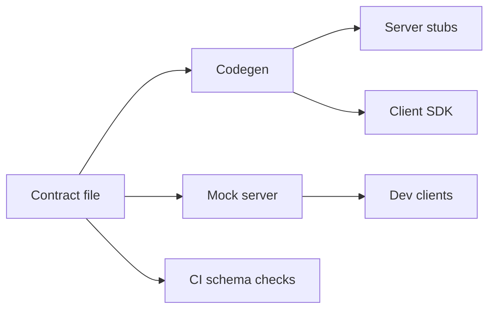

# Contract-First Design

## 1. One-Line Definition
Contract-first design means defining an API's machine-readable schema and semantics — the *contract* — before any implementation, and generating or mocking both the server and the client from that single source of truth.

## 2. Why Do We Need It?
Teams on both sides of an API develop in parallel. Without a shared, versioned, machine-readable contract, each side writes its own mental model: the server ships what it guessed, the client consumes what it guessed, and they meet — badly — at integration time. Interesting behavior drifts across docs, code, and test stubs. Contract-first makes the interface a first-class, reviewed, versioned artifact both sides agree to build against, so integration breaks are found by CI, not by production incidents.

## 3. Simple Intuition
A house blueprint. Plumbers and electricians don't negotiate fixture placement on-site while the walls are going up; they get the same approved plan and work against it. When someone wants to move a socket, they don't job-site-argue — they revise the plan (a versioned contract), review it, and only then do the trades proceed. The blueprint is the contract; the trades are client and server.

## 4. What Happens Without It?
Contract urban sprawl: the "source of truth" is a chat thread, docs drift to fiction, generated SDKs don't match the deployed endpoints, and breaking changes land unannounced because nobody could see every consumer. Server teams ship; client teams discover the mismatch at integration, then each team patches on their side until the contract is a tangle of exceptions only the author understands. Every upgrade becomes a coordinated funeral.

## 5. Core Idea
- **The contract artifact:** a versioned, machine-readable schema — OpenAPI (REST), Protobuf/IDL (gRPC), GraphQL SDL, AsyncAPI (events) — committed to the repo like code, reviewed in PRs like code, and diffed in CI like code.
- **Contract-first, not code-first:** the schema is written and agreed *before* implementation; server stubs and client SDKs are generated from it (or mocked from it) so both sides start from the same shapes.
- **Semantics live in the contract too:** not just field shapes — status codes, the error envelope, pagination style, idempotency, authentication — the behavior contract beyond the schema [[error-handling|Error Handling]].
- **Compatibility discipline:** additive changes are usually backward-compatible; breaking changes (rename/remove/rettype, semantic reversals) require a new version and a migration plan — enforced by schema-diff checks.
- **Review is the point:** the contract is where trade-offs are discussed before they calcify into code; a schema PR is the cheapest place to catch an over-scoped API (see [[api-composition|API Composition]] for the over-fetching consequence).
- **Mock servers and contract tests:** from a single schema you get a runnable mock server (clients develop before the server exists) and contract tests (server responses validated against the schema in CI).

## 6. Important Terminology

| Term | Simple Meaning |
|------|----------------|
| Contract | Versioned machine-readable API definition |
| OpenAPI | Contract language for REST APIs |
| Protobuf / IDL | Contract + serialization for gRPC/RPC |
| GraphQL SDL | Schema language for GraphQL |
| AsyncAPI | Contract language for event streams |
| Codegen | Generating server/client code from the contract |
| Mock server | Fake server generated from contract for parallel dev |
| Contract test | Validating a real response against the contract |
| Breaking change | A change that would silently break old clients |

## 7. Basic Architecture



One contract drives generated server, client, mock, and validation — nothing authoritative survives outside the file.

## 8. Request or Data Flow
1. A feature needs an API: a schema PR is written (types, endpoints, statuses, error envelope, pagination, auth).
2. Reviewers (including a consumer-side engineer) reject or refine; on approval it merges.
3. CI validates the schema itself and diffs it against the previous version for compatibility; codegen emits server stubs + client SDK + a mock server.
4. Server team implements stubs; client team develops against the mock. Contract tests validate real traffic shapes against the contract.
5. Schema changes go through the same gate: a breaking diff fails CI until a version bump and migration exist.

## 9. Practical Example
A payments team exposes `POST /charges`. The contract defines: success `200` with the charge object, `409` `idempotency-conflict`, `422` invalid-argument with per-field detail, retryability per error ([[request-deduplication|Request Deduplication]] pair). Generated artifacts: a Java server stub, a mobile SDK, a mock server. The web team ships its checkout against the mock two weeks before the server exists; CI on both repos fails on any schema drift; a rename of `charge.amount_cents` to `amount` fails the diff check and forces a `v2` decision. The contract negotiation happened in the schema PR — not in a production incident.

## 10. Scaling
- **Org-wide registry:** with many services, contracts gather in a shared registry/repo with ownership rules — every consumer subscribes to changes, so breaking diffs travel as notifications.
- **Schema sprawl is the scaling risk:** hundreds of one-off contracts with copied field names drift. Central naming and reuse conventions (shared component schemas) keep the fleet greppable.
- **Pipelines at scale:** contract-as-CI-gate only scales if codegen is fast, deterministic, and hermetic — otherwise the registry becomes a bottleneck.
- **Multiple protocol families** (REST + gRPC + events) each need their contract regime; don't force one tool for all (planned: RPC/gRPC/GraphQL).

## 11. Reliability and Failure Scenarios

| Failure | What Happens | Detection | Recovery | Trade-off |
|---------|--------------|-----------|----------|-----------|
| Drift between contract and server | Generated clients break at runtime | Contract tests in CI | Reject non-conforming responses | test maintenance |
| Breaking change slips past diff | Old clients fail silently | Compatibility checks + canary rollouts | Version + migration, then coordinated rollout | release ceremony |
| Contract vs doc vs mock mismatch | Confusion, mis-built clients | Single-source tests reuse the same file | Mock and docs generated from the contract | upfront investment |
| Generated code unreviewable | Opaque stubs | Code-review only of overrides | Keep codegen output read-only, override rarely | freedom vs consistency |

## 12. Consistency and Correctness
- **Versioning is the contract's job:** the schema diff says whether a change needs a new version; the discipline ("additive is safe, breaking must version") is enforced in CI, not memory.
- **Semantics must be pinned, not implied:** the contract states idempotency markers, ordering guarantees, and error codes; a schema without semantics is a shape with no behavior ([[delivery-semantics|Delivery Semantics]] for the async side).
- **Cross-service schemas** (events, RPC) share one registry so A's emit and B's consume can be diffed against the same artifact — drift is caught before deployment.
- Timestamp/units/enum stability: the classic silent breakers; the schema pins types but the *meaning* (UTC vs local, cents vs dollars) needs explicit contract prose and tests.

## 13. Performance
- Frameworks add little per-request overhead; the contract doesn't dictate latency. Where it *does* matter: heavy validation on every request is the price of enforcing the contract at runtime — validate once at the boundary, not per hop.
- Codegen can bloat payloads if defaults aren't reviewed (a contract granting every optional field leads to over-fetching — [[api-composition|API Composition]]).
- Serialization cost differs by protocol (JSON vs protobuf); the contract choice is also a performance choice for hot paths (planned: RPC/gRPC/GraphQL).

## 14. Security
- The schema review is a security review: it exposes attack surface — new endpoints, parameter autos, IDOR-prone identifiers — before code exists.
- Strict validation at the boundary (reject unknown fields, type-check, enforce limits) is the first defense against over-posting, injection, and schema-confusion attacks (see [[web-vulnerabilities|Web Vulnerabilities]]).
- Secrets never live in a contract; auth fields reference mechanisms (OAuth scopes) rather than embedding credentials, and least-privilege scopes are part of the contract [[authentication-vs-authorization|Authentication vs Authorization]].

## 15. Trade-Offs

| Choice | Advantages | Disadvantages | When to Use |
|--------|------------|---------------|-------------|
| Contract-first | Parallel dev, less drift, reviewable interface | Upfront ceremony, schema verbosity | External or multi-team APIs |
| Code-first | Fast, matches implementation trivially | Implementation dictates interface, drift-prone | Internal, single-team, throwaway |
| OpenAPI (REST) | Huge ecosystem, HTTP-native | JSON heavy, codegen quality varies | REST-heavy orgs |
| Protobuf/gRPC | Typed, fast, streaming built-in | Toolchain lock-in, less human-readable | High-QPS internal contracts |
| GraphQL SDL | Client-declared fields, one endpoint | Caching/codegen complexity | Client-rapidly-evolving frontends |
| Recommended vs enforced | Good default with guard rails | If unenforced, "contract-first" is a slogan | Any org with >2 teams |

## 16. Common Mistakes
- Code-first quietly masquerading as contract-first: the schema is generated *from* the code and backfilled — drift returns, review is hollow.
- Hand-written OpenAPI that never passes validation — the contract fails its own admit test; run it through linters in CI.
- Breaking changes without a version bump, because "the diff looks small."
- Designing only the shapes: no error envelope, no idempotency, no pagination, no auth — so the "contract" is half a contract.
- A schema that says everything and commits to nothing — every field optional is no contract at all.
- Versioning by copying the whole schema file (`v2` duplicate) instead of diff-driven evolution — two sources of truth from day one.

## 17. HLD vs LLD Boundary
HLD: contract-first vs code-first decision, the contract technology (OpenAPI/protobuf/GraphQL/AsyncAPI), versioning and compatibility policy, registry/ownership model, CI gates, and how semantics (errors, idempotency, pagination) are pinned. LLD: writing the schema file, generating and wiring stubs, building the mock server, writing the specific contract tests, and the diff script.

## 18. Interview Questions

### Beginner
- What does "contract-first" mean, and how is it different from code-first?
- What concrete artifacts can a single schema produce?

### Intermediate
- Design the contract-first workflow for a team of six with a separate mobile consumer team. Where does drift get caught, and who owns the schema?
- A requested change is additive but client team still breaks. What part of the process failed?

### Advanced
- How do you enforce compatibility across 50 services with a shared registry, and how do you version a breaking event schema consumed by others?
- Contract-first vs code-first for a prototype-to-production API — when do you switch, and what must be in place to switch without pain?

## 19. Interview Memory Summary

> [!abstract]- Interview Memory Summary

### Remember

- The contract is a machine-readable, versioned, reviewed artifact — a file, not a doc.
- Contract-first: schema before implementation; codegen + mocks derive from it.
- Semantics belong in the contract: errors, idempotency, pagination, auth — not just shapes.
- Additive changes are safe; breaking changes demand a version + migration, enforced by CI diff.
- Contract tests and mock servers find integration breaks before deploy.
- A registry + an ownership model keeps 50 services from sprawling.
- Reviewing the schema is reviewing the product.

### 30-Second Explanation

Before any implementation, a team writes a versioned machine-readable schema and a semantics block (status codes, error envelope, idempotency, pagination, auth). Reviewers — including a consumer-side engineer — argue over the file, then CI validates it, diffs it for compatibility, and generates server stubs, client SDKs, and a mock server from it. Both sides develop in parallel against the same truth; contract tests hold live traffic to the schema; a breaking diff fails CI until a version bump and migration exist. The contract is where product decisions and integration failures are caught cheapest.

### Interview Traps

- Claiming contract-first while generating the schema from code.
- A schema with fields but no semantics — that's a shape, not a contract.
- Breaking changes without versioning because "nobody will notice."
- Hand-written OpenAPI that fails its own validation in CI.
- Duplicating schemas per version instead of diff-driven evolution.

### Key Trade-Off

Contract-first trades speed-to-first-code and schema ceremony for massively cheaper integration: drift, mis-negotiation, and breaking changes are caught in review and CI instead of in production — but only if the contract is actually the source of truth, enforced by machines.

## 20. Related Concepts

### Prerequisites

- [[http-and-https|HTTP and HTTPS]]
- [[delivery-semantics|Delivery Semantics]]

### Commonly Used Together

- [[error-handling|Error Handling]] — the error envelope and codes are part of the contract
- [[api-composition|API Composition]] — contracts define the composed responses clients rely on
- [[request-deduplication|Request Deduplication]] — idempotency semantics pinned in the contract
- [[authentication-vs-authorization|Authentication vs Authorization]] — scopes and auth flows part of the contract

### Alternatives

- Code-first development when the API is internal and single-team
- Schema-on-read flexibility for rapidly prototyping frontends (GraphQL, planned under RPC/gRPC/GraphQL)

Related planned topics (not authored yet): API versioning, REST constraints, RPC / gRPC / GraphQL, backward compatibility, event schema registry.

## 21. References
OpenAPI Specification (OAS 3.x, current); Google Cloud API Design Guide (versioning guidance and API improvement proposals); gRPC / Protocol Buffers documentation (IDL-first development); AsyncAPI specification (event contracts). All real, canonical sources.

## 22. Active Recall

Test yourself before revealing each answer.

> [!question]- Basic: what makes contract-first genuinely different from code-first?
> In code-first the implementation shapes the interface and the schema is an after-image; drift and asymmetry between sides are invisible until integration. In contract-first the schema is written, reviewed, and versioned *before* implementation, and server, client, mock, and tests all derive from that one file — so drift is caught by CI and both sides start from identical assumptions.

> [!question]- Design: a change adds a new optional field but drops a deprecated one. Is it breaking, and what does CI say?
> Optional field: usually additive and safe. Dropping a field: literally breaking — an old client that reads it gets undefined after deploy. The policy is mechanical: add = safe, remove/rename/retype = version bump. CI diff flags the drop even if it "feels small," forcing a version + migration decision rather than a silent contractual lie.

> [!question]- Trade-off: contract-first's real costs — name them honestly.
> Upfront ceremony (schema PR, review, codegen wiring), verbosity (hand-written OpenAPI is long), toolchain lock-in (codegen quality varies, generated code is read-only), and the risk that it's only a slogan if nothing enforces the contract in CI. The payoff: integration failures, mis-negotiation, and breakage found where they're cheapest — proportionally worth it for any API with more than one team.

> [!question]- Failure: your server deploys a field rename but neither the version nor the diff gate caught it. What went wrong in the process?
> Either the flux wasn't contract-first (schema generated post-hoc from code), or CI doesn't run the compatibility diff, or the deployment system bypassed the gate. The fix is mechanical and unglamorous: the schema lives in the same repo/registry as the server, CI validates + diffs it against the previous tagged contract, and deploys that violate it fail. If the contract isn't machine-enforced, it's decorative.

> [!question]- Interview scenario: two teams build the same endpoint guessing at each other. How does contract-first change the timeline?
> The interface argues happen in one schema PR before code exists: consumer-side engineer reviews shapes, error envelope, idempotency, pagination, auth. Both teams then develop in parallel — the mobile team against a generated mock, the server team against generated stubs — meeting at CI-run contract tests instead of at production. The integration risk moves from a launch-day fire to an early review that costs minutes.

> [!question]- Design: how do you share contracts across 50 services without anarchy?
> A central registry with ownership per contract: one place to subscribe to changes, shared component schemas for common types (error envelope, money, timestamps), and per-service admins who approve their contract's diffs. Breaking changes publish notifications to all consumers, and CI on every consumer runs the diff. The registry becomes the org's nervous system — greppable, versioned, testable — instead of 50 local truths.

> [!question]- Basic: why do semantics (errors, idempotency) belong in the contract, not just field shapes?
> Because a client can only behave correctly if it knows that a `409` is non-retryable, that a request must carry an idempotency key, or that pagination is cursor-based. Those behaviors are coordination facts between the sides, exactly like field types are — so they belong in the same reviewed, versioned, diffed artifact. A shapes-only contract still leaves integration to guesswork.

## 23. When Should I Use This?

### Use it when

- More than one team or organization consumes the API — external partners, mobile teams, other services.
- Two sides must develop in parallel (server and client both under time pressure).
- The API is long-lived: it will be versioned, evolved, and possibly replaced; the contract documents that evolution.
- Breaking a remote consumer costs far more than the schema ceremony (usually true for anything public).

### Avoid it when

- The "API" is three endpoints for one internal consumer that also owns the backend.
- You're prototyping semantics at speed and the interface will be thrown away.
- The org won't enforce it: an unenforced contract-first is worse than honest code-first, because it claims a guarantee it doesn't provide.

### What problem does it solve?

Parallel development against a shared truth: drift and mis-negotiation are caught in schema review and CI instead of at integration, breaking changes are visible and managed, and mock servers let clients build without a backend.

### What problem does it NOT solve?

It doesn't make your backend reliable (a valid contract can be a broken service; reliability is [[reliability|Reliability]] elsewhere), it doesn't choose the right interface design (a clean contract can still be bad API design), and it doesn't replace runtime testing: contract tests prove the shape, not the correctness of the implementation behind it.

## 24. Decision Connections

Decisions that go together with contract-first design:

- [[error-handling|Error Handling]] — the error envelope and codes are contract elements; version them with the API.
- [[api-composition|API Composition]] — composed responses become contracts your clients compile against.
- [[request-deduplication|Request Deduplication]] — idempotency semantics and keys are pinned in the contract.
- [[authentication-vs-authorization|Authentication vs Authorization]] — scopes and flows are declared in the contract.
- [[delivery-semantics|Delivery Semantics]] — async/event contracts (AsyncAPI) define delivery guarantees too.
- [[bulk-and-long-running-apis|Bulk and Long-Running APIs]] — job lifecycle and polling contract comes from the same source of truth.
- [[http-and-https|HTTP and HTTPS]] — the transport the REST contract builds on.

Decision tree:

```
Define the interface for this API
    |
    +-- One team, own consumer, throwaway?
    |      → code-first; skip the ceremony
    |
    +-- Multi-team, external consumers, long-lived?
    |      → [[contract-first-design|Contract-First Design]]
    |         |
    |         +-- REST ecosystem?        → OpenAPI
    |         +-- High-QPS typed RPC?    → Protobuf / gRPC (planned: RPC/gRPC/GraphQL)
    |         +-- Client-declared fields?→ GraphQL SDL (planned: RPC/gRPC/GraphQL)
    |         +-- Events/async?          → AsyncAPI
    |         |
    |         +-- CI gates: schema validation + compatibility diff
    |         +-- Versioning: additive safe, breaking must bump
    |         +-- From one file: server stubs, client SDK, mock server, contract tests
```