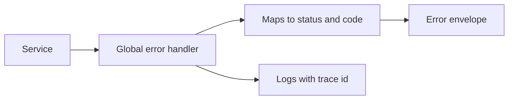

# Error Handling

## 1. One-Line Definition
Error handling is the deliberate design of how failures are detected, classified, represented as structured responses, and recovered from across an API, so that clients, retries, alerts, and support all get consistent, actionable information.

## 2. Why Do We Need It?
Failures are inevitable; ambiguity is not. Without a designed error model, every service formats failures differently: one returns `200` with `{"ok": false}`, another `400` with free text, another drops the response entirely. Clients then *guess* — and guesses cause double charges, silent data loss, and long incident recovery. A shared error contract lets clients classify, retry, and expose the failure correctly, and lets operators correlate it across the stack.

## 3. Simple Intuition
A restaurant order: the waiter does not just fail to bring your salmon. They come back and say "we're out of salmon — here is the grilled fish if you'd like it, or you can change the order." That is a well-formed error: it says what failed, why, and what the recoverable options are. A kitchen that simply serves nothing instead is the API that hangs on a 5xx forever.

## 4. What Happens Without It?
A zoo of ad-hoc errors: `200` wrapping failures, stringly-typed messages clients try to parse, status codes that lie about retryability, sensitive stack traces leaking, and errors that die silently in log files. On-call can't tell a bad request from a broken backend; clients retry things retry can't fix and don't retry things that would succeed on retry. It is one of the cheapest failures to prevent and one of the most costly to inherit.

## 5. Core Idea
- **HTTP status classes are the coarse grammar:** 4xx means "the client did something wrong — fix the request"; 5xx means "the server failed — retry may help." 401/403 (authn/authz), 404, 409 (conflict), 422 (validation), 429 (rate limited), 500/502/503 (server trouble).
- **A consistent envelope:** every error body has the same shape — a stable machine-readable code, a human message, and optional details (`RFC 9457` Problem Details standardizes `type/title/status/detail/instance`).
- **Codes ≠ status:** status is the class; the code is the precise, versioned identifier clients branch on. Never parse human messages.
- **Retryable vs non-retryable:** the response must tell clients whether calling again can ever succeed. 429/503/504/408 are classically retryable-with-backoff; 400/404/409/422 are not.
- **Global error handler:** one boundary point maps internal exceptions (DbDown, ValidationFailed, OutOfStock) to status + code + envelope, so every service speaks the same dialect.
- **The error catalog:** a versioned registry of every code, its meaning, retryability, and a human explanation — the contract of failure.

## 6. Important Terminology

| Term | Simple Meaning |
|------|----------------|
| Error code | Stable machine-readable identifier for a failure |
| Error envelope | Consistent JSON shape wrapping all failures |
| Retryable error | Failure that may succeed if repeated later |
| Non-retryable error | Failure doomed to repeat; client must not retry |
| Problem Details | RFC 9457 standard error format |
| Status class | 4xx client / 5xx server category |
| Error catalog | Registry of all codes + their meaning |
| Graceful degradation | Reducing functionality instead of failing wholesale |

## 7. Basic Architecture



All exceptions funnel through one handler that classifies, shapes, and logs them — the client never sees raw framework errors.

## 8. Request or Data Flow
1. Request arrives; validation fails → handler maps to `422` with code `invalid-argument`, field details, no sensitive internals.
2. Business rule violation → `409` with code `duplicate-order`, retryable `false`.
3. Downstream dependency times out → `503` with code `dependency-unavailable`, retryable `true`, with `Retry-After` hint.
4. Every error includes a trace/correlation id matching the logs ([[distributed-tracing|Distributed Tracing]]).
5. Client branches on `code` and `retryable`, never on the message text.

## 9. Practical Example
A payments API's catalog: `invalid-argument` (422, no retry), `unauthorized` (401, no retry), `insufficient-funds` (402-analog custom `402`-family code, no retry), `idempotency-conflict` (409, no retry), `rate-limited` (429, retry → wait `Retry-After`), `upstream-unavailable` (503, retry). One envelope shape everywhere:

```json
{"error": {"code": "upstream-unavailable", "message": "Processor unavailable",
           "retryable": true, "trace": "t-9f2a"}}
```

A client retry loop checks `retryable` + backoff; the on-call dashboard groups by `code`; support uses the `trace` to pull logs. All three tasks use the same artifact — that is the point.

## 10. Scaling
- Centralize via an error catalog and a shared library or gateway remapping so 100 services emit one dialect; drift is the going-to-scale killer.
- Error paths should cost less than success paths: filter internal details at the edge, sample verbose logs, never serialize stack traces into responses.
- 429s and 503s multiply during incidents — they must carry `Retry-After` and the catalog must say "back off," or retry storms turn one failure into an outage ([[rate-limiter|Rate Limiter]]).

## 11. Reliability and Failure Scenarios

| Failure | What Happens | Detection | Recovery | Trade-off |
|---------|--------------|-----------|----------|-----------|
| Envelope shape drift | Clients break on old parsers | Versioned catalog + contract tests | Reject non-conforming responses, version | hardening cost |
| 5xx mislabeled retryable | Clients hammer a dead dependency | Error-rate alerting | Return 503 + Retry-After, add [[circuit-breaker|Circuit Breaker]] | complexity |
| 200-with-error-body | Observability sees success | Check status != 2xx rule in logging | Kill the pattern at the gateway | none — it's a bug |
| Sensitive details in errors | Data leak in responses/logs | Scrub at the handler | Generic external message + internal detail log | debugging speed |

## 12. Consistency and Correctness
- Stability of codes is the contract: codes are versioned like endpoints — never repurpose or remove without a version bump (contract-first design, planned).
- The error must not lie: a `404` for a resource that exists (security by obfuscation) is a conscious choice, but then it must be *consistently* a 404 everywhere.
- Correlation: every error carries a trace id that joins the request's logs across services; without it, error handling is debugging in the dark.

## 13. Performance
- Mandate cheap error paths: classify at the handler, emit a small envelope, and log at sampled or structured levels — avoid stack-trace serialization per error.
- Errors that are also *load* signals (429/503) should be nearly free to produce, because they are generated in bulk exactly when capacity is tight.
- Monitoring: error rate, error latency, and top-errors always alertable — [[golden-signals|Golden Signals]].

## 14. Security
- Never leak internals: database names, SQL, stack traces, and internal hostnames belong in internal logs, not responses (attackers map your stack from error text; see [[web-vulnerabilities|Web Vulnerabilities]]).
- Treat error paths as attack surface: identical "wrong password" vs "user not found" messages avoid user enumeration; validation errors must not expose internal logic.
- Error envelopes should not carry PII or secrets — scrub tokens, card numbers, and personal data before the boundary.

## 15. Trade-Offs

| Choice | Advantages | Disadvantages | When to Use |
|--------|------------|---------------|-------------|
| Detailed errors (internal) | Fast debugging | Data-leak risk, verbosity | Inside the perimeter |
| Generic errors (external) | Safe, small | Hard for clients to self-fix | Public APIs |
| Codes + catalog | Clients branch reliably | Catalog governance burden | Any public/multi-client API |
| Pure human messages | Fast to write | Clients must parse free text | Internal throwaway scripts |
| Retryable flag in payload | Explicit, self-describing | And the status bar | Rich SDK clients |
| Standardized Problem Details | Interoperable, tooling | Slightly formal | Standards-aligned orgs |

## 16. Common Mistakes
- Returning `200` with an error flag in the body — observability, clients, and proxies all treat it as success.
- Making clients depend on human-readable messages (they will break when text changes).
- Not marking retryability: clients guess, and guessing causes storm retries that a 503 + Retry-After would prevent.
- Retrying 4xx errors (doomed request) as if they were transient.
- Leaking stack traces, SQL, and internals in production responses.
- Inconsistent shapes per team — every client then needs per-team adapters.

## 17. HLD vs LLD Boundary
HLD: the envelope schema, the code/status taxonomy, retryability rules, where the global handler lives, the catalog process, and gateway remapping. LLD: the exception-to-code mapping table, the JSON serializer, the logging filter, and the shared client SDK's error parser.

## 18. Interview Questions

### Beginner
- What is the difference between 4xx and 5xx, and why does the class matter for retries?
- Why is "200 with an error body" considered harmful?

### Intermediate
- Design the error contract for a payments API: what codes, statuses, and retryability?
- A service returns 500 for both a validation failure and a DB outage. What breaks for clients?

### Advanced
- How do you keep one error dialect across 100 services, and how does the gateway participate?
- (a) Trace id correlation: an error crossed three services. How does a single envelope surface the root cause?

## 19. Interview Memory Summary

> [!abstract]- Interview Memory Summary

### Remember

- 4xx = client's fault, fix the request; 5xx = server's fault, maybe retry.
- One envelope, stable machine-readable codes, never parse messages.
- The retryable flag (not the status alone) drives client retry behavior.
- A global error handler maps exceptions → status + code in one place.
- Codes are part of the API contract: versioned, cataloged, never repurposed.
- Error paths must be cheap — they run hardest during overload.
- No stack traces, SQL, or PII in external errors.

### 30-Second Explanation

Errors are a first-class part of the API contract. Every failure funnels through one boundary handler that classifies it by class (4xx vs 5xx), picks a stable versioned code, sets retryability, carries a trace id, and returns the same envelope shape. Clients branch on codes and honor retryability with backoff; operators group by code and join to logs by trace id. The status class says who is at fault; the retryable flag says whether calling again can help.

### Interview Traps

- "200 OK" carrying a failure — the classic silent killer.
- Parsing messages instead of codes, and repurposing codes without versioning.
- Retrying 4xx or failing to retry 5xx with the right backoff.
- Detailed production errors that leak the blueprints of the system.
- No correlation across services — the error says what broke but never where.

### Key Trade-Off

Structured, cataloged, versioned errors cost governance and ceremony; ad-hoc errors are free until the first incident where nobody can tell what failed or what is safe to retry.

## 20. Related Concepts

### Prerequisites

- [[http-and-https|HTTP and HTTPS]]
- [[retry-and-timeout|Retry and Timeout]]

### Commonly Used Together

- [[retry-and-timeout|Retry and Timeout]] (retryability drives the retry loop)
- [[circuit-breaker|Circuit Breaker]] (stop retrying a dead dependency)
- [[rate-limiter|Rate Limiter]] (429s and Retry-After)
- [[distributed-tracing|Distributed Tracing]] (trace id on every error)
- [[golden-signals|Golden Signals]] and [[observability|Observability]] (error-rate alerting)

### Alternatives

- Log-only errors (no structured contract) for internal, low-traffic services
- Failing completely vs [[reliability|Reliability]]-style degradation with fallbacks

Related planned topics (not authored yet): idempotent retry, load shedding, API error model in contract-first design (planned).

## 21. References
RFC 9110 (HTTP semantics and status codes); RFC 9457 (Problem Details for HTTP APIs); Google Cloud API design guide (errors); Stripe API documentation (error model and codes). All canonical, verifiable sources.

## 22. Active Recall

Test yourself before revealing each answer.

> [!question]- Basic: a request comes back 400. Can retrying it ever help?
> Almost never — 400 is a client class error: the request itself is malformed or invalid. Repeating the identical request repeats the identical failure. Only fix-then-resend works for 4xx; 5xx (especially 503/504) is where retry-with-backoff earns its keep.

> [!question]- Design: what belongs in an error envelope vs the status line?
> The status line carries the coarse class (4xx/5xx) so every HTTP intermediary understands it. The envelope carries the stable code, a human message, retryability, details, and a trace id. Status is for machines at the transport level; the code is for your SDK's decision logic.

> [!question]- Trade-off: detailed external errors vs generic ones.
> Detailed errors speed client self-service but leak architecture (SQL, table names, stack frames) that attackers harvest. The standard split: rich detail internally, generic + code + `trace` externally, with full details in logs joined by trace id.

> [!question]- Failure: a service quietly returns 200 with error bodies. What breaks downstream?
> Error rate metrics and alerting see success, so incidents start late; proxies cache failures as successes; clients who check status are blindsided; and nobody can distinguish the failure class to retry correctly. It's one of the highest-cost habits in API design.

> [!question]- Interview scenario: your checkout API is returning 500 for validation failures and for DB outages alike. What do you tell the interviewers?
> 1. Split by class at the boundary: validation failures are client errors → 422 plus the offending fields and retryable=false, so the app fixes the form. 2. DB outages are server errors → 503 with retryable=true and Retry-After, so the retry loop backs off. 3. Add a catalog + global handler so the mapping can't drift per endpoint. A single 500 makes both failure modes indistinguishable to every caller and to on-call.

> [!question]- Design: how do you keep one error dialect across 50 services?
> A versioned error catalog owned centrally, a shared error library (or the API gateway) enforcing the envelope, contract tests that reject non-conforming responses, and CI that refuses a new code without a catalog entry. The gateway is the enforcement point because it sees every response crossing the boundary.

> [!question]- Basic: why are codes versioned like the rest of the API?
> Clients compile branches on code strings. Removing or repurposing a code silently rewrites the meaning of existing client logic — old clients keep telling users the old message. Codes enter the change-management process just like endpoints: additive changes are safe, semantic changes require a version (contract-first design, planned).

## 23. When Should I Use This?

### Use it when

- The API is consumed by code you don't control (public APIs, SDKs, partner integrations) — they can only behave correctly if the error *is* a contract.
- Retries exist anywhere in the stack ([[retry-and-timeout|Retry and Timeout]]): clients and proxies must classify retryability.
- Reliability budget is real ([[sli-slo-sla|SLI / SLO / SLA]]): errors must be countable and groupable to feed SLOs.
- You want observability to distinguish a bad request from a broken backend.

### Avoid it when

- The consumer is a single internal call-site you control — a minimal, consistent convention may be enough.
- The system genuinely cannot fail meaningfully (fire-and-forget telemetry with no observable contract).
- You are mid-incident: designing error contracts during a fire makes the fire worse; standardize first, then harden.

### What problem does it solve?

Making failures explicit, structured, classifiable, retryable-or-not, correlated, and cheap to produce and monitor — so clients behave correctly and operators respond fast.

### What problem does it NOT solve?

It does not make the request succeed: a `503` contract is not a fallback, an `403` is not authorization policy, and marking something retryable is only correct if the underlying failure is actually transient. Error *presentation* is not error *recovery* — recovery is timeouts, retries, circuit breakers, and idempotency, elsewhere in this library.

## 24. Decision Connections

Decisions that go together with error handling:

- [[retry-and-timeout|Retry and Timeout]] — the retryable/non-retryable distinction IS the bridge between the two.
- [[circuit-breaker|Circuit Breaker]] — a `503` repeated enough times should trip the breaker, not feed the storm.
- [[rate-limiter|Rate Limiter]] — error-handling traffic (429s) is the load signal; backoff policy lives at this intersection.
- [[distributed-tracing|Distributed Tracing]] — every error carries the trace id that reconstructs the failure path.
- [[golden-signals|Golden Signals]] — error rate and error latency are the metrics that make the contract visible.
- [[observability|Observability]] — structured logs, grouped by code.
- [[http-and-https|HTTP and HTTPS]] — the transport defines the status vocabulary you build on.
- [[reliability|Reliability]] — degrading with fallbacks instead of erroring wholesale is the higher-level goal.

Decision tree:

```
A call fails
    |
    +-- Client's fault (validate, auth, conflict)?
    |      → 4xx, retryable = false
    |         +-- Malformed input        → 422 invalid-argument
    |         +-- Conflict / duplicate   → 409 + idempotency guidance
    |         +-- Not allowed            → 401 / 403
    |
    +-- Server's fault, transient?
    |      → 5xx, retryable = true
    |         +-- Dependency down        → 503 + Retry-After
    |         +-- Timeout / hung         → 504, tripped [[circuit-breaker|Circuit Breaker]]
    |         +-- Overloaded             → 429-like load shed, backoff
    |
    +-- Will happen again no matter what?
           → 5xx but retryable = false; alert, don't retry
```

Decision tree leaf notes: every branch emits the same envelope with a stable code and trace id; every branch respects the error catalog (planned: contract-first design enforces this boundary).