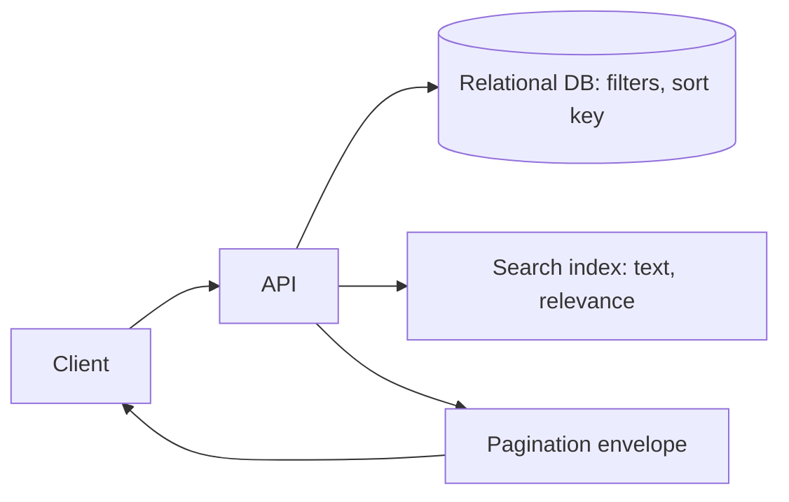

# Filtering / Sorting / Searching

## 1. One-Line Definition
Filtering narrows a collection by exact criteria, sorting orders it by a chosen field, and searching matches fuzzy/partial text and relevance — the three query mechanisms that turn a flat list of resources into something clients can actually find things in.

## 2. Why Do We Need It?
A collection API that returns everything in one fixed order is useless beyond a toy: a user with 10 million orders cannot find "last month's shipped ones." Filtering and sorting make collections *queryable* at the database instead of in the client (preventing the fetch-everything-and-filter-in-JS anti-pattern), and search turns unstructured text — content, names, log lines — into findable, ranked results.

## 3. Simple Intuition
A bookstore. **Filtering** is "only paperbacks in the crime section" — exact bins. **Sorting** is "arrange the shelf by price or by author" — a chosen order. **Searching** is asking the clerk "anything about dragons?" — the clerk scans titles and descriptions and points you at the few that seem relevant. The API is the shelf; the query parameters are the librarian's instructions.

## 4. What Happens Without It?
Clients fetch entire collections and filter/sort in browser or app memory: every view downloads the whole dataset, memory and bandwidth explode, and results are stale the moment they arrive. Text lookups become `LIKE '%dragon%'` full scans that melt under load. Nobody can answer "show me healthy orders from last week" without a dedicated write per UI, so feature demand funnels into bespoke endpoints nobody can reuse.

## 5. Core Idea
- **Filtering = structural predicates.** Exact-value, range, and set membership on indexed fields; expose as query params (`?status=shipped&qty_min=5`) or a small expression language (`genre=crime,thriller&price=10..30`). Filters map to WHERE clauses; indexed filters remain fast.
- **Sorting = an ordered view.** A `sort=created_at,desc` parameter with a whitelist of sortable fields (never accept arbitrary column names). Multi-field sorts need defined precedence and must match indexes to pay off (see [[database-indexing|Database Indexing]]).
- **Searching = relevance over text.** Tokenized, inverted-index based matching with ranking — the difference from filtering is fuzzy/partial/relevance semantics, not exact equality (see planned search concept, search-engine/inverted-index).
- **Composition is the contract:** filters + sort + [[pagination|Pagination]] combine into one query plan — WHERE, ORDER BY, LIMIT — so the page of results reflects the client's full view, not just its size.

## 6. Important Terminology

| Term | Simple Meaning |
|------|----------------|
| Filter predicate | A condition narrowing rows (status equals ...) |
| Query parameter filter | `?status=shipped` style flat filters |
| Expression filter | Rich grammar: `price=10..30,genre=crime,thriller` |
| Sort key | Field + direction determining order |
| Whitelisted sort | Server-approved list of sortable columns |
| Relevance | Search ranking score of how well text matches |
| Inverted index | Map of terms to documents (search engine core) |
| Facet | Precomputed filter buckets (e.g. price ranges) |
| Tiebreaker | Secondary key resolving sort ties |

## 7. Basic Architecture



## 8. Request or Data Flow
1. Client asks `GET /products?category=books&sort=price,asc&q=dragon&limit=20`.
2. API validates every parameter against whitelists (filterable + sortable fields only) and parses range/set expressions.
3. It builds one execution plan: search-query for `q`, filter+sort pushed down for the rest.
4. The store returns a bounded window for the cursor (see [[pagination|Pagination]]).
5. API returns the envelope with items, facets if requested, and next cursor — filter, order, and window all describe one coherent view.

## 9. Practical Example
**Product search on a marketplace.**
- `GET /products?category=electronics&brand=a,b&price=50..500&sort=rating,desc&q="wireless headphone"&facet=price_range`.
- The DB filter (`category`, `brand`, `price` range) rides indexed columns; `q` hits the inverted index and returns ranked matches; `sort=rating,desc` must be on a second index or the sort spills to memory.
- Numbers: pre-filters narrow 5M products to 20k; full-text ranks them; the client gets an instant page plus a `next_cursor` — nothing is fetched, sorted, or counted client-side.

## 10. Scaling
- **Filter/sort only scale if indexed:** every viable filter/sort combination needs an index; wildcard sorts and unindexed ranges degrade to scans. Consolidate on "indexes serve the hot filter+sort pairs" and let rare combos go slow.
- **Search belongs in a search index**, not SQL `LIKE`: at volume, move `q`/relevance to a dedicated inverted-index engine and keep SQL filters as the co-filters (see planned search concepts: search engine, Elasticsearch).
- **Facets add cost:** computing bucket counts (e.g. price ranges) is extra aggregation per query; budget, approximate, or cache them.
- **Cross-shard sorting/filtering** fan out across shards and merge — expensive; keep hot queries shard-local (see [[sharding|Sharding]]).

## 11. Reliability and Failure Scenarios

| Failure | What Happens | Detection | Recovery | Trade-off |
|---------|--------------|-----------|----------|-----------|
| Unwhitelisted sort passed | Injection/app crash | Validation | Safe reject 400 | limited flexibility |
| Combined query no index | Full scan, slow p99 | Query plan inspection | Add covering index | write cost |
| Search engine down | Text query fails, filters OK | Engine health | Fail to filter-only results | degraded relevance |
| Facet aggregation heavy | Slow list responses | Facet latency | Enable/disable, cache | freshness |
| Sorting ties unspecified | Unstable page order | Duplicates across pages | Tiebreaker key | extra key choice |

## 12. Consistency and Correctness
- **Deterministic ordering:** a sort must always end in a unique tiebreaker (id) or pages will duplicate/miss rows; combine with the [[pagination|Pagination]] ordering contract.
- Multi-filter semantics = AND by default; document OR/in/set-exclusion makers explicitly (`brand=a,b` = in-set, `-status=archived` = exclusion) so clients aren't guessing.
- Filters must be validated *before* touching data, and the same semantics must not flip between pages.

## 13. Performance
- Push filter+sort into the database (indexed WHERE/ORDER BY); never filter in app code post-pagination — that defeats the bounded window.
- Sorting by a non-indexed column beats the index with a temp sort; a covering index on `(filter_col, sort_col, id)` often eliminates the round trip entirely.
- Search ranking with co-filters: send the filters into the search engine as well, don't post-filter ranked results in memory — or relevance order gets silently corrupted.
- Cap expression grammar and max terms; deep regexes and giant `IN (...)` lists are denial-of-service input ([[web-vulnerabilities|Web Vulnerabilities]]).

## 14. Security
- **Whitelist is a security control:** arbitrary SQL column names in `sort`/`filter` invite injection; map param names to safe, typed columns.
- Never expose raw ORM query syntax or full-text operators unvalidated; parse into a closed DSL ([[web-vulnerabilities|Web Vulnerabilities]]).
- Scope every filter/sort to the authenticated identity's dataset — a `?status=` query must not let a user read rows they can't see ([[authentication-vs-authorization|Authentication vs Authorization]]).

## 15. Trade-Offs

| Choice | Advantages | Disadvantages | When to Use |
|--------|------------|---------------|-------------|
| Flat params `?status=x` | Simple, cacheable, discoverable | Limited expressiveness | Common filters |
| Expression grammar | Powerful one-shot queries | Parser + validation cost, abuse risk | Power users |
| Indexed sort columns | Fast, predictable | Others slow; index sprawl | Hot UIs |
| Any-column sort | Flexible | No index helps, temp sorts | Tiny collections |
| SQL filter + search engine duo | Fast at scale | Two systems to keep coherent | Search-heavy products |

## 16. Common Mistakes
- Accepting raw sort/filter column names from clients without a whitelist — the SQL-injection-door.
- `LIKE '%x%'` for "search" on a production dataset — a full scan pretending to search.
- Filtering the already-paginated page in app code as if that equals filtering the collection.
- Sort without a tiebreaker, then wondering why pages duplicate.
- Recalculating facets on every keystroke for a huge collection.

## 17. HLD vs LLD Boundary
HLD: which fields are filterable/sortable, the grammar and defaults (AND semantics, in-sets, exclusions), where search index vs SQL boundaries sit, and the facet strategy. LLD: the query-param parser, the closed-DSL mapping to WHERE/ORDER BY, index definitions, and the search-engine query construction.

## 18. Interview Questions

### Beginner
- Filtering vs searching — what's the real difference?
- Why must sortable fields be whitelisted?

### Intermediate
- Design the filter+sort+search surface for a product catalog; where does SQL end and a search engine begin?
- `LIKE '%abc%'` is on your hot path — diagnose and rearchitect.

### Advanced
- Design facets for a 10M-product catalog without melting the DB per keystroke.
- How do you keep relevance ranking correct when users co-filter by category and price?

## 19. Interview Memory Summary

> [!abstract]- Interview Memory Summary

### Remember

- Filter = exact predicates on structured fields; Search = fuzzy/relevance over text.
- Push WHERE and ORDER BY to the database with indexes; never filter fetched pages in app code.
- Sortable + filterable fields are a whitelist — it's a security control, not just style.
- Always end sorts in a unique tiebreaker for stable pages.
- Text search lives in an inverted index, not SQL LIKE, at scale.
- Facets are extra aggregation cost — cache or approximate.
- Filters + sort + pagination describe one coherent view in one plan.

### 30-Second Explanation

Expose filtering and sorting as validated, whitelisted query parameters that map straight to indexed WHERE and ORDER BY, always anchored by a unique tiebreaker, and composed with pagination into one query plan. For text, push `q` into a proper inverted-index search engine that also takes your filters so relevance stays correct, and treat facets as a cacheable extra cost, not a default.

### Interview Traps

- "Search" as `LIKE '%x%'` at scale.
- Arbitrary client-selected sort columns.
- Filtering in app code after pagination.
- Sorting without a unique tiebreaker.
- Forgetting that search engines need the filters sent with the query, or ranking silently breaks.

### Key Trade-Off

Rich, expressive queryability (grammars, any-column sorts) trades against security, index sanity, and predictable latency — the whitelist-and-index discipline is the price of a fast, safe query surface.

## 20. Related Concepts

### Prerequisites

- [[rest|REST]]
- [[database-indexing|Database Indexing]]
- [[http-and-https|HTTP and HTTPS]]

### Commonly Used Together

- [[pagination|Pagination]]
- [[api-design-principles|API Design Principles]]
- [[sql-vs-nosql|SQL vs NoSQL]]

### Alternatives

- [[rpc-grpc-graphql|RPC / gRPC / GraphQL]] (GraphQL arguments as a filter surface)

### Advanced Concepts

- [[database-indexing|Database Indexing]]
- [[sharding|Sharding]] (cross-shard queries)
- [[caching|Caching]] (faceted/cached list views)

Related planned topics (not authored yet): search-engine and inverted-index design, autocomplete, Elasticsearch-style search architecture, Elasticsearch pagination.

## 21. References
Elasticsearch docs on query, filter, and aggregation semantics. Postgres docs on partial indexes and index ordering for filter+sort. Google Cloud API Design Guide on list standard methods, filtering, and sorting. Verify field-filter grammar conventions against current API guideline docs.

## 22. Active Recall

Test yourself before revealing each answer.

> [!question]- Basic Understanding: In one sentence each, what do filtering, sorting, and searching each do?
> Filtering applies exact predicates to structured fields; sorting arranges the collection by a chosen field; searching matches unstructured text with fuzzy/relevance semantics. They compose: filter narrows, sort orders, search matches.

> [!question]- Design Decision: When do you move `q` out of SQL and into a search engine?
> When the corpus is large, matches are partial/fuzzy, or ranking matters. SQL `LIKE` with a leading wildcard cannot use a normal index and offers no relevance — at thousands of searchable documents and any user-facing search, an inverted index takes over.

> [!question]- Trade-Off: Expression grammar (rich filters in one param) vs flat query params.
> Flat params are simple, cacheable, and constrain abuse; grammars are powerful one-shots but need parsing, validation, and defense against pathological input. Common filters for everyone, a documented grammar for power users.

> [!question]- Failure Scenario: A `sort=price` call on a 5M-row table takes 3 seconds. Trace it.
> Either no index covers the sort (temp sort on the whole filter result) or it's sorting pre-pagination across data that isn't co-located. Fix: composite index on the filter+sort columns with the tiebreaker, and verify the plan executes an index ORDER BY, not a scan-and-sort.

> [!question]- Interview Scenario: Design the query surface for a hotel search.
> 1. Filterable fields: city, dates, room type, price range — all validated. 2. Sort whitelist: price, rating, popular with a tiebreaker id. 3. Text search mirrors an inverted index for names/amenities with relevance; filters co-sent to the engine. 4. Facets: date/price analytics cached. 5. Pagination: cursors over the merged result — the whole thing one coherent query view.

> [!question]- Basic Understanding: Why must a sort always end in a unique tiebreaker?
> Without it, equal-ordered rows occupy ambiguous positions: pages can duplicate or skip them as data shifts between requests. Appending a unique id breaks ties so every row has exactly one place in a stable total order (the same rule [[pagination|Pagination]] relies on).

> [!question]- Failure Scenario: Users report that search "filters" don't affect what they see. What's the likely root cause?
> The search engine got the `q` but not the filters, or filtrated results were post-filtered in app memory rather than sent into the engine — either way ranking/filtering disagree. Fix: pass filters into the search query itself so relevance order and filter set stay coherent.

> [!question]- Trade-Off: Whitelisted sort fields vs letting clients sort by anything.
> Whitelisting protects indexes, query predictability, and injection surface; open sorting maximizes flexibility but means no index can help and any column name becomes attack input. The whitelist is the right default; open sorting only for tiny internal collections.

> [!question]- Interview Scenario: The listing page wants immediate typeahead-style facets as you type. What do you refuse to build naively?
> Real-time faceting that recomputes every bucket over the full collection per keystroke. You build it as: precomputed/cached facet summaries recomputed on a schedule or event, coarse counts first, async refinement, and search-engine aggregations that the co-filter query already pays for.

## 23. When Should I Use This?

### Use it when

- Collections are large and users need to narrow, order, or text-match them.
- You want one reusable query surface instead of bespoke endpoints per UI.
- Clients should stay thin — filter/sort/search pushed to the server.

### Avoid it when

- Collections are tiny and fixed (config) — the grammar is ceremony.
- Only one fixed view is ever queried — a tailored endpoint beats a DSL.
- You can't build indexes for the promised surface — slower-than-need be damned.

### What problem does it solve?

It makes collections genuinely searchable and orderable server-side, killing the fetch-all-then-filter-in-client anti-pattern, and it contains text search costs by routing `q` to indexes instead of scans.

### What problem does it NOT solve?

It doesn't make an unindexed query fast (garbage in, garbage out), it won't rank relevance well without a real search index, and it can't protect authorization — scoping per-identity still has to be enforced regardless of the query parameters.

## 24. Decision Connections

Decisions that go together with filtering/sorting/searching:

- [[pagination|Pagination]] — the bounded window the query surface returns.
- [[database-indexing|Database Indexing]] — the engine behind indexed filter+sort.
- [[rest|REST]] — how query params and list methods carry the surface.
- [[sql-vs-nosql|SQL vs NoSQL]] — how the store constrains the query grammar.
- [[rpc-grpc-graphql|RPC / gRPC / GraphQL]] — GraphQL arguments as a filter alternative.
- [[api-design-principles|API Design Principles]] — the whitelist/envelope conventions.
- [[sharding|Sharding]] — cross-shard sort/filter cost.
- [[caching|Caching]] — caching filtered/faceted views.

Decision tree:

```
Make a collection queryable
    |
    +-- Text matching and relevance needed?
    |      → search index (inverted), SQL LIKE is not search
    |
    +-- Exact predicates over structured fields?
    |      → validated filter params on indexed columns
    |
    +-- Ordering requested by clients?
    |      → whitelisted sort fields, unique tiebreaker
    |
    +-- Large collection?
    |      → compose with [[pagination|Pagination]] in one query plan
    |
    +-- Facets/badges wanted?
    |      → cached/approximate; never recompute per keystroke
```