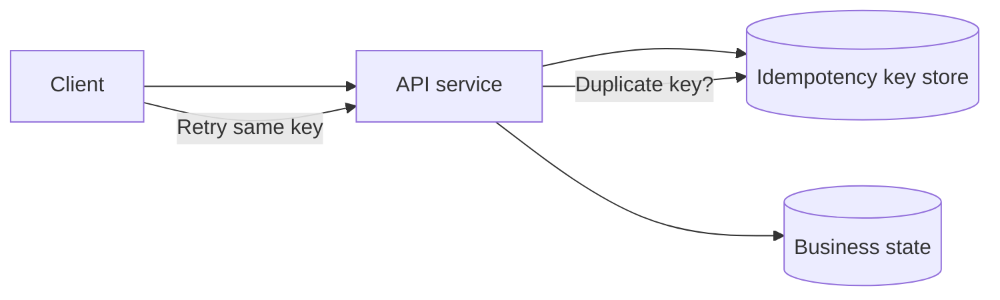

# Idempotency

## 1. One-Line Definition
An operation is idempotent when applying it multiple times produces the same observable result as applying it once — and API idempotency is the discipline of giving clients safe retries so a network blip never doubles a payment, duplicates an order, or appends a message twice.

## 2. Why Do We Need It?
Distributed systems fail with ambiguity: a client sends a write, the server commits, and the response is lost in transit. The client cannot distinguish "never happened" from "happened, reply lost" — and if it retries blindly, the side effect runs twice. Idempotency converts that fatal ambiguity into a safe retry, which is what makes [[retry-and-timeout|Retry and Timeout]] strategies actually safe to run on writes. Payments, orders, messaging, and ledgers simply cannot operate at production reliability without it.

## 3. Simple Intuition
Pressing the "down" button on an elevator is not idempotent — you press twice and you call two elevators. Pressing the door-open button is idempotent: pressing twice opens it once. The problem is that a client pressing "down" can't tell whether the first press registered, so it needs a receipt: "call elevator #3 if I already did." That receipt is the idempotency key.

## 4. What Happens Without It?
Retries double-spend: customers get double-charged, orders duplicate, and message queues replay the same event into two charge records. Teams respond by not retrying (accepting silent failures), retrying without thinking and hitting double-writes, or hand-rolling "is this a duplicate?" checks per endpoint — a spread of inconsistent hacks exactly where consistency is most needed.

## 5. Core Idea
- **Idempotent by shape:** GET, PUT, and DELETE are inherently repeat-safe — the same request can run twice with no extra effect. The dangerous shape is POST and "act"-style endpoints, which NEED explicit idempotency.
- **Idempotency key:** a client-generated unique string (UUID) sent on each mutating request, scoped per user/account. The server stores the key + computed result; a duplicate submission with the same key returns the stored result instead of rerunning the effect.
- **Storage of keys:** a key table (or key-value store) keyed on `(user_id, idempotency_key)`; expires after a TTL window (minutes to ~24h) covering the client's realistic retry horizon.
- **Concurrency:** key is set atomically (INSERT-if-absent); concurrent same-key requests serialize — one executes, the others wait or return the in-flight/committed result.
- **Scope of correctness:** the *client-visible effect* is idempotent even if the internal mechanism isn't — a charge that runs twice internally but is reconciled into one external charge still counts.

## 6. Important Terminology

| Term | Simple Meaning |
|------|----------------|
| Idempotent | Repeating the call has the same effect as one call |
| Idempotency key | Client-supplied unique token for one logical operation |
| Key store | Table/DB tracking seen keys and their results |
| Deduplication | Detecting and dropping a repeated request |
| Retry-safe | An endpoint that tolerates duplicate submissions |
| At-most-once / at-least-once | Delivery guarantees; idempotency converts the latter to effectively-once |
| Exactly-once effect | One side effect even under retries and replays |
| TTL on key | How long the seen-key result is kept |

## 7. Basic Architecture



## 8. Request or Data Flow
1. Client generates `Idempotency-Key: 9f6e...` once per logical operation and sends `POST /payments`.
2. Server does an atomic `INSERT` of `(user, key, status=running)` — if the insert conflicts, a request with this key is already running or finished.
3. Fresh key → server executes the payment, stores the result (linked to the key), returns 201.
4. The response is lost. Client retries with the *same* key.
5. Server sees the key, finds a committed result, and returns the stored result (2xx) without re-executing — the effect runs exactly once.

## 9. Practical Example
**Payments, $ amount matters:**
- Client wants to charge $50. It calls `POST /charges` with `Idempotency-Key: uuid-1`.
- First attempt: key inserted, charge commits, response lost.
- Retry at t+3s with the same key: server returns the stored successful charge — **$50 charged once, not $100.**
- A *different* key (uuid-2) is a NEW operation, so it charges again — this is why the key is the client's guarantee, and why key reuse across users is forbidden (mixing keys leaks charges between accounts).

## 10. Scaling
- **Key store scales like any hot table:** high write rate (one insert per logical POST) plus reads on retries — keep it in a fast datastore, shard by `user_id` (see [[sharding|Sharding]]), and expire rows past TTL.
- **Distributed app servers:** the "insert-if-absent" must be atomic across instances — do it against the shared store with a unique constraint or `SETNX`-style primitive; never per-process memory or two instances both "win."
- **At high retry storms,** the key lookup should hit a cache ([[caching|Caching]]) with the committed result, not re-hit the ledger.
- Amortize: batch/outbox patterns can combine idempotency with durable queues ([[outbox-pattern|Outbox Pattern]]).

## 11. Reliability and Failure Scenarios

| Failure | What Happens | Detection | Recovery | Trade-off |
|---------|--------------|-----------|----------|-----------|
| Response lost after commit | Client unsure of outcome | No 2xx received | Retry same key; stored result returns | none - it works |
| Key store down | Can't safely dedupe | Store health | Fail closed (reject writes) to avoid doubles | availability dip |
| Concurrent same-key | Double execution race | Atomic insert conflict | One executor; others wait/see result | serialization |
| Key expiry mid-retry | Replay after TTL → new op | Missing key row | Long enough TTL for retry horizon | storage/latency cost |
| Client reuses a key | Different operation conflated | Inconsistent effects | Key unique per op; scope per user | client discipline |

## 12. Consistency and Correctness
- **Effective exactly-once:** at-least-once delivery + idempotent consumer/handler = exactly-once effect. This is the standard durable pattern ([[delivery-semantics|Delivery Semantics]]).
- **Key store and business state must be consistent** — the classic failure: key stored but effect rolled back, or effect stored and key rollback → retry duplicates. Do both in one transaction, or use a workflow that reconciles.
- **Idempotency vs causality:** the same logical operation must produce the same key at every attempt; a "new" operation always gets a fresh key.
- Ordering and concurrent updates: PUT-with-key replacing a resource is naturally idempotent; PATCH-with-key still needs last-value-wins semantics documented (see [[transactions-and-acid|Transactions and ACID]]).

## 13. Performance
- Idempotency costs one key-store write per logical mutation plus a read on retries — microseconds to low ms on a fast store; negligible against the operation itself (a payment takes tens of ms).
- Read path wins: the hot "lucky path" is one insert, one execution, one reply. Retries merely find the seat taken — cheap.
- Expiration keeps storage bounded: TTL sized to your retry horizon (minutes for internal, ~24h for public payment surfaces), gigabytes scale is not required.

## 14. Security
- Keys are identity-scoped: a `(user_id, key)` composite prevents cross-user key guessing or replay of another caller's operation.
- Keys should be unguessable (UUID4) — a predictable key lets an attacker "claim" someone else's in-flight operation ([[authentication-vs-authorization|Authentication vs Authorization]]).
- Enforce authn before the key lookup; never return stored result bodies across identity boundaries, and beware side-channel behavior differences between "committed by another user" errors.

## 15. Trade-Offs

| Choice | Advantages | Disadvantages | When to Use |
|--------|------------|---------------|-------------|
| POST + explicit key | Safe creates/actions | One more header + key store | Money, writes that matter |
| PUT/DELETE (inherently idempotent) | No key machinery | Semantics rigid (full replace) | Resource replacement |
| GET idempotent by nature | Free retries, cacheable | Cannot create state | Reads |
| Server-generated dedupe | Zero client change | Heuristic, can't catch cross-user ambiguity | Logs/telemetry only |
| Key in transactional DB | Consistent with effect | Single DB bottleneck | Low-volume critical writes |

## 16. Common Mistakes
- Forgetting idempotency on POST "act" endpoints (refund, email send, retry job) and discovering duplicates in production.
- Storing the key but committing the effect in a separate call that can fail — the retry then re-executes.
- Using the same key for unrelated operations, or letting different users share a key namespace.
- TTL too short: the client's retry horizon exceeds key retention, and a late retry becomes a brand-new operation.
- Exposing "which key do I use?" to the client twice — one logical op must map to one key, always.

## 17. HLD vs LLD Boundary
HLD: which operations must be idempotent, key scope and TTL, storage and atomic-insert scheme, concurrency policy, and the retry-safety contract with clients. LLD: the unique-constraint/`ON CONFLICT` code, key-store rows, request middleware parsing the header, and the response-caching for seen keys.

## 18. Interview Questions

### Beginner
- What does it mean for an API operation to be idempotent?
- Why is POST the method that needs explicit idempotency while PUT does not?

### Intermediate
- Design the idempotency system for a payment API — key scope, storage, TTL, concurrency.
- A client retries with the same key but a different body — how should the server respond?

### Advanced
- How does a key store guarantee exactly-once *effect* even when the store and the business state live in different systems?
- When do you accept non-idempotency (fire-and-forget) and how do you bound the risk?

## 19. Interview Memory Summary

> [!abstract]- Interview Memory Summary

### Remember

- Idempotent = doing it twice has the same effect as doing it once.
- GET/PUT/DELETE are inherently idempotent; POST and actions are not.
- The idempotency key is a client-generated unique token scoped per user.
- Keys are stored with atomic insert-if-absent; duplicates return the stored result.
- At-least-once delivery + idempotent handling = exactly-once effect.
- Keep keys and the side effect consistent (same transaction or reconciliation).
- TTL must exceed the realistic retry horizon; keys expire to bound storage.
- Same key = same logical operation; new key = new operation.

### 30-Second Explanation

For every mutating POST, require a client-generated idempotency key scoped to the user. The server atomically records the key (insert-if-absent); the first request executes and stores its result, and any retry carrying the same key returns that stored result instead of re-running — converting at-least-once retries into exactly-once effects. Scope keys per identity, expire them past the retry horizon, and keep key record and business effect consistent or the double-write returns.

### Interview Traps

- Claiming "the DB is ACID so POSTs are safe" — duplicated *effects* are the failure, not row-level transactions.
- A key store whose insert and effect commit in different transactions.
- A TTL shorter than the client's retry window.
- One key reused across many requests, or shared across users.

### Key Trade-Off

You exchange a little storage, one key-header convention, and per-key concurrency discipline for the ability to retry writes safely — eliminating the double-charge/double-order class of failures entirely.

## 20. Related Concepts

### Prerequisites

- [[http-and-https|HTTP and HTTPS]]
- [[transactions-and-acid|Transactions and ACID]]

### Commonly Used Together

- [[retry-and-timeout|Retry and Timeout]]
- [[delivery-semantics|Delivery Semantics]]
- [[webhooks|Webhooks]]
- [[rest|REST]]

### Alternatives

- [[outbox-pattern|Outbox Pattern]] (durable side effects without client keys)
- [[event-driven-architecture|Event-Driven Architecture]]

### Advanced Concepts

- [[strong-vs-eventual-consistency|Strong vs Eventual Consistency]]
- [[kafka-delivery-guarantees|Kafka Delivery Guarantees]] (exactly-once semantics)

Related planned topics (not authored yet): request deduplication, idempotent consumer pattern in messaging, exactly-once-effect plumbing.

## 21. References
Stripe API idempotency docs. Microsoft's idempotent operations paper (Z. Siddiqi) — the classic reference. Postgres docs on `INSERT ... ON CONFLICT` for atomic key records. RFC 9110 on safe/idempotent methods. Verify against your current API tooling docs.

## 22. Active Recall

Test yourself before revealing each answer.

> [!question]- Basic Understanding: What distinguishes an idempotent from a safe HTTP method?
> Safe (GET/HEAD/OPTIONS) means it never changes state. Idempotent (PUT/DELETE, and GET) means repeating it produces the same *result effect* — PUT can change state but doing it twice equals doing it once. POST is neither safe nor idempotent, which is why it needs the key.

> [!question]- Design Decision: Where does the server store idempotency keys, and what must be true of the insert?
> In a fast store keyed by `(user_id, idempotency_key)`, with a TTL. The insert must be atomic insert-if-absent — a unique constraint or equivalent — because that single atomicity is what stops two concurrent duplicate requests from both "winning" and executing twice.

> [!question]- Trade-Off: Why not make every POST a PUT to inherit idempotency for free?
> PUT's idempotency comes from replacing a *known* resource with a full representation — a create/add/action has no existing resource or full-replace semantics, so renaming it PUT is cosmetic, not safe. The explicit key mechanism is the honest way to make creation idempotent.

> [!question]- Failure Scenario: Your key store and the business effect are written in two separate transactions. What breaks?
> If the key commits but the effect rolls back, a retry sees "already done" and never runs the effect — the operation silently never happens. If the effect commits but the key doesn't, the retry executes it again — the double-write you built this to prevent. They must commit together or reconcile.

> [!question]- Interview Scenario: "Design a retry-safe refund API." Walk the design.
> 1. `POST /refunds` requires an Idempotency-Key per logical refund. 2. Key store keyed `(account, key)` with atomic insert-if-absent, TTL 24h. 3. Fresh key → validate, execute refund, store result with key. 4. Retry → return stored result. 5. Concise versioning of `already_refunded` vs `refund_in_progress` for the concurrent window. 6. Concurrency: one winner, rest see the committed result.

> [!question]- Basic Understanding: How does a same-key retry with a *different* body resolve?
> By policy, the request is a repeat of the original logical operation — so the server must ignore the new body and return the result recorded under that key (or reject if the key is in-flight). Allowing body swaps poisons the whole key guarantee.

> [!question]- Trade-Off: Internal fire-and-forget job kickoff — is idempotency worth it there?
> If the job is idempotent by nature (re-processing a file, cache warm) fire-and-forget is fine; if it creates external effects (emails, charges), the same exactly-once rule applies. The cost of a key store is small next to an email blast sent twice.

> [!question]- Interview Scenario: "Exactly-once delivery, please." What precision do you insist on?
> You refuse the phrase and offer *exactly-once effect*: at-least-once delivery (retries, the only honest network reality) plus idempotent handling at the consumer equals exactly one visible effect. Exactly-once *delivery* requires ids/dedup at production, and is where people over-promise.

## 23. When Should I Use This?

### Use it when

- Operations create or act on state with external side effects (payments, notifications, orders).
- Clients retry automatically and your network/latency budget makes ambiguity likely.
- You want retry policies that are safe to run on writes ([[retry-and-timeout|Retry and Timeout]]).

### Avoid it when

- The operation is naturally idempotent (PUT/DELETE, idempotent job replays).
- It's an at-most-once telemetry path where duplicates are harmless and cost beats safety.
- You cannot provide an atomic key record near the business state.

### What problem does it solve?

It makes "did it commit?" retries safe — eliminating double-charges, duplicate orders, and double side effects — which is the difference between a retry strategy you can trust and one that silently corrupts data.

### What problem does it NOT solve?

It doesn't fix ordering or concurrent *different* operations, it isn't a substitute for transactional correctness (keys must stay consistent with effects), and it can't help if the client reuses or rotates keys sloppily — the guarantee is only as strong as the key's uniqueness and TTL.

## 24. Decision Connections

Decisions that go together with idempotency:

- [[retry-and-timeout|Retry and Timeout]] — retries are only safe on writes because idempotency exists.
- [[rest|REST]] — PUT/DELETE are idempotent by the spec; POST needs the key.
- [[delivery-semantics|Delivery Semantics]] — at-least-once + idempotent handler = exactly-once effect.
- [[webhooks|Webhooks]] — consumers must dedupe on event id (at-least-once delivery).
- [[transactions-and-acid|Transactions and ACID]] — key and effect consistency inside a transaction.
- [[outbox-pattern|Outbox Pattern]] — durable side effects as the queue-backed alternative.
- [[rate-limiter|Rate Limiter]] — a different lever that also protects mutating endpoints.
- [[strong-vs-eventual-consistency|Strong vs Eventual Consistency]] — how strong the key store must be.

Decision tree:

```
Make a write safe to retry
    |
    +-- Method is PUT or DELETE?
    |      → inherently idempotent, no key needed
    |
    +-- POST creating or acting with external effects?
    |      → require Idempotency-Key
    |         |
    |         +-- Key unique per user?          → scope as user + key
    |         +-- Atomic insert needed?         → insert-if-absent, one winner
    |         +-- Retries last long?            → TTL beyond the retry horizon
    |         +-- Key and effect split systems? → transaction or reconciliation
    |
    +-- At-most-once, harmless duplicates?
    |      → skip, fire-and-forget
```