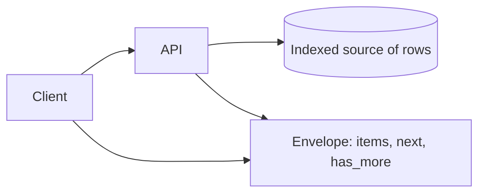

# Pagination

## 1. One-Line Definition
Pagination splits a potentially huge result set into bounded pages of a fixed size, letting clients page through items efficiently — via offset parameters or opaque cursors — instead of pulling the whole collection at once.

## 2. Why Do We Need It?
A list endpoint over a growing collection will, if unbounded, produce enormous payloads and database scans. Clients time out, servers run out of memory, and a single heavy listing request can degrade the whole system. Pagination caps every response, bounds database work per request, and gives clients a predictable way to walk large collections.

## 3. Simple Intuition
A library with a million books doesn't hand you the whole catalog at once. It gives you page 1 (say 50 books) and a bookmark. To go on, you ask for the next chunk — either "give me page 3" (offset, like a numbered page list) or "give me the 50 books starting from where I left off" (cursor, like a saved bookmark that keeps your place even if the catalog changes).

## 4. What Happens Without It?
`GET /orders` returns 2 million rows for a big customer. The response blows memory on server and client, the DB does a giant scan, caches reject the payload, mobile apps crash, and an attacker can trivially ask for the entire dataset. To avoid it, teams bolt on `limit` with no stable ordering, and pagination becomes inconsistent per-endpoint — worse than none.

## 5. Core Idea
- **Bounded pages.** Always return a fixed, documented page size with a sane default and a hard cap (e.g. limit defaults to 20, maximum 100).
- **Offset pagination** (`?offset=40&limit=20`): simple, jumps anywhere, but slow/deep on large tables (needs `OFFSET`, scanning-and-discarding) and unstable when rows are inserted/deleted between pages.
- **Cursor / keyset pagination** (`?cursor=eyJpZCI6NDF9`): opaque token encoding "continue after this row"; the server walks rows after a last-seen key (e.g. `WHERE id > $cursor`), giving O(log N) fetch with an index and stability against concurrent inserts. Best for large, fast-moving, or infinite-scroll lists.
- **Page-number pagination** (`?page=2&size=20`) is offset in disguise; fine for small static admin tables, poor for live feeds.
- **Response envelope** carries `next_cursor`/`has_more`/`total_count` — the client never composes page math, it just follows the server's pointer.

## 6. Important Terminology

| Term | Simple Meaning |
|------|----------------|
| Page size / limit | Maximum items per response |
| Offset | Row offset to skip before listing |
| Cursor | Opaque token marking position in the list |
| Keyset pagination | Paging on a monotonic key with an index |
| has_more | Boolean telling clients another page exists |
| next_cursor | Server-provided pointer to the next page |
| total_count | Optional grand total (expensive to compute) |
| Infinite scroll | Client loads pages on demand as user scrolls |

## 7. Basic Architecture



## 8. Request or Data Flow
1. Client sends `GET /videos?limit=25&cursor=<opaque>`.
2. API validates page size (caps it), decodes the cursor into a keyset position.
3. API executes an index-scan `WHERE id > last_seen ORDER BY id LIMIT 26` (one extra to detect `has_more`).
4. API returns the envelope: `items`, `next_cursor`, `has_more`, optionally `total_count`.
5. Client requests the next page using the exact `next_cursor` returned — never reconstructing it.

## 9. Practical Example
**Comments API on a viral post (500k comments).**
- Offset page 20 of 50: `OFFSET 95000 LIMIT 50` — DB scans ~95k rows every time; p99 goes from 20ms to 400ms and users get page drift as new comments arrive.
- Cursor page: `WHERE (created_at, id) > ($ts, $id) ORDER BY (created_at, id) LIMIT 50 + 1` — each fetch is an index probe, ~5-10ms, and new comments inserted between pages don't shuffle already-returned rows off-page.

## 10. Scaling
- **Cursors win on large tables:** the deep page is the offset's death — O(offset) scanning vs O(log N) index probe. Watch for the composite index on the keyset columns.
- **Every index must match the ordering you paginate on;** an unindexed `ORDER BY ... LIMIT` is a full scan per page.
- **Search systems differ:** Elasticsearch uses `from/size` (offset-like) and requires `search_after` for deep pagination — same curse, same prescription, applied to the search index (see planned search concepts).
- `total_count` is a hidden cost: counting 500k rows for a UI badge is expensive — offer it as opt-in or an approximation.

## 11. Reliability and Failure Scenarios

| Failure | What Happens | Detection | Recovery | Trade-off |
|---------|--------------|-----------|----------|-----------|
| Unbounded default limit | Huge response, OOM | Response size alarms | Hard cap + documented default | surprise for big asks |
| Offset over giant table | Deep page crawl | Slow p99 on late pages | Keyset pagination | complexity |
| Concurrent inserts | Offset pages drift/duplicate | Rewrites on retries | Cursor stability, no drift | cursor opaqueness |
| Snapshot/join-heavy lists | Pagination state is expensive | Query cost | Pre-materialize or coalesce pages | staleness |
| Cursor over non-indexed key | Full scan per page | Slow list endpoint | Add composite index | write-amplified index |

## 12. Consistency and Correctness
- **Stable ordering is the contract:** always paginate on a total order (unique and deterministic) — the primary key or a composite like `(created_at, id)`. Ties are the classic bug: equally-valued rows swap between pages without a tiebreaker key.
- **Concurrency:** offset pagination inserts/deletes cause duplicated or missed rows between pages; cursors sidestep drift because position is a snapshot property, not an arithmetic one.
- **Envelope honesty:** `has_more` must be computed from a fetch of page_size+1, not guessed; lying breaks infinite scroll and client assertions.

## 13. Performance
- Keyset uses the clustered/index order — typical list endpoints go from tens-of-milliseconds (deep offset) to single-digit milliseconds.
- Sorting before paging is the other hidden cost: paginating a `ORDER BY other_col` forces a sort — require indexes that serve the sort too (see [[database-indexing|Database Indexing]]).
- Keep cursors opaque (encoded `id` or compound token) so they encode position without inviting clients to tamper or to request arbitrary offsets.
- Cache hot pages (`?page=N` or cursor result) with short TTLs; infinite-scroll CDN caches work best when cursors are cache-key-friendly.

## 14. Security
- **Never trust page math for authorization** — enforce data scoping per authenticated identity regardless of offset/cursor ([[authentication-vs-authorization|Authentication vs Authorization]]).
- Cap `limit` and cursor decoding strictly; a decoder error should 400 with no side effects.
- Opaque cursors prevent parameter probing: they should encode position, not admit "give me offset 20 million" or arbitrary sort expressions.
- Deep-offset queries are a denial-of-service vector for large collections — cursor pagination keeps the DB cost per page bounded ([[web-vulnerabilities|Web Vulnerabilities]]).

## 15. Trade-Offs

| Choice | Advantages | Disadvantages | When to Use |
|--------|------------|---------------|-------------|
| Offset | Simple, jumpable, debuggable | Slow deep pages, drift under writes | Small/static admin tables |
| Cursor / keyset | Fast deep pages, stable under loads | Opaque, no random jump, ordering fixed | Large, live collections |
| Page-number | Familiar to humans | Worst of offset + extra ambiguity | Manual review UIs |
| Has_more only | Zero counting cost | No total known | Infinite scroll, feeds |
| total_count included | UI badges, statistics | Expensive on big tables | Small collections or opt-in |

## 16. Common Mistakes
- Paginating `user_id` alone when the sort key ties (e.g. many messages share a timestamp) — pages duplicate/miss rows; always append a unique tiebreaker.
- Requiring an index you never created, then blaming pagination for slow pages (see [[database-indexing|Database Indexing]]).
- Returning `next_cursor` computed via offset math instead of the true last-seen key.
- Making `total_count` a mandatory computed field on every list — O(n) per request for no reason.
- Letting clients set unbounded `limit` or negative/absurd offsets without validation.

## 17. HLD vs LLD Boundary
HLD: the pagination family (offset vs cursor), envelope shape (`next`/`has_more`/`total_count`), ordering keys, default and max limits, and what deep-page cost you're willing to accept. LLD: the DB query (`WHERE (x, id) > ($x, $id)`), cursor encode/decode, `LIMIT size+1` has_more logic, and validation code.

## 18. Interview Questions

### Beginner
- What problem does pagination solve for a list API?
- What's the difference between offset and cursor pagination?

### Intermediate
- Your `GET /comments` endpoint crawls at page 1000 of a viral post. Diagnose and fix.
- Why do cursors resist the page-drift that offset suffers under concurrent inserts?

### Advanced
- Design pagination for a feed merged from several data sources (posts, shares, ads).
- When is `total_count` a legitimate requirement, and how do you make it cheap?

## 19. Interview Memory Summary

> [!abstract]- Interview Memory Summary

### Remember

- Pagination caps response size and per-request DB work; it is the list endpoint's safety valve.
- Offset = simple but O(depth) scan and page drift under writes.
- Cursor/keyset = index-probe speed, stable under concurrency.
- Always paginate on a total order with a unique tiebreaker.
- Envelope: `items`, `next_cursor`, `has_more` from a size+1 probe.
- Cap limits; validate cursor input; never trust page math for authz.
- `total_count` is expensive — opt-in, not default.

### 30-Second Explanation

Every collection endpoint returns bounded pages under an envelope — items, next cursor, has_more — and you page on a total order with a unique tiebreaker using keyset for large/live collections (index probe: `WHERE (created_at, id) > ... LIMIT size+1`), reserving offset for small static tables. Cursors stay opaque server-owned tokens so clients just follow the pointer, and you cap limits and never authorize by page math.

### Interview Traps

- Deep offset defended for a viral dataset that's write-heavy.
- Ordering on a non-unique column and calling the paging "stable."
- Computing `total_count` on every list call and wondering why it's slow.
- Letting `next_cursor` be client-supplied arithmetic.

### Key Trade-Off

Cursors give you deep-page efficiency and write-stability but forfeit arbitrary jumps and human-readable page numbers; offset buys simplicity and jumpability at the cost of deep-page scans and drift.

## 20. Related Concepts

### Prerequisites

- [[rest|REST]]
- [[database-indexing|Database Indexing]]
- [[http-and-https|HTTP and HTTPS]]

### Commonly Used Together

- [[filtering-sorting-searching|Filtering / Sorting / Searching]]
- [[api-design-principles|API Design Principles]]
- [[api-gateway|API Gateway]]

### Alternatives

- [[rpc-grpc-graphql|RPC / gRPC / GraphQL]] (GraphQL cursor-style pagination in a query)

### Advanced Concepts

- [[database-indexing|Database Indexing]] (the composite index behind keyset)
- [[sharding|Sharding]] (cross-shard pagination gets harder)

Related planned topics (not authored yet): search-engine pagination (from/size vs search_after), streaming-based pagination for near-real-time data.

## 21. References
Bing/Meta API cursor-pagination docs as the canonical public design. Postgres/SQL docs on keyset pagination via WHERE-comparison versus OFFSET. Elasticsearch `from/size` vs `search_after` docs. Verify defaults against your platform's API guidelines.

## 22. Active Recall

Test yourself before revealing each answer.

> [!question]- Basic Understanding: Why is `OFFSET 100000 LIMIT 50` slow?
> The engine must produce, sort, and discard rows 1..100000 before returning 50 — work grows linearly with offset. A keyset query uses an index to jump straight past the cursor, so every page costs about the same small amount.

> [!question]- Design Decision: Offset or cursor for a chat history that grows by the second?
> Cursor. The list is large and moving: offset pages drift as new messages push boundaries, the deep end crawls. Keyset on `(message_id)` gives stable, index-probed pages — infinite scroll on a chat is the canonical cursor use case.

> [!question]- Trade-Off: What do you lose when you choose cursors over offsets everywhere?
> Arbitrary jumps (skip to page 40) and human-readable page numbers are gone, cursors are opaque, and your ordering is fixed by the keyset contract — acceptable for feeds, annoying for admin review tables where offset is genuinely fine.

> [!question]- Failure Scenario: Users report duplicated comments across pages after a new comment posts. What broke?
> Non-unique ordering key (or plain offset math): a new row inserted at the top shifts every boundary so the same comments reappear on successive offset pages. Fix: paginate on a total order with a unique tiebreaker, or switch to cursors so position is a snapshot, not arithmetic.

> [!question]- Interview Scenario: Design pagination for a recommendation feed merged from three services.
> 1. Union/merge with a shared candidate identifier and a common sortable timestamp in one stream. 2. Cursor encodes server state, not offsets. 3. Keyset on a composite merged ordering; where sources disagree, normalize fields earlier. 4. Envelope with `has_more`; backfill/dedup on reconnect. 5. Treat "unique position" like a first-class output, because the merge is where duplication creeps in.

> [!question]- Basic Understanding: Why does `has_more` need a size+1 probe?
> Because the only correct way to know a next page exists is to try to fetch it: ask for one more row than the page size, then report `has_more=true` only when you got it. Any arithmetic guess breaks under writes and cursor ambiguity.

> [!question]- Design Decision: Should `total_count` be part of every list response?
> No. Totals on large collections mean a full scan per request. Make it opt-in (`?include=total`), approximate, or cached — the common infinite-scroll UI never needs it, and paying O(n) for the occasional badge is a self-inflicted performance tax.

> [!question]- Failure Scenario: Your DB doesn't have a composite index matching the pagination sort and the endpoint melts. How did it happen and what's the fix?
> The keyset columns weren't backed by an index, so every page degenerated to a scan. Fix: add a composite index matching the exact `WHERE (a, b) > (...)` and `ORDER BY` shape — this is the standard coupling where pagination and [[database-indexing|Database Indexing]] meet.

## 23. When Should I Use This?

### Use it when

- List endpoints can return more than a bounded page of results.
- You have feeds, search results, logs, messages, or histories.
- Responses must stay quick with a predictable size for suspicious large requests.

### Avoid it when

- Collections are tiny and bounded by design (config, enums) — pagination is ceremony.
- The client genuinely needs the entire small dataset in one call.
- You need real-time complete snapshots — look at change feeds instead of paging.

### What problem does it solve?

It bounds the two cost axes of a list: response size (no massive payloads) and per-request work (no full scans), while giving clients a stable, scalable protocol for walking large collections.

### What problem does it NOT solve?

It doesn't fix slow queries that aren't pagination-shaped (a list without an index stays slow), it won't give you real-time consistency (pages are snapshots of point-in-time positions), and it doesn't replace exporting — bulk/export is about streaming, not paging.

## 24. Decision Connections

Decisions that go together with pagination:

- [[rest|REST]] — collection endpoints that pagination disciplines.
- [[filtering-sorting-searching|Filtering / Sorting / Searching]] — the query surface pagination pages over.
- [[api-design-principles|API Design Principles]] — the envelope convention (items, next, has_more).
- [[database-indexing|Database Indexing]] — the composite index keyset paging depends on.
- [[rpc-grpc-graphql|RPC / gRPC / GraphQL]] — GraphQL-style cursor/relay pagination as an alternative.
- [[api-gateway|API Gateway]] — where limits and validation get enforced at the edge.
- [[sharding|Sharding]] — cross-shard lists that make global pagination hard.
- [[authentication-vs-authorization|Authentication vs Authorization]] — scoping pages to identity.

Decision tree:

```
List endpoint over a growing collection
    |
    +-- Fixed small static table?
    |      → offset or plain pages, cheap enough
    |
    +-- Large or write-heavy collection?
    |      → cursor / keyset on a unique ordering
    |         |
    |         +-- Ties possible in sort?      → append unique tiebreaker
    |         +-- Index missing?              → add composite [[database-indexing|Database Indexing]]
    |         +-- Total needed for a badge?   → opt-in or approximate, never default
    |
    +-- UI is infinite scroll?
    |      → cursor + has_more envelope only
    |
    +-- Data spans shards?
           → aggregate-page carefully; see [[sharding|Sharding]]
```