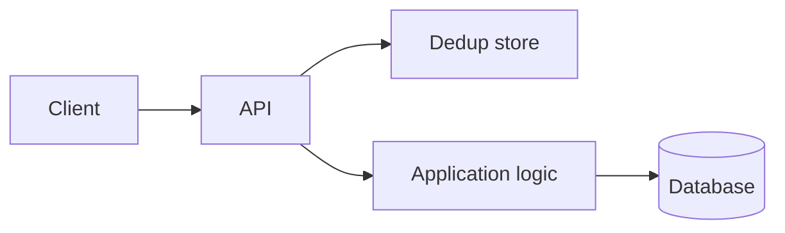

# Request Deduplication

## 1. One-Line Definition
Request deduplication is the mechanism that detects and discards repeated deliveries of the same logical request so the system applies its effect exactly once, no matter how many times the network, client, or job framework re-sends it.

## 2. Why Do We Need It?
Networks and clients misbehave: timeouts, retries, and at-least-once delivery mean the same request can arrive two, five, or a thousand times. If the server blindly re-executes each copy, a double-click buys two orders, a flaky payment retry charges twice, and a job framework replays a file twice. Deduplication lets you retry automatically without fear — the safety net that makes retries (and eventually-consistent systems) genuinely safe.

## 3. Simple Intuition
A boarding pass: you can scan the same pass at the gate five times, but you board once. The airline records the pass serial number as *used*; the second scan is not a second flight. Or an elevator call button — pressing it twice does not summon two elevators, because the building records that floor as already requested.

## 4. What Happens Without It?
Every automatic retry doubles or multiplies the harm: double charges, duplicate orders, duplicate emails, double file-writes to storage. During an incident the worst part happens — clients retry *more* precisely when the system is struggling, multiplying failures. Dedup is what makes the classic reliability stack (retry + timeout + at-least-once) safe instead of self-destructive.

## 5. Core Idea
- **Dedup key (idempotency key):** a client-generated unique identifier (a UUID v4 is typical) attached to a request that marks *which logical operation it is*. The same logical operation re-sent keeps the same key; a different operation gets a new one.
- **Dedup store:** a server-side record keyed by `(client, key)` that remembers the request's current status and, once finished, the exact response that was already returned. A duplicate arrival looks up the record and returns the stored response instead of re-running the work.
- **Dedup window:** keys are remembered only for a bounded time (e.g. 24 hours) — long enough to swallow any retry storm, short enough that storage stays small.
- **Exactly-once effect:** deduplication converts *at-least-once* delivery into effectively-once processing. It does not make the transport exactly-once; it makes the *outcome* exactly-once by filtering repeats.
- **Concurrency:** two identical requests arriving at once (parallel first try + retry) must serialize — one executes, the other waits on the "in-flight" marker and then reads the stored response.
- **Atomicity with the effect:** the dedup record and the business effect (charge, insert row) must be committed together, otherwise a crash between the two re-executes the request in the next attempt.
- **Event/replay dedup:** for webhooks and queue consumers, dedup usually runs on an event id or a payload hash already present on the event, rather than a generated header.

## 6. Important Terminology

| Term | Simple Meaning |
|------|----------------|
| Dedup key / idempotency key | Identifier marking one logical operation |
| Dedup store | Records keyed by (client, key) with status and stored response |
| Dedup window | How long a key is remembered |
| Replay | Re-delivery of an already-seen request |
| In-flight marker | Temporary record saying "processing now" |
| Exactly-once effect | Result applied once despite at-least-once delivery |
| Response replay | Returning the original response instead of re-running work |

## 7. Basic Architecture



The dedup check sits in front of real work. The store (Redis or a DB table) is the source of truth for "have we already done this?"; the application logic only ever runs for a genuinely new key.

## 8. Request or Data Flow
1. Client generates a UUIDv4 key and sends it with the request (e.g. `Idempotency-Key` header).
2. API looks up `(client, key)` in the dedup store.
3. Record exists with a finished response → return that response immediately (no re-execution).
4. No record → atomically write an "in-flight" marker and run the application logic; commit the marker + the effect together.
5. On completion, store the response under the key (still within the window).
6. A concurrent duplicate that finds the in-flight marker waits briefly, then reads the stored response.

## 9. Practical Example
A card-charge endpoint handling 60M charges/day. Clients time out at 2s but the charge takes 4s under load, so each failed attempt is retried up to 3 times — without dedup that is 4 charges per order. With a UUIDv4 key per order and a Redis dedup store (TTL 24h), retries return the cached "success" payload and exactly one charge lands. Storage math: ~1B keys/day × ~60 bytes ≈ 60GB/day if retained a day, which is why many systems shorten the window or store only a keyed success summary instead of the full response body.

## 10. Scaling
- The dedup store sees one extra lookup per request and one write per new request — it must keep up with peak request rate, not peak business work.
- Horizontally sharded Redis (or a partitioned DB table) spreads the lookup load; the partition is `(client, key)` so the same key always lands in the same place.
- **Hot key:** a single frantic consumer hammering one key is a single-store hotspot — mitigate with per-key locks instead of per-request recomputation and fine TTLs so the record does not persist forever.
- Window sizing vs storage: a window covering the real retry horizon with the cheapest adequate dedup record (sometimes a hash of the response) keeps storage bounded.

## 11. Reliability and Failure Scenarios

| Failure | What Happens | Detection | Recovery | Trade-off |
|---------|--------------|-----------|----------|-----------|
| Dedup store down | Lookups unavailable; duplicates risk re-execution | Store health metric | Fail-open (run, risk double effect) vs fail-closed (reject) | correctness risk vs availability loss |
| Crash after effect, before dedup commit | Retry re-executes the effect | Audit/write-ahead log | Commit via one atomic transaction or the [[outbox-pattern|Outbox Pattern]] | transaction cost |
| Concurrent duplicates | Race on the key; possible double run | In-flight marker timeouts | Lock or atomic "insert if absent" | serialization latency |
| Window expires too early | Late-arriving retry passes the dedup check | Keys surviving longer than expected | Size window by the max retry horizon | storage cost |

## 12. Consistency and Correctness
- **Atomicity is the crux:** if the effect commits and the dedup record write fails, the next retry re-runs it. Use one transaction for both, or an outbox so the dedup marker is emitted alongside the effect and applied asynchronously — the [[outbox-pattern|Outbox Pattern]] is the standard answer.
- **Concurrent duplicates** must serialize: atomic "insert if absent" guarantees a single in-flight winner; others wait and read.
- Dedup is *not* a substitute for [[strong-vs-eventual-consistency|Strong vs Eventual Consistency]] between services — it guarantees this one operation happened once, not that downstream systems agree on ordering.
- Outside the dedup window there is no protection: a request retried after the record expired is treated as new.

## 13. Performance
- One extra store round-trip per request (~sub-millisecond on Redis) is the cost; response replay makes retries cheaper than first runs (no business work).
- Avoided work pays for it: every deduped retry saves a DB write, an email send, or a bank call.
- Don't store full response bodies for rare, huge responses — store a summary or hash to keep the store small.

## 14. Security
- A dedup key is not a credential: it only identifies "same operation." Authentication and authorization still apply on every request (see [[authentication-vs-authorization|Authentication vs Authorization]]).
- Namespace keys per client/principal so one user cannot replay or observe another's keyed operation.
- If requests are replayed later by an attacker (captured keys in logs), bind dedup to the authenticated identity and consider signed request bodies — dedup blocks duplicates, not forgery.

## 15. Trade-Offs

| Choice | Advantages | Disadvantages | When to Use |
|--------|------------|---------------|-------------|
| App-level exactly-once (transactions/outbox) | No duplicates even across crashes | Complexity cost at every write | Money moves, critical side effects |
| Request dedup only | Simple, cheap, catches most retries | Crash window can still double-run | Most APIs with idempotent-ish effects |
| Fail-open on store outage | Availability kept | Duplicate risk exactly during incidents | Low-harm effects (cache fills) |
| Fail-closed on store outage | Strict correctness | Requests rejected when store is down | Payments, account mutations |
| Long dedup window | Late retries still caught | Storage grows, stale records linger | Unbounded retry horizons, slow consumers |
| Short window | Small store, fast expiry | Late retries slip through | Fast client retries only |

## 16. Common Mistakes
- Using a request-body hash as the key: whitespace, field ordering, and serialization differences change the hash; collisions between different operations are catastrophic for dedup.
- One global key namespace: client A can collide with client B — namespace by client.
- Window shorter than the real retry horizon, so legitimately late retries re-execute.
- Writing the dedup marker *after* the effect instead of atomically with it — the crash window is where double effects escape.
- Treating dedup as authentication or authorization — a captured key still needs replay protection.
- Forgetting the concurrency case: assuming duplicates arrive one after another, never in parallel.

## 17. HLD vs LLD Boundary
HLD: where keys come from, how they are namespaced, the dedup store technology (Redis vs transactional DB), dedup window length, fail-open vs fail-closed policy, and how the marker stays atomic with the business effect (transaction or outbox). LLD: parsing the header, the exact "insert if absent" statement, per-key lock implementation, TTL constant, and the stored-response schema.

## 18. Interview Questions

### Beginner
- What is the difference between idempotency and request deduplication?
- Why do at-least-once delivery and retries make deduplication necessary?

### Intermediate
- Design deduplication for a payment endpoint: where does the key come from, and how do you handle two identical requests arriving at the same time?
- Your dedup store is down. Do you fail open or fail closed, and what do you lose either way?

### Advanced
- Walk through the crash window: the charge committed but the dedup marker did not. How does an outbox remove that window?
- How would you dedup a multi-step workflow where each step retries independently? Per-step keys or one flow key?

## 19. Interview Memory Summary

> [!abstract]- Interview Memory Summary

### Remember

- Deduplication filters repeated deliveries of the *same logical request* using a client-supplied key.
- It is the safety net that makes retries and at-least-once delivery safe.
- A duplicate is detected by consulting a keyed store and returning the stored response.
- Concurrency matters: identical requests in parallel need an atomic "insert if absent" so only one runs.
- The dedup record and the effect must commit atomically (or via an outbox) — otherwise a crash re-executes.
- The window must cover the real retry horizon; storage cost is the price of a longer window.
- Dedup is not idempotency, and neither is security.

### 30-Second Explanation

Every request carries a client-generated key. The server checks a store keyed by (client, key): a found record means "already handled" and returns the stored response; otherwise it atomically marks the request in-flight, runs the effect, and stores the outcome. Retries then replay the original answer instead of the work. The dedup write must be committed together with the effect — an outbox or single transaction — or the crash window lets a duplicate through.

### Interview Traps

- Using the request body or its hash as the dedup key.
- Ignoring concurrent duplicates — they are the most common real-world miss.
- Committing the effect and the dedup marker in separate steps.
- Confusing deduplication (mechanism) with idempotency (property) or exactly-once *delivery* (transport guarantee).
- A window sized for test traffic, not the production retry horizon.

### Key Trade-Off

You make retries and at-least-once delivery safe at the cost of a keyed store, a window, and atomic commit discipline; get the atomic commit wrong and the store gives you false confidence.

## 20. Related Concepts

### Prerequisites

- [[retry-and-timeout|Retry and Timeout]]
- [[delivery-semantics|Delivery Semantics]]

### Commonly Used Together

- [[stateless-vs-stateful-services|Stateless vs Stateful Services]] (the dedup store introduces one small piece of state)
- [[transactions-and-acid|Transactions and ACID]] (atomicity of marker + effect)
- [[outbox-pattern|Outbox Pattern]]
- [[database-connection-pooling|Database Connection Pooling]] (store access efficiency)

### Alternatives

- Achieving the same result by making the downstream effect itself idempotent (idempotency, planned)
- End-to-end exactly-once pipelines via idempotent consumers (idempotent-consumer, planned; exactly-once-effect, planned)

Related planned topics (not authored yet): idempotency, idempotent retry, idempotent consumer, exactly-once effect.

## 21. References
Stripe API documentation ("Idempotent Requests"); AWS API documentation (idempotency for safe retries); Kleppmann, *Designing Data-Intensive Applications*, ch. 11 (exactly-once effect). Verify window sizing against your workload, not defaults.

## 22. Active Recall

Test yourself before revealing each answer.

> [!question]- Basic: what is the difference between idempotency and deduplication?
> Idempotency is a *property* of an operation — repeating it produces the same result. Deduplication is the *mechanism* that detects and discards repeats. An idempotent API still re-executes work on each retry; a deduplicated API remembers the key and skips re-execution, which is why dedup also protects non-idempotent effects like charges.

> [!question]- Design: two identical requests with the same key arrive concurrently. What happens?
> They serialize on the key: an atomic "insert if absent" creates the in-flight marker for exactly one winner; losers wait on the marker and then return the stored response. Without this, both pass the initial check and the effect runs twice.

> [!question]- Trade-off: your dedup store is down during a payments peak. Fail open or fail closed?
> Fail-closed rejects requests (correctness kept, availability lost); fail-open accepts them (availability kept, duplicate charges possible precisely when it is hardest to fix). Payment APIs usually fail closed; low-harm workloads fail open. The danger is failing open by accident — an unplanned outage you didn't choose.

> [!question]- Failure: the effect committed but the dedup marker write failed. What happens on retry and how do you prevent it?
> The retry sees no marker and re-executes the effect — a double charge. Prevention: commit marker and effect in one transaction, or write the effect plus an outbox event atomically and materialize the dedup marker from the outbox ([outbox-pattern|Outbox Pattern]).

> [!question]- Interview scenario: a checkout API double-charged users during a retry storm. Walk the fix.
> 1. Confirm retries were at-least-once (yes, clients retry on timeout). 2. Add a client-generated key per order with a 24h window. 3. Put a Redis dedup store in front of the charge. 4. Make the marker write atomic with the charge record (single transaction or outbox). 5. Monitor "deduped retry" rate as a golden signal so a future store outage is visible.

> [!question]- Design: why do keys need namespacing and identity binding?
> Without namespacing, client A's key can collide with client B's and one user's retry returns another user's response. Binding the key to the authenticated principal means replays only work for the same user — a captured key in a log is otherwise a free replay across accounts.

> [!question]- Trade-off: long dedup window vs short window — what breaks at the edges?
> A window too short lets a legitimate late retry re-execute (a duplicate effect); a window too long grows storage and keeps stale responses around. Size it to the maximum realistic retry horizon (client retry budget × network worst case), plus headroom.

## 23. When Should I Use This?

### Use it when

- The operation has irreversible side effects (payments, orders, emails, writes to storage) and can be retried by the client.
- Your transport or job framework gives at-least-once delivery ([delivery-semantics|Delivery Semantics]).
- Clients cannot be relied on to be well-behaved with retries — they always retry more than you expect.
- You need automatic retries ([[retry-and-timeout|Retry and Timeout]]) to be safe by default.

### Avoid it when

- The operation is already truly idempotent and re-execution is harmless (pure reads, SET-like writes).
- The side effect is tiny and a rare duplicate is acceptable (cache refreshes, counters where drift is tolerated).
- You cannot make the dedup marker atomic with the effect — you would be adding a store while keeping the crash window.

### What problem does it solve?

Repeated delivery of the same logical request must not repeat its effect; dedup makes at-least-once delivery behave like at-most-once application of the outcome.

### What problem does it NOT solve?

Not ordering, not cross-service consistency, not message loss, and not request forgery: a replayed or re-sent *different* request with a new key runs normally, and an attacker replaying a captured key still needs identity binding and request signing.

## 24. Decision Connections

Decisions that go together with request deduplication:

- [[retry-and-timeout|Retry and Timeout]] — retries are what create the duplicates; dedup is what makes the retries safe.
- [[delivery-semantics|Delivery Semantics]] — at-least-once delivery is the assumption dedup runs under.
- [[outbox-pattern|Outbox Pattern]] — atomic marker + effect: the mechanism that closes the crash window.
- [[transactions-and-acid|Transactions and ACID]] — one atomic unit for marker and effect.
- [[strong-vs-eventual-consistency|Strong vs Eventual Consistency]] — dedup guarantees single-run, not agreement across systems.
- [[authentication-vs-authorization|Authentication vs Authorization]] — identity binding and namespacing keep dedup secure.
- [[stateless-vs-stateful-services|Stateless vs Stateful Services]] — the store reintroduces a small, deliberate amount of state.

Decision tree:

```
Duplicate effects possible on retry?
    |
    +-- Effect harmless to repeat?
    |      → make it truly idempotent; skip dedup
    |
    +-- Effect is money / irreversible side effect?
    |      → request deduplication
    |         |
    |         +-- Can marker + effect share one transaction? → single atomic commit
    |         +-- Different systems?                        → [[outbox-pattern|Outbox Pattern]]
    |         +-- Concurrent duplicates likely?             → atomic insert-if-absent, in-flight marker
    |         +-- Store outage acceptable?                  → choose fail-open or fail-closed deliberately
    |
    +-- Duplicates come from queues/webhooks not clients?
           → dedup on event id / replay hash at the consumer (idempotent-consumer, planned)
```