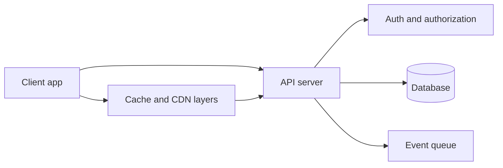

# REST

## 1. One-Line Definition
REST (Representational State Transfer) is an architectural style where clients manipulate addressable resources over HTTP using a uniform set of methods — GET, POST, PUT, PATCH, DELETE — guided by statelessness, cacheability, and a layered system.

## 2. Why Do We Need It?
Before REST, every API invented its own shape: opaque RPC calls, custom verbs, no shared caching or error semantics. REST standardizes around the resources businesses already think in (users, orders, videos) and reuses HTTP's primitive operations that every proxy, cache, and load balancer already understands. That reuse is the point: infrastructure works for free.

## 3. Simple Intuition
HTTP is a post office and REST is how you address the mail. A resource is a room at a specific address — `/rooms/users/42`. The methods are the standard forms: GET is "show me the room", PUT is "replace everything in it", DELETE is "empty it", POST is "bring me a new room to furnish". Because the forms are the same everywhere, any post office (proxy, cache) knows how to treat them without knowing your business.

## 4. What Happens Without It?
Every team builds its own vocabulary: `/fetchAllUsers`, `/usersByFilter?x=`, RPC-style `userService.get(id)`. Marked as "REST but not really", these APIs defeat HTTP caching and idempotency, confuse tools, and shift all this accidental complexity into clients. Each integration re-learns the API from scratch.

## 5. Core Idea
- **Resources are nouns.** Addressable representations: `/users/42`, `/videos`, `/orders/9/items`. Two URLs for the same logical thing is a code smell.
- **Methods are the uniform interface.** GET reads (safe, cacheable), POST creates or triggers an action (not idempotent), PUT replaces a resource (idempotent), PATCH applies a partial update, DELETE removes (idempotent).
- **State transfers in the representations.** Clients GET a representation and PUT/POST it back; the server's state is what you manipulate, not a remote object's memory.
- **Statelessness.** Each request carries everything needed (authn, context); no server-side session memory. This is what makes horizontal scaling and load balancing trivial.
- **Cacheable responses.** GET responses declare cacheability via headers so [[caching|Caching]] and [[cdn|CDN]] layers can serve repeat reads.
- **Layered system.** Clients talk to a gateway/LB, not the origin; layers add security, caching, and scaling without client changes ([[reverse-proxy|Reverse Proxy]]).
- **HATEOAS (optional).** Responses carry links to the next actions, letting clients discover the API.

## 6. Important Terminology

| Term | Simple Meaning |
|------|----------------|
| Resource | An addressable thing: `/users/42` |
| Representation | The JSON/XML body describing the resource's current state |
| Safe method | GET/HEAD/OPTIONS — no state change |
| Idempotent method | PUT/DELETE — same effect no matter how many times applied |
| Stateless | Every request is self-contained; no server session |
| Collection | A container of resources: `/users` |
| Sub-resource | Nested: `/users/42/orders` |
| HATEOAS | Response links that advertise the next possible actions |

## 7. Basic Architecture



## 8. Request or Data Flow
1. Client sends `GET /users/42` with an authn header; the request contains everything the server needs (no session).
2. A cache or CDN may serve it without ever reaching the API (cache hit).
3. On miss the API authenticates, authorizes, reads its store, and returns a representation with cache-control headers.
4. For writes, the client sends `PUT /users/42` with the full representation; the server applies it idempotently and returns 200/204, or `POST /users` to create and returns `201` with a `Location` header.

## 9. Practical Example
**Order service:**
- `GET /orders/7812` → `200` with order JSON. Repeatable, cacheable for a minute.
- `GET /orders/7812` again → served from cache.
- `PUT /orders/7812` → replaces the whole order; calling it twice is harmless.
- `PATCH /orders/7812` with `{"status":"shipped"}` → partial update.
- `DELETE /orders/7812` → `204 No Content`; calling DELETE twice still returns success (idempotent).
- `POST /orders` → `201`, header `Location: /orders/7821`. Unsafe: retries create duplicates unless the client sends an [[idempotency|Idempotency]] key.

## 10. Scaling
- **Statelessness is the superpower.** Any instance can serve any request, so `N` instances behind a [[load-balancing|Load Balancing]] slice the traffic; no sticky sessions needed (see [[stateless-vs-stateful-services|Stateless vs Stateful Services]]).
- **GET traffic scales with caching.** Hot reads vanish into [[caching|Caching]] and [[cdn|CDN]] layers; a 90% cache hit ratio multiplies effective capacity.
- **Reads scale separately from writes** with [[database-replication|Database Replication]] behind the API.
- **Watch list endpoints.** Unbounded `/users` responses are the famous REST scaling failure — fix with [[pagination|Pagination]].

## 11. Reliability and Failure Scenarios

| Failure | What Happens | Detection | Recovery | Trade-off |
|---------|--------------|-----------|----------|-----------|
| POST retried after timeout | Duplicate resource | Duplicate keys | [[idempotency|Idempotency]] headers | extra storage |
| Server dies mid-write | Client uncertain if it committed | 5xx + timeout | Retry with idempotent method, else replay | duplicate risk |
| Cache serves stale read | Client sees old data | TTL and invalidation | Short TTL, invalidate on PUT | freshness vs hit rate |
| Dependency down | Request fails at the API | Circuit open | [[circuit-breaker|Circuit Breaker]] + degrade | complexity |

## 12. Consistency and Correctness
- **Idempotency of methods is the correctness anchor.** PUT, DELETE, and GET are repeat-safe; POST is not, so POST/DELETE-like actions need explicit idempotency keys (see [[idempotency|Idempotency]]).
- **Read-your-writes.** Behind replicas a client may PUT then GET a stale value; when guaranteed freshness matters, read from the primary or use session affinity (see [[replication-lag|Replication Lag]]).
- **Single-responsibility representations.** PATCH with explicit field paths is easier to reason about than merged whole-object PUTs racing each other.

## 13. Performance
- Latency budget per request: keep the hot path a single round trip — db lookup, small body, done. Long jobs become async (see [[message-queue|Message Queue]]).
- Caching is the free performance multiplier: enforce `Cache-Control` and conditional GET with `ETag`/`If-None-Match` so unchanged resources cost bytes, not queries.
- Pagination, partial fields, and compression keep payloads small; avoid chatty N+1 client loops with composed endpoints when latency matters.
- Measure with standard percentiles; see [[latency-vs-throughput|Latency vs Throughput]].

## 14. Security
- HTTPS on every route (see [[http-and-https|HTTP and HTTPS]] and [[encryption-and-keys|Encryption and Keys]]).
- Authenticate and authorize per resource — [[authentication-vs-authorization|Authentication vs Authorization]]; token flows are the norm ([[oauth-oidc-jwt|OAuth 2.0 / OIDC / JWT]]).
- Safe methods must not mutate; servers must treat destructive verbs as such and never hide them behind GET.
- Validate and escape inputs ([[web-vulnerabilities|Web Vulnerabilities]]); never leak internals in error bodies; enforce limits at the [[api-gateway|API Gateway]] with the [[rate-limiter|Rate Limiter]].

## 15. Trade-Offs

| Choice | Advantages | Disadvantages | When to Use |
|--------|------------|---------------|-------------|
| REST over HTTP/1.1 | Universal, cacheable, tooling everywhere | Chatty, text overhead | Public web APIs |
| Strict resource model | Clean caching, predictable | Awkward for actions/CQRS verbs | CRUD-heavy domains |
| PUT full replace | Simple idempotent semantics | Overwrites fields on race | Coarse objects |
| PATCH partial | Cheap, concurrent-friendly | Semantics (merge vs JSON Patch) vary | Frequent partial edits |
| HATEOAS | Self-describing API, evolvable | Extra boilerplate, most consumers ignore it | True REST evangelists |

## 16. Common Mistakes
- Calling it REST but using RPC verbs in URLs (`/getUser`, `/updateUser`).
- Returning 200 for everything and stuffing errors into the body — kills caching, proxies, and clients' ability to react.
- Nesting resource paths too deeply (`/a/1/b/2/c/3`) instead of using query params or links.
- Believing REST forces one-table-one-endpoint verbosity; resources can still be shaped to the client's actual reads and writes.
- Forgetting `Location` headers, proper 201/204, and cache headers, leaving clients to guess semantics.

## 17. HLD vs LLD Boundary
HLD: the resource boundaries, URL tree, method-to-operation mapping, status code conventions, versioning, and caching strategy. LLD: framework route handlers, serialization DTOs, validation rules, and the middleware that enforces headers and idempotency per endpoint.

## 18. Interview Questions

### Beginner
- What is a resource and why do methods map cleanly onto HTTP verbs?
- Why is a GET response cacheable while a POST generally is not?

### Intermediate
- Design the REST resource model for a video service and defend your nesting choices.
- A client PUTs a full object that two users edited simultaneously — what breaks and how does PATCH help?

### Advanced
- Argue when REST is the wrong tool versus [[rpc-grpc-graphql|gRPC or GraphQL]] for a given workload.
- How do you evolve a REST API (versioning, cache semantics, HATEOAS) when 500 external consumers depend on it?

## 19. Interview Memory Summary

> [!abstract]- Interview Memory Summary

### Remember

- REST = resources as nouns + uniform HTTP methods over them.
- Stateless requests → horizontal scaling is trivial.
- GET is safe and cacheable; PUT/DELETE are idempotent; POST is neither.
- Representations transfer state; layers (gateway, cache, LB) slot in without client changes.
- Caching and CDN multiply read capacity for free when headers are right.
- Versioning, pagination, and idempotency complete the practical picture.

### 30-Second Explanation

REST models the domain as addressable resources manipulated through HTTP's uniform methods: GET to read (safe, cacheable), PUT/DELETE to mutate idempotently, POST to create. Because state lives in representations and requests are stateless, any node can serve anyone and caches/CDNs absorb reads — so REST scales horizontally and evolves through versioning and links.

### Interview Traps

- Using verbs in the URL and calling it REST.
- Claiming "REST is just JSON over HTTP" — the uniform interface and constraints matter.
- Assuming POST is retry-safe; it is the exact reason you need idempotency keys.
- Ignoring caching headers, the thing that makes REST actually cheap at scale.

### Key Trade-Off

REST buys universal interoperability, cacheability, and trivially easy horizontal scaling; it pays with chatty text payloads and occasional awkwardness for actions and complex query shapes that gRPC or GraphQL handle better.

## 20. Related Concepts

### Prerequisites

- [[http-and-https|HTTP and HTTPS]]
- [[api-design-principles|API Design Principles]]

### Commonly Used Together

- [[idempotency|Idempotency]]
- [[api-versioning|API Versioning]]
- [[pagination|Pagination]]
- [[caching|Caching]]
- [[api-gateway|API Gateway]]

### Alternatives

- [[rpc-grpc-graphql|RPC / gRPC / GraphQL]]

### Advanced Concepts

- [[http-and-https|HTTP and HTTPS]] (ETag, conditional requests, HTTP/2)
- [[cdn|CDN]]
- [[load-balancing|Load Balancing]]

Related planned topics (not authored yet): HTTP caching details, OpenAPI contract-first design, error handling for HTTP APIs.

## 21. References
Fielding's REST dissertation. RFC 9110 for HTTP semantics, methods, status codes, and caching semantics. Richardson Maturity Model (Fowler). Google Cloud API Design Guide. Verify against current HTTP docs, not folklore.

## 22. Active Recall

Test yourself before revealing each answer.

> [!question]- Basic Understanding: What exactly does the "S" and "T" in REST stand for and why does it matter?
> State Transfer — the client receives and transmits *representations* of server state via uniform methods. It matters because the server never exposes object internals; it trades in documents, which is why strategies like caching and versioning snap on cleanly.

> [!question]- Design Decision: When would you choose to make a POST endpoint accept an idempotency key?
> Whenever the operation is a client-initiated action with a side effect that must not happen twice (payments, orders, uploads) and where a network retry is likely. The key converts an unsafe POST into a retry-safe one; the server keys its effect-tracking table on that unique id.

> [!question]- Trade-Off: PUT whole-resource replace vs PATCH partial update — pick one for a fast-moving doc and justify.
> PATCH for high write frequency: clients send only changed fields, reducing races and bandwidth, though you take on merge-semantics complexity and must document them. PUT stays the right call for coarse immutable objects where full replace is cheap and unambiguous.

> [!question]- Failure Scenario: A caching proxy returns an old document after a critical update. What went wrong and how do you fix it?
> The update path never invalidated or the cache headers allowed over-long freshness. Fix by setting correct `Cache-Control` on reads, using `ETag` + conditional requests so stale caches revalidate cheaply, and invalidating (or versioning cache keys) on writes.

> [!question]- Interview Scenario: "How does REST scale to a million reads per second?"
> Statelessness lets any instance serve any request behind a load balancer; GET traffic is largely absorbed by cache and CDN layers; read replicas absorb the rest; and write paths stay small and authoritative. The diagram is: client → CDN/cache → LB → stateless API → replicas.

> [!question]- Basic Understanding: Why is DELETE defined as idempotent when a second delete finds nothing to delete?
> Idempotent means "same observable effect as doing it once," not "always succeeds the same way." A second DELETE returns success or a benign not-found because the resource state — absent — is identical; that semantics is what makes retries safe.

> [!question]- Design Decision: Your consumers need several different views of the same data. What placement and shape decisions make that cheap?
> Keep one canonical resource per noun, let query params select projection/expansion (`?fields=...`, `?include=author`), and treat alternate views as derived representations, not new resources — that preserves cache lines and versioning scope.

> [!question]- Trade-Off: REST for everything, RPC for nothing — where does that stance bite you?
> On high-throughput internal traffic and complex query needs: REST's text payloads and chatty round trips underperform binary gRPC and flexible GraphQL for those cases, so the stance forces complexity into clients that the alternative styles would eliminate.

## 23. When Should I Use This?

### Use it when

- The API is public or consumer-facing and must work everywhere HTTP, proxies, and caches work.
- The domain naturally reads as addressable resources with CRUD-ish operations.
- Reads dominate and you want caching/CDNs to carry the load for free.
- You need horizontal scaling driven by statelessness.

### Avoid it when

- Traffic is binary, streaming, or latency-hostile internal RPC (prefer [[rpc-grpc-graphql|gRPC]]).
- A single endpoint must serve wildly varied client-shaped queries over rich graphs (prefer [[rpc-grpc-graphql|GraphQL]]).
- Operations are basically action verbs (start, cancel, retry) with little resource structure — REST will fight you.

### What problem does it solve?

It standardizes how systems exchange state over HTTP: uniform methods, addressable resources, statelessness, and cacheability, so infrastructure (caches, proxies, load balancers) and clients work with the same primitives everywhere.

### What problem does it NOT solve?

It doesn't guarantee query flexibility (GraphQL wins there), it doesn't give the lowest latency for binary/pipelined RPC (gRPC wins), and it doesn't make unsafe semantics safe by itself — retries, idempotency, and correctness are still your design problem.

## 24. Decision Connections

Decisions that go together with REST:

- [[api-design-principles|API Design Principles]] — the rules REST most visibly realizes.
- [[http-and-https|HTTP and HTTPS]] — the transport; methods, status, caching live here.
- [[idempotency|Idempotency]] — safe retries for PUT/DELETE and guarded POSTs.
- [[api-versioning|API Versioning]] — evolving URLs, headers, or media types without breaking consumers.
- [[pagination|Pagination]] — the list-endpoint discipline REST needs at scale.
- [[api-gateway|API Gateway]] — where versioning, auth, rate limits, and routing attach.
- [[caching|Caching]] and [[cdn|CDN]] — the free read-scaling REST enables.
- [[rpc-grpc-graphql|RPC / gRPC / GraphQL]] — the alternative you weigh REST against.

Decision tree:

```
Choose your interface style
    |
    +-- Public web API, CRUD-heavy, cache-friendly reads?
    |      → [[rest|REST]]
    |         |
    |         +-- Consumers retry writes?      → [[idempotency|Idempotency]]
    |         +-- Lists returned to clients?   → [[pagination|Pagination]]
    |         +-- Contract evolves in public?  → [[api-versioning|API Versioning]]
    |
    +-- Internal, high-throughput, binary/streaming?
    |      → [[rpc-grpc-graphql|RPC / gRPC / GraphQL]]
    |
    +-- One client, rich query shapes, deep graphs?
    |      → [[rpc-grpc-graphql|RPC / gRPC / GraphQL]]
    |
    +-- Cross-cutting concerns (auth, quota, routing)?
    |      → enforce in the [[api-gateway|API Gateway]]
    |
    +-- Hot reads dominating traffic?
           → add [[caching|Caching]] and [[cdn|CDN]] layers
```