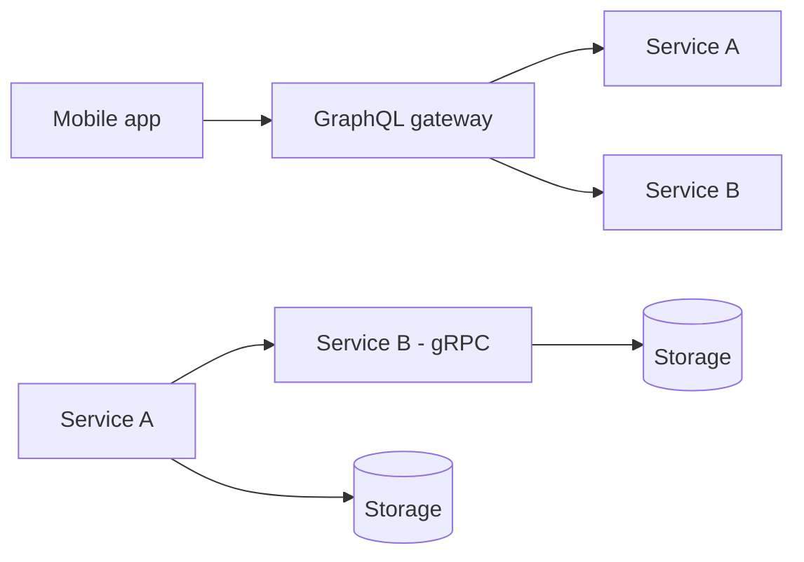

# RPC / gRPC / GraphQL

## 1. One-Line Definition
RPC is the style of calling a remote function as if it were local; gRPC is a modern binary, typed, HTTP/2-based RPC framework, and GraphQL is a query language that lets clients request exactly the data shape they want from a single endpoint.

## 2. Why Do We Need It?
REST owns the public-web space, but it is worse than ideal for two big jobs: internal, high-throughput service-to-service traffic (chatty, text-heavy, weakly typed) and client-facing APIs where one mobile app needs many different views of a rich graph. gRPC attacks the first; GraphQL attacks the second. RPC's old generations (CORBA, DCOM, RMI) tried the first and failed on complexity — gRPC is the modern, protocol-safe answer.

## 3. Simple Intuition
A server exposes functions like `GetUser(id)` and `ChargeCard(card, amt)`. A **local call** style from the client side: you "call" the function and the framework makes the network invisible — that's RPC. gRPC is that same idea with strongly typed contracts (both sides share a schema compilable to code), fast binary bytes, and streaming. GraphQL is different: instead of calling function `X`, you send one *query* describing the shape of the answer you want — "give me the user's name and their last 3 orders" — and the server figures out the calls for you.

## 4. What Happens Without It?
Without gRPC, internal services pile up ad-hoc JSON REST with manual DTOs, no schema, and painfully slow payloads under heavy QPS; interfaces drift and break silently. Without GraphQL, mobile apps issue five REST calls and stitch results client-side, or the server bloats overloaded endpoints to guess every client's needs. You get version churn, N+1 network costs, and contract drift in both directions.

## 5. Core Idea
- **RPC:** mask the remote call as a local one — `stub.GetUser(req)`. The transport, serialization, and error plumbing are generated from a contract (IDL).
- **gRPC specifics:** schema-first via Protocol Buffers (`.proto`); clients and servers generate typed code from the same file — schema drift is a compile error, not a runtime surprise. HTTP/2 transport gives multiplexing, streaming (unary, server-stream, client-stream, bidirectional), and compression for free. Defaults assume high-throughput, low-latency, internal use.
- **GraphQL specifics:** one endpoint, a schema of types/fields, a query language for selection, and a resolver layer per field that fetches exactly what's asked. Clients fetch a tree in one round trip; no over-fetching and no under-fetching. Fragments and mutations have their own semantics; subscriptions give push.
- **Where each wins:** gRPC for service-to-service backbone traffic; GraphQL for BFF/mobile/aggregation layers sitting on top of REST/gRPC services.

## 6. Important Terminology

| Term | Simple Meaning |
|------|----------------|
| RPC | Calling a remote function like a local one |
| IDL | Interface definition language describing the contract |
| Protocol Buffers | gRPC's binary serialization format (.proto) |
| Stub / client code | Generated code exposing remote methods locally |
| Unary call | One request, one response (like a function call) |
| Streaming RPC | Continuous request/response flow over one connection |
| Schema | The GraphQL type/field contract |
| Resolver | Function that fetches data for one GraphQL field |
| BFF | Backend for Frontend, the layer authoring GraphQL queries |
| Over-fetching | Receiving more fields than needed (REST pain) |
| Under-fetching | Needing several calls to assemble an answer (REST pain) |

## 7. Basic Architecture



## 8. Request or Data Flow
1. **gRPC:** a service imports the shared `.proto`, compiles a stub, and calls `GetUser(123)`. The client channel picks a connection, protobuf-encodes the request, and HTTP/2 multiplexes it with other calls; the server dispatches to the handler and streams back the response.
2. **GraphQL:** the app sends one query `user(id:3) { name orders(last:3) { total } }`. The server starts at the root resolver, walks the selection tree, calls each field resolver (often a gRPC/REST fetch), and assembles the exact nested JSON in one response.

## 9. Practical Example
**E-commerce backend:**
- Orders service calls payments service over gRPC: `charge_card(card{...}, amount)`. Both sides compile the same `.proto`, so a field rename breaks the build, not the runtime. Bidirectional stream streams cart-typing events for a sync-update UX.
- The **GraphQL gateway** (`/graphql`) exposes `order(id) { items, status, ship_date, customer { name } }` to mobile. The mobile client sends one query; the gateway resolves it into three gRPC calls — order, items, customer — then assembles one JSON tree. Numbers: one round trip instead of three, no 3x over-fetch of unused fields.

## 10. Scaling
- **gRPC scales horizontally** like any stateless service but with much better link utilization: HTTP/2 multiplexing means thousands of concurrent calls share few connections, cutting connection counts and head-of-line blocking.
- **Protobuf is small and fast** — a few ms saved per call and 10-30x smaller payloads versus JSON, which matters at millions of QPS (see [[latency-vs-throughput|Latency vs Throughput]]).
- **GraphQL has the classic scaling traps:** N+1 resolver queries (a list of 100 items firing 100 resolves) and unbounded depth/cost — mitigate with batching (DataLoader), depth/query-cost limits, persisted queries, and caching at the gateway.
- **Federation** splits one graph across teams, each owning subgraphs, but adds coordination and gateway complexity.

## 11. Reliability and Failure Scenarios

| Failure | What Happens | Detection | Recovery | Trade-off |
|---------|--------------|-----------|----------|-----------|
| gRPC service down | Stub call errors fast | gRPC status codes + health checks | [[retry-and-timeout|Retry and Timeout]], [[circuit-breaker|Circuit Breaker]] | added latency |
| Schema drift across teams | Shared .proto mismatches | Compile breaks at release | Share contract repo, CI schema check | push process cost |
| GraphQL resolver N+1 | One query triggers a storm | Trace query depth and resolver counts | DataLoader batching | gateway complexity |
| Deep hostile query | CPU/memory blowup | Query cost analysis | Depth limits, persisted queries | reduced flexibility |

## 12. Consistency and Correctness
- gRPC supports **idempotency flags** on methods and retry policies, so payment-like calls can be retried safely; the same [[idempotency|Idempotency]] rules apply as in REST.
- Streaming has ordering guarantees per stream; unary calls are independent — enforce your own ordering if the business needs it.
- GraphQL mutations can be transactional per root field, but cross-resolver consistency is your job; be explicit about weak/eventual reads (see [[strong-vs-eventual-consistency|Strong vs Eventual Consistency]]).

## 13. Performance
- **gRPC:** protobuf encoding is CPU-light and tiny on the wire; HTTP/2 multiplexing removes connection-per-request overhead. Streaming turns chatty polling into one persistent flow.
- **GraphQL:** one round trip replaces many, cut per-payload over-fetch; but resolve time adds up — never let resolver latency scale with fan-out. Cache hot sub-queries.
- Decide by measuring, not vibes: fetch typical payload latency and sizes for [[rest|REST]] vs gRPC vs GraphQL on your real queries.

## 14. Security
- gRPC runs over TLS (often mutual TLS) and supports per-RPC authn; protect the service mesh boundary (see [[encryption-and-keys|Encryption and Keys]]).
- GraphQL needs **query-cost and depth enforcement** — public introspection and unbounded arguments are classic attack surfaces ([[web-vulnerabilities|Web Vulnerabilities]]).
- Authorization applies per field/root resolver, not just per endpoint; mirror the [[authentication-vs-authorization|Authentication vs Authorization]] model onto the schema.

## 15. Trade-Offs

| Choice | Advantages | Disadvantages | When to Use |
|--------|------------|---------------|-------------|
| gRPC vs REST | Fast, typed, streaming, tiny payloads | Browser-unfriendly, debuggability, HTTPS/gRPC-Web ceremony | Internal, high-QPS service traffic |
| Protobuf vs JSON | Compact, fast, typed, versioned fields | Binary hard to debug, needs tooling | Anything with volume |
| GraphQL vs REST | One round trip, exact data, schema docs | Caching complex, resolver N+1, cost attacks, slower ramp-up | Client-facing with rich graphs, mobile, multi-client |
| Streaming vs unary | Live updates, less polling | Ordering/reconnect complexity | Feeds, chat, progress |
| Single graph vs federation | Simple ownership | Monolithic graph coupling per-team | Small-medium businesses |

## 16. Common Mistakes
- Using gRPC only (no gateway) against public browsers — most proxies/clients speak HTTP/JSON, and you need a translation layer.
- Treating .proto as a code warehouse instead of a stable contract — fields must never be reused/reordered.
- GraphQL without depth/cost limits, exposing an open query facility to attackers.
- Forgetting DataLoader, then wondering why a 100-item list fires 101 queries.
- Copy-pasting REST DTOs into the proto and calling it "schema-first."

## 17. HLD vs LLD Boundary
HLD: choose style (gRPC vs GraphQL gateway vs REST), define the .proto/schema boundaries, versioning strategy for schemas, resolver/ownership mapping, and scaling/security posture. LLD: the exact .proto definitions, resolver implementations, DataLoader wiring, and gateway query planning code.

## 18. Interview Questions

### Beginner
- What problem does gRPC solve that plain REST over HTTP/1.1 does not?
- What does a GraphQL query give you that a REST endpoint cannot?

### Intermediate
- You have a mobile app needing users, orders, and shipping in one screen. Compare REST vs GraphQL for the data path.
- Why does HTTP/2 matter so much for gRPC's efficiency?

### Advanced
- Design the schema evolution policy for a shared .proto used by five teams.
- How do you protect a public GraphQL endpoint against abusive queries and N+1 storms while keeping flexibility?

## 19. Interview Memory Summary

> [!abstract]- Interview Memory Summary

### Remember

- RPC asks "call this function"; REST asks "act on this resource"; GraphQL asks "give me this shape."
- gRPC: schema-first protobuf + HTTP/2 + streaming = fast, typed, internal backbone.
- GraphQL: one endpoint, client-chosen shape, resolver-per-field; cures over/under-fetching.
- gRPC failure modes are code-visible at compile time; JSON is not.
- GraphQL's bills: N+1, cache complexity, and query-cost attacks.
- Federation splits the graph across teams at the cost of coordination.
- Both complement, not replace, REST and each other.

### 30-Second Explanation

gRPC is your fast, typed, internal service-to-service backbone: a shared protobuf contract generates code on both sides, HTTP/2 gives multiplexing and streaming, and payloads are tiny. GraphQL fronts clients: one endpoint answers exactly the nested shape each app asks for, resolved field-by-field, curing the chatty/over-fetching REST pain — provided you budget query depth and batch resolvers so the graph doesn't become a query storm.

### Interview Traps

- Saying "GraphQL just beats REST" — caching and authorization are genuinely harder.
- Claiming gRPC is "for everything" on the public web — browsers and proxies disagree.
- Treating .proto field numbers as safe to reuse.
- Ignoring N+1 the moment someone mentions a list query.

### Key Trade-Off

You trade universal interoperability (REST) and client simplicity for speed+typing (gRPC) or exact-fit client queries (GraphQL), and both pay with harder security, caching, and operational discipline.

## 20. Related Concepts

### Prerequisites

- [[http-and-https|HTTP and HTTPS]] (HTTP/2 foundation)
- [[api-design-principles|API Design Principles]]

### Commonly Used Together

- [[api-gateway|API Gateway]] (termination and translation point)
- [[rest|REST]]
- [[event-driven-architecture|Event-Driven Architecture]] (gRPC-streamed feeds)
- [[message-queue|Message Queue]] (async alternative paths)

### Alternatives

- [[rest|REST]]

### Advanced Concepts

- [[encryption-and-keys|Encryption and Keys]] (mTLS for the mesh)
- [[circuit-breaker|Circuit Breaker]] and [[retry-and-timeout|Retry and Timeout]]
- [[outbox-pattern|Outbox Pattern]] (reliable side effects beside the API)

Related planned topics (not authored yet): contract-first design with OpenAPI, GraphQL federation, gRPC-Web recipes.

## 21. References
gRPC official docs and protobuf language guide. GraphQL specification at spec.graphql.org. Fielding's dissertation (RPC vs REST contrast). Google Cloud API Design Guide sections on gRPC/HTTP mapping. Verify current HTTP/2 and gRPC-Web support against platform docs.

## 22. Active Recall

Test yourself before revealing each answer.

> [!question]- Basic Understanding: What is a .proto / IDL and why does gRPC insist on it?
> It is the interface definition: types and methods shared by both sides, from which code is generated. The insistence removes drift — a field mismatch is a compile error instead of a silent runtime misparse, and versioning is handled by the type system.

> [!question]- Design Decision: When do you put a GraphQL gateway in front of gRPC services?
> When clients need many different shapes of the same underlying data (mobile, multiple device types) or when you want to aggregate several services behind one call. The gateway resolves GraphQL onto the gRPC backbone instead of exposing the wire style to fat clients.

> [!question]- Trade-Off: Small and fast (gRPC) vs self-describing and transparent (JSON REST).
> gRPC wins when velocity of bytes and calls matter and both sides are yours; JSON wins when operators, humans, and third parties must inspect traffic. In practice enterprises run both — gRPC inside, JSON at the edge — and translate.

> [!question]- Failure Scenario: A GraphQL list query now fires 500 tiny DB queries. Diagnose it.
> Classic N+1: the list root fetched 100 items and the per-field resolver ran per item. Fix with DataLoader batching (collect keys, one batched fetch per type) plus query depth/cost limits so the graph stays bounded.

> [!question]- Interview Scenario: Design the service-to-service layer for a large microservices platform.
> 1. Contract-first .proto repositories with CI schema checks. 2. gRPC over HTTP/2 with TLS/mTLS in the mesh. 3. Standard status codes mapped to your error taxonomy, retry/circuit-breaker policies, tracing correlation. 4. A small set of read models and denormalization so cross-service fan-out stays bounded. 5. Client-facing REST/GraphQL gateway at the edge.

> [!question]- Design Decision: Why can gRPC multiplex thousands of calls on one connection when HTTP/1.1 can't?
> HTTP/2 frames requests and responses as streams over a single TCP connection with headers compressed and flows multiplexed. HTTP/1.1 needs a new connection per in-flight request, which blows up latency and connections at high fan-out.

> [!question]- Failure Scenario: Teams A and B both edit the shared .proto and the build breaks on merge.
> The schema is a contract, not a code library. Treat it like a versioned API: additive fields only with explicit deployment order, frozen field numbers, and a review/CI gate so breaks surface loudly and early rather than as prod misparses.

> [!question]- Trade-Off: One monolithic GraphQL graph vs federated subgraphs per team.
> A monolith graph is simpler and end-to-end type-checked but couples every team's schema changes into one deploy; federation decouples ownership behind subgraph contracts at the cost of a coordinating gateway, more moving parts, and resolver-latency surprises.

## 23. When Should I Use This?

### Use it when

- **gRPC:** service-to-service traffic with high QPS, tight latency budgets, or streaming needs; you want typed contracts enforced at build.
- **GraphQL:** one client base (mobile, multiple apps) with many data shapes; you want to kill over/under-fetching and round-trip counts.

### Avoid it when

- Public/browser-facing APIs where JSON over plain HTTP and universal proxy compatibility dominate (keep REST).
- Simple CRUD with one consumer — gRPC/GraphQL overhead and schema governance are pure cost.
- Heavy binary transfers (multimedia) — streams and object storage handle those better.

### What problem does it solve?

gRPC solves internal API performance, typing, and streaming; GraphQL solves client-shaped data access without the round-trip and payload bloat of point-fixed REST endpoints.

### What problem does it NOT solve?

Neither fixes your data model, business logic, or consistency; gRPC doesn't reach generic browsers easily, GraphQL doesn't give you HTTP-cacheable public endpoints out of the box, and both still need authn/authz, rate limiting, tracing, and gateway enforcement.

## 24. Decision Connections

Decisions that go together with RPC / gRPC / GraphQL:

- [[rest|REST]] — the style you compare against and often bridge to at the edge.
- [[api-gateway|API Gateway]] — the front termination and translation layer.
- [[api-design-principles|API Design Principles]] — the contract discipline both styles demand.
- [[event-driven-architecture|Event-Driven Architecture]] — streaming/async complements to request/response.
- [[message-queue|Message Queue]] — where request/response becomes event push.
- [[encryption-and-keys|Encryption and Keys]] — mTLS for the gRPC mesh.
- [[retry-and-timeout|Retry and Timeout]] and [[circuit-breaker|Circuit Breaker]] — the reliability gear every RPC path needs.
- [[cdn|CDN]] — hardening public GraphQL/gRPC-Web traffic at the edge.

Decision tree:

```
Need an interface for something
    |
    +-- Public web, browsers, universal clients?
    |      → [[rest|REST]]
    |
    +-- Internal, high-QPS, low-latency, or streaming?
    |      → gRPC, schema-first protobuf, HTTP/2
    |         |
    |         +-- Guarantee retries safe?          → [[idempotency|Idempotency]]
    |         +-- Backend call fails chronically?  → [[circuit-breaker|Circuit Breaker]]
    |
    +-- One app base needing varied data shapes?
    |      → GraphQL gateway, resolver-ready
    |         |
    |         +-- List queries heavy?              → batch resolvers, depth limits
    |         +-- Shared cross-team schema?        → federate subgraphs
    |
    +-- Both? → gRPC backbone + GraphQL/REST gateway at the edge
```