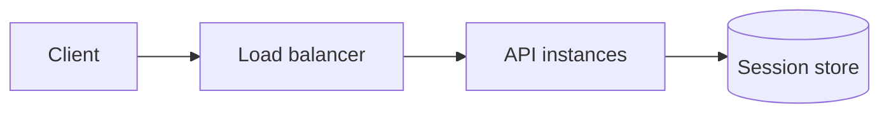

# Session Management

## 1. One-Line Definition
Session management is the system that creates, stores, validates, expires, and revokes a per-user record — a *session* — so many stateless HTTP requests are tied together into one authenticated, continuous conversation.

## 2. Why Do We Need It?
HTTP is a stateless protocol: every request arrives as if it were the first. Yet real products need continuity — a logged-in user adds to a cart, navigates, checks out, and every hop must agree on *who* they are and *what* they did. Sessions carry that continuity. They hold identity, authorization context, and lightweight user state between requests without forcing the user to authenticate (or re-submit credentials) on every click.

## 3. Simple Intuition
A gym locker: you hand over your bag at the front desk, the clerk gives you a numbered claim ticket, and you retrieve the bag later by presenting the ticket. The ticket is tiny and meaningless on its own; the *state* lives safely behind the counter, and you cannot get someone else's bag with your ticket. That is a session ID pointing at a session record.

## 4. What Happens Without It?
Every action requires full re-authentication, so a cart vanishes on refresh and every click re-runs password checks — slow and fragile. The alternative people reach for, shoving everything client-side, is just as bad: state a client can tamper with, sessions you can never revoke, and a secret-bearing token that leaks once and is usable forever. You need somewhere central and revocable — that is the session store.

## 5. Core Idea
- **Two storage models:** *server-side sessions* keep a random, opaque session ID in a cookie and the actual data in a server store (memory, Redis, DB) — fully revocable, but stateful. *Stateless tokens* (signed JWTs) carry the claims inside the token itself — nothing to look up and nothing to revoke; trust comes from a signature and expiry.
- **Delivery:** browsers get cookies (automatic, [[http-and-https|HTTP and HTTPS]]); mobile apps and SPAs use an explicit session token in a header.
- **Session store:** shared (Redis) so *any* app instance can serve any session — this is what decouples sessions from [[stateless-vs-stateful-services|Stateless vs Stateful Services]]. In-memory-only sessions force sticky routing and die with the instance.
- **Lifecycle:** create on login, verify on every request, regenerate on privilege escalation, expire (absolute TTL *and* sliding idle TTL), destroy on logout or revocation.
- **Binding:** optional fingerprint/IP binding so a stolen cookie or token alone is not enough to impersonate.

## 6. Important Terminology

| Term | Simple Meaning |
|------|----------------|
| Session ID | Random unguessable token identifying the session |
| Session store | Shared place session records live (often Redis) |
| Session cookie | Cookie that carries the session ID to the server |
| Sliding expiration | Idle timeout that refreshes on activity |
| Absolute expiration | Hard deadline, regardless of activity |
| Session fixation | Attacker sets the victim's session ID beforehand |
| Session revocation | Killing a session (logout, security event) |
| Stateless token | Signed token (JWT) carrying claims, no server state |

## 7. Basic Architecture



Stateless sessions change Store to the client itself and skip the store lookup:


## 8. Request or Data Flow
1. Login: verify credentials → create a session record (ID, user id, roles, expiry) in the store → set an HttpOnly session cookie (or return a token).
2. Each request: parse the cookie/token → look up the store (or verify the signature) → check expiry and binding → load identity and authorize.
3. Authorized action runs with the identity context; sliding TTL refreshes on activity.
4. Logout: delete the store record (server-side) or blacklist/let a stateless token expire naturally.
5. Missing/expired/revoked session → unauthenticated (401/redirect to login).

## 9. Practical Example
A shopping site with 1M users/day: peak concurrent web sessions ~2M. Sessions store user id, roles, and a small cart reference (~80 bytes). In Redis at ~200MB that is trivially cacheable, with a 30-minute sliding TTL and a 7-day absolute limit to force periodic re-login for security. Because the store is shared, web instance rolls during a deploy do not log anyone out — in-memory sessions would.

## 10. Scaling
- **Shared store wins:** Redis (or similar) lets app instances stay stateless — scale horizontally freely, restart nodes without breaking logins, and fail over from [[failover|Failover]].
- **Sticky sessions** avoid a store round-trip but cost elasticity: an instance death or a scale-in wipes its sessions unless they were replicated, and stickiness works against load balancing's goal.
- **Stateless tokens scale the furthest** (no store at all) but revocation becomes a problem: need short-lived access tokens + a revocation list, or a shared deny-list store that reintroduces exactly the shared state you removed.

## 11. Reliability and Failure Scenarios

| Failure | What Happens | Detection | Recovery | Trade-off |
|---------|--------------|-----------|----------|-----------|
| Session store down | Every user appears logged out | Store health | Replicated store + [[failover|Failover]]; or fall back to stateless short-lived tokens | dependency on store |
| App instance dies | In-memory sessions lost | Load balancer health | Shared store makes it invisible | store lookup cost |
| Token blacklist lost | Revoked tokens work again briefly | Node restart | Keep blacklist in shared store | store reintroduced |
| Clock skew on token expiry | Tokens validate on wrong time | NTP drift | Use aud/iss and leeway, sync clocks | security margin |

## 12. Consistency and Correctness
- **Read-your-writes:** a session update (cart change, MFA flag) must be visible to the *next* request. Redis with client-affinity within a request, or single-node writes to the session key, keeps this simple — session state is per-user so there is rarely a cross-node consistency problem.
- **Concurrent logins (multi-device):** each device gets its own session; shared state like a cart then needs its own merge/conflict story, not session storage.
- **Revocation is immediate server-side**, delayed/difficult for stateless tokens — this asymmetry is the heart of the server-session vs token choice.

## 13. Performance
- Server-side sessions add one store lookup per request (~sub-ms with Redis); that is the price of revocability.
- Don't store blobs in the session — it bloats every request's round trip. Keep the session minimal; fetch heavy data on demand.
- Sliding TTL writes on *every* request is write amplification; touch only when idle time exceeds some fraction of TTL.
- Stateless tokens need zero lookups but carry their own cost: a large JWT in every request and asymmetric signature verification per request.

## 14. Security
- **Session fixation:** regenerate the session ID on login — otherwise an attacker can pre-use a known ID.
- **Hijacking:** mark cookies HttpOnly (JS can't read), Secure (TLS only), and SameSite (CSRF defense), rotate IDs on privilege change, optionally bind to fingerprint/IP, and expire sessions that go quiet.
- **Stateless tokens:** the signing key is everything — protect it, make tokens short-lived, and pair with refresh tokens and a revocation mechanism (see [[oauth-oidc-jwt|OAuth 2.0 / OIDC / JWT]]).
- A session ID alone is not identity proof forever; pair with re-auth for sensitive actions (payments, password changes) via [[authentication-vs-authorization|Authentication vs Authorization]].

## 15. Trade-Offs

| Choice | Advantages | Disadvantages | When to Use |
|--------|------------|---------------|-------------|
| Server-side session store | Instant revocation, small cookies, fits any client | Store dependency, one lookup per request | Web apps needing logouts and server control |
| Stateless JWT | Zero store, scales trivially, stateless | Hard revocation, large tokens, signing-key risk | Mobile/SPA where a store is undesirable or unneeded |
| Cookie delivery | Automatic, HttpOnly, SameSite | CSRF surface, browser-only, size limits | Browser clients |
| Header/token delivery | No CSRF, mobile-friendly | Manual management, xss-stealable | Mobile apps, SPAs |
| In-memory sessions | Fastest lookup | Instance death logs users out, sticky needed | Single instance, dev/low scale |
| Shared store | Indestructible-ish, stateless apps | Store cost and latency | Horizontal scale |

## 16. Common Mistakes
- Never expiring sessions — one cookie, pristine forever.
- No ID regeneration on login → session fixation.
- Storing secrets (card data, passwords) inside a stateless token — clients can read it.
- In-memory session store with horizontal app instances and no stickiness — random intermittent logouts.
- No logout path that actually revokes; "logout" that only deletes the cookie and leaves the server record alive.
- Forgetting HttpOnly/Secure/SameSite on the cookie.
- Using predictable session IDs (incrementing counters) instead of strong randomness.

## 17. HLD vs LLD Boundary
HLD: storage model (store vs stateless token), store technology and topology, TTL policy (sliding/absolute values), delivery (cookie vs header), revocation strategy, per-client binding policy, and how sessions compose with auth flows. LLD: the middleware that parses and validates, the Redis key schema, cookie attribute flags, JWT claim set and signing, the specific rotation logic.

## 18. Interview Questions

### Beginner
- Why can't you just keep all user state in the browser?
- What is the difference between an absolute and a sliding session expiration?

### Intermediate
- Recommend server-side sessions vs stateless JWTs for a banking app and defend the revocation story.
- A user refreshes mid-session and is logged out randomly. What is the likely cause and the fix?

### Advanced
- Design session handling across a Redis outage: what degrades, what breaks, and how do you recover auth continuity?
- How do sessions interact with MFA, password reset, and device revocation? Walk one flow end to end.

## 19. Interview Memory Summary

> [!abstract]- Interview Memory Summary

### Remember

- HTTP is stateless; the session is the per-user thread binding requests.
- Two models: server-side store (revocable, stateful) vs stateless signed token (scalable, hard to revoke).
- Shared store (Redis) decouples sessions from app instances — stateless app, stateful store.
- Lifecycle: create, validate, rotate, expire (absolute + sliding), revoke.
- Cookie flags (HttpOnly, Secure, SameSite) and ID regeneration are the security non-negotiables.
- Revocation speed is the decisive difference between the two models.
- Small sessions, one lookup per request, sensible TTLs.

### 30-Second Explanation

On login, issue a session: a server-side model writes a record (user, roles, expiry) to a shared Redis store and hands the browser an opaque HttpOnly cookie; a stateless model signs claims into a short-lived JWT. Every request looks up or verifies the session, checks expiry and binding, and authorizes with the stored identity; activity refreshes a sliding TTL and privilege changes rotate the ID. Logout deletes the store record — instant — which is exactly what stateless tokens lose.

### Interview Traps

- Claiming stateless JWTs "just work" without a revocation story.
- Forgetting to regenerate session IDs on login (dev fixes everything except fixation).
- Storing too much in the session (bloat) or storing secrets in a token (visible to the client).
- Saying "we scale because every request is stateless" while sessions sit in instance memory.
- Skipping cookie security flags and calling sessions "secure."

### Key Trade-Off

Revocability and control want a server-side session store; scale and zero-state want stateless tokens. The trade is logged-out-when-store-down against revoked-only-when-token-expires.

## 20. Related Concepts

### Prerequisites

- [[stateless-vs-stateful-services|Stateless vs Stateful Services]]
- [[http-and-https|HTTP and HTTPS]] (cookies, TLS)

### Commonly Used Together

- [[authentication-vs-authorization|Authentication vs Authorization]]
- [[oauth-oidc-jwt|OAuth 2.0 / OIDC / JWT]]
- [[load-balancing|Load Balancing]] (sticky sessions vs shared store)
- [[caching|Caching]] (the session store is a cache-like hot path)

### Alternatives

- Stateless signed tokens end-to-end (JWT; oauth-oidc-jwt covers the token side)
- No sessions at all — anonymous workflows where identity is not needed per request

Related planned topics (not authored yet): http-cookies, sticky sessions, api keys and sessions.

## 21. References
OWASP Session Management Cheat Sheet; RFC 6265 (HTTP State Management Mechanism, cookies); RFC 7519 (JWT); Auth0 documentation on session vs JWT storage. Verify cookie flags and JWT lifetimes against current security guidance.

## 22. Active Recall

Test yourself before revealing each answer.

> [!question]- Basic: why does HTTP need sessions at all?
> HTTP is stateless — each request is independent and carries no memory of prior ones. Sessions attach a per-user record so the server can recognize the same user across many requests without re-authenticating each time.

> [!question]- Design: when is a stateless JWT better than a server-side session?
> When you can tolerate weak revocation and want zero shared state — mobile/SPA clients, horizontally scaled services with no session store, long-lived-machine trusts. The token carries claims and is verified by signature alone; the price is that "logging out" cannot take the token away.

> [!question]- Trade-off: in-memory sessions vs a shared Redis store — what breaks at scale?
> In-memory is fast and simple but binds sessions to one instance: scaling out needs sticky routing, an instance death logs those users out, and deploys break sessions. A shared store makes instances interchangeable (stateless apps) at the cost of one store lookup and a store that must itself be replicated.

> [!question]- Failure: the session store goes down at peak. What breaks, and what is the recovery?
> Every request that needs a session lookup fails — users appear logged out, carts vanish, auth calls fail. Recovery: rely on the replica/failover; failing gracefully means read-mostly features degrade while anything requiring identity is rejected rather than served unsafe. A stateless-token fallback (short-lived) can carry authentication until the store returns — the availability trick.

> [!question]- Interview scenario: design session handling for a banking app with horizontal scale and mandatory logout-on-compromise.
> Server-side sessions in a replicated Redis store; random session IDs in HttpOnly+Secure+SameSite cookies, regenerated on login and privilege change; 15-min sliding and 24h absolute TTL; explicit logout endpoint deleting the record; ID revocation list for fast compromise response; MFA and re-auth tied into the same session record.

> [!question]- Design: what protects a session cookie from theft, and what happens when it is stolen anyway?
> HttpOnly (no JS read), Secure (TLS only), SameSite (CSRF), TLS transport, ID rotation, and fingerprint binding. If stolen anyway, the attacker gets a working session until it expires or is revoked — which is why short TTLs plus active revocation, and re-auth for sensitive actions, bound the damage.

> [!question]- Trade-off: why regenerate the session ID on login instead of reusing it?
> Session fixation: if an attacker pre-supplies a known ID (via a link or another site), reusing it lets them ride the victim's login. Regenerating on login invalidates the attacker's planted ID — cheap, and standard security practice.

## 23. When Should I Use This?

### Use it when

- Users need continuity across many requests (login, cart, preferences) without re-authenticating.
- You must be able to revoke a user's access quickly (logout, compromise, termination).
- Sessions can live comfortably in a replicated shared store (Redis-class latency).
- You need to associate authorization context (roles, tenant, MFA state) with every request cheaply.

### Avoid it when

- The workload is genuinely anonymous or stateless per request (public reads, webhooks).
- You cannot operate a replicated session store and revocation needs are minimal — then prefer short-lived stateless tokens.
- State is per-device and long-lived with no server-side revocation requirement (device credentials).

### What problem does it solve?

Tying stateless HTTP requests into a continuous, authenticated, revocable user conversation.

### What problem does it NOT solve?

Not authorization policy (sessions carry authorization, they don't decide it — that is [[authentication-vs-authorization|Authentication vs Authorization]]), not per-device data conflicts across multiple simultaneous sessions, and not offline/eventual state: in-flight multi-service consistency is a [[strong-vs-eventual-consistency|Strong vs Eventual Consistency]] problem, not a session problem.

## 24. Decision Connections

Decisions that go together with session management:

- [[stateless-vs-stateful-services|Stateless vs Stateful Services]] — sessions are the deliberate little bit of state that makes everything else stay stateless.
- [[oauth-oidc-jwt|OAuth 2.0 / OIDC / JWT]] — flows mint the identity that sessions later carry.
- [[authentication-vs-authorization|Authentication vs Authorization]] — sessions prove identity and carry authorization context.
- [[load-balancing|Load Balancing]] — sticky sessions vs shared store decides how sessions and scaling interact.
- [[caching|Caching]] — the session store is a hot, replicated cache that must not fall over.
- [[failover|Failover]] — the store must survive, or every user gets logged out at once.
- [[http-and-https|HTTP and HTTPS]] — cookies, headers, and TLS deliver the session ID safely.

Decision tree:

```
Users need continuity across requests?
    |
    +-- No, requests are independent?
    |      → stateless API; skip sessions
    |
    +-- Yes, but revocation can be slow?
    |      → short-lived stateless JWT + refresh
    |         |
    |         +-- Server must invalidate instantly (banking)?
    |                → add a shared blacklist/revocation store
    |
    +-- Yes, revocation must be immediate?
           → server-side session in a shared replicated store
              |
              +-- Browser client?    → HttpOnly Secure SameSite cookie
              +-- Mobile / SPA?      → session token in header
              +-- App instances stateless? → shared store, no sticky needed
```