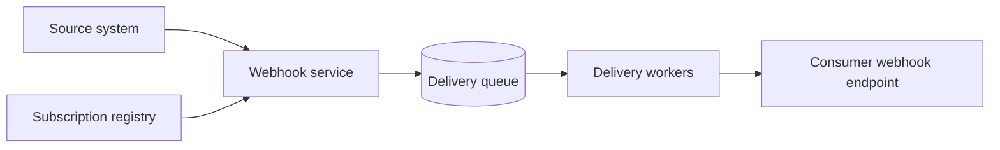

# Webhooks

## 1. One-Line Definition
A webhook is a user-supplied callback URL the service calls over HTTP when a subscribed event happens — it turns the client-server flow around so events push out instead of being polled in.

## 2. Why Do We Need It?
In a pull model, clients repeatedly ask "did anything new happen?" — wasteful, slow, and backfire-prone under volume. Webhooks let a service notify the consumer the instant an event materializes (payment succeeded, video encoded, dependency failed), so consumers react with low latency and no polling traffic. They are the primitive that makes modern integrations (Stripe, GitHub, Slack bot apps) possible at third-party scale.

## 3. Simple Intuition
Polling is checking your mailbox every five minutes "because something might arrive." A webhook is an assistant who calls you the moment a letter you care about actually lands. You give the assistant your number and the topics you care about (your subscription); the letter (event) is delivered to you, not fetched by you.

## 4. What Happens Without It?
Consumers poll every few minutes: event latency is bounded by the poll interval, traffic is mostly wasted, and under high event volume the poller lags the producer. Rapid-fire integrations hammer the API instead of receiving pushes, so latency is bad, load is bad, and "real-time" features effectively don't exist.

## 5. Core Idea
- **Subscription:** consumer registers `https://consumer.example.com/hooks/payments` for event types via the provider's API.
- **Delivery:** on each event the provider sends an HTTP POST (usually JSON) to the registered URL.
- **Retries and ordering:** delivery is at-least-once over a best-effort network; providers retry failures with backoff and may give sequence ids — consumers get duplicates sometimes and must be idempotent.
- **Verification and security:** events carry a signature (HMAC over a shared secret) so consumers can prove the sender; providers often challenge-on-subscribe to prove URL ownership.
- **Delivery guarantees:** between fire-and-forget, at-least-once with retries, and queues that dead-letter after N failures (see [[delivery-semantics|Delivery Semantics]]).

## 6. Important Terminology

| Term | Simple Meaning |
|------|----------------|
| Webhook | HTTP callback URL receiving event POSTs |
| Event | A notification that some domain thing happened |
| Subscription | Consumer's chosen set of event types + URL |
| Payload | The event body the provider delivers |
| HMAC signature | Authentic hash of payload, keyed on a shared secret |
| Retry / backoff | Provider re-sends failed deliveries, spaced out |
| Dead-letter queue | Overflow for events that kept failing |
| Idempotent consumer | Handler safe against receiving the same event twice |
| Endpoint verification | Handshake proving the URL belongs to the consumer |

## 7. Basic Architecture



## 8. Request or Data Flow
1. Consumer calls the provider's API: `POST /webhooks` with `{url, events:[payment.succeeded, payment.failed]}`.
2. Provider verifies the URL (challenge handshake) and stores the subscription.
3. When a payment settles, the provider's own pipeline emits the event; the webhook service loads matching subscriptions.
4. It POSTs `{type:"payment.succeeded", data:{...}, id:"evt_123", timestamp:...}` to the URL.
5. If the consumer replies non-2xx or times out, the provider retries with exponential backoff for a bounded window, then dead-letters or stops.

## 9. Practical Example
**Payments provider (Stripe-style):** you subscribe to `charge.succeeded`. Every successful charge delivers a signed JSON payload with an `id` and `object`. If your endpoint is down, the provider retries at ~1min, 10min, 1h, 6h, 36h. Numbers that matter: you process ~100 events/s but your consumer only needs to know about ~5 — webhooks push exactly those 5 instead of 100/s of polling. Duplicates happen under at-least-once, so your handler keys on `id` and returns `200` the second time.

## 10. Scaling
- **Producer side:** many subscriptions, many consumers — the delivery path must queue, fan out, and scale horizontally; a slow consumer must not block others (separate delivery queues, per-subscription retry state).
- **Consumer side:** peaky second-scale bursts of events; consumers need headroom, async ingestion, and a fast `200` — do work off the hook's hot path.
- **Backpressure and dead letters:** bounded retries per subscription; dead-letter or pause subscriptions that cannot keep up. See [[consumer-lag|Consumer Lag]] for the same problem in queue form.
- **Cost/load trade:** batch multi-event delivery or aggregate counters when event volume dwarfs consumer interest.

## 11. Reliability and Failure Scenarios

| Failure | What Happens | Detection | Recovery | Trade-off |
|---------|--------------|-----------|----------|-----------|
| Consumer down | Delivery fails | Non-2xx, timeout | Provider retries with backoff | delayed events |
| Duplicate delivery | Handler runs twice | Duplicate event id | [[idempotency|Idempotency]] at the handler | handler complexity |
| Stuck consumer | Queue backs up | Dead-letter + alerting | Backpressure, pause subscription | bounded freshness |
| Signature leak | Forged event arrives | Verification fails | Reject, rotate secret | rotation ceremony |
| Silent drop (fire-and-forget) | Event lost with no sign | Gap detection | Opt for at-least-once providers | added cost |

## 12. Consistency and Correctness
- **At-least-once by default:** duplicates are the norm, safety lives in the consumer — dedupe on event id, make handlers idempotent ([[idempotency|Idempotency]]).
- **Ordering:** fights with at-least-once — most providers give best-effort ordering; if order matters (state transitions), consumer must tolerate or the producer must carry sequence numbers.
- **Exactly-once is an illusion** at the network level; the industry answer is at-least-once + idempotent consumer ([[delivery-semantics|Delivery Semantics]]).

## 13. Performance
- Delivery latency is minutes-to-real-time, bounded by provider retry cadence, not human polling.
- Payload size matters at volume: gzip, prune event data, or send deltas.
- A slow consumer costs *you* retry budget; a fast `200` with async processing keeps the delivery path healthy (mirror the [[message-queue|Message Queue]] intake pattern).
- Batching (event-id arrays, aggregate counters) is the standard compression for high-volume telemetry-style hooks.

## 14. Security
- **Verify sender:** HMAC signature of the raw body with a per-subscription secret; constant-time compare, reject missing headers (see [[encryption-and-keys|Encryption and Keys]]).
- **Verify endpoint ownership:** challenge handshake on subscribe prevents hook injection and hijacking.
- **Don't mount consumer endpoints on GET**, don't log payload secrets, rotate secrets, and treat untrusted consumer URLs like any user input.

## 15. Trade-Offs

| Choice | Advantages | Disadvantages | When to Use |
|--------|------------|---------------|-------------|
| Webhook vs polling | Low latency, low waste | Setup + security burden, consumer must be reachable | Real-time integrations |
| Fire-and-forget | Simplest, fast | Silent event loss | Cosmetic/nice-to-have events |
| At-least-once + retries | Durable, standard | Duplicates, ordering gaps | Anything that matters |
| Queue + dead-letter | Bounded retries, alerting | More infra | Enterprise integrations |
| Push polling + long-polling | No permanent endpoint, degraded latency | Complexity both sides | NATted/offline consumers |

## 16. Common Mistakes
- Treating delivery as exactly-once and never deduping — at-least-once sends duplicates, guaranteed.
- Not verifying the signature — accepting forged events from anyone who can reach the URL.
- Making the consumer do heavy work inline (video encode in the handler) — the producer's retry window burns out.
- No retry discipline: infinite retries to a dead consumer clog the system; zero retries lose events silently.
- Handling the endpoint as an afterthought with no alerting when deliveries drop.

## 17. HLD vs LLD Boundary
HLD: subscription model and event taxonomy, transport (HTTP POST), retry/at-least-once policy, dead-lettering, signature scheme, and consumer-side idempotency requirement. LLD: the exact payload schemas, HMAC implementation, retry schedule code, and per-subscription state store.

## 18. Interview Questions

### Beginner
- Why is a webhook more efficient than polling for the same use case?
- What does "at-least-once delivery" mean for a webhook consumer?

### Intermediate
- Design a webhook delivery system that must survive a consumer being down for an hour.
- How do you prove a webhook really came from your provider?

### Advanced
- A consumer receives events out of order and duplicates — design the contract and consumer so results stay correct.
- Your events are 100k/s but subscribers care about 100 — what mechanisms keep both sides sane?

## 19. Interview Memory Summary

> [!abstract]- Interview Memory Summary

### Remember

- Webhook = provider POSTs to a consumer URL when an event happens.
- Push beats polling on latency and wasted traffic.
- Delivery is at-least-once: retries + duplicates are expected.
- Consumers must dedupe on event id and be idempotent.
- Verify by HMAC signature; verify URL ownership on subscribe.
- Retry with bounded backoff, dead-letter persistent failures.
- Ordering is best-effort; enforce real order in the consumer or the contract.

### 30-Second Explanation

You register a callback URL for event types; when an event occurs the provider POSTs a signed payload to it. Because the network doesn't guarantee delivery, treat it as at-least-once — retries with backoff for failures, dead-lettering for the terminally stuck — and make the consumer dedupe by event id and stay idempotent while verifying every payload's HMAC signature.

### Interview Traps

- Assumed exactly-once, no dedup — expects duplicates to never arrive.
- Forgot signature verification — no way to reject forged events.
- Heavy work in the handler — the retry budget burns out.
- Unbounded retries or silent fire-and-forget for important events.

### Key Trade-Off

You trade polling's wastefulness and latency for push's timeliness, paying with consumer-side reliability (idempotency, verification, retry tolerance) and a reachable endpoint you must operate.

## 20. Related Concepts

### Prerequisites

- [[http-and-https|HTTP and HTTPS]]
- [[event-driven-architecture|Event-Driven Architecture]]

### Commonly Used Together

- [[delivery-semantics|Delivery Semantics]]
- [[message-queue|Message Queue]]
- [[outbox-pattern|Outbox Pattern]]
- [[idempotency|Idempotency]]

### Alternatives

- [[publish-subscribe|Publish/Subscribe vs Point-to-Point]] (broker-style fan-out vs direct callback)
- [[message-queue|Message Queue]] (where consumer pulls instead of provider pushing)

### Advanced Concepts

- [[distributed-tracing|Distributed Tracing]] (correlating delivery)
- [[sli-slo-sla|SLI / SLO / SLA]] (delivery/reliability targets)
- [[web-vulnerabilities|Web Vulnerabilities]] (signature bypass risk)

Related planned topics (not authored yet): webhook signature rot and key rotation, push to broker bridging, delivery receipts.

## 21. References
Stripe webhooks documentation (delivery, retries, signatures). GitHub webhooks docs (event types, delivery). Standard Webhooks specification. Verify current signature and retry semantics against provider docs.

## 22. Active Recall

Test yourself before revealing each answer.

> [!question]- Basic Understanding: What is the minimum contract a consumer needs before subscribing?
> A URL, the event types, and a shared secret. The provider needs these to route, filter, and sign deliveries; the consumer needs the secret to verify the sender and the event types to stay lean.

> [!question]- Design Decision: Should your delivery be fire-and-forget or at-least-once with retries?
> If events matter (payments, authz changes, state transitions), at-least-once with bounded retries and a dead-letter trail; fire-and-forget only for disposable signals where silent loss is tolerable. Never claim exactly-once over raw HTTP POST.

> [!question]- Trade-Off: Batching many events into one hook vs sending one hook per event.
> Batching cuts HTTP overhead and consumer load dramatically at high rates, but shatters per-event latency, complicates tracking, and mixes events with different retry outcomes. Use per-event hooks for correctness-critical flows and batches for telemetry-style volume.

> [!question]- Failure Scenario: Your consumer's endpoint is down for three hours. What does the provider owe you and what do you owe yourself?
> The provider owes a durable retry policy (bounded backoff, then dead-letter) — and you owe the system an idempotent, dedupe-by-id handler so the delayed flood replays cleanly the moment you return. Without both sides honoring the contract, events are silently lost.

> [!question]- Interview Scenario: Design a webhook delivery pipeline for a platform.
> 1. Subscription registry + endpoint verification. 2. Event ingress → delivery queue → fan-out workers. 3. Per-subscription retry state with exponential backoff, then dead-letter. 4. Signature payloads; consumers verify. 5. Alerting on delivery lag and dead-letters. 6. Document semantics: at-least-once, best-effort ordering, dedupe on id.

> [!question]- Basic Understanding: Why is ordering "best-effort" instead of guaranteed?
> Because the transport is plain HTTP over an unreliable network with independent deliveries, retries, and fan-out workers; guaranteeing order would mean pausing the queue on any failure — doomed under at-least-once. Sequence numbers in the payload let consumers detect and repair where order matters.

> [!question]- Failure Scenario: Someone forges webhook payloads at your consumer endpoint. What's the defense?
> Every payload carries an HMAC over the raw body using your per-subscription secret; the handler recomputes and compares (constant-time) before touching the data. Sign only what you'll compare, rotate secrets, and reject deliveries whose signature header is missing or wrong.

> [!question]- Interview Scenario: "Why not just use a message queue instead of webhooks?"
> If the consumer is inside your infrastructure, a [[message-queue|Message Queue]] gives ordering, replay, and retention without an HTTP endpoint — it wins there. Webhooks win when the consumer is external, heterogeneous, or cross-org: any HTTP service can receive them with no broker dependency.

## 23. When Should I Use This?

### Use it when

- The consumer cares about events as they happen, not at poll time.
- The consumer is reachable over HTTP and you can own an endpoint.
- You're providing third-party integrations where a broker isn't available.
- You want one producer many-consumers fan-out without them polling you.

### Avoid it when

- Consumers are behind NAT/firewalls or may be offline for long stretches.
- Events flow between your own services — a [[message-queue|Message Queue]] is richer.
- You need replay, retention, and guaranteed ordering the transport can't give.
- Every consumer polls rarely and tolerance for delay is high.

### What problem does it solve?

It eliminates wasteful polling and event latency by having the provider push the event the moment it occurs, through a simple universally-compatible HTTP call.

### What problem does it NOT solve?

It doesn't give exactly-once, ordering, or durability guarantees — those live with the consumer's idempotency and the producer's retry policy; it requires a reachable consumer endpoint and careful security, and it won't scale until you add retry/dead-letter machinery behind it.

## 24. Decision Connections

Decisions that go together with webhooks:

- [[event-driven-architecture|Event-Driven Architecture]] — the mental model webhooks sit inside.
- [[delivery-semantics|Delivery Semantics]] — at-least-once framing for delivery.
- [[message-queue|Message Queue]] — the inside-your-SLA alternative or ingestion layer.
- [[outbox-pattern|Outbox Pattern]] — how producers reliably emit the events that feed hooks.
- [[idempotency|Idempotency]] — the consumer-side requirement that makes at-least-once safe.
- [[http-and-https|HTTP and HTTPS]] — the protocol everything rides on.
- [[web-vulnerabilities|Web Vulnerabilities]] — signature mishandling is an attack surface.
- [[observability|Observability]] — delivery lag, retries, and dead-letters need metrics.

Decision tree:

```
Notify consumers of events
    |
    +-- Both sides inside one org, need replay/ordering?
    |      → [[message-queue|Message Queue]]
    |
    +-- External consumers with HTTP endpoints?
    |      → Webhooks
    |         |
    |         +-- Events critical?           → at-least-once + retries + dead-letter
    |         +-- Handler must dedupe?       → [[idempotency|Idempotency]]
    |         +-- Payload forgeable?         → HMAC signature verification
    |
    +-- Fan-out to many heterogeneous parties?
    |      → Webhooks or [[publish-subscribe|Publish/Subscribe]]
    |
    +-- Producer must never lose domain events?
           → [[outbox-pattern|Outbox Pattern]] first, hooks/queues after
```