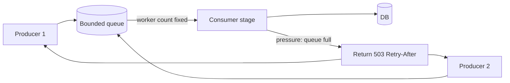

# Backpressure / Load Shedding

## 1. One-Line Definition
Backpressure is the mechanism by which a slow or overloaded component tells its producers to slow down or shed work, so the whole pipeline degrades gracefully instead of buffering into collapse.

## 2. Why Do We Need It?
In any producer-consumer chain, throughput is bounded by the slowest stage. If producers keep blasting work into a slower consumer, one of three things quietly fails: buffers grow unbounded (memory death), queues process with ever-growing latency (freshness death), or retries multiply until everything is retrying everything (cascade death). Backpressure makes the speed mismatch explicit and bounded before any of those deaths happen.

## 3. Simple Intuition
A busy kitchen with one cook and a bell for the next dish. If the waiters keep shouting orders no matter how backed up the cook is, the kitchen fills with incongruous tickets and every dish comes out cold. The cook's whistle — "no more orders until I clear the pass" — is backpressure: cheap, immediate, honest.

## 4. What Happens Without It?
Buffers balloon and latency balloons with them; "requests" spend their whole lifetime queued instead of served. When the buffer finally overflows, you usually trade *slow and working* for *fast and failing* all at once — and what could have been a slow-then-fine experience becomes a full rejection at the worst moment. Worse, downstream retries go from mild to cascading as timeouts fire.

## 5. Core Idea
- **The chain view:** every stage has capacity; the strongest backpressure signals are the earliest (producers feel it before consumers topple). Queues are buffers, not sinks — a bounded queue plus a reject policy is backpressure in practice.
- **Bound the buffer, then reject:** finite queues + explicit failures (`503`, `Retry-After`, queue-full errors) beat unbounded ones; rejection communicates "not now" instead of silently degrading.
- **Feedback directions:** *flow control* (peer-to-peer: TCP window style — send as much as the receiver accepts) and *synchronous drain* (do not fetch work until prior work is committed — the reactive-streams "pull" model).
- **Load shedding is the sibling:** when backpressure arrives too late, shed cheaply (drop non-critical work, serve degraded/cached answers) rather than fail the essential path — see [[overload-protection|Overload Protection]] and [[graceful-degradation|Graceful Degradation]].
- **Windows you actually control:** client request rates, batch sizes, queue depths, worker counts, per-stage concurrency — pick which stage applies pressure.

## 6. Important Terminology

| Term | Simple Meaning |
|------|----------------|
| Backpressure | Downstream tells upstream to slow down |
| Bounded buffer | Queue with a hard capacity limit |
| Load shedding | Actively dropping work under pressure |
| Flow control | Peer-to-peer pacing of work transmission |
| Pull model | Consumer requests work only when ready |
| Admission control | Gate requests at the entry before queues |
| 503 Retry-After | Explicit "come back later" signal |
| Cascade / retry storm | Uncontrolled re-sends amplifying overload |

## 7. Basic Architecture



## 8. Request or Data Flow
1. Producers submit work to a bounded queue.
2. The consumer stage pulls at its own speed (fixed worker count), never accepting more than it can finish.
3. When the queue is full, admission rejects new work with an explicit `503 + Retry-After` rather than growing the buffer.
4. Producers honor the signal: pause, back off, or shed the least-important work.
5. Everyone reverts to normal throughput as the slow stage recovers.

## 9. Practical Example
**Video upload pipeline (assumptions):** transcoding is 10x slower than ingest.
- Ingest pushes videos onto a bounded transcode queue (say 10,000).
- If encoders can't keep up long enough to fill it, ingest starts rejecting or spills to a slower-path bucket instead of buffering memory away.
- Downloads decoupled: users see "processing" without the ingest path stalling — the queue is the pressure valve, the 503 is the honesty.

## 10. Scaling
- **What breaks:** unbounded queues, a consumer whose workers compete for one slow dependency, and producer-side retries that double the incoming rate (see [[retry-and-timeout|Retry and Timeout]]).
- **What to do:** 1) bound every internal queue; 2) scale consumers with the honest signal (watch consumer-lag analog: queue depth is a health metric, see [[consumer-lag|Consumer Lag]]); 3) make producers observably rate-aware (backoff + jitter); 4) shed the cheapest work first.
- **Across tiers:** backpressure at one hop is not enough — a deep async hop (Kafka) absorbs bursts; a synchronous hop (HTTP) needs explicit 503s; identify where each lives.

## 11. Reliability and Failure Scenarios

| Failure | What Happens | Detection | Recovery | Trade-off |
|---------|--------------|-----------|----------|-----------|
| Consumer slows | Queue grows | Queue-depth metric | Scale workers or shed | latency vs loss |
| Unbounded buffer | Memory death | OOM / GC strain | Bound it now | drop rate |
| Retry storm | Queue floods itself | Repeat-request rate | Backoff + jitter + circuit breaker | recovery speed |
| Reject-all at full | Drop rate spikes | 503 rate | Add capacity or shed precedence | availability vs loss |
| Stuck consumer | Zero progress, full queue | Freshness/age of head | Drain/fail the stuck item | wasted work |

## 12. Consistency and Correctness
Backpressure interacts with at-least-once semantics: if work is rejected by 503 or dropped after N retries, that's a *loss* by design but it must never be a silent one. Log the drop, track shed counters, and make dropped work retryable-and-idempotent (see [[idempotency|Idempotency]]) so recovery doesn't duplicate side effects. Ordering: a pull model preserves per-producer order better than a flood; where ordering matters, page exactly one-stage-at-a-time.

## 13. Performance
- The fundamental trade is throughput vs latency under stress: backpressure *chooses* to lower throughput to hold latency and memory bounded, and it does it fast (signals propagate in RTTs, not in buffer-crack times).
- Bounded-queue rejection turns a memory death (catastrophic, nonmonotonic) into a clean 503 (bounded, monitorable) — the performance tax is the shed fraction, which you can watch.
- Synchronous drain and flow control add small handshake overhead per item in exchange for never being surprised.

## 14. Security
- 503s and error surfaces can leak internal queue positions (put generic messages out; keep metrics internal).
- A capacity-limit rejection surface is a natural DoS amplifier: an attacker flooding to trigger 503s both degrades the service and reveals exact capacity — rate-limit the rejection path itself ([[rate-limiter|Rate Limiter]]).

## 15. Trade-Offs

| Mechanism | Advantages | Disadvantages | When to Use |
|-----------|------------|---------------|-------------|
| Bounded queue + reject | Simple, bounded memory | Drops when full | Any sync/async boundary |
| Flow control (TCP-window style) | Lossless pacing | Requires peer cooperation | Long-lived transport |
| Pull model (reactive streams) | Consumer never over-accepts | Backpressure latency, complexity | Streams, actors, reactive stacks |
| 503 + Retry-After | Explicit, resumable | Retry churn if honored naively | HTTP APIs under load |
| Load shedding | Protects the critical path | Losses acceptable work | Peak handling, [[overload-protection|Overload Protection]] |

## 16. Common Mistakes
- Unbounded queues "to avoid losing anything" — you exchange a drop for a memory meltdown.
- 503s without Retry-After or without producer backoff — the 503 becomes the new avalanche.
- Ignoring multi-hop truth: pressure absorbed all the way down, released all the way back up.
- Scheduling nothing to shed — when the moment arrives, everything matters and nothing gets saved.
- Confusing backpressure with a mere error code; it's a *system* of bounded queues plus signals plus producer semantics.

## 17. HLD vs LLD Boundary
HLD: which stages bound their buffers, who applies pressure, reject vs shed policy (load-shedding — planned concept), queue depths, where 503s are emitted, coupling to autoscaling. LLD: the queue's hard capacity constant, the admission-check code path, worker-count configuration, Retry-After values, per-stage backoff formulas.

## 18. Interview Questions

### Beginner
- What is backpressure in one sentence?
- Why is an unbounded queue not "safe from loss"?

### Intermediate
- Diagram a producer-consumer pipeline tight with a slow consumer — where does pressure surface and what do you bound first?
- Why do retries make overload worse, and what do client and server each do?

### Advanced
- Design the pressure points for a Kafka-pipeline with a lagging consumer group (see [[consumer-lag|Consumer Lag]]).
- How do you prevent backpressure rejection from becoming a retry-storm amplifier?

## 19. Interview Memory Summary

> [!abstract]- Interview Memory Summary

### Remember

- Downstream to upstream: "slow down" is backpressure.
- Bound every buffer; the reject policy is the boundary.
- Shed cheap work first; protect the critical path.
- 503 + Retry-After only works if producers honor it (backoff, not blind resend).
- Retry storms multiply the problem — tame with backoff, jitter, circuit breakers.

### 30-Second Explanation

Every stage has capacity; the honest architecture bounds that with finite queues and explicit rejections. When a consumer slows, upstream stops: producers get 503+Retry-After (or flow-control/pull semantics) rather than filling memory, and the pipeline sheds the cheapest work first. The result is bounded latency and memory under stress — degradation by design, not collapse.

### Interview Traps

- Claiming an unbounded queue prevents loss — it converts loss into a memory death.
- Treating 503 as a fix without producer backoff and Retry-After honor.
- Forgetting that pressure must propagate hop-by-hop, not stay at one stage.
- No shedding plan: at stress, everything is mission-critical and nothing gets saved.

### Key Trade-Off

Backpressure exchanges controlled work-loss or latency for boundedness and predictability: at the cost of dropping or deferring work when queues fill, you get stable memory, monotone degradation, and a service that survives rather than melting.

## 20. Related Concepts

### Prerequisites

- [[message-queue|Message Queue]] — where backpressure most often lives.
- [[latency-vs-throughput|Latency and Throughput]] — the metric trade backpressure manages.

### Commonly Used Together

- [[overload-protection|Overload Protection]] — admission control and shedding alongside backpressure.
- [[graceful-degradation|Graceful Degradation]] — what to keep serving when you shed.
- [[circuit-breaker|Circuit Breaker]] — trip the problematic dependency rather than queue into it.
- [[rate-limiter|Rate Limiter]] — the producer-facing gate that complements consumer pressure.

### Alternatives

- [[consumer-lag|Consumer Lag]] — the async-queue analog where lag is the backpressure indicator.
- [[retry-and-timeout|Retry and Timeout]] — the client discipline that stops blasting when backpressure talks.

### Advanced Concepts

- [[adversarial-reliability|Adversarial Reliability]] — hostile overload is backpressure at its most extreme.
- [[tail-latency|Predictable Tail Latency]] — what unbounded queues quietly ruin.

Related planned topics (not authored yet): `load-shedding` and `bulkhead` (reliability deep-dives), `producer-consumer`.

## 21. References
Kleppmann (Designing Data-Intensive Applications) ch. 11 — stream processing and backpressure; Reactive Streams and TCP flow-control RFC 9293 concepts; SRE book loading/chapter on overload handling. Verify with current streaming library docs.

## 22. Active Recall

> [!question]- In one sentence, what is backpressure?
> A mechanism where the slower component tells the faster one — "no more work right now" — so speed mismatches surface as explicit, bounded signals (queue full, retry-after) instead of silent buffer and memory collapse.

> [!question]- Why is an unbounded queue actually a time bomb, not a safety net?
> It looks lossless but grows without limit: memory saturates, latency compounds, and when it finally overflows you lose *everything currently queued* and any ordering it carried — exchanging controlled drops for a catastrophic one.

> [!question]- Trade-off: why does a 503 all-by-itself make overload worse?
> Without backoff and Retry-After, every 503 triggers immediate re-sends, which pad the queue right back to full — a retry storm that keeps the system maximally loaded. The 503 is only honest as a *signal*; honoring it (backoff, jitter, shedding) is what makes it backpressure, not noise.

> [!question]- Failure scenario: a pipeline with an async Kafka hop and a sync HTTP hop — where do the two kinds of pressure surface differently?
> The Kafka hop absorbs bursts deep into the queue; the backpressure signal there is consumer lag and queue depth, not drops. The HTTP hop must reject early (admission + 503) because synchronous queues can't drain invisibly. Design both pressures to be monotone so the combined system degrades predictably.

> [!question]- Interview scenario: your ingest-to-transcode pipeline stalls every Friday at quota-time spike. Walk the fix, in order.
> 1. Bound the transcode queue and watch depth. 2. Add admission control so queue-full returns 503+Retry-After instead of buffering. 3. Make the encoder stage's worker count the pacemaker. 4. Shed the cheapest work first (thumbnail/fast-tier) to protect originals. 5. Teach producers exponential backoff + jitter so they slacken, not hammer.

> [!question]- What is the pull model, and why does it make backpressure structural rather than reactive?
> A consumer requests work only when it can commit previous work — no queue to fill at all. Pressure is structural: the producer literally cannot out-run the consumer's pull window. It costs complexity and handshake latency per item, and is why reactive streams choose it for correctness-sensitive pipelines.

## 23. When Should I Use This?

### Use it when

- A producer's rate can exceed a consumer's sustainable throughput (the normal case for any pipeline).
- Bounded memory and predictable latency under load are requirements.
- Failure must degrade as explicit rejection, not silent buffering.
- Async hops already exist — give them a depth signal (lag/queue metrics).

### Avoid it when

- Producers can't be trusted to honor the signal and there's no admission layer to enforce it.
- The workload is naturally flat and any queue depth is negligible.
- Rejection is worse than buffering for your domain (e.g., ordering-guaranteed financial writes where drops are catastrophic — then you need *durable* unbounded or spill-to-disk semantics, not blind rejection).

### What problem does it solve?

It stops speed mismatch from becoming collapse: producers feel the slow stage, buffers stay bounded, latency stays monotone, and overload turns into a clean, monitorable rejection rather than a memory meltdown.

### What problem does it NOT solve?

It does not create capacity (a slow consumer stays slow without scaling or shedding), does not make dropped work safe (that takes idempotency and retry discipline), and cannot paper over a genuinely bad dependency — those still need autoscaling, shedding, and circuit breakers.

## 24. Decision Connections

Decisions that go together with backpressure:

- [[overload-protection|Overload Protection]] — admission control and load shedding are backpressure's enforcement arm.
- [[graceful-degradation|Graceful Degradation]] — what to keep serving when pressure forces shedding.
- [[circuit-breaker|Circuit Breaker]] — fails fast on a broken dependency instead of queuing into it.
- [[rate-limiter|Rate Limiter]] — the producer face of the same coin.
- [[consumer-lag|Consumer Lag]] — the async-queue pressure indicator.
- [[retry-and-timeout|Retry and Timeout]] — producer discipline that makes 503s useful.
- [[autoscaling|Autoscaling]] — the capacity reaction backpressure is meant to buy time for.

Decision tree:

```
Producer can out-pace consumer?
    |
    +-- Flat workload, no mismatch?  → skip; nothing to apply pressure to
    |
    +-- Mismatch exists (the usual case)?
    |      → [[backpressure|Backpressure]]
    |         |
    |         +-- Buffers grow if untouched?       → bound them + reject policy
    |         +-- Peer-to-peer long-lived?         → flow control / pull model
    |         +-- HTTP boundary, producers remote? → 503 + Retry-After + producer backoff
    |         +-- Even with bounding, overwhelmed? → shed cheapest work, degrade others
    |
    +-- Dependencies are broken, not just slow?
           → [[circuit-breaker|Circuit Breaker]] before pressure even arrives
```