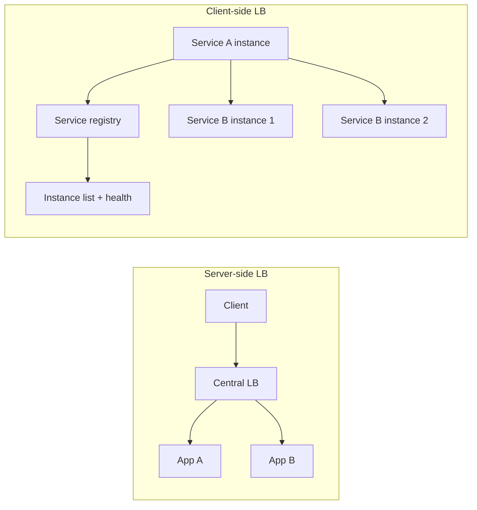

# Client-Side vs Server-Side LB

## 1. One-Line Definition
Server-side load balancing puts a central balancer (or sidecar) between clients and backends, while client-side load balancing embeds selection logic in the client itself through a service registry and a choice of algorithm.

## 2. Why Do We Need It?
Every distributed system needs someone to answer "which instance should handle this call?" Server-side LB centralizes that answer (no client awareness), while client-side LB removes the central hop (lower latency, no proxy SPOF) for high-throughput internal service calls like microservices. Choosing the right side decides your architecture's fan-out latency, failure surface, and coupling.

## 3. Simple Intuition
Two ways to staff a call center: one receptionist (server-side) routes each caller to an agent — callers only know one number. Or every caller knows the working agent list and picks someone directly (client-side) — no receptionist, but callers must keep their lists up to date and shuffle them themselves.

## 4. What Happens Without It?
Think of a microservices call graph: Service A calls Service B, which has 20 replicas. Without someone choosing a replica, A either hard-codes one instance (that instance is a SPOF and saturates), or every call goes through a central proxy that becomes a hop, a bottleneck, and a failover liability. Neither scales with east-west traffic.

## 5. Core Idea
- **Server-side:** a central component ([[reverse-proxy|Reverse Proxy]], LB, Kubernetes Service, mesh sidecar) owns the pool, runs [[health-checks|Health Checks]], and picks a target for the client. The client is dumb.
- **Client-side:** a client library contacts [[service-discovery|Service Discovery]] for the live instance list, applies weights or least-connections or consistent hash, and dials a target directly. The client is smart.
- **The difference is ownership:** who keeps the node list, who runs health checks, where retry and failover logic lives, and who pays for the extra network hop.
- **Forms of client-side:** DNS round robin (crude), a service mesh sidecar, published client stacks and protocol-native resolvers (for gRPC, Finagle-style libraries).
- **Mesh hybrid:** sidecar proxies put the balancing *beside* the client — logical server-side thinking, deployed client-side near the caller.

## 6. Important Terminology

| Term | Simple Meaning |
|------|----------------|
| Server-side LB | Front-tier balancer owning the whole pool |
| Client-side LB | Caller picks a replica via a registry |
| Service registry | System of record for live instances |
| Sidecar / mesh proxy | LB logic co-located with the caller |
| Sticky / affinity | Requirement that a client lands on one instance |
| Round robin | Client or server iterates the instance list |
| Least connections | Pick the least-busy instance |
| North-south vs east-west | User-to-app vs service-to-service traffic |

## 7. Basic Architecture



## 8. Request or Data Flow
Server-side: client → LB (single VIP), the LB picks a healthy backend, forwards, and replies through the LB. Client-side: each service registers at startup; callers pull the live list; on a call the caller sees healthy options, chooses via its algorithm, and dials a replica directly — retrying the next replica on failure.

## 9. Practical Example
**Microservice checkout (assumptions):** the payments service runs 30 replicas.
- Externally: an L7 API gateway (server-side) fronts the payments pool for browser and mobile clients — one public endpoint, TLS, WAF (see [[api-gateway|API Gateway]]).
- Internally: the cart service calls payments via its published gRPC client, which pulls the replica list from the registry and load-balances with least-connections — no gateway in the hop.
- Result: north-south traffic is centralized and secure; east-west traffic avoids an extra proxy hop and a shared SPOF.

## 10. Scaling
- **Server-side scaling:** the LB is the scaling target; its connection count and TLS CPU are the practical ceiling — run LBs in pairs, split by path or service.
- **Client-side scaling:** every client re-queries the registry on churn; the registry becomes the coordination hot path — cache aggressively, refresh asynchronously, and expect the fleet to rebalance within refresh windows.
- **Registry-backed pools:** adding instances requires them to register; monitor healthy-count versus expected to catch registration bugs.
- **Composition:** both compose — client-side picks a zone's gateway, the gateway picks the node.

## 11. Reliability and Failure Scenarios
- **Central LB dies:** every client behind it loses the route (mitigate with [[load-balancer-failover|Load Balancer Failover]]).
- **Client-side stale list:** a caller holds a dead replica and keeps failing — registry TTL plus per-request failover to the next replica fixes it.
- **Registry partition:** clients split on who is live; stale-but-working views usually beat a dead connectivity probe.
- **Retry storm:** client-side retries after a partial failure can hammer one replica — backoff + jitter and circuit-breaking discipline (see [[circuit-breaker|Circuit Breaker]]).

## 12. Consistency and Correctness
The node list is a distributed cache: registry writes are near-immediate, but replicas observe them asynchronously — a caller may route to an instance that just died, and a dying instance may still receive traffic. Design for idempotency on the callee and fail-fast-to-next on the caller so stale views degrade gracefully rather than error.

## 13. Performance
- Client-side saves one network hop (client → proxy → replica becomes client → replica), which wins strict latency budgets — but only when the caller and registry agree on health, otherwise wasted connect attempts erode the gain.
- Server-side wins on administration: one place for HA, load shed, TLS, observability; you pay the hop and the proxy's connection and TLS CPU.

## 14. Security
- Server-side centralizes the security edge — one place for TLS termination, WAF, auth, and hiding internal topology from the internet.
- Client-side must not leak internals externally: only internal callers should read the registry; expose everything north-south through a gateway or LB so backends stay unreachable from outside.

## 15. Trade-Offs

| Choice | Advantages | Disadvantages | When to Use |
|--------|------------|---------------|-------------|
| Server-side LB | Simple clients, central ops, security edge | Extra hop, proxy SPOF and ceiling | North-south, public APIs |
| Client-side LB | No hop, no proxy SPOF, fast retries | Registry coupling, smarter clients | East-west, microservices, strict latency |
| Mesh sidecar | Uniform retries, mTLS, observability | Per-pod proxy overhead, platform cost | Enterprises standardizing east-west |
| DNS round robin | Zero code | Coarse, no health awareness | Coarse spread only |

Server-side is the default for anything facing users; client-side (or sidecar) is the norm for interior service calls.

## 16. Common Mistakes
- Server-side-only thinking for east-west calls — the extra proxy hop on every internal call inflates P99 latency.
- Forgetting the registry when going client-side — a hard-coded list is client-side balancing that rots as nodes churn.
- Treating the central LB as infinitely scalable (connection count and TLS CPU are the real ceiling).
- No fail-back on client-side pools: callers give up after one whole-set failure instead of retrying the next replica.
- Mixing north-south and east-west policies with no naming of which side currently owns which traffic.

## 17. HLD vs LLD Boundary
HLD: which side owns balancing per traffic class, registry design, LB redundancy, registry cache and TTL, retry policy. LLD: the resolver callback hooks, algorithm wiring in the client stack, registration code in a service, LB config files.

## 18. Interview Questions

### Beginner
- What is the difference between client-side and server-side load balancing?
- When would you never use client-side balancing?

### Intermediate
- Diagram a two-service call graph: where does the registry sit and who updates it?
- A replica dies during client-side balancing — what happens to in-flight calls?

### Advanced
- Design registry health propagation for a 500-replica service across three zones.
- When is a service mesh "client-side" and when is it "server-side"? Justify.

## 19. Interview Memory Summary

> [!abstract]- Interview Memory Summary

### Remember

- Server-side: one balancer in front; client-side: the client picks via a registry.
- Public north-south traffic → server-side (gateway/LB); interior east-west → client-side or sidecar.
- Client-side costs coherence: registry + TTL + stale-list behavior + fail-fast.
- Server-side costs a hop and a proxy SPOF; it needs its own failover.
- Never hard-code replicas in any client — route through a registry or a balancer.

### 30-Second Explanation

Decide who owns the instance list: a central balancer (server-side, for public north-south traffic — simple and secure but a hop and a SPOF) or the caller itself polling a service registry (client-side, for east-west microservice calls — no extra hop, but needs health-aware lists and fail-fast logic). Mesh sidecars move the balancer into the caller's pod to get both.

### Interview Traps

- Claiming one hop is always worse without counting the registry cost.
- Ignoring stale node lists in client-side designs — that is the real failure mode.
- Forgetting a central LB needs its own redundancy (it is a SPOF).
- Blurring "sidecar" into either camp without defining the logical owner.

### Key Trade-Off

Client-side balancing removes a network hop and a central SPOF but shifts correctness to a cached registry; server-side balancing centralizes ops and security at the price of a hop and a failoverable balancer.

## 20. Related Concepts

### Prerequisites

- [[service-discovery|Service Discovery]] — the registry that makes client-side pools possible.
- [[load-balancing|Load Balancing]] — the algorithms and L4/L7 ideas both sides use.

### Commonly Used Together

- [[reverse-proxy|Reverse Proxy]] — the usual server-side balancer with TLS and WAF duties.
- [[api-gateway|API Gateway]] — north-south server-side balancing plus auth and routing.
- [[health-checks|Health Checks]] — the feed that keeps either side's pool honest.

### Alternatives

- [[dns-load-balancing|DNS Load Balancing]] (crude "client-side" naming of servers)
- [[consistent-hashing-load-balancing|Consistent Hashing Load Balancing]] (deterministic client-side selection for cache and sharded backends)

### Advanced Concepts

- [[microservices|Microservices]] — where the east-west vs north-south split is most acute.
- [[service-mesh|Service Mesh]] — sidecar balancing and mTLS as a platform.

Related planned topics (not authored yet): `forward-proxy` for the analogous server-side naming.

## 21. References
gRPC name resolution and load-balancing documentation, Finagle and defunct netflix/ribbon client-side balancing docs, Kubernetes Service and Istio or Envoy sidecar docs. Verify resolver and registry behavior against current docs.

## 22. Active Recall

> [!question]- What is the single decision that separates client-side from server-side LB?
> Who owns the live instance list and picks the target. Server-side: a central balancer owns the pool and health. Client-side: the caller pulls the list from a service registry and applies an algorithm itself — no proxy in the middle.

> [!question]- When does client-side balancing actually save the most latency?
> East-west traffic inside a microservice graph: every interior call that goes through a central gateway or proxy pays an extra network hop and the proxy's processing. Dialing replicas directly removes that hop — but only while the caller's registry view stays fresh.

> [!question]- Trade-off: what does a mesh sidecar give you vs a raw central LB?
> A sidecar is a proxy beside the client: balancing logic sits logically "server-side" but runs locally, near the caller. It removes the shared SPOF hop while keeping a uniform control surface for retries, mTLS, and observability — at the cost of a per-pod proxy.

> [!question]- Failure scenario: a client-side pool holds a deregistered replica. Walk it.
> The caller holds a stale cached list (registry refresh TTL). It dials the dead replica, gets a connection failure, and must fail-fast to the next healthy replica from its list; the registry re-verifies and the next refresh prunes the entry. This is why registries need push plus TTL and callers need quick fail-over logic.

> [!question]- Interview scenario: design load balancing for a payments microservice across three zones.
> North-south: an L7 gateway (server-side) in each zone, backed by an LB pair (see [[load-balancer-failover|Load Balancer Failover]]). East-west: callers use client-side resolvers reading a multi-AZ registry; prefer the same zone for latency, apply least-connections or consistent hashing, and fail over within the zone before crossing.

> [!question]- What problem does server-side LB solve that client-side cannot?
> Total client simplicity plus a single resistance point for the security edge — TLS, WAF, auth, and rate limiting live in one place the clients never need to know exists. Client-side balancing solves the opposite problem: maximum call efficiency when clients can be trusted and updated.

## 23. When Should I Use This?

### Use it when

- Public-facing north-south traffic needs centralization, TLS, WAF, and health-aware fan-out.
- Microservices talk to each other at high QPS with a strict latency budget.
- Internal replicas must be opaque and reachable only via a registry or gateway.
- You want a uniform retry, mTLS, and observability story across services (mesh sidecars).

### Avoid it when

- A single instance has headroom — client-side machinery outweighs the need.
- Clients are untrusted or cannot be updated — keep balancing server-side.
- You need a central audit point for every call — server-side is the answer.
- You cannot run a reliable registry — client-side pooling decays without one.

### What problem does it solve?

It decides, per traffic class, who routes a call to a healthy replica: a central balancer (simple, secure, hop cost) or the caller via a registry (low latency, no central SPOF). Both are the mechanism that turns N replicas into a routable service without hard-coding IPs anywhere.

### What problem does it NOT solve?

Neither side removes the need for [[health-checks|Health Checks]] — either pool must learn health through probes or passing traffic. Client-side does not solve registry inconsistency (it introduces it), and server-side does not remove the balancer SPOF (it just concentrates it and requires failover).

## 24. Decision Connections

Decisions that go together with client-side vs server-side LB:

- [[load-balancing|Load Balancing]] — the L4/L7 algorithms both models rest on.
- [[service-discovery|Service Discovery]] — required for any client-side model; the registry is the system of record.
- [[reverse-proxy|Reverse Proxy]] — what a server-side balancer usually is in production.
- [[api-gateway|API Gateway]] — the north-south front door that should stay server-side.
- [[service-mesh|Service Mesh]] — the hybrid that puts balancers beside every caller.
- [[health-checks|Health Checks]] — the shared feed both sides consume.
- [[circuit-breaker|Circuit Breaker]] — protects whichever side initiates retries.

Decision tree:

```
Which service class is being balanced?
    |
    +-- Public or untrusted clients?
    |      → server-side: [[reverse-proxy|Reverse Proxy]] or [[load-balancing|Load Balancing]] in front
    |         |
    |         +-- Need auth, TLS, routing, WAF? → [[api-gateway|API Gateway]]
    |
    +-- Internal east-west calls (trusted, latency-sensitive)?
    |      → client-side via [[service-discovery|Service Discovery]]
    |         |
    |         +-- Fleet is large and standardized? → [[service-mesh|Service Mesh]] sidecars
    |         +-- Small fleet, library is enough?  → direct client-side LB
    |
    +-- Need health pruning in either model?
           → [[health-checks|Health Checks]] feed the pool
```