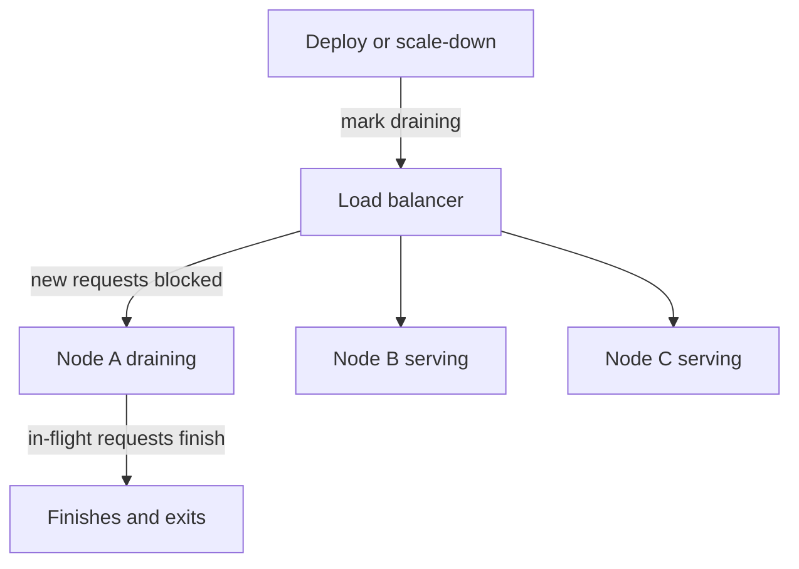

# Connection Draining

## 1. One-Line Definition
Connection draining stops a load balancer from sending new requests to a node while letting the already in-flight work finish, so the node can be removed for deploy or scale-down without dropping a single request.

## 2. Why Do We Need It?
A node being taken down is rarely requesting nothing: in-flight requests, open WebSockets, long polls, or queued async work may still need seconds to finish. Removing it abruptly cuts those requests, and clients perceive every cut as a failure — dropped uploads, lost chat messages, corrupted writes. Draining is the ritual that turns "kill this node" into "stop feeding it, then let it go" with zero user impact.

## 3. Simple Intuition
Leaving a checkout aisle open to the queue but locking the register closed: the cashier finishes serving the customers already standing there (in-flight), then walks away; nobody else may join the line. A lane that just flips its sign off without handling the current customer strands them mid-purchase.

## 4. What Happens Without It?
Deployments and scale-downs become rolling outages: a dropped in-flight payment, a half-written record, a torn WebSocket — plus retries that refire the same broken request and inject duplicates. As fleets get bigger and deploys more frequent, the aggregate user-facing error rate rises with every deploy and every autoscaling event.

## 5. Core Idea
- **Two phases:** stop *new* connections, wait for *in-flight* ones, then remove. The drain window is how long you're willing to wait for the tail.
- **Where it lives:** the LB pool (deregistration delay), the orchestrator (termination grace period), and the service itself (graceful shutdown: stop accepting, finish workers, then exit).
- **Drain and health interlock:** a node marked draining is the same withdrawer that failed [[health-checks|Health Checks]] or a deploy — health removes it from the pool, drain handles the hand-off.
- **Enforcement:** hard cutoffs (process exit, LB timeout) bound the wait; the drain period is a deadline, not an indefinite hold.
- **Variants:** connection draining for in-flight HTTP; deregistration delay for AWS-style targets; termination grace for pods; long-poll/WebSocket-aware closing for streaming services.

## 6. Important Terminology

| Term | Simple Meaning |
|------|----------------|
| Drain | Stop new work, finish in-flight, then leave |
| Drain window | Maximum time a balancer waits for in-flight work |
| Deregistration delay | Configurable drain in managed LBs |
| Graceful shutdown | The app finishes work before exiting |
| In-flight request | A request already accepted, not yet answered |
| New connection | A request arriving after drain begins |
| Termination grace | Pod kill delay in orchestrators |
| Drain hysteresis | Not undoing drain on flapping health |

## 7. Basic Architecture



## 8. Request or Data Flow
1. Someone marks a node for removal: deploy, scale-down, failed health check, manual ops.
2. The LB marks it "draining" — no new connections or new requests (sticky-session new requests also refused).
3. Already-accepted requests in the worker queues run to completion; long-lived connections get a graceful-close notice when the drain window nears its end.
4. After the window (or when the node finishes), the LB completes the removal and the orchestrator terminates the process.
5. Clients retry onto healthy nodes with normal retry behavior ([[retry-and-timeout|Retry and Timeout]]).

## 9. Practical Example
**Rolling deploy of 20 replicas (assumptions):** drain window 60s.
- Each replica is drained for up to 60s; most requests finish in <1s, so the window mostly sleeps as a safety bound.
- A single slow bulk-report endpoint that takes 40s: allowed to finish inside the window.
- A pathological hang would be cut at 60s — bounded tail, no indefinite zombie node.
- Across 20 replicas the deploy takes `20 × (drain + boot)` and drops zero requests.

## 10. Scaling
- **Faster drains:** reduce in-flight lifetime so windows shrink — shorter request timeouts, smaller batches, async tasks decoupled to a queue instead of held in-process.
- **Streams and long-polls:** these reject the "finish in 60s" model — drain must hand off to another node (state in a shared store) or do connection-cooperative close (send a "please reconnect" frame) rather than wait.
- **Autoscaling scale-down:** the same drain applies when capacity shrinks; coordinate with the [[autoscaling|Autoscaling]] controller so a scale-down drains to zero before the LB notices it's empty.
- **Shepherd at scale:** drain many nodes simultaneously but stagger so the rest of the pool never saturates.

## 11. Reliability and Failure Scenarios

| Failure | What Happens | Detection | Recovery | Trade-off |
|---------|--------------|-----------|----------|-----------|
| Hang beyond window | Tail requests cut | Drain timeout | Client retry lands on healthy node | bounded vs lossless |
| Node dies mid-drain | In-flight lost | Connection reset | Retries re-fire (idempotency must hold) | window can't save all |
| Drain window too short | Long requests dropped | Error counts during deploys | Lengthen window or shorten work | stall vs safety |
| Drain and health fight | Node marked healthy again mid-drain | Flap detection | Hysteresis: never un-drain | delayed recovery |
| Sticky sessions re-hijack | Pinned client sends new work post-drain | Connection tracking | Refuse new sticky requests while draining | complexity |

## 12. Consistency and Correctness
Draining is only as safe as what it protects: in-flight work that mutates state must be either completed, idempotent (see [[idempotency|Idempotency]]), or replayable after client retry — a *retried* stuck request is the classic duplicate-write trap. The drain hand-off is a deadline, not a guarantee: if work still runs at window end, clients get retries, and retries must be safe to re-fire.

## 13. Performance
- Draining costs a latency budget, not raw throughput: the window is an upper bound the balancer waits before teardown, so total deploy time ≈ `replicas × (boot + drain_tail)`.
- Long drain windows keep zombie nodes around (holding sockets, memory, rate-limit accounting); short ones risk cutting genuine work. Match the window to your real in-flight p99, not a default.

## 14. Security
- Draining nodes holding secrets or active auth material must finish those before pivot — credentials cleanup on shutdown delivers "nothing sensitive left in memory at exit."
- Drain signals shouldn't be spoofable by clients (internal control plane only).
- Long-tail work during drain may still need auth and quota checks — don't exempt draining traffic from controls.

## 15. Trade-Offs

| Choice | Advantages | Disadvantages | When to Use |
|--------|------------|---------------|-------------|
| Short drain (5-15s) | Fast deploys, few zombies | Drops long requests | Stateless, fast responses |
| Medium drain (30-60s) | Covers normal tails | Deploys slower | Typical mixed HTTP APIs |
| Long drain (minutes) | Cosmetic zero-loss | Zombie nodes, quiet failures | Legacy, slow endpoints |
| No drain (hard kill) | Simplest | Torn requests, retry storms | Dev/non-production only |
| Connection-cooperative close | True lossless for streams | Requires protocol support | WebSockets, long-poll |

## 16. Common Mistakes
- Sizing the drain window against average latency instead of the in-flight p99/p99.9.
- Marking a node drained but forgetting it re-enters the pool on a spurious healthy signal.
- Assumptions that sticky clients stop immediately — sticky sessions keep new work coming until the balancer rejects them (see [[health-checks|Health Checks]] interplay).
- Calling graceful shutdown "draining" without stopping *new* work first.
- Relying on drain as the only safety: a node that dies mid-drain still burns in-flight requests; retries idempotency is the real backstop.

## 17. HLD vs LLD Boundary
HLD: drain window value, what counts as in-flight per workload, staggering across nodes, retry-after-drain policy, how deploy and scale-down invoke it. LLD: the balancer's drain config, graceful-shutdown handler (SIGTERM → stop accepting → finish workers), the LB's in-flight tracking, per-service close-notice implementation.

## 18. Interview Questions

### Beginner
- What does connection draining accomplish, and why doesn't a health check do it?
- What happens to in-flight requests during a drain?

### Intermediate
- A 40-second bulk endpoint fights your 15-second drain — what do you change?
- How do sticky sessions complicate draining?

### Advanced
- Design drain for WebSockets and long-poll endpoints so no message is lost.
- A node dies mid-drain; explain why drain isn't enough and what the real backstop is.

## 19. Interview Memory Summary

> [!abstract]- Interview Memory Summary

### Remember

- Drain = stop new work, finish in-flight, then remove — a deadline, not a hold.
- Interlocks with health checks and orchestrator termination grace.
- Window is sized on in-flight p99, not average latency.
- Sticky sessions keep trying to send new work; the balancer must refuse it.
- Retry idempotency is the true backstop when a drain is cut short.

### 30-Second Explanation

When a node leaves (deploy, scale-down, failure), the balancer stops feeding it new requests, gives in-flight work a bounded window to finish, then removes it; the app cooperates by graceful shutdown. Size the window on the in-flight tail, refuse new sticky-session work while draining, and keep retries idempotent for anything cut by the deadline.

### Interview Traps

- Claiming drain guarantees zero loss — it's a deadline; hard cuts still happen.
- Sizing windows on average latency instead of the tail.
- Ignoring sticky sessions that keep routing new requests in.
- Confusing a graceful shutdown handler with drain (drain stops new work *before* shutdown).

### Key Trade-Off

You trade deploy speed and zombie-node cleanliness for lossless hand-off: a drain window long enough to cover the in-flight tail protects requests but keeps leaving nodes alive longer, so the window is a latency-vs-availability dial you size on real tails.

## 20. Related Concepts

### Prerequisites

- [[load-balancing|Load Balancing]] — draining is one operation of the balancer that owns the pool.
- [[health-checks|Health Checks]] — the detection that decides when a node needs draining out.

### Commonly Used Together

- [[deployment-strategies|Deployment Strategies]] — rolling and blue-green rely on drain for zero-dropped rollouts.
- [[autoscaling|Autoscaling]] — scale-down events drain nodes before removal.
- [[kubernetes-services|Kubernetes Services]] — pod termination grace is the orchestrator-side drain.

### Alternatives

- [[sticky-sessions|Sticky Sessions]] — the affinity feature that makes drain stricter.
- [[load-balancer-failover|Load Balancer Failover]] — draining *into* another balancer during LB-tier failover.

### Advanced Concepts

- [[retry-and-timeout|Retry and Timeout]] — what clients legitimately do when a drain cuts a request.
- [[idempotency|Idempotency]] — makes retried drain-cut work safe to re-fire.

Related planned topics (not authored yet): `rollout-and-canary` deep-dive in deployment; `graceful-shutdown` patterns.

## 21. References
AWS ELB deregistration-delay documentation; Kubernetes termination-grace-period docs; HAProxy graceful shutdown / `disable-server` semantics. Verify current drain knobs with vendor docs.

## 22. Active Recall

> [!question]- What exactly does draining prevent that a health check alone cannot?
> A health check stops future routing, but requests already accepted keep running. Drain handles the transition: no new work, in-flight work finishes, then removal. Without it, already-accepted requests are torn mid-flight on every deploy or scale-down.

> [!question]- Why is the drain window a latency-vs-safety dial and how do you set it?
> Longer windows let slow requests finish (safer) but keep zombie nodes alive holding sockets and memory (worse). Set it from the in-flight p99/p99.9 across your workloads — e.g., 60s if slow bulk endpoints plus p99.9 ≈ 40s with margin — not from average latency.

> [!question]- Failure scenario: your traffic is 90% instant REST and 10% long-poll. Deploys drop the long-poll tails even at 60s. What do you change?
> Don't just widen the window (now even outstanding integration cares). Either move long-poll state to a shared store and hand off, or close cooperatively ("reconnect") so the client retries to a healthy node — that keeps drain short while long-polls survive the transition.

> [!question]- Interview scenario: you must deploy 100 replicas with zero user-visible errors during business hours.
> Send each replica into drain one at a time (stagger so the pool never loses too much capacity), refuse new sticky-session work, let in-flight work finish inside a window sized on the tail, then replace. Scale the group of in-flight replicas so no node carries beyond-drain live work; keep clients' retries idempotent for anything the deadline cuts.

> [!question]- Why does sticky-session traffic complicate draining, and what does the LB have to do?
> Session-pinned clients don't naturally go elsewhere — the balancer must actively refuse new requests for pinned sessions on a draining node, or the session keeps arriving for work on a node about to disappear. It's an extra rule on top of "stop new work."

> [!question]- What is the difference between draining and graceful shutdown, and how do they compose?
> Draining is the balancer's contract (stop new work, wait, remove). Graceful shutdown is the app's contract (on signal, stop accepting, finish workers, exit). They compose: drain stops routing, the app receives the termination signal, finishes its in-flight work, then exits — the balancer's window guards against the app refusing to exit.

## 23. When Should I Use This?

### Use it when

- You deploy frequently and user-visible request cuts are unacceptable.
- Autoscaling shrinks capacity and must not tear open work.
- Endpoints hold long-running requests, streams, or stateful work worth completing.
- Sticky sessions or websockets make clients depend on a specific node's continuation.

### Avoid it when

- Requests are trivially short and clients retry cleanly — the complexity isn't worth it.
- Work cannot ever finish in a bounded window (then hand off or stream-cooperate instead).
- A hard cutoff is already governed by truly idempotent request semantics (drain just delays deploy).

### What problem does it solve?

It removes a node without tearing the work already entrusted to it: new traffic stops, in-flight traffic completes, and clients never see a deploy or scale-down as a failure.

### What problem does it NOT solve?

It cannot save work that outlives the window, cannot heal a node that dies mid-drain, and does nothing about requests that were never handed off — retries and idempotent semantics, not a longer window, are the real safety nets for those cases.

## 24. Decision Connections

Decisions that go together with connection draining:

- [[load-balancing|Load Balancing]] — the pool operation that owns the drain lifecycle.
- [[health-checks|Health Checks]] — decides when a node leaves; drain handles how.
- [[deployment-strategies|Deployment Strategies]] — rolling and blue-green need drained hand-offs per node.
- [[autoscaling|Autoscaling]] — scale-down triggers drain; wasted windows slow scale response.
- [[kubernetes-services|Kubernetes Services]] — orchestrator termination grace parallels drain.
- [[sticky-sessions|Sticky Sessions]] — affinity makes drain stricter; plan refusal of new pinned work.
- [[retry-and-timeout|Retry and Timeout]] and [[idempotency|Idempotency]] — the backstop when a drain window is cut.

Decision tree:

```
Are you removing a node the balancer still feeds?
    |
    +-- Requests are short and idempotent?
    |      → short drain or hard kill is fine
    |
    +-- In-flight work must survive removal?
    |      → [[connection-draining|Connection Draining]]
    |         |
    |         +-- Long-polls or streams?   → cooperative close / shared-state handoff
    |         +-- Sticky sessions present? → refuse new pinned work while draining
    |         +-- Many nodes leaving?      → stagger; respect autoscaler and deploy cadence
    |
    +-- Node dies before the drain finishes?
           → rely on [[idempotency|Idempotency]] and client retry, not a longer window
```