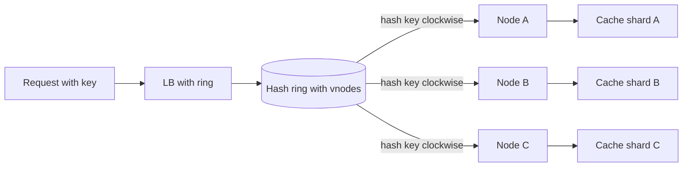

# Consistent Hashing Load Balancing

## 1. One-Line Definition
Consistent hashing load balancing maps each request key (user, IP, tenant) onto a hash ring and assigns it to the nearest owning node, so adding or removing a node only reassigns a small slice of keys instead of reshuffling everything.

## 2. Why Do We Need It?
Plain hash `key mod N` spreads load evenly, but any membership change rewrites nearly every mapping — caches cold-start, stateful sessions land elsewhere, and every request misses at once. Consistent hashing guarantees that when the pool changes, only ~1/N of keys move, which keeps per-node caches warm, sessions pinned enough for correctness, and failover tiny.

## 3. Simple Intuition
A circular birthday chart with server names on the edge. Each person (key) walks clockwise from their own birthday to the first server they meet — that server owns them. Add a new server at a new point on the wheel: only the people between that point and the previous server move. Everyone else stays exactly where they were.

## 4. What Happens Without It?
With `key mod N`, removing one server from a fleet of 20 remaps ~95% of keys to a different node. Behind a [[load-balancing|Load Balancing]] front door this means: caches flush globally, in-memory sessions are orphaned, and one server's maintenance causes a fleet-wide stampede to the database — a self-inflicted outage on top of the original event.

## 5. Core Idea
- **The ring:** keys and nodes hash onto a shared circle; a key maps to the first node clockwise from its hash.
- **Membership change is local:** adding or removing a node only touches keys in that node's arc — ownership moves exactly where the new node sits, nowhere else.
- **Virtual nodes (vnodes):** each physical node claims many labeled points on the ring, giving a statistically even spread and smoothing imbalance when a real node is heavier or lighter.
- **Standing on the classic hashing idea:** the existing [[consistent-hashing|Consistent Hashing]] concept from sharding applies verbatim to load balancing — the key differs (user ID vs shard key) but the math is the same.
- **Costs:** skew from uneven key hashing (hot users for the same node), no adaptivity to actual load (hash ignores live CPU/RPS), and the lookup is an extra O(log N) ring search.

## 6. Important Terminology

| Term | Simple Meaning |
|------|----------------|
| Hash ring | A circle of hash values for nodes and keys |
| Owning node | The ring point a key lands on |
| Vnode | One of many virtual positions per physical node |
| Key churn / movement | Fraction of keys remapped on membership change |
| Skew | Load imbalance from uneven key distribution |
| Rendezvous hashing | Key chooses the node with the best hash score |
| Jump hash | Order-stable hashing ideal for cache sharding |
| Cache affinity | Same key returns to a node with warm data |

## 7. Basic Architecture



## 8. Request or Data Flow
1. Request arrives with a routing key: user ID, session ID, home-country code, or tenant ID.
2. The LB hashes the key onto the ring and walks clockwise to the first vnode it meets.
3. It maps that vnode to a physical node and forwards the request.
4. The node serves from its attached local cache (hit if the key has been warm).
5. On pool change: only keys whose clockwise walk now encounters a different vnode move; the rest keep the same node and stay warm.

## 9. Practical Example
**Video streaming CDN-origin cache pool (assumptions):** 8 edge-cache nodes keyed by video ID.
- Node 7 goes down: consistent hashing remaps only ~1/8 of video IDs to other nodes; 7/8 keep hitting warm caches.
- A new node joins: only its arc's keys move. With 128 vnodes the registration error is tiny and the join spreads load without a fleet-wide flush.
- Compare: `video_id mod 8` would remap 7 of 8 videos on the same event.

## 10. Scaling
- **Add nodes:** only the arc of the new vnodes relocates; load lands mostly on its vicinity unless you re-hash globally (a deliberate rebalancing event).
- **Remove nodes:** the victim's arc is re-owned by neighbors, which can skew those neighbors — another reason for vnodes and for draining before decommission (see [[connection-draining|Connection Draining]]).
- **Uneven key distribution:** a celebrity key still piles onto one node; consistent hashing spreads *membership* evenly but not *peaks* — complement with [[hotspot-handling|Hotspot Handling]] and caches.
- **Weighted nodes:** give heavier machines more vnodes, but track actual load too — hash is placement, not admission.

## 11. Reliability and Failure Scenarios
- **Node failure:** its vnode arc shifts to successors; keys re-warm but availability holds. Pair ring updates with [[health-checks|Health Checks]] so a dead node's arc is re-owned quickly.
- **Hot key on one node:** skew saturates a single successor after a crash — plan vnode density and overflow capacity.
- **Partial ring split (split-brain-ish):** inconsistent membership views in different LBs route the same key to different nodes (breaking affinity) — converge the ring via a shared coordinator (etcd/ZooKeeper-style) or the LB cluster.
- **Flapping:** a node bouncing in and out of health churns its arc repeatedly — enforce hysteresis and drain-before-remove.

## 12. Consistency and Correctness
Consistent hashing is a *placement* decision, not a consistency guarantee: at most it pins a key to a node for the duration of a stable ring. If you rely on it for session affinity, acknowledge the window during which a membership change legitimately moves a session mid-flight; the key itself must be stable (a user-scoped key, not traffic-fluctuating state) for affinity to mean anything.

## 13. Performance
- Lookup is a O(log N) binary search over ring points with the key's hash — nanoseconds to microseconds, far cheaper than a database hit avoided.
- The win is hit-rate economics: warm caches amortize the whole fleet's read load; churn is the enemy and consistent hashing minimizes it.
- Memory cost: the ring table grows with vnode count — thousands of entries are trivial.

## 14. Security
- Key hashing reveals no internals if the ring lives in the LB and backends stay private.
- Hash-flooding attacks: an adversary choosing colliding keys can pin load onto one backend — use keyed hashing or mix in a secret to make collision crafting impractical.
- Never expose ring topology through client-visible responses.

## 15. Trade-Offs

| Choice | Advantages | Disadvantages | When to Use |
|--------|------------|---------------|-------------|
| `key mod N` | Trivial, perfectly even when N fixed | Every change remaps everything | Ephemeral shards that never scale |
| Consistent hash | 1/N churn, affinity preserved | Skew, no load-awareness | Caches, sessions, service pool membership |
| Consistent hash + vnodes | Smooth, weighted spread | More memory, tuning needed | Large fleets, hot pool churn |
| Rendezvous / jump hash | Lowest variance, order-stable | Specialized; not object-affinity friendly | Sharded stores, minimal overlap |

The universal recommendation: consistent hashing where affinity beats evenness; simple mod where the pool never changes.

## 16. Common Mistakes
- Believing consistent hashing is a substitute for [[load-balancing|Load Balancing]] algorithms — it pins keys but never reacts to live load.
- Reading a ring change's remap as "only keys in one vnode's arc" while forgetting successors absorb crashes (spillover skew).
- Using a per-request volatile key for affinity (cache-busting headers, timestamps) — affinity only survives on stable keys.
- Too few vnodes on uneven key populations, or too many on tiny fleets (ring rewrite churn).
- Manually re-hashing the whole fleet on every resize and defeating the entire point.

## 17. HLD vs LLD Boundary
HLD: ring vs mod decision, key selection per routing class, vnode count, weighted membership, membership-change protocol, spillover policy. LLD: the ring hash implementation, vnode assignment mapping, binary-search lookup, the coordinator client code that keeps ring views converging.

## 18. Interview Questions

### Beginner
- How does consistent hashing differ from `key mod N`?
- What does "only 1/N moves" mean concretely for a cache pool?

### Intermediate
- Node 7 of 8 dies — walk the ring's consequence for caches and sessions.
- Why are virtual nodes used, and what imbalance do they smooth?

### Advanced
- Design ring membership convergence for a fleet of LBs (no split ring views).
- Consistent hashing pins keys but not load — how do you handle a celebrity key hammering one node?

## 19. Interview Memory Summary

> [!abstract]- Interview Memory Summary

### Remember

- Hash keys and nodes to the same ring; a key owns the next node clockwise.
- Membership change touches only the changed node's arc — about 1/N of keys.
- Vnodes fix real-world skew and enable weighted membership.
- Affinity is the product: warm caches, surviving sessions, small failover.
- Hash places; it does not balance live load — pair with health checks and hotspot controls.

### 30-Second Explanation

Place each key on a circle where each node (via many vnodes) holds arcs; a request's key walks clockwise to an owner. When the pool changes, only the changed node's arc remaps — roughly 1/N of keys — so caches stay warm and sessions survive. Use it wherever affinity beats perfectly even placement, and accept that it never looks at actual load.

### Interview Traps

- Claiming consistent hashing balances load — it balances placement.
- Forgetting successors absorb a crashed node's arc (spillover hot spots).
- Using unstable keys for affinity, then wondering why affinity vanishes.
- Rewriting the whole ring on every resize.

### Key Trade-Off

You trade perfectly even placement for affinity and tiny churn: ~1/N of keys move per membership change, at the cost of hash skew, spillover on crashes, and zero sensitivity to live load.

## 20. Related Concepts

### Prerequisites

- [[consistent-hashing|Consistent Hashing]] — the core algorithm, taught from the sharding angle.
- [[load-balancing|Load Balancing]] — where this placement algorithm plugs in.

### Commonly Used Together

- [[health-checks|Health Checks]] — decide when a node leaves and its arc re-owns.
- [[connection-draining|Connection Draining]] — evacuate arcs before a node departs.
- [[hotspot-handling|Hotspot Handling]] — counter hash skew from celebrity keys.

### Alternatives

- [[sticky-sessions|Sticky Sessions]] (affinity by cookie instead of by key hash)
- Client-side load balancing (see [[client-side-vs-server-side-lb|Client-Side vs Server-Side LB]])

### Advanced Concepts

- [[sharding|Sharding]] and [[shard-key|Shard Key]] — the same math owning rows instead of requests.
- [[caching|Caching]] — the cache pool this maximizes hit rates for.

Related planned topics (not authored yet): `virtual-nodes` as a dedicated deep-dive, `rendezvous-hashing`.

## 21. References
Karger et al., "Consistent Hashing and Random Trees" (STOC 1997); AWS DynamoDB paper's "Ring with vnodes" section (bigtable-dynamo lineage); open-source ring implementations (HAProxy `balance hash`, nginx consistent hash). Verify current vnode policies in the LB you deploy.

## 22. Active Recall

> [!question]- In one sentence, what does consistent hashing guarantee that plain mod hashing cannot?
> On any membership change only the ~1/N of keys whose ring owner changes actually move, so the other keys keep their node, their cache, and their session — plain `key mod N` would remap almost everything.

> [!question]- Why do virtual nodes exist, and what do they actually fix?
> One point per node makes real key populations skew badly and makes a node's weight untunable. Many vnodes per node smooth the distribution statistically and let a heavy machine claim more points — turning even placement and weighted placement into the same mechanism.

> [!question]- Design decision: you want session affinity AND cache affinity with the same ring. What one condition makes this work?
> A stable, user-scoped key reused by both lease and cache resolution. If the cache keys the same way the session pins, both goals align; if either uses a volatile key, affinity silently breaks and you get two conflicting placements fighting each other.

> [!question]- Failure scenario: 8 cache nodes, one dies, and its successor instantly melts. Diagnose.
> The successor re-owns the dead node's whole arc (spillover) on top of its own share — that is the classic consistent-hash hot successor. Mitigations: enough vnodes to split spillover across several successors, pre-sized headroom, draining before removal, and load-aware overrides (see [[hotspot-handling|Hotspot Handling]]).

> [!question]- Interview scenario: caching layer reviews that thrash the ring on every deploy. What's the plan?
> Separate rebalancing from deploys: add the new cache node, let it warm its arc via existing ingress (or blockhole during warm), then remove the old node's vnodes only after its arc has handed over — gradually adjusting vnode counts rather than bulk-rewriting the ring, and never re-hashing keys globally.

> [!question]- Trade-off: when do you NOT want consistent hashing in front of your services?
> When even placement can't be approximated by any vnode count (a handful of keys dominate) and when affinity buys nothing (stateless fleet, shared distributed cache) — then a load-aware algorithm like least connections serves you better than any hash.

## 23. When Should I Use This?

### Use it when

- Backends hold per-node state worth preserving (local caches, in-memory sessions).
- The pool changes often (scale up/down, rolling deploys) and cache hit rates must survive.
- Sharded or partitioned backends need the same owner per key for co-located operations.
- Membership churn (auto-scaling, spot instances) would otherwise cold-start everything.

### Avoid it when

- Backends are fully stateless with a shared store — any algorithm works; evenness may matter more than affinity.
- A tiny number of keys dominate traffic (hash skew is intractable without other controls).
- You need active load awareness — hash cannot watch CPU or RPS.
- Ring consistency cannot be maintained across all LB nodes (split views break affinity).

### What problem does it solve?

It makes pool membership changes cheap and locally-scoped — a target of ~1/N remap per resize — preserving cache warmth, session survival, and cache-partition ownership across scaling, crash, and deployment events.

### What problem does it NOT solve?

It does not respond to live load, does not guarantee even load (only even placement), does not protect a single celebrity key, and does not provide consistency or ordering — at best it pins a key to a node while the ring is stable.

## 24. Decision Connections

Decisions that go together with consistent hashing load balancing:

- [[consistent-hashing|Consistent Hashing]] — the algorithm this technique applies; know the ring math before reading on.
- [[load-balancing|Load Balancing]] — the L4/L7 family this placement mode belongs to.
- [[health-checks|Health Checks]] — the trigger for arc re-ownership on failure.
- [[connection-draining|Connection Draining]] — the door to evacuate an arc gracefully before removal.
- [[hotspot-handling|Hotspot Handling]] — what to add when hash skew meets real peaks.
- [[sticky-sessions|Sticky Sessions]] — the cookie-style alternative when keys can't be chosen freely.
- [[caching|Caching]] — the workload whose hit rate this optimization exists to protect.

Decision tree:

```
Backend pool changes often and holds per-node state?
    |
    +-- No: fully stateless, shared cache
    |      → plain [[load-balancing|Load Balancing]] algorithms (RR, least connections)
    |
    +-- Yes: want affinity and minimal churn
    |      → [[consistent-hashing-load-balancing|Consistent Hashing Load Balancing]]
    |         |
    |         +-- Real key distribution is skewed?     → add vnodes + weighting
    |         +-- Celebrity keys dominate?             → add [[hotspot-handling|Hotspot Handling]]
    |         +-- Nodes must leave without meltdown?   → [[connection-draining|Connection Draining]]
    |         +-- Ring views must stay converged?      → shared coordinator membership
    |
    +-- Else: affinity that must survive cookies?
           → [[sticky-sessions|Sticky Sessions]]
```