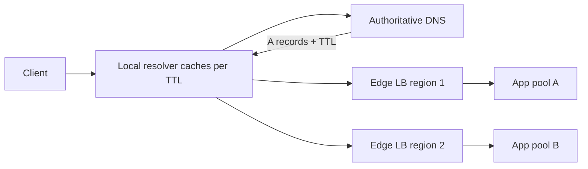

# DNS Load Balancing

## 1. One-Line Definition
DNS load balancing spreads traffic by returning multiple IP addresses (or SRV records) for one hostname and letting resolvers pick one, so load is distributed at the DNS layer before a single request ever reaches a load balancer.

## 2. Why Do We Need It?
Before any L4/L7 load balancer can fan out traffic, clients must first reach that balancer — and the thing that turns a hostname into an IP is DNS. DNS is therefore the **coarsest, cheapest, most global** load-balancing layer: it spreads clients across data centers, across LB pools, and across regions with almost zero infrastructure cost, purely by controlling which IP a resolver returns.

## 3. Simple Intuition
The phone directory for a restaurant chain lists the same name with multiple locations. The caller (resolver) picks one of the listed numbers. If the chain wants to send more callers to the downtown branch, it prints downtown's number first and most often. DNS does this with `A` records: several IPs under one hostname, plus TTLs that decide how long callers remember the number.

## 4. What Happens Without It?
Clients pull a single IP for your service from DNS. That IP is a single spelling of "where the app is" — one LB, one region. You cannot shed load globally, you cannot fail over a region quickly, and a poisoned or stale cached IP keeps a client hammering an endpoint you no longer serve. You lose the ability to steer traffic without touching the applications.

## 5. Core Idea
- **Multiple records, one name:** a hostname resolves to N IPs (round-robin ordering) or weighted sets; resolvers pick one, spreading traffic.
- **TTL as the throttle:** short TTLs (30-120s) let changes propagate fast but push more queries to your authoritative server; long TTLs (300s+) reduce load but keep clients stuck on old answers.
- **Records as knobs:** `A`/`AAAA` for round robin, `SRV` for port + weight (services), weighted `A` sets by order/count, and GeoDNS/Anycast for location-aware steering (see [[geo-dns-anycast|Geo-DNS and Anycast]]).
- **The blind spot:** the DNS layer has **no knowledge of backend health** — a returned IP may point at a dead server. Health is handled by TTL + monitoring, not by DNS itself.
- **Splitting zones:** internal (split-horizon) DNS returns private addresses to your own services; external DNS returns public ones to the internet.

## 6. Important Terminology

| Term | Simple Meaning |
|------|----------------|
| A / AAAA record | Maps hostname to IPv4 / IPv6 |
| SRV record | Hostname + port + weight for a service |
| TTL | How long resolvers cache a DNS answer |
| Resolver / Recursor | The system that answers a client's query |
| Authoritative DNS | The server with the true record set |
| Round robin DNS | Answer order rotates the first IP |
| Weighted DNS | Some IPs returned more often than others |
| GeoDNS | Returns region-appropriate IPs by client location |
| Split-horizon | Different answers for internal vs external queries |

## 7. Basic Architecture



## 8. Request or Data Flow
1. Client asks its local resolver for `api.example.com`.
2. Resolver walks to the authoritative server (caching the path along the way).
3. Authoritative DNS returns multiple `A` records (possibly weighted), with a TTL.
4. Resolver returns one IP to the client and caches the set until TTL expiry.
5. Client connects to that IP — the LB at that address then does real L4/L7 balancing.
6. On TTL expiry the resolver re-queries and may get a different, better IP.

## 9. Practical Example
**Global video service (assumptions):** two regions, public launch.
- `api.example.com` gets `10.1.0.10` and `10.2.0.10` (one LB per region), TTL 60s.
- Launch traffic: 7:3 weight. DNS implementations vary in honoring weights, so you also use a route-53-style latency/Geo policy and anycast as backup.
- An east-coast outage: update DNS to remove that region's IP, wait `TTL + margin`, and traffic shifts to the surviving region.

## 10. Scaling
- **What breaks:** DNS itself doesn't break under normal scale, but reordering means some clients hammer one IP; assigning equal records does **not** split traffic evenly (resolver-think: recursive caches, OS prefs, jitter, ordering per resolver).
- **Steering at scale:** layer GeoDNS on top (region → short record list) and keep the per-region LB for real distribution.
- **Fix skew:** weighted records, per-region pools, and short TTLs for volatile zones; use a dedicated edge LB tier so DNS is the coarse splitter only.
- **Combine:** ride DNS down to "which LB/region", then let L4/L7 load balancing do the fine-grained distribution (see [[load-balancing|Load Balancing]]).

## 11. Reliability and Failure Scenarios

| Failure | What Happens | Detection | Recovery | Trade-off |
|---------|--------------|-----------|----------|-----------|
| Backend dies | DNS still returns its IP | Health checks at LB | LB removes node; DNS updated on TTL | stale cache window |
| Region dies | Clients still resolve dead region IP | Synthetic probes / LB state | Remove/blackhole the IP in DNS | TTL delay |
| Poisoned/stale cache | Client retries dead IP | Trace resolver TTL | Bump TTL down / wait it out | more DNS load |
| Authoritative DNS down | No resolution at all | Monitoring set | Replicate zone (secondary, Anycast) | cost/complexity |
| Weights ignored | Resolver skew loads one IP | Per-IP request counts | Fix with GeoDNS + anycast LB | fewer levers |

## 12. Consistency and Correctness
- **It's a cache, not a contract:** every cached record is a small partition of your traffic that honors a TTL, so DNS changes are **eventually consistent with delay = TTL**. Never assume instantaneous failover.
- **Subset steering:** resolvers and clients deliberately *randomize* among the IPs; you cannot rely on exact ratios — always verify with per-IP telemetry.
- **Start-of-authority edge cases:** short TTLs propagate faster but may steer clients mid-flight; a client already connected to a now-drained IP is unaffected (TCP is per-IP, only new connections move).

## 13. Performance
- DNS overhead per request is negligible even at high QPS (resolvers cache answers and queries are tiny) — most apps never see the authoritative server, only the cached copy.
- Long TTLs are the performance friend: fewer queries, faster local resolution. Short TTLs buy freshness at the price of resolver traffic to your authoritative zone.
- Resolution adds one RTT to the *first* connection (resolver chain); amortize by keeping per-region records and relying on resolver caching.

## 14. Security
- DNS is an attack surface and an availability lever: protect the authoritative zone (DNSSEC signing, access control, DDoS scrubbing), use split-horizon so internals aren't exposed publicly, and never let a public record point directly into your backends — it should land on a hardened LB tier.
- Cache poisoning and spoofed answers can redirect clients; DNSSEC and re-validation of cached records mitigate this.

## 15. Trade-Offs

| Choice | Advantages | Disadvantages | When to Use |
|--------|------------|---------------|-------------|
| Plain round-robin DNS | Zero infra, global spread | No health awareness, uneven weights | Publicly exposed simple endpoints |
| Weighted DNS | Coarse hit ratios | Resolvers ignore exact ratios | Launch ramp, A/B |
| GeoDNS | Region steering, compliance | Depends on IP-based geo, not server load | Global apps |
| Anycast DNS | Fast failover, low latency | Finite IP range, hiding LBs, cost | HA + performance |
| Long TTL | Cheap, cached fast | Slow to steer | Stable, small zones |
| Short TTL | Fast steering, freshness | More queries, less predictable | Rolling changes, DR |

## 16. Common Mistakes
- Using DNS as the *fine-grained* balancer (it only ever splits coarsely; the LB still has to do the real work).
- Believing weights produce exact ratios (resolvers shuffle).
- Forgetting TTL when time-to-failover matters — "we removed the IP but clients still hit it" is a TTL story.
- Returning backend IPs directly instead of LB IPs, exposing internals and skipping health-aware routing.
- No monitoring on the authoritative zone, so the whole name resolvable-lifetime becomes a silent SPOF.

## 17. HLD vs LLD Boundary
HLD: record topology (A vs SRV), weights, TTL policy, Geo/Anycast steering, split-horizon zones, failover plan. LLD: the exact zone file, redirect/record update scripts, resolver configuration, DNSSEC key management.

## 18. Interview Questions

### Beginner
- What does round-robin DNS do, and where does it fall short?
- What is TTL and why does it matter for load balancing?

### Intermediate
- You remove an IP from DNS but traffic still hits it — what is happening and how do you fix it?
- How do GeoDNS and load balancers split responsibilities?

### Advanced
- Design DNS-based failover across two regions with a 60-second detection-to-steering budget.
- Why can't DNS give you even load distribution, and what do you add at each layer to compensate?

## 19. Interview Memory Summary

> [!abstract]- Interview Memory Summary

### Remember

- DNS is the coarse, global, cache-based traffic splitter — LB does the fine work.
- Several records under one name + TTL = distribution with delayed consistency.
- **No health awareness**: DNS happily returns dead IPs; that's the LB's job after connect.
- Weighted records are approximate — resolvers shuffle and cache.
- TTL is your failover clock: changes take TTL + margin to land everywhere.
- Anycast/GeoDNS layer on top for region steering and DR.

### 30-Second Explanation

Put multiple LB IPs under `api.example.com` with a sensible TTL. Resolvers cache and pick among them, spreading clients across regions and LB pools; drop a region's IP away and wait TTL + margin to shift traffic off it, and layer GeoDNS/Anycast for location-aware steering. Never expect exact ratios or instant health-awareness from DNS — keep fine-grained balancing and pruning at the LB tier.

### Interview Traps

- Pretending DNS rebalancing is instant — it is eventual, TTL-bounded.
- Claiming round-robin gives even load (resolver randomness breaks it).
- Routing DNS straight to backends instead of an LB tier.
- Ignoring the authoritative zone as an availability and security surface.

### Key Trade-Off

DNS balancing is free, global, and cache-fast, but it trades control away — it cannot see health, honors TTLs, and only steers coarsely, so you still need an LB tier and short-TTL discipline for real distribution and failover.

## 20. Related Concepts

### Prerequisites

- [[dns|DNS]] — records, resolvers, TTL, the resolution pipeline this technique lives in.
- [[http-and-https|HTTP and HTTPS]] — the protocol that flows after DNS points the client at an IP.

### Commonly Used Together

- [[load-balancing|Load Balancing]] — DNS steers to an LB pool; the LB distributes to nodes.
- [[global-load-balancing|Global Load Balancing]] — the full multi-region steering stack this is the bottom layer of.
- [[geo-dns-anycast|Geo-DNS and Anycast]] — DNS + anycast routing used for regional steering and DR.

### Alternatives

- [[consistent-hashing-load-balancing|Consistent Hashing Load Balancing]] (deterministic server selection instead of resolver randomness)

### Advanced Concepts

- [[regional-failover|Regional Failover]] — what DNS is steering when a region dies.
- [[multi-region-models|Active-Active vs Active-Passive Regions]] — the topology DNS must represent.

Related planned topics (not authored yet): `http-cookies` (cookie-based steering), `forward-proxy` (proxy-based name resolution).

## 21. References
RFC 1034/1035 (DNS), RFC 2782 (SRV). Cloud DNS product docs (Route 53, Cloud DNS, Azure DNS) for weighted and latency policies. Verify current TTL/weighting behavior with vendor docs.

## 22. Active Recall

> [!question]- How does DNS load balance without knowing anything about the backends?
> It returns multiple IPs and lets resolvers pick; the distribution is a side effect of TTL-cached record sets. Backend health is invisible to DNS, so pruning dead nodes stays the LB's job, and failover lag equals the TTL.

> [!question]- You must shift traffic off a region. Walk the sequence.
> Remove (or blackhole) the region's IP in DNS, apply a low TTL beforehand, wait TTL + resolver margin, then monitor per-IP telemetry to confirm steering; keep the surviving region sized for the full load.

> [!question]- Why don't weighted DNS ratios match observation?
> Resolvers randomize among the returned set, OS/application preferences differ, recursive caches re-answer, and weight handling varies by resolver. Weighted records are a rough knob — pair them with per-IP metrics and Geo policies.

> [!question]- Trade-off: long TTL vs short TTL seem opposite — which do you pick?
> Long TTLs (300s+) make resolution cheap and cached and fault-tolerant, but slow both normal change and failover. Short TTLs (30-120s) turn steering knobs into near-real-time levers at the cost of more load on the authoritative zone and less deterministic traffic.

> [!question]- Interview scenario: "our global DNS is down, is the app down?" Walk it.
> Name the surfaces: the authoritative zone (is the name resolvable at all?), the LB tier the records point to (is it healthy? is its IP same in all records?), and shared prod assumptions — DNS is a cache, so even a dead zone keeps serving cached answers until TTLs expire.

> [!question]- Failure scenario: poisoned or stale cache is sending users to a dead IP. What now?
> Detect via resolver/TTL traceroute and per-IP failure metrics; drop TTL to flush faster, blackhole the bad IP, add a honeypot/monitor for the poisoned answer, and verify the source (compromise vs stale). Teach resolvers to re-validate on NXDOMAIN/short TTLs where supported.

## 23. When Should I Use This?

### Use it when

- You serve clients globally and want zero-cost regional splitting.
- You need a rough experience-of-uptime lever for DR before any other tier acts.
- Your service resolves as one hostname and clients don't need server awareness.
- You want a fast, cheap way to point new traffic toward scaled-out capacity.

### Avoid it when

- You need real-time, health-aware, evenly balanced distribution — that's an LB's job.
- Exact load ratios are contractually required (weights are approximate).
- You must fail over faster than your TTL allows (drop to L3/Anycast or LB-level steering).
- Backends are internal only — use split-horizon or service discovery, not public records.

### What problem does it solve?

Clients must reach the right LB pool before the LB can do anything. DNS solves "which LB / which region" globally, at near-zero cost, distributing and failing over traffic by controlling the IP set behind one hostname — with TTL as the propagation clock.

### What problem does it NOT solve?

It does not balance within a region (no health awareness, approximate ratios), cannot fail over faster than the TTL, does not inspect traffic, and is not a substitute for the LB tier or for per-request routing.

## 24. Decision Connections

Decisions that go together with DNS load balancing:

- [[dns|DNS]] — the resolution model (records, resolver cache, TTL) this technique lives in; DNSSEC and zone safety are prerequisites.
- [[load-balancing|Load Balancing]] — DNS chooses the LB pool; the LB chooses the node. Never skip the second hop.
- [[global-load-balancing|Global Load Balancing]] — this is the bottom layer of the multi-region steering stack.
- [[geo-dns-anycast|Geo-DNS and Anycast]] — add anycast/geo policies when plain records can't steer by location or fail over fast.
- [[regional-failover|Regional Failover]] — DNS steering is the first action when a region dies.
- [[multi-region-models|Active-Active vs Active-Passive Regions]] — the topology the records must encode.

Decision tree:

```
Clients resolve one hostname pointing at multiple pools
    |
    +-- Pure global spread, zero infra?
    |      → [[dns-load-balancing|DNS Load Balancing]] (A records + TTL)
    |
    +-- Need location-aware steering or fast region failover?
    |      → [[geo-dns-anycast|Geo-DNS and Anycast]]
    |      → [[global-load-balancing|Global Load Balancing]]
    |
    +-- Need fine-grained per-request distribution and health pruning?
    |      → [[load-balancing|Load Balancing]] (DNS only steers to the pool)
    |
    +-- Backends internal only?
           → [[service-discovery|Service Discovery]] instead of public DNS
```

The last branch references [[service-discovery|Service Discovery]] from 13-deployment-and-infrastructure.