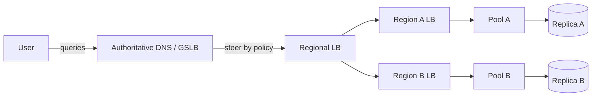

# Global Load Balancing

## 1. One-Line Definition
Global load balancing steers users to the right region's entry point — by geography, latency, weight, or health — using DNS, Anycast, and cross-region LB tools, so a multi-region service is both fault-tolerant and fast wherever the client sits.

## 2. Why Do We Need It?
A single region can hold everything, but physics and risk don't agree: latency grows with distance, and one region is one blast radius. Global load balancing decides *which* region handles a given user — the decision that determines both their latency and whether a single-region outage takes everyone down.

## 3. Simple Intuition
A pizza chain with a kitchen per city. The phone system knows where you're calling from and routes you to the nearest kitchen (latency-based), sends overflow to a sibling kitchen when one is slammed (capacity-aware), and if a kitchen burns down, reroutes all its customers to the next nearest one (failover). The caller never knows a kitchen exists — they dialed one number.

## 4. What Happens Without It?
Clients resolve one global address and hit one entry. Distant users eat cross-continental round trips, a single region is a single point of failure (see [[regional-failover|Regional Failover]]), and there is no way to shift load away from a saturated or failing region — either the whole world is slow or the whole world is down.

## 5. Core Idea
- **The stack of steering:** [[dns-load-balancing|DNS Load Balancing]] (records and TTLs) → [[geo-dns-anycast|Geo-DNS and Anycast]] (location/latency steering) → L7 GSLB on top (weighted, health-aware, branded as traffic management).
- **Steering policies:** geography (fixed region), latency (measure and pick the fastest), weighted (percentage splits, launch ramps), primary/backup (failover), and cell/service-level splits (see [[cell-based-architecture|Cell-Based Architecture]]).
- **Health-gated:** policies are only as good as [[health-checks|Health Checks]] and availability signals feeding them — a region returned for a user but unable to serve is a routing bug.
- **The state question:** cross regional boundaries and state must follow or be externalized — multi-region data sync is the real constraint behind any steering decision ([[cross-region-replication|Cross-Region Replication]], [[multi-region-models|Active-Active vs Active-Passive Regions]]).
- **TTL as governor:** clients cache steering answers; propagation speed and consistency of steering = f(TTL, Anycast convergence).

## 6. Important Terminology

| Term | Simple Meaning |
|------|----------------|
| GSLB | Global server load balancing |
| Steering policy | Rule choosing which region handles a user |
| Latency-based steering | Route to the region with the lowest measured latency |
| Weighted steering | Split traffic ratio across regions |
| Primary/backup | All-in region until it fails, then fall over |
| Health-gated | Only offer regions that pass checks |
| Anycast convergence | Time for routing to settle after a change |
| Cell | An isolated deployable unit regional topologies map onto |

## 7. Basic Architecture



## 8. Request or Data Flow
1. A user's resolver asks for the service name.
2. The GSLB applies its policy (latency probe result, geo map, weight, region health) and returns the IP scope for the chosen region — plus a short TTL.
3. The user connects to that region's LB and is balanced normally within the region.
4. Health/availability telemetry from each region feeds back into the GSLB so the next steering decision prefers live regions.

## 9. Practical Example
**Global video platform (assumptions):** 4 regions, read-heavy.
- Latency-based steering routes the closest region for streaming; write-heavy admin traffic steers to the primary region to keep consistency simple.
- Launch ramp: new region takes 0% → 20% weighted over a week, watching error rates and latency regressions.
- One region's CDN + LB sag: its health signal drops, GSLB shifts weight to neighbors; users re-resolve within TTL and land elsewhere.

## 10. Scaling
- **Cluster scaling:** region entry LBs scale via the local autoscaler ([[autoscaling|Autoscaling]]); GSLB oversees the *set* — adding a region is a policy + DNS + data-sync exercise, not just more nodes.
- **Capacity scaling:** weights should reflect real capacity, not assumptions; feed usage metrics into the policy and reweight as regions grow or shrink.
- **Cell scaling:** every new cell needs an address answer — rather than a host per cell, keep a small count of addressable cells and add via policy.
- **Steering state:** keep steering policy changes fast (short TTL on the steering record) so capacity events react in tens of seconds, not tens of minutes.

## 11. Reliability and Failure Scenarios

| Failure | What Happens | Detection | Recovery | Trade-off |
|---------|--------------|-----------|----------|-----------|
| One region dies | Users steered there fail | Region health probe | GSLB re-steers; TTL waits | failover = TTL + probe |
| Region degrades slowly | Latency climbs, errors mount | Error-rate signal | Down-weight via policy | threshold tuning |
| GSLB/DNS itself fails | No resolution at all | Scrubber/redundancy | Anycast DNS pool | cost |
| State sync lag | Reads served from stale region | Replication lag | Route reads to fresher region | latency |
| Weight miscalc | One region saturated | Capacity metrics | Reweight / add capacity | capacity planning |

## 12. Consistency and Correctness
Global steering is a *location* decision, and location before consistency: reads hitting a laggy replica are only as correct as the replication you accept (see [[replication-lag|Replication Lag]]) — which is why read-heavy steering often tolerates it while write paths pin to a primary region. Any user-visible feature must survive the *steer* changing mid-session (session pinned to a region must either be location-true, or the state must be region-migratable) — pair with [[locality-based-routing|Locality-Based Routing]] expectations.

## 13. Performance
- The win is path optimization: latency-based steering removes cross-continental RTT — often the single biggest latency lever available globally (see [[latency-vs-throughput|Latency and Throughput]]).
- The cost is completed complexity: a DNS lookup + Anycast convergence + health-gated policy becomes the critical path of the first connection; keep TTL short but large enough to amortize query volume.
- Expect per-region tail differences; the GSLB's answer is only as good as the region health signal feeding it.

## 14. Security
- GSLB is a high-value target: attack the steering apparatus and you control where the world lands. Protect the DNS zone (DNSSEC, access control), authenticate steering signals, and do not leak region topology to clients that shouldn't know it.
- DDoS scrubbing at the edge (Anycast) and per-region rate limiting live naturally inside a GSLB topology.

## 15. Trade-Offs

| Choice | Advantages | Disadvantages | When to Use |
|--------|------------|---------------|-------------|
| Latency-based | Best per-user latency | State/read-freshness trade-offs | Streaming, read-heavy |
| Geo | Deterministic, compliance | Rigid, ignores real latency | Data residency rules |
| Weighted | Capacity control, ramps | Manual-ish, needs metrics | Launches, traffic shifts |
| Primary/backup | Simple failover | Idle backup region | Active-passive, DR |
| Cell-based | Isolation, blast radius | Deployment complexity | Large platforms |

## 16. Common Mistakes
- Treating global LB purely as DNS and forgetting it must be *health-aware* — dead regions still get traffic until queries time out.
- Long TTLs on the steering record: an outage costs you TTL-hours of continued mis-steering.
- Latency-based steering for write-heavy paths that violate the freshness you actually need.
- Ignoring state migration — steering users to a region whose data hasn't caught up.
- Single-region "since we can fail over 'at the DNS'" — the DNS itself must be redundant (Anycast + scrub).

## 17. HLD vs LLD Boundary
HLD: policy type per traffic class, TTL strategy, region topology and cells, health-gating inputs, state-sync requirements behind steering, outage runbook. LLD: rule implementations (DNS record sets, GSLB config), latency probe wiring, the health feed's owner, per-region capacity metrics pipeline.

## 18. Interview Questions

### Beginner
- What is global load balancing and how does it differ from 4-region load balancing?
- What steering policies can a GSLB implement?

### Intermediate
- Why does "steer to the nearest region" break for write-heavy workflows?
- Your region dies — walk the exact steering sequence and the TTL cost.

### Advanced
- Design the GSLB inputs (health, latency, capacity) for a 3-region launch ramp with zero observability black holes.
- How do you balance user latency with data-residency constraints and still fail over legally?

## 19. Interview Memory Summary

> [!abstract]- Interview Memory Summary

### Remember

- Global LB steers *which region*, per user — DNS + Anycast + GSLB on top.
- Policies: geo, latency, weights, primary/backup, cells.
- All steering must be health-gated.
- TTL = failover clock; keep steering TTLs short.
- State determines what you can steer — sync before you redirect (cross-region replication).

### 30-Second Explanation

Put a steering layer between clients and region LBs: DNS/Geo and Anycast for location and latency, a GSLB policy for weights, health, and failover. Route reads to the nearest region (latency win) but pin writes to a primary (freshness), health-gate every answer, keep the steering record's TTL short — and make sure replication keeps the target region's state ready before you ever point traffic at it.

### Interview Traps

- Assuming steering is instantaneous — it's bounded by TTL and Anycast convergence.
- Steering writes into a laggy region for latency.
- A GSLB with no health feed is a roulette wheel.
- Forgetting the DNS/Anycast front itself needs redundancy.

### Key Trade-Off

Global load balancing buys both latency and survival across regions, at the price of steering policy complexity, TTL-turn-based failover, and the hard constraint that any region you point traffic at must already have the state (via replication) to serve it correctly.

## 20. Related Concepts

### Prerequisites

- [[load-balancing|Load Balancing]] — what happens once traffic lands in a region (the fine-grained half).
- [[dns|DNS]] — the resolution machinery everything steers with.

### Commonly Used Together

- [[dns-load-balancing|DNS Load Balancing]] — the record-layer half of the steering stack.
- [[geo-dns-anycast|Geo-DNS and Anycast]] — location and failover backing for GSLB.
- [[regional-failover|Regional Failover]] — what steering executes when a region dies.
- [[cross-region-replication|Cross-Region Replication]] — the data readiness that makes a target region steerable.

### Alternatives

- [[locality-based-routing|Locality-Based Routing]] — where steering meets leading-edge latency decisions.
- [[edge-computing|Edge Computing]] — pushing even closer than entire regions.

### Advanced Concepts

- [[multi-region-models|Active-Active vs Active-Passive Regions]] — the topology GSLB policy must represent.
- [[cell-based-architecture|Cell-Based Architecture]] — finer steerable units than whole regions.

Related planned topics (not authored yet): `data-residency` for the compliance dimension of region choice; `global-consistency` for cross-region state guarantees.

## 21. References
AWS Route 53 routing policies and Global Accelerator (Anycast) docs; Cloudflare/Cloud DNS Anycast documentation; GSLB product docs (F5/Infoblox GTM). Verify current latency routing and health-gating knobs with vendor docs.

## 22. Active Recall

> [!question]- What is the difference between global LB and simply having many regions with their own LBs?
> Per-region LBs assume the client already asked the right region; global LB decides which region to ask in the first place — the layer that controls latency for distant users and the blast radius of one region's outage. It's the split: "which region" (GSLB) vs "which node" (regional LB).

> [!question]- Why does latency-based steering fight with write-heavy workflows?
> Routing writes to the nearest (far) region from the authoritative data means every write is either cross-region or served from lag. Cheap reads tolerate a replica's lag; writes demand freshness — so standard design routes writes to a primary region, reads to the nearest, trading write latency for consistency.

> [!question]- Trade-off: TTL on a steering record — what are you actually choosing?
> TTL bounds both propagation speed and steering accuracy: short = fast failover and quick fixes, but more queries and less caching; long = cheap resolution but outages cost you TTL-hours of mis-steering (and stale geo). For regional steering you err short precisely because the failover clock is the TTL.

> [!question]- Failure scenario: a region dies at 2am with TTL 300. Walk the timeline before users would recover.
> Probe/health signal notices around the death (seconds to a minute). GSLB switches the policy within seconds. But every resolver that cached the old region answer stays there until its 300s TTL, then re-queries. So: users recover between ~1 and ~5+ minutes, and that window is exclusively governed by TTL minus resolver punctuality.

> [!question]- Interview scenario: launch a brand-new region at 10% and ramp it weekly without user-facing pain.
> Pick the policy (weighted), feed it real signals (region health, error rate, latency probe), expose 10% of a two-ID stable shard, monitor same-week error/latency deltas against the control regions, then bump 25/50/100% only if the metrics hold — and keep the steering TTLs short the whole time so re-budgeting is quick.

> [!question]- Why is GSLB only as good as its health feed?
> DNS answers are guesses about the future; a dead region's answer is a delay-adding hallucination. Health-gating keeps responses to *live* subsets, so even a fast steering system degrades gracefully instead of instructing users into an outage.

## 23. When Should I Use This?

### Use it when

- Users span continents and path latency is the dominant user-perceived cost.
- You must survive an entire region's outage within minutes.
- Capacity must shift between regions (ramps, launches, geos).
- Your regions can actually serve steerable traffic (state synced or externalized).

### Avoid it when

- You run one region with headroom — global machinery adds complexity for nothing.
- State cannot yet follow traffic (no cross-region replication) — steering would just point users at data they can't read.
- Regions are rigid and compliance-pinned — geo steering isn't a substitute for real residency.

### What problem does it solve?

It chooses the region per user — optimizing latency, honoring geography and health, shifting capacity, and failing regions over — so a multi-region service is both fast everywhere and not hostage to any single regional outage.

### What problem does it NOT solve?

It does not replicate or sync the data regions need (that's replication's job), cannot make a region serve state it doesn't have, does not fix a region's own overload, and its failover is inherently bounded by TTL and Anycast convergence — steering hands "fast and safe", never "instant and free".

## 24. Decision Connections

Decisions that go together with global load balancing:

- [[load-balancing|Load Balancing]] — the per-region half this steering layer fronts.
- [[dns-load-balancing|DNS Load Balancing]] — record-level steering and TTL management.
- [[geo-dns-anycast|Geo-DNS and Anycast]] — location and latency primitives behind the policy.
- [[regional-failover|Regional Failover]] — what the GSLB executes when a region dies.
- [[cross-region-replication|Cross-Region Replication]] — the data readiness gate for steerable regions.
- [[multi-region-models|Active-Active vs Active-Passive Regions]] — the topology the policy must encode.
- [[locality-based-routing|Locality-Based Routing]] — the latency-optimized extension of steering.
- [[cell-based-architecture|Cell-Based Architecture]] — finer, isolated units a GSLB can manage.

Decision tree:

```
Users are spread across regions, one address serves them all?
    |
    +-- Minimal global surface — one region is enough?
    |      → skip; single regional [[load-balancing|Load Balancing]] suffices
    |
    +-- Need a global entrypoint that fails over and stays fast?
    |      → [[global-load-balancing|Global Load Balancing]]
    |         |
    |         +-- Latency is the dominant user cost?      → latency-based steering
    |         +-- Compliance/geography dominates?         → geo policy
    |         +-- Ramping or shifting capacity?           → weighted policy
    |         +-- One active, one DR?                     → primary/backup
    |
    +-- Targets must have fresh state first?
           → [[cross-region-replication|Cross-Region Replication]] before any steer
```