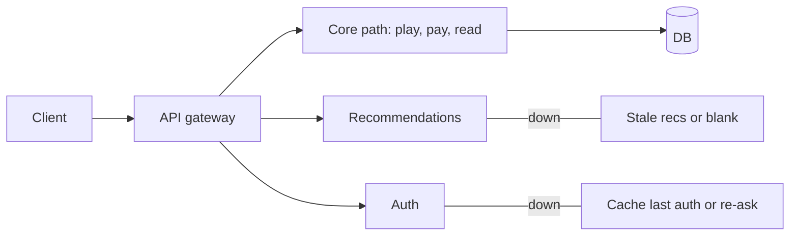

# Graceful Degradation

## 1. One-Line Definition
Graceful degradation keeps a system useful during partial failure by dropping or simplifying non-critical features while protecting the core functionality — users get less, not a total outage.

## 2. Why Do We Need It?
Failures are eventually proportional, not binary. A recommendations engine dying shouldn't take down a video player; a payment provider outage shouldn't disable browsing. Graceful degradation is the explicit design decision that partial availability beats total failure — you keep the essential path alive by making the inessential path optional, cached, or muted.

## 3. Simple Intuition
A restaurant understaffed at dinner: instead of closing, the kitchen trims the menu to the well-rehearsed dishes, seats fewer tables, and tells guests the slow-cooked special is off tonight. Nobody gets a bad meal, nobody gets turned away hungry. The essence survived; the flourish was sacrificed.

## 4. What Happens Without It?
A non-critical dependency fails → every request that touches it fails with it → the outage radius inflates to the whole service. Users get total unavailability backed by a graph of healthy services that can't serve anything, because nothing was ever designed to work without the others.

## 5. Core Idea
- **Rank the features:** decide, in advance, which user experiences are essential (must protect) vs additive (may drop). The ranking is the policy; degradation is just executing it.
- **Fallback ladder:** fresh data → stale cached data → default/blank with a sensible UX → explicit degraded messaging. Each rung costs quality, but keeps serving (see [[caching|Caching]] for the stale-read mechanics).
- **Degrade the dependency, cut it: leave the surface up — 503 a *feature*, not the whole app: recommendations blank, "unavailable now" boxes, retry later.
- **Signals gate it:** degradation triggers on [[health-checks|Health Checks]]-style signals, error rates, latency budgets, or explicit circuit-breaker state ([[circuit-breaker|Circuit Breaker]]) — never on luck.
- **Loudness matters:** a degraded answer that silently looks correct is a lie; mark it "reduced recommendations" so trust survives the episode.

## 6. Important Terminology

| Term | Simple Meaning |
|------|----------------|
| Fallback | A lower-quality path when the primary fails |
| Feature ranking | Which experiences are essential |
| Stale read | Serving old cached data rather than failing |
| Degraded mode | Deliberately reduced functionality |
| Fail-open vs fail-closed | Continue without the dependency vs stop safely |
| Percent effective | The fraction of normal quality still delivered |
| Circuit-breaker state | Open/half-open gate to a failing dependency |

## 7. Basic Architecture



## 8. Request or Data Flow
1. A request arrives for a page that aggregates core + recommendation content.
2. The recommendations dependency fails (or crosses its latency budget).
3. The service executes the fallback ladder: serve the last cached recommendations within a freshness window, else a neutral block, and mark it degraded.
4. The core path completes normally; a "recommendations unavailable" annotation rides along.
5. The outage is invisible in *availability* terms — page loads, core tasks work — and visible only in the feature's quality.

## 9. Practical Example
**Social feed app (assumptions):** feed is core, "who viewed me" is nice-to-have.
- When profile-analytics backend breaks: feed keeps serving from cache (stale but useful), the "viewed me" strip gets a muted placeholder instead of a hard error.
- A/B experiments that touch experimental features are shut first; the read path never degrades below read-only.
- Measured: during a 40-minute incident, p99 latency was steady and page-views dropped 15%, not 100%.

## 10. Scaling
- **What breaks:** feature rank lists go stale, fallback data goes missing, and someone flips every feature optional — then "degradation" is just permanent half-service.
- **What to do:** per-feature SLOs with clear degrade thresholds; keep fallbacks pre-warmed so they work at stress, not only during rehearsal; exercise degradation in drills (chaos-engineering drill / planned concept).
- **Scale the trade:** the more critical and cacheable the feature, the more rungs its ladder needs; the more real-time it is, the earlier it plateaus (real-time chat can't be cached — its fallback is "offline presence").

## 11. Reliability and Failure Scenarios

| Failure | What Happens | Detection | Recovery | Trade-off |
|---------|--------------|-----------|----------|-----------|
| Recommend engine down | Feed core survives, recs degrade | Ladder triggers | Engine back → full mode | quality vs avail |
| Auth latency spike | Re-auth wall or cached-auth window | Latency budget breach | Repeal degrade when latency recovers | trust vs speed |
| Cache storm during failure | Fallback cache miss | Hit-ratio drop | Pre-warm fallbacks | cost |
| Everything ranked optional | Under-degraded trash UX | Feature-quality metrics | Enforce core-vs-additive | quality control |
| Breaker half-open lingering | Flap between full and degraded | State metrics | Half-open + timeout discipline | detection delays |

## 12. Consistency and Correctness
Degraded data is *old* data: whenever a stale read is served, the system promises monotonicity but not freshness — so never let a stale fallback satisfy a fresh-data guarantee silently (mark timestamps, add "as of" tags, and refuse stale reads where correctness forbids them, e.g., account balance, not page counts). Idempotency still applies: a fallback that answered once must not cause a retried request to double-effect (see [[idempotency|Idempotency]]).

## 13. Performance
The whole point is latency under pain: a degraded answer should be *faster* than the normal one (no slow dependency in the path). If the fallback is as slow as the failure, degradation is theater — measure degrade-path latency and keep it on budget. The correctness cost is freshness; the latency cost should be a savings.

## 14. Security
Degrade pathways can smuggle privilege: a fallback that skips real authorization (fail-open auth under load) can become a real bypass — always fail *closed* for auth, degrading only the experience, never the controls. Log degradation loudly: an audit trail of what was served degraded is a security feature no less than a reliability one.

## 15. Trade-Offs

| Fallback choice | Advantages | Disadvantages | When to Use |
|-----------------|------------|---------------|-------------|
| Stale cached data | Fast, useful | Old information | Feeds, catalogs, recs |
| Default/blank block | Simple, honest | Empty-feeling UX | Nice-to-have widgets |
| Reduced write (read-only mode) | Preserves the surface | Writers deferred/queued | Partial DB incidents |
| Fail-closed | Safe by construction | Total feature outage | Auth, payments, invariants |
| Explicit degraded messaging | Trust maintenance | Slightly worse UX | Anything user-visible |

## 16. Common Mistakes
- Ranking everything optional — when the core itself has no fallback, you've built a polite outage.
- Ladders without pre-warmed fallbacks: at failure time every cache is cold and your graceful path becomes a thundering-herd.
- Silent degradation — a stale "recommendations" that looks fresh erodes trust and hides the incident from metrics.
- Failing open on auth/control surfaces in the name of degradation.
- Never rehearsing the degrade path (chaos-engineering drills — planned concept) so the fallback itself is the broken thing.

## 17. HLD vs LLD Boundary
HLD: essential-vs-additive feature ranking, fallback ladder per feature, degrade triggers, fail-open vs fail-closed per surface, monitoring of degrade state. LLD: the specific fallback code branches, cache-read logic, the "as of" timestamp plumbing, the metric that flips a feature into degraded mode.

## 18. Interview Questions

### Beginner
- What is graceful degradation, and how is it different from just "not crashing"?
- Give three fallback rungs for a feed that loses its recommendation backend.

### Intermediate
- Don't fail-open on auth — why, even when availability matters more?
- How do you ensure your fallback data isn't itself a cache stampede at failure time?

### Advanced
- Design a per-feature degrade ladder with explicit SLO-per-rung for a payments-adjacent page.
- How does degradation interact with a distributed transaction's invariants, and where does it become forbidden?

## 19. Interview Memory Summary

> [!abstract]- Interview Memory Summary

### Remember

- Rank features: core must survive, additive may drop.
- Fallback ladder: fresh → stale cache → default → degraded message.
- Fail closed on auth, payments, invariants; fail open on experience.
- Degraded answers must be loud (marked), not silently stale.
- Pre-warm and rehearse fallbacks; they're code too.

### 30-Second Explanation

Classify features into core (protected) and additive (degradable), then give every degradable one a fallback ladder from fresh data down to stale cache, default, and explicit "unavailable" — triggered by health/circuit signals, not luck. Serve the core path at full quality while the additive path sheds gracefully, keeping the surface up, latency flat, and the degradation itself visible.

### Interview Traps

- Treating all features as equally degraded — you built a polite outage.
- Failing open on authorization as "graceful" — that's a security bypass.
- Silent stale reads that look fresh.
- Fallbacks that are cold at exactly the moment they're needed.

### Key Trade-Off

Graceful degradation trades full quality (fresh features, all surfaces) for controlled availability — you keep the core path alive under failure, but you serve older data or placeholder UX, so the honest cost is freshness and feature depth, not functionality itself.

## 20. Related Concepts

### Prerequisites

- [[caching|Caching]] — the stale-read mechanics that power most fallback ladders.
- [[reliability|Reliability]] — the discipline this is the user-visible face of.

### Commonly Used Together

- [[circuit-breaker|Circuit Breaker]] — the switch that puts a dependency into degraded mode.
- [[backpressure|Backpressure]] — what happens when even degraded demand exceeds supply.
- [[overload-protection|Overload Protection]] — the admission/shedding system degradation is a policy input to.
- [[error-handling|Error Handling]] — the API semantics for partial success.

### Alternatives

- [[retry-and-timeout|Retry and Timeout]] — trying again first; degradation is what happens when retries exhaust.
- [[failover|Failover]] — swapping the whole dependency rather than serving reduced quality.

### Advanced Concepts

- Chaos-engineering drills — how you prove the degrade path works (planned concept).
- [[resilience-patterns|Resilience Patterns (Catalog)]] — the full toolbox degradation is one member of.

Related planned topics (not authored yet): `load-shedding` (the mechanical sibling), `cloud/db degradation runbooks`.

## 21. References
Google SRE books — "practical reliability" chapters on graceful degradation and load shedding; Netflix/CDN case-writing on fallback ladders. Verify against current SRE practice guidance.

## 22. Active Recall

> [!question]- In one sentence, what does graceful degradation actually buy you?
> Life: a user-facing service that stays up and core-functioning during partial failure because the non-essential features were designed to shed, cache, or mute themselves instead of failing the whole surface with them.

> [!question]- A feed's recommendation backend dies. Walk the fallback ladder, rung by rung.
> 1) Serve the last cached recommendations within a freshness window. 2) Beyond the window, serve a neutral "recommendations unavailable" block under the still-fresh core feed. 3) Mark the response degraded so the client/metrics treat quality loss as quality loss, not full service. 4) Recover and shift back only when the dependency passes readiness again — via the health signal.

> [!question]- Trade-off: why must auth fail *closed* even during degradation?
> Degradation is about sacrificing *feature depth*; authorization is about *control*. Failing open on auth turns a reliability event into a security bypass at the worst moment. So auth stays fail-closed (users re-authenticate; sessions degrade), while only neutral experience features may fail open.

> [!question]- Failure scenario: the fallback cache misses exactly when the primary fails. What happened, and what's the fix?
> The fallback wasn't pre-warmed — at the moment of need a cold cache swamps origin with misses (a stampede on top of the outage). Fix: separate pre-warmed fallback pools with a freshness budget, serve from them immediately, and cap the miss rate so a stampede can't form.

> [!question]- Interview scenario: payments-scale traffic, an analytics page must stay available during a caching backend outage. Walk the design.
> Rank: page load is core; analytics detail is additive. Give analytics a ladder: cache-copy → "analytics temporarily limited" placeholder. Never serve fabricated or stale *monetary* numbers (fail closed there). Pre-warm the fallback, trigger off a circuit/cache-health signal, mark degraded responses, measure that p99 stays flat — and, if load persists, hand off to load-shedding so the core path never degrades too.

> [!question]- Why is silent degradation dangerous beyond just being unfriendly?
> It hides both the incident and its cost: metrics look fine, SLOs pass, users just quietly get worse data — and because nothing "broke," nobody fixes the dependency and the fallback becomes permanent habit. Loud degradation keeps the problem visible and forces restoration.

## 23. When Should I Use This?

### Use it when

- Multiple services feed one user experience, and not all are equally critical.
- Availability obligations matter more than every feature's freshness.
- You already have (or can build) caches and marked-degraded responses.
- A dependency fails occasionally and you have a pre-warmed fallback to serve.

### Avoid it when

- The dependency's correctness itself is the product (monetary ledgers, auth, safety invariants) — fail closed, don't degrade.
- There's no pre-warmed fallback: degrading to an empty stub is a zombie.
- The feature is barely used and worth killing outright instead of degrading.

### What problem does it solve?

It decouples the essential user experience from the aggregate failure of optional parts — turning a dependency outage from total unavailability into a controlled quality dip on the periphery, with the core path serving at full capacity throughout.

### What problem does it NOT solve?

It cannot serve data the system doesn't have (no fallback without a source), cannot preserve freshness guarantees (it explicitly forgoes them), and cannot conjure capacity — when even degraded demand overflows, you still need overload protection and shedding on top.

## 24. Decision Connections

Decisions that go together with graceful degradation:

- [[caching|Caching]] — the stale-data fallback rung most degradation ladders descend to.
- [[circuit-breaker|Circuit Breaker]] — the mechanism that flips a dependency into degraded mode.
- [[backpressure|Backpressure]] — the rejection policy for when even degraded load overflows.
- [[overload-protection|Overload Protection]] — per-feature shedding ranks that degradation executes.
- [[error-handling|Error Handling]] — API semantics for partial/degraded responses.
- [[reliability|Reliability]] — the parent discipline; degradation is its user-visible strategy.
- Chaos-engineering drills — how you prove the fallback works under real force (planned concept).

Decision tree:

```
Can a failing dependency bring down the whole user experience?
    |
    +-- It's correctness-critical (auth, payments, invariants)?
    |      → fail closed — [[graceful-degradation|Graceful Degradation]] does NOT apply
    |
    +-- It's experience-critical and cacheable?
    |      → fallback ladder: fresh → stale cache → placeholder → marked
    |
    +-- Even degraded demand exceeds supply?
    |      → [[backpressure|Backpressure]] + [[overload-protection|Overload Protection]]
    |
    +-- Dependency is intermittently slow?
           → [[circuit-breaker|Circuit Breaker]] gates the degrade trip
```