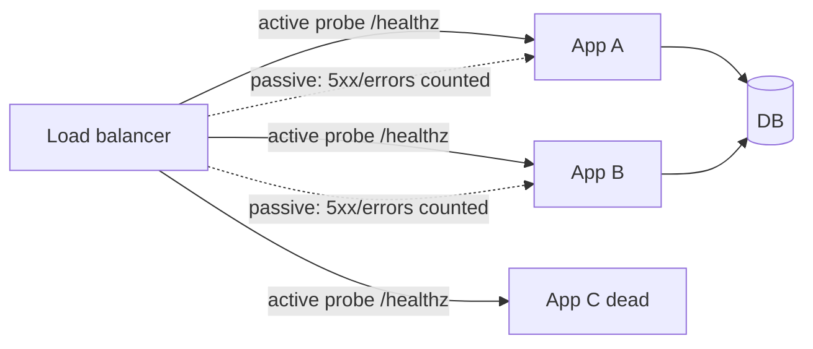

# Health Checks (Active/Passive)

## 1. One-Line Definition
Health checks test whether a backend is usable — actively by probing it on a schedule or passively by watching real traffic's success rate — so load balancers, orchestrators, and registries can automatically stop sending work to broken nodes.

## 2. Why Do We Need It?
Load balancing assumes a pool of *healthy* nodes; the only way to keep that assumption true is detection. Without detection you route traffic into dead nodes (errors) or, worse, *kind of alive* nodes (thrashing, serving stale state). Health checks turn "this instance crashed" from an incident into a transparent, seconds-scale routing decision.

## 3. Simple Intuition
A shop clerk who faints: you want someone to notice within seconds, take them off the checkout rota, and add them back only after they're demonstrably standing again. Two ways to notice: a manager taps them on the shoulder every few seconds (active), or the line spontaneously stops being serviced (passive — too late for those customers).

## 4. What Happens Without It?
A crashing node accumulates failures: requests hang until client timeouts, retries pile onto the same node, queues saturate the still-healthy neighbors, and "transient" errors become cascades. In failover scenarios the balancer keeps sending traffic to the dead node, so the whole system's availability collapses to the least-healthy member.

## 5. Core Idea
- **Active checks:** the balancer (or orchestrator) initiates a probe on a schedule — TCP connect, HTTP `GET /healthz` expecting 2xx, gRPC health, or an app-defined deep check that validates DB connectivity. Explicit and prompt, but they cost real traffic and can lie (happy endpoint, broken internals).
- **Passive checks:** measure real requests — consecutive 5xx / timeout counts, error ratios. No extra load, no extra traffic, but reactive: you only learn after real users hit failures; requires a success threshold to heal.
- **Probe knobs:** interval (how often), timeout (how long to wait), healthy/unhealthy thresholds (how many passes/failures flip state), and startup grace (time before probing begins).
- **Where they live:** LB backend pools, orchestration (K8s `readiness` / `liveness` — see [[kubernetes-services|Kubernetes Services]]), service registries (see [[service-discovery|Service Discovery]]), autoscaler signals.
- **Hard vs soft:** hard checks stop traffic; soft checks only down-weight/deprioritize. Graded handling keeps slow-but-functional nodes serving instead of flapping.

## 6. Important Terminology

| Term | Simple Meaning |
|------|----------------|
| Active probe | Balancer-initiated scheduled test |
| Passive check | Traffic-derived success/failure counting |
| Health endpoint | A dedicated unhealthy-reporting route |
| Liveness vs readiness | Is the process alive vs can it take traffic |
| Threshold | Consecutive successes/failures to flip state |
| Startup grace | Wait before probing a freshly started node |
| Flapping | A node bouncing healthy/unhealthy repeatedly |
| Weight down / less-route | Soft-degraded but still serving |

## 7. Basic Architecture



## 8. Request or Data Flow
1. Balancer marks a node "draining entry" on N consecutive probe failures (or a passive error burst).
2. New requests stop routing to it; in-flight work finishes (see [[connection-draining|Connection Draining]]).
3. The probe continues. After M consecutive successes, the node returns to the pool.
4. Health state feeds counts: `pool_healthy` for the autoscaler ([[autoscaling|Autoscaling]]), alert thresholds for on-call ([[golden-signals|Golden Signals]]).

## 9. Practical Example
**Checkout API pool (assumptions):** 10 replicas, `/healthz` does a DB ping.
- Probe every 5s, timeout 2s, down after 3 failures (~15s detection), up after 2 successes.
- A replica loses DB connectivity: within 15s the LB stops sending it traffic; the error budget is untouched because users never saw the failures.
- The `/healthz` DB ping is the *deep* check; a separate shallow `/live` line-check guards the process itself — liveness vs readiness split.

## 10. Scaling
- **Probe cost:** active checks scale with pool size; thousands of replicas × 5s probes is real monitoring traffic — batch-lite probes or sample sub-groups when huge, and reuse app telemetry instead of brute-force probing.
- **False-negative snowball:** an over-strict probe (DB ping during a brief bump) can halve your pool at the exact moment you need all hands — tune thresholds, add startup grace, and never probe for things beyond the routing decision's scope.
- **Probe fan-out:** when many balancer nodes each probe independently, multiply intervals against promotion attempts; centralize the health verdict per node instead.

## 11. Reliability and Failure Scenarios

| Failure | What Happens | Detection | Recovery | Trade-off |
|---------|--------------|-----------|----------|-----------|
| Node crashed | Requests fail | Active probe down / passive 5xx | Threshold flips node out | detection latency |
| Node zombie (process up, app broken) | Timeouts and hangs | Deep probe only | Deep check flags it | probe complexity |
| DB degradation, app still up | Slow calls, high tail | Passive error window | Down-weight, not remove | graduated response |
| Probe endpoint itself broken | Healthy node falsely removed | Cross-check passive metrics | Compare signals | blind spots |
| Flapping node | Churn in pool counters | Threshold hysteresis | Slow unmark (more successes) | detection delay |

## 12. Consistency and Correctness
Health is a *prediction about the near future*, not a fact: a node can pass a probe and die a millisecond later. Design your caller-timeouts and retries assuming health checks lag reality. Use monotonic, idempotent liveness semantics (a node that comes back healthy re-enters from scratch; never "resume where you left off" without draining purgatory). Passive checks must account for partial success (2xx with degraded path) or they mislabel bad-as-good and good-as-bad.

## 13. Performance
- Active probes add load proportional to `pool_size / interval`: 100 nodes probed every 5s ≈ 20 QPS of test traffic — trivial, but it grows; deep checks (DB pings) multiply DB load per probe.
- Passive checks are free of extra traffic but blur the signal: a 5xx from a client bug looks identical to a dead node.
- Threshold tuning is a latency-to-accuracy trade: aggressive = faster detection but more flapping; lenient = steadier but slower recovery.

## 14. Security
- Health endpoints must never leak internals: response is a status code, not stack traces, config, or versions.
- Authentication-sensitive probes should live on a private network or use a shared secret, so attackers can't use `/healthz` to fingerprint or to spoof liveness.
- Don't let the health endpoint double as unauthenticated data store.

## 15. Trade-Offs

| Choice | Advantages | Disadvantages | When to Use |
|--------|------------|---------------|-------------|
| Active probe | Fast, explicit, can test depth | Costs traffic, can mislead | Most LB pools |
| Passive check | Zero extra load, real user view | Reactive only, noisy signals | Hot paths, large fleets |
| Shallow check | Cheap, always current, catches crashes | Misses logical breakage | Process liveness only |
| Deep check | Catches DB/config breaks | Cost, flakiness, probe amplification | Routing-critical dependencies |
| Binary in/out | Simple, predictable | Sharp edges on subtle degradation | Most cases |
| Graded (weighted) | Smooth degradation handling | More config, subtler monitoring | Autoscaling-LB interplay |

## 16. Common Mistakes
- Shallow `/healthz` that returns 200 even when the service can't serve — the check lies.
- A deep DB ping on every probe creating a *probe noise floor* that thrashes the database.
- No startup grace: newly booted nodes wobble between failing and passing, flapping in and out.
- Probing for things that shouldn't gate routing (disk full on an append-only node still able to serve reads).
- Ignoring the passive signal: active probes alone miss the "slowly dying over hours" degradation that error ratios capture.

## 17. HLD vs LLD Boundary
HLD: check location (LB / orchestrator / registry), depth per endpoint, intervals and thresholds, in/out vs graded, coupling to autoscaling and alerting. LLD: the `/healthz` handler implementation, the probe client config, the threshold math in one service, per-node status plumbing.

## 18. Interview Questions

### Beginner
- What is the difference between an active and a passive health check?
- What should the `/healthz` endpoint actually test?

### Intermediate
- A "fine" health endpoint hides a broken dependency — how do you make checks honest?
- Why would an over-strict probe worsen an outage?

### Advanced
- Design health-checks for a 10,000-replica fleeted behind many LBs without a probe storm.
- When would you use graded down-weighting instead of hard in/out removal?

## 19. Interview Memory Summary

> [!abstract]- Interview Memory Summary

### Remember

- Active = probe on schedule; passive = count real-traffic success/failure.
- Thresholds make detection: N failures out, M successes back in, grace on boot.
- Deep checks catch "process up, logic broken" — but cost DB/CPU per probe.
- Graded (weighted) handles slow-but-working better than binary in/out.
- Health is lagging — pair it with caller timeouts and retries.

### 30-Second Explanation

Give the balancer an honest health signal: probe actively on a sane interval with a depth matching what routing actually depends on, count passive error ratios as a second opinion, and flip nodes in/out via thresholds (with startup grace and down-weighting). Feed the same health state to autoscalers and alerts so detection converts cleanly into capacity and on-call visibility.

### Interview Traps

- A 200-returning `/healthz` that never checks dependencies — the classic lie.
- Probe storms on deep checks as the fleet grows.
- Probing as if liveness == readiness.
- Removing the passive signal because active checks exist.

### Key Trade-Off

Deep, frequent probes detect fastest but cost real traffic and can disqualify healthy nodes in a bump; a shallow, lenient check is cheap and stable but blind — the right depth and thresholds depend on what the routing decision truly needs to be sure of.

## 20. Related Concepts

### Prerequisites

- [[load-balancing|Load Balancing]] — checks are the balancer's eyes; no pool stays honest without them.
- [[http-and-https|HTTP and HTTPS]] — the status-code semantics a probe consumes.

### Commonly Used Together

- [[connection-draining|Connection Draining]] — the evacuation step that follows a failed check.
- [[autoscaling|Autoscaling]] — healthy-node counts drive scale decisions.
- [[kubernetes-services|Kubernetes Services]] — readiness/liveness probes as platform primitives.

### Alternatives

- [[service-discovery|Service Discovery]] — registration of live instances as a form of passive liveness.

### Advanced Concepts

- [[golden-signals|Golden Signals]] — where health state feeds SLOs and alerts.
- [[observability|Observability]] — deeper, signal-based views when probes can't see enough.

Related planned topics (not authored yet): `heartbeat-health-checks` (the dedicated 12-reliability angle), `incident-management`.

## 21. References
Kubernetes liveness/readiness/startup probe docs; HAProxy and NGINX health-check documentation; AWS ELB target-group health-check settings. Verify probe semantics with current vendor docs.

## 22. Active Recall

> [!question]- What is the difference between liveness, readiness, and a deep check?
> Liveness: is the process alive at all (start/stop on crash). Readiness: can it take traffic now (gate routing in the platform). Deep check: can it actually do its job, e.g., reach the DB — the difference between "the process breathed" and "the request will succeed".

> [!question]- Trade-off: frequent deep probes on a large fleet — why is that dangerous?
> Probe traffic scales with pool size and depth: 10k nodes × DB pinging `/healthz` every few seconds is a real DB load floor and creates flakiness, so nodes get falsely marked down. Mitigate by splitting depth (coarse on all, deep on samples) and reusing real telemetry as the deep signal.

> [!question]- What does a startup grace period prevent?
> A freshly booted node is often not yet serving while checks are being initialized; without grace it fails its first few probes and flips to unhealthy, then passes and flips back — flap churn that destabilizes pool membership counters and autoscaling decisions.

> [!question]- Failure scenario: a node passes active probes but real users fail. What's happening and how do you fix it?
> The probe is blind to the real failure (shallow endpoint, or failure only occurs under real request shapes like auth or payload parsing). Fix: deep-enough probes for routing-critical dependencies plus a passive check on real traffic's error ratio, and route-away sampling to confirm.

> [!question]- Interview scenario: you must make health checks part of a zero-dropped-request deploy. Walk the timeline.
> Probe the new node, mark it ready only after M green checks (readiness passes), switch traffic gradually while the old node sets drain (see [[connection-draining|Connection Draining]]), and keep probing the old node during drain until its connections terminate — health state drives every step without a hard stop signal.

> [!question]- Basic understanding: name three knobs that define an active probe and say what each controls.
> Interval (how often), timeout (how long to wait for success or failure), and thresholds (how many consecutive passes/failures flip state) — plus startup grace for freshness. These four control detection speed, accuracy, and flapping.

## 23. When Should I Use This?

### Use it when

- Any load balancer, orchestrator, or registry needs to know who it should route to.
- You want code or infrastructure to survive degraded dependencies without users noticing.
- You change capacity (scale up/down) and need newly-booted nodes admitted only when ready.
- You deploy often and want new versions verified before they receive real traffic.

### Avoid it when

- A single instance bottleneck means detection has nothing to re-route around (add redundancy first).
- Probe depth exceeds what routing actually depends on (probing the whole universe).
- A health endpoint cannot be kept honest — a lying check is worse than none (it gives false confidence).

### What problem does it solve?

It turns crashes and degradation into a self-healing pool decision: dead or broken nodes are discovered in seconds, quarantined from routing, and readmitted only when proven fit — without waiting for users to hit errors.

### What problem does it NOT solve?

It does not fix the underlying brokenness (it only routes around it), cannot see into dependencies the probe doesn't touch, and cannot respond to load — that is autoscaling and load-control territory, which is exactly why health state feeds those systems rather than replacing them.

## 24. Decision Connections

Decisions that go together with health checks:

- [[load-balancing|Load Balancing]] — the pool that consumes health verdicts; no balancer is safe without them.
- [[connection-draining|Connection Draining]] — the graceful evacuation a failed check triggers.
- [[autoscaling|Autoscaling]] — healthy-count feeds scale decisions; flapping corrupts them.
- [[kubernetes-services|Kubernetes Services]] — platform-level liveness/readiness probes modeled here.
- [[service-discovery|Service Discovery]] — registration is liveness; deregistration needs checks.
- [[golden-signals|Golden Signals]] — health state lives beside error/latency SLOs.
- [[observability|Observability]] — complement probes when signal depth is insufficient.

Decision tree:

```
How should a backend be verified before routing to it?
    |
    +-- Just "is the process alive"?
    |      → shallow probe (liveness), cheap interval
    |
    +-- "Can it actually serve"? 
    |      → [[health-checks|Health Checks]] with deep probe
    |         |
    |         +-- Many backends, probe cost matters? → passive checks + sampled depth
    |         +-- Crippled-but-working is acceptable? → graded down-weighting
    |         +-- Must drain before removal?         → [[connection-draining|Connection Draining]]
    |
    +-- Needs capacity reaction too?
           → feed health into [[autoscaling|Autoscaling]]
```