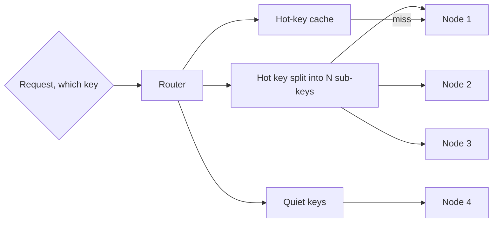

# Hotspot Handling

## 1. One-Line Definition
Hotspot handling is a family of techniques — caching, key splitting, replication-of-hot-data, and skewed-load rebalancing — for neutralizing the few request keys or partitions that attract far more load than anyone planned for.

## 2. Why Do We Need It?
Load balancing and [[consistent-hashing-load-balancing|Consistent Hashing Load Balancing]] even out *membership*, not *demand*. A celebrity's profile, a single tenant's busiest hour, or one "today" key can attract 100x a normal key. Unhandled, it saturates one node or shard while the rest of the fleet idles — your evenly-spread pool is only as healthy as its hottest member.

## 3. Simple Intuition
A post office with one counter for every neighborhood, and everyone suddenly mailing to the same celebrity's zip code. The "even" distribution is perfect — except one counter melts while the others twiddle. The fix isn't to re-twiddle the lanes; it's to split that one hot zip across many temporary counters, pre-sort the hot mail somewhere fast, and copy the famous person's change-of-address card to every counter.

## 4. What Happens Without It?
One hot key pinning a single node means: that node's CPU/latency SLOs crater, p99 across the service spikes because one tail belongs to everyone touching it, autoscalers add nodes to the wrong place (the pool inflates but the hot node is unchanged), and in [[sharding|Sharding]] systems the shard owning the hot key becomes the availability boundary for the whole dataset.

## 5. Core Idea
- **Find it first:** hotness is a *distribution* property — detect via per-key QPS/latency percentiles, partition skew metrics, shard-lag deltas (see [[shard-key|Shard Key]] and [[observability|Observability]]), not aggregate load.
- **Cache the hot ones:** a fixed, small set of very-hot keys often satisfies most read amplification with a tiny cache ([[caching|Caching]]). Measure; a "hot keys cache" of 50 keys can absorb 90% of skew.
- **Split the key:** give the hot key logical suffixes (key_0..key_N) so its load spreads across nodes; reads fan out and merge, writes must fan-out-to-ALL-splits for consistency, or a hot-write key splits at the coordinator (copy rewrite).
- **Replicate the hot copy:** make read-heavy hot data exist on many nodes (read replicas, partition-replica, memcache churn) so the hot read hits any warm node — writes stay single-writer.
- **Isolate or re-home:** move the hot tenant/key to its own partition or cell so its flames stay out of the neighbors (see [[tenancy-and-cells|Multi-Tenancy and Cell-Based Architecture]] and [[sharding-strategies|Sharding Strategies]]).
- **Management:** a coordinator tracks "hot keys" and — for dynamic hotness — rebalances sub-keys or re-maps ownership; anything manual at large scale turns into an unplanned outage.

## 6. Important Terminology

| Term | Simple Meaning |
|------|----------------|
| Hot key | A key with disproportionate request rate |
| Hot partition | The shard/replica owning the hot key |
| Skew metric | Measure of load imbalance across keys/nodes |
| Key splitting | Fanning a hot key onto N logical sub-keys |
| Hot-copy replication | Cloning hot data onto many nodes |
| Fan-out read | Read all sub-keys, merge results |
| Fan-out write | Write to every sub-key (expensive) |
| Celebrity / super-tenant | The archetypal hot entity |

## 7. Basic Architecture



## 8. Request or Data Flow
1. Every request carries a key; the router consults the hot-key list (a coordinator-managed set).
2. A quiet key routes like normal — hash to an owner.
3. A hot read routes to a hot-key cache first; on a miss it fans out to the hot key's N sub-shards and merges.
4. A hot write goes to *all* N sub-shards (or the coordinator appends a fresh sub-key) to keep the split consistent — the write cost is the price of spreading the read.
5. The coordinator watches skew and adds/removes sub-keys or re-homes owners as demand shifts.

## 9. Practical Example
**Tweet lookups (assumptions):** one celebrity with 100x traffic at drop-time.
- Before: any hash puts that user on one "hot" shard of 256 — its QPS melts.
- After: hot-key cache serves the top 20 celebrities from memory (~90% of their reads), and the celebrity account itself splits into 8 sub-accounts for write isolation and read fan-out.
- Observable: total fleet p99 back to baseline, skew metric < 1.5x, and no tenant-crossing (see [[tenancy-and-cells|Multi-Tenancy and Cell-Based Architecture]]).

## 10. Scaling
- **Detection must scale:** per-key counting at server scale uses sampling, top-K sketches, or count-min sketches rather than a per-key table of everything (see [[probabilistic-data-structures|Probabilistic Data Structures]]).
- **Split logic must scale:** too many hot keys (a long-tail distro under every-day churn) defeats a manual list — a dynamic coordinator auto-splits, auto-merges, and auto-re-homes; humans only sit policy.
- **Rebalancing axis:** add more *capacity* (replicas or nodes) for read hotness, but writes scale only by splitting keys or re-homing to a dedicated unit — capacity alone won't fix a single-writer funnel.

## 11. Reliability and Failure Scenarios

| Failure | What Happens | Detection | Recovery | Trade-off |
|---------|--------------|-----------|----------|-----------|
| Hot key grows post-split | Sub-shards saturate again | Skew metric | Add sub-shards / fan out more | write cost doubles |
| Hot-copy cache churn | Miss hysteresis on the hottest reads | Cache hit-ratio on hot set | Warm replica set before traffic flips | memory cost |
| Fan-out read misses | Merge path amplifies QPS | Merge-cost metric | Cache at router too | latency |
| Hot-write consistency slip | Scattered splits disagree | Read-after-write check | Publish-to-all with quorum | consistency cost |
| Detection late | Whole partition dies pre-cache | Latency p99 spike | Same-day split + re-home | detection speed |

## 12. Consistency and Correctness
The moment you split a key, correctness moves into *your* hands: a fan-out read merging N sub-shards returns the union only if writes went to all of them — use publish-to-all (or a coordinator-arbitrated single-writer per sub-shard) and make inserted data idempotent per sub-shard. Read-hot copies diverge naturally; serve them with an explicit freshness budget (see [[strong-vs-eventual-consistency|Strong vs Eventual Consistency]]), never silently swap a stale copy for live data where correctness demands newness.

## 13. Performance
- Hot-key caching is the highest ROI: a few dozen keys can erase the worst tail at one hop.
- Key splitting trades read fan-out (QPS multiplies by N, merged) for the write amplification of N publishes — so split for read-heavy hot keys, and only when the merged fan-out is cheaper than the alternative meltdown.
- Detect-and-react latency is the real tax: the faster you find skew (metric sampling), the faster you cool it; every detection-lag minute is a saturated node.

## 14. Security
- A fabricated "hot" key flood (attackers hammering one key to force cache splits and writes) weaponizes your own mitigation — treat hot-key caches and split-writes as adversarial surfaces (sketch or keyed-hash the key space so attackers can't force collisions).
- Don't let hot-key handling echo internal topology: sub-key suffixes or replica addresses must not leak partition membership.

## 15. Trade-Offs

| Approach | Advantages | Disadvantages | When to Use |
|----------|------------|---------------|-------------|
| Hot-key cache | Cheap, one hop, huge read wins | Heat-up window, memory | Read-heavy hot keys |
| Key splitting | Spreads reads and writes across nodes | Fan-out reads, N writes | Hot keys persist |
| Replication of hot data | Reads from any warm node | Write path single-writer | Read-only hot blobs |
| Re-home to own partition | Containment, isolation | Cell/tenant ops complexity | Super-tenants, celebrities |
| Dynamic coordinator | Self-adapting | Control-plane cost + latency | Long-tail hotness at scale |
| Manual lists | Simple | Stale, human-laggy | Small fleets, rare events |

## 16. Common Mistakes
- Not detecting: building load-balancing without per-key/per-shard skew metrics, so the first hot key is discovered as a p99 spike.
- Splitting read-hot keys without solving the write path — every sub-shard diverges and reads return partial history.
- Caching hot keys with a warmup gap: at exactly the celebrity flash the cache is cold and origin grenades.
- Confusing "even hash" with "even load" — placement evenness never equalizes popularity.
- Letting retries concentrate: identical retry keys re-enter the same hot shard and amplification quadruples.

## 17. HLD vs LLD Boundary
HLD: detection instrumentation (skew metrics, sampled top-K), the hot-key policy (which keys split vs cache vs replicate), split/rehome protocol, freshness budget for hot copies, coordinator topology. LLD: the count-min/sketch implementation, the split-fan-out merge code in the service, the publish-tags write path, the coordinator watch loop triggering splits.

## 18. Interview Questions

### Beginner
- What is a hot key, and why does even load balancing not prevent it?
- Name three mitigations for a read-hot key.

### Intermediate
- A hot read key splits into N shards — walk the read and the write paths and their costs.
- Why doesn't adding servers fix a hot key?

### Advanced
- Design the detector and coordinator for dynamic hot-key splitting across a 2,000-shard system.
- How do hot keys interact with consistent hashing's spill-over-on-crash, and what policy do you set?

## 19. Interview Memory Summary

> [!abstract]- Interview Memory Summary

### Remember

- Even placement ≠ even load — popularity is a distribution property.
- Detect skew per key/partition before the p99 spike.
- Hot-key cache is the cheapest lever; splitting spreads but costs writes.
- Hot data can be replicated for reads; writes stay single-writer.
- Re-home super-tenants into their own cells.
- Never let the metric pipeline lag — detection speed is cooling speed.

### 30-Second Explanation

Measure skew, then neutralize the hot key: cache the top few keys, split a hot key into N sub-keys so reads fan out (and writes publish to all, keeping the split consistent), or replicate the read-hot data across nodes — and for sustained superstars, re-home them into their own partition or cell. Coordinate splits dynamically; detection that lags converts every hot key into a live meltdown first.

### Interview Traps

- Claiming consistent hashing fixes hot keys — it fixes membership, not popularity.
- Splitting reads without a write-consistent plan — the famous partial-history source.
- Cold-cache heat-up at exactly the flash moment.
- Adding capacity for a single-writer funnel.

### Key Trade-Off

You trade fan-out and write cost for read spread — caching is nearly free, splitting/replicating get expensive fast, and re-homing buys isolation at configuration cost — so the right tool depends on how hot, how persistent, and how write-heavy the key is.

## 20. Related Concepts

### Prerequisites

- [[load-balancing|Load Balancing]] — the even-membership layer that provably doesn't handle hotness.
- [[consistent-hashing|Consistent Hashing]] — the ring behavior hotspots twist (see spill-over).

### Commonly Used Together

- [[caching|Caching]] — the first and cheapest hot-key lever.
- [[consistent-hashing-load-balancing|Consistent Hashing Load Balancing]] — the placement being skewed by celebrity keys.
- [[shard-key|Shard Key]] — where hotness is born if the key's cardinality is low.
- [[observability|Observability]] — skew metrics are the detection half of handling.

### Alternatives

- [[sharding|Sharding]] and [[sharding-strategies|Sharding Strategies]] — the partitioning shape a hot key deforms.
- [[graceful-degradation|Graceful Degradation]] — serving the hot set degraded when it can't be cooled in time.

### Advanced Concepts

- [[tenancy-and-cells|Multi-Tenancy and Cell-Based Architecture]] — re-homing superstars into isolated cells.
- [[probabilistic-data-structures|Probabilistic Data Structures]] — sketches that detect hot keys at fleet scale.
- [[fanout-and-aggregation|Fan-Out / Fan-In / Scatter-Gather]] — the merge machinery split-keys read by.

Related planned topics (not authored yet): `shard-rebalancing` and `virtual-nodes` (the movement half of hotspot response).

## 21. References
DynamoDB/MongoDB partition-heat guidance; "Hotspotting" discussion in Kleppmann ch. 6 (partitioning is uneven); count-min sketch literature for top-K tracking. Verify current hot-partitioning advice with managed DB docs.

## 22. Active Recall

> [!question]- Why can't a perfectly even hash distribute hot loads?
> Because even placement solves *membership*, not *demand*: the hash distributes keys, but the *traffic* is attached to specific keys. One popular key still lands on exactly one node — its owner carries all the popularity. The fix has to act on popularity, not placement.

> [!question]- Walk the costs of splitting a hot key into 8 sub-keys, reads and writes separately.
> Reads: 8 sub-lookups merged into one answer — QPS multiplies by 8, plus merge CPU. Writes: must publish to *all* 8 to keep the split consistent — write amplification of 8x. So splitting is a good deal for hot-read keys and a bad deal for hot-write keys, and the moment you stop publishing to all, sub-shards diverge.

> [!question]- Design decision: hot-key cache vs split vs replicate — how do you choose?
> Measure the hot set's size: if a handful of keys cause the skew, cache them (cheap spin, big win). If the set is large or growing, split (spread into sub-keys). If the hot data is read-only, replicate (read from any warm copy, keep single-writer). Re-home when it's one sustained superstar shouldering a whole tenant or cell.

> [!question]- Failure scenario: a flash-sale key saturates its shard, cache is cold, and writes keep flowing. Walk the response, first 5 minutes.
> Detection (skew metric) flags the key — already a minute gone. Router splits it into N sub-keys immediately, but writes must fan out to all (momentary extra load). The hot-key cache warms in parallel, deflecting subsequent reads. Once the sale ends, quiesce splits and re-merge — and treat every retry's identical key as amplification stacked on the same shard, so backoff applies there too.

> [!question]- Interview scenario: your consistent-hash LB pool has a celebrity tenant on node 7, and you're moving it off. Design the migration.
> Drain node 7's hot tenant incrementally: point reads at a replicated warm copy (or cell) while writes stay on node 7 until the copy proves fresh, then flip writes to the migrated home and deprecate the old split (see [[connection-draining|Connection Draining]] — same discipline at key granularity). Keep skew metrics alive through the flip so a stale copy never serves fresh reads.

> [!question]- How do you detect hot keys at fleet scale without a per-key accounting table?
> Stream-sampled top-K tracking over a count-min sketch at the router: it keeps bounded memory, finds the true heavy hitters, and gives you a real-time hot-key list to feed the coordinator — the alternative (a global per-key counter) costs more storage than the keys you're trying to save.

## 23. When Should I Use This?

### Use it when

- Read or write traffic concentrates on a small key set (celebrity users, super-tenants, "today" spans).
- A single shard/node's saturation violates your latency or availability SLO despite even placement.
- Partition skew metrics already show the imbalance — detection is done, action must follow.
- Hot data can be cached, replicated, or re-homed at an acceptable write/consistency cost.

### Avoid it when

- The "hot" key is actually systemic: tail-heavy but *broad* long-tail demand is a capacity problem, not a hotspot — adding nodes beats splitting.
- The hot path is write-bound and can't afford the N-publish split cost.
- You have no skew detection in place — mitigation without measurement is guessing.
- The hot entity is inherently non-splittable (a single database row shard boundary) — then re-home it, don't pretend you can split it.

### What problem does it solve?

It stops one popular key/node from dragging the whole system's p99 down: detection finds the skew, then caching, splitting, replication, or re-homing neutrals it so the evenly-spread fleet actually stays evenly-pressured.

### What problem does it NOT solve?

It cannot fix systemic broad load (that needs capacity), cannot make hot writes cheap (splitting amplifies them), and cannot guarantee freshness of replicated copies without a consistency budget — it manages the heat; it doesn't remove the burning question of what demand actually is.

## 24. Decision Connections

Decisions that go together with hotspot handling:

- [[consistent-hashing-load-balancing|Consistent Hashing Load Balancing]] — the placement your hot keys are skewing; know spill-over behavior on crash.
- [[caching|Caching]] — the first lever: a tiny top-K cache absorbs outsized read skew.
- [[shard-key|Shard Key]] — where hotness is born from low-cardinality or celebrity keys.
- [[sharding|Sharding]] — partition ownership; hotspot = the partition that's melting.
- [[observability|Observability]] — skew and p99-per-key metrics gate every mitigation.
- [[graceful-degradation|Graceful Degradation]] — the hot set served degraded if cooling can't keep up.
- [[tenancy-and-cells|Multi-Tenancy and Cell-Based Architecture]] — re-homing super-tenants into isolated cells.

Decision tree:

```
Is load even across keys and nodes?
    |
    +-- Yes → monitor; nothing to handle (revisit at scale)
    |
    +-- No: a few keys dominate reads?
    |      → [[caching|Caching]] the top-K (cheap)
    |
    +-- No: a persistent, read-heavy hot key?
    |      → split into N sub-keys, fan-out reads, publish writes to all
    |         +-- hot data read-only? → replicated hot copies
    |
    +-- No: sustained superstar/super-tenant?
    |      → re-home to its own cell → [[tenancy-and-cells|Multi-Tenancy and Cell-Based Architecture]]
    |
    +-- Detection missing entirely?
           → instrument [[observability|Observability]] skew metrics first — no handling without measuring
```