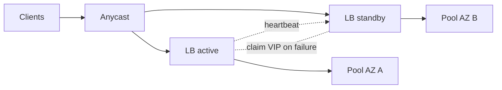

# Load Balancer Failover

## 1. One-Line Definition
Load balancer failover is the set of techniques — active-passive VIP takeover, active-active pairs, Anycast, and health-driven promotion — for keeping traffic flowing when the load balancer itself, rather than a backend, becomes the broken point.

## 2. Why Do We Need It?
The load balancer is the front door, and by design it funnels *all* traffic through one logical path. That concentration makes it a single point of failure of the worst kind: it doesn't just lose one backend, it loses every backend behind it. Everything about scaling and high availability downstream is pointless if the door itself is a single machine that can die.

## 3. Simple Intuition
Your city has 100 shops behind one reception desk. The desk is a great idea for routing — until the receptionist takes the day off and nobody can reach *any* shop. So you hire a second receptionist who shadows the first, shares the same phone number, and the moment the first waves, answers the line. If the whole building burns, you pre-arrange a second building on the same maps.

## 4. What Happens Without It?
A single LB machine fails → DNS still points clients at its now-dead IP → total outage, even though every backend is healthy and complaining about zero traffic. The irony: the system designed to remove a single point of failure reintroduces one at its own layer, bigger than any backend's.

## 5. Core Idea
- **Active-passive / VIP takeover:** two LBs share one virtual IP (VIP). The standby only advertises the VIP once the active fails, via a heartbeat protocol (VRRP-style/keepalived) — failover in seconds, but one idle mid-failover gap.
- **Active-active:** N LBs each serve real traffic and advertise a shared or per-LB VIP/Anycast; no idle capacity, but state (sessions, sticky cookies, in-flight) must be either externalized or tolerated across balancer instances (see [[sticky-sessions|Sticky Sessions]]).
- **Layered with DNS/Anycast:** [[dns-load-balancing|DNS Load Balancing]] steers clients to whichever LB pool is alive, and [[geo-dns-anycast|Geo-DNS and Anycast]] hides several LB instances behind one advertised address.
- **Bias of capacity:** plan so one surviving LB can carry the full load — a failed half shouldn't saturate the survivor.
- **Egress and connections:** a stateful L4 LB holds NAT mappings; takeover needs state sync or connection restart. Prefer stateless L7 or state-sync-capable L4 for clean failover.

## 6. Important Terminology

| Term | Simple Meaning |
|------|----------------|
| VIP | Virtual IP exposed to clients |
| VIP takeover | Standby claims the same VIP on failover |
| Heartbeat / VRRP | Liveness link between LB peers |
| Active-passive | One serves, one shadows |
| Active-active | All peers serve, all are required |
| Anycast | Several LBs advertise one address |
| State sync | Replicating LB connection/session state |
| Split brain | Both peers claim the VIP |
| Failover zone | The LB failure domain (rack/AZ/region) |

## 7. Basic Architecture



## 8. Request or Data Flow
1. Clients resolve the VIP/Anycast address and reach the active LB.
2. The heartbeat between the two LBs confirms liveness every tick.
3. Active LB dies: heartbeat times out; the standby claims the VIP (or Anycast reroutes at the network layer).
4. New traffic lands on the standby; in-flight connections on the dead LB are lost unless state was synced.
5. Health checks and backend pools continue as always on the surviving balancer.

## 9. Practical Example
**Regional API (assumptions):** one AZ, two LBs, strict uptime.
- Active-passive with VRRP: failover in ~3s (missed heartbeats), small but nonzero gap.
- To cut the gap further, run active-active: two LBs behind a short-TTL Anycast address — anycast propagation plus routing metrics make the surviving peer pick up traffic within seconds without a VIP hand-over.
- The pool's 80 backends are stateless, so pulling all of them under either LB carries zero reconfiguration risk.

## 10. Scaling
- **Fleet scaling:** each LB has connection and TLS CPU ceilings — scale by adding active-active peers behind Anycast, never by making one VIP bigger; plan so any subset can handle the whole load.
- **Region scaling:** LB failover composes with [[regional-failover|Regional Failover]] and [[multi-region-models|Active-Active vs Active-Passive Regions]]: the LB is per-region, DNS is cross-region.
- **State scaling:** active-active with stateful L4 requires syncing NAT/session state between peers — cost and complexity grow with connection rate; stateless L7 or externalized sessions scale without that tax.

## 11. Reliability and Failure Scenarios

| Failure | What Happens | Detection | Recovery | Trade-off |
|---------|--------------|-----------|----------|-----------|
| Active LB dies | 0 new traffic routed | Heartbeat timeout | Standby claims VIP (~seconds) | idle standby gap |
| Both LBs in same rack die | Zone-level outage | N/A | Manual/cell-level failover | rack co-location |
| Split brain | Both claim VIP, packets flap | Role arbitration, fencing | Quorum/lease owner | fencing complexity |
| Stateful L4 dies | Mid-stream connections reset | Connection error metrics | State-synced LB resumes | sync cost |
| Health-check flapping | VIP bounces between peers | Flap counters | Hysteresis on claim | detection delay |
| Anycast propagator dies | Regional steering degrades | Route monitoring | DNS fallback | DNS TTL |

## 12. Consistency and Correctness
LB failover is about routing, but correctness bites at two seams: session/connection state (only exists if synced or externalized — see [[sticky-sessions|Sticky Sessions]]) and operation ordering in stateful balancers (an un-synced takeover resets the NAT table). Prepare for exactly-once-idempotent retries behind the LB so a small routing abort doesn't cascade; idempotent backends (see [[idempotency|Idempotency]]) turn an LB flap into a retry, not a data bug.

## 13. Performance
- Active-passive wastes half the LB capacity; active-active uses all of it but adds state-sync overhead on L4.
- Failover time is the latency of detection: heartbeat interval + threshold + claim propagation on VIP, versus routing-metric convergence time on Anycast.
- Choose the trade: VIP takeover is deterministic and fast-ish with idle capacity; Anycast fails in seconds with capacity efficiency but depends on network convergence.

## 14. Security
- LB peers and VIP-claim messaging are control-plane channels: encapsulate and authenticate them (the fake-peer reservation attack claims a VIP you don't own).
- Harden the VIP boundary itself — the LB is the security edge: DDoS scrub, WAF, TLS, and it is exactly where you want a cloud-managed LB to abstract the failover plumbing.
- Never leak standby/peer IPs into public routing.

## 15. Trade-Offs

| Choice | Advantages | Disadvantages | When to Use |
|--------|------------|---------------|-------------|
| Active-passive (VIP) | Deterministic, simple control | Half capacity idle, failover gap | Strict one-at-a-time ops |
| Active-active (Anycast) | Full capacity, no idle LB | Network convergence dependence | High availability, strict latency |
| Managed cloud LB | Ops-free failover, scrub | Vendor abstraction, cost | Default in the cloud |
| L4 + state sync | Lossless connections | Sync cost, complexity | Streaming, VPN-ish |
| L7 stateless | No state sync for sessions | In-flight re-fetch on failover | HTTP APIs, most services |

## 16. Common Mistakes
- Treating an LB pair in one rack/AZ as "HA" — a rack or AZ failure takes both (spread LB pairs across failure domains).
- Sizing LBs so a single failure saturates the survivor — capacity planning must assume one peer is gone.
- Keeping backend state behind a stateful LB and discovering that takeover resets the NAT table.
- An unsynced VIP claim (split brain) flapping routes — fencing and quorum prevent this.
- Forgetting the failover test is not a vacuum: verify idle-standby actually serves while the primary is down, during a real drain (see [[health-checks|Health Checks]]).

## 17. HLD vs LLD Boundary
HLD: LB redundancy mode (active-passive vs active-active vs Anycast), failure domains, capacity math with one peer down, state-sync policy, interplay with regional failover and DNS. LLD: VRRP/keepalived config, Anycast routing tables, the heartbeat implementation, VIP claim arbitration and fencing scripts.

## 18. Interview Questions

### Beginner
- Why is a single load balancer a worse SPOF than a single backend?
- What is the difference between active-passive and active-active LB failover?

### Intermediate
- Two LBs in the same rack — why is that not HA? Where do you actually put the pair?
- During a takeover, what happens to in-flight connections, and what decides that?

### Advanced
- Design failover so one dead LB in a region costs near-zero RPO and callers even retry transparently.
- How do you design to survive a full region LB tier failure (not just one box)?

## 19. Interview Memory Summary

> [!abstract]- Interview Memory Summary

### Remember

- The LB is a SPOF with the whole fleet behind it — failover is mandatory.
- Active-passive: VIP takeover via heartbeat; one peer idle.
- Active-active + Anycast: full capacity, network-side failover.
- State (NAT, sessions) only survives if synced or externalized.
- Capacity plan must assume a peer is gone.

### 30-Second Explanation

Never run one LB: pair it active-passive and let the standby take the VIP on heartbeat loss, or run active-active LBs behind Anycast/short-TTL DNS so a dead instance reroutes at the network layer within seconds. Spread the pair across failure domains, externalize or sync the connection/session state you want to survive, and size every survivor to carry the full load.

### Interview Traps

- Calling a single rack's LB pair "HA" — one failure domain takes both.
- Claiming lossless failover without accounting for in-flight connections.
- Ignoring split brain between LB peers.
- Sizing so a single peer death saturates the survivor.

### Key Trade-Off

Active-passive gives a deterministic, fast VIP handover but keeps half your LB capacity idle and still cuts long connections on takeover; active-active Anycast uses all capacity and fails faster at the network layer, but depends on convergence and needs state externalized.

## 20. Related Concepts

### Prerequisites

- [[load-balancing|Load Balancing]] — the workload the failover is protecting; without it there is nothing to fail over.
- [[availability|Availability]] — the nines this technique preserves.

### Commonly Used Together

- [[health-checks|Health Checks]] — the trigger for any promotion decision.
- [[dns-load-balancing|DNS Load Balancing]] — the layer above that routes to whichever LB set is alive.
- [[geo-dns-anycast|Geo-DNS and Anycast]] — how one address fronts many live LB instances.
- [[autoscaling|Autoscaling]] — capacity reaction alongside failover.

### Alternatives

- [[failover|Failover]] — testing the same ideas in the database layer.
- [[standby-models|Standby Types]] — the active-passive/active-active vocabulary more generally.

### Advanced Concepts

- [[regional-failover|Regional Failover]] — LB failover composed up and across regions.
- [[multi-region-models|Active-Active vs Active-Passive Regions]] — choosing the region topology failover must express.

Related planned topics (not authored yet): `split-brain` (the two-leaders danger in LB pairs), `quorum`.

## 21. References
VRRP/keepalived documentation; VPC and Anycast routing docs; AWS ELB/ALB multi-AZ and target-group failover behavior. Verify current cloud-managed LB failover semantics with vendor docs.

## 22. Active Recall

> [!question]- Why is the load balancer the worst possible place for a single point of failure?
> It funnels every client toward every backend. Losing a backend loses that backend; losing the LB loses the entire fleet behind it — one small machine becomes a downstream outage of everything it was meant to protect.

> [!question]- Active-passive VIP takeover: walk the failure timeline.
> The heartbeat between peers stops. After a threshold of missed beats, the standby claims the shared VIP (VRRP-style), updates its ARP/routing advertisement, and begins serving. New traffic arrives at the same address but lands on the standby; the gap is roughly detection interval plus claim propagation.

> [!question]- Trade-off: stateful L4 (NAT mappings) vs stateless L7 for failover — what's at stake?
> An L4 LB holds NAT mappings that map client connections to backends; unsynced takeover resets those mappings and mid-stream connections die. A stateless L7 LB stores nothing per client (session state external), so takeover only costs re-fetching app state on retry. State-syncing an L4 pool is possible but costs real sync bandwidth per connection.

> [!question]- Failure scenario: active-active LBs all in one AZ, and that AZ fails. Diagnose the design flaw and fix it.
> The failover tier was itself single-AZ — the redundancy was within, not across, failure domains. Fix: spread the LB pair across AZs (or run per-AZ pairs behind an Anycast address), so an AZ failure reroutes to another region's or AZ's LB while backends in dead AZs drain.

> [!question]- Interview scenario: design LB failover for a strict "near-zero visible" SLA with fast deploy cadence.
> Run active-active LBs behind short-TTL Anycast in each region; externalize all session state so takeover doesn't strand clients; chain DNS + Geo steering above for region-level events (see [[regional-failover|Regional Failover]]); and size every LB to carry 100% so one death never saturates the survivor.

> [!question]- What is split brain in this context, and how do you stop it?
> Both peers believe they are the active VIP holder and both advertise/accept traffic — flapping routes, duplicate state, unpredictable storms. Prevention is a quorum/lease on a shared coordinator plus fencing: a peer that can't get the lease stops serving even if it still hears its own heartbeats.

## 23. When Should I Use This?

### Use it when

- Availability of the whole tier matters (any real service).
- The LB carries a strict latency or connection budget worth protecting.
- You have more than one failure domain to spread peers across.
- Clients already retry or re-resolve on connection death without user-visible hurt.

### Avoid it when

- A single cloud-managed LB already abstracts failover internally (you inherit it).
- Traffic is tiny and a few seconds of downtime is acceptable (complexity for nothing).
- There is no second failure domain to place the pair in.

### What problem does it solve?

It removes the largest and most total single point of failure in the architecture — the front door of the whole service — by giving the LB's address multiple live hosts: VIP takeover or Anycast make any single LB failure invisible, seconds-long, and full-capacity.

### What problem does it NOT solve?

It does not make LB failure lossless by itself (in-flight connections need state sync/externalization), cannot protect against a failure domain that contains the whole pair, and does not scale — it's redundancy for the door, not a substitute for an autoscaled pool behind it.

## 24. Decision Connections

Decisions that go together with load balancer failover:

- [[load-balancing|Load Balancing]] — the workload any redundancy scheme is protecting.
- [[health-checks|Health Checks]] — the detection that decides who is fit to promote.
- [[dns-load-balancing|DNS Load Balancing]] — the layer steering clients to the live LB set.
- [[geo-dns-anycast|Geo-DNS and Anycast]] — one address, many LB instances.
- [[failover|Failover]] — the general vocabulary (RPO/RTO, active/passive).
- [[standby-models|Standby Types]] — mapped to whole LB instances.
- [[regional-failover|Regional Failover]] — the LB tier's boss when the whole region dies.
- [[idempotency|Idempotency]] — makes client retries after an LB flap safe.

Decision tree:

```
Can one LB instance failure take the whole service down?
    |
    +-- Yes, and availability matters?
    |      → [[load-balancer-failover|Load Balancer Failover]]
    |         |
    |         +-- Deterministic handover, peak ops?    → active-passive VIP takeover
    |         +-- Full capacity utilization?           → active-active + Anycast
    |         +-- In-flight connections must survive?  → state sync or stateless L7
    |         +-- Rack or AZ might fail?               → spread peers across failure domains
    |
    +-- Cross-region events?
    |      → [[regional-failover|Regional Failover]] + [[geo-dns-anycast|Geo-DNS and Anycast]]
    |
    +-- Region-grade, multi-region topology?
           → [[multi-region-models|Active-Active vs Active-Passive Regions]]
```