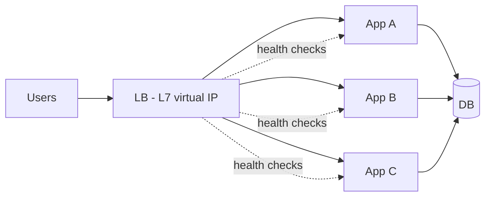

# Load Balancing

## 1. One-Line Definition
A load balancer (LB) sits in front of multiple backend instances and distributes incoming requests across them so no single instance is overwhelmed.

## 2. Why Do We Need It?
It is the enabler of **horizontal scaling and high availability**: with an LB, you can add/remove instances at will, survive individual node failures, and spread traffic so nodes stay below saturation. Without one, you have a single entry point that is both a bottleneck and a single point of failure.

## 3. Simple Intuition
Airport check-in: instead of one counter everyone queues at, there's a coordinator who sends each passenger to the shortest counter line, skips closed counters, and takes a counter offline for cleaning without stopping the airport.

## 4. What Happens Without It?
Clients must hard-code a single server IP. That server is the ceiling (throughput capped), the SPOF (it dies → everything dies), and unmaintainable (updates mean downtime). Growth is stuck at one machine.

## 5. Core Idea
An LB terminates client connections and forwards requests to a backend picked by a **routing algorithm**, masking the backend topology. Key concepts:
- **Layers:** **L4** balances on TCP/UDP + IP (fast, no content inspection); **L7** sees HTTP (paths, headers, cookies) → richer routing (e.g., `/api/*` → service A, `/static/*` → CDN), and can do TLS termination, compression, gzip.
- **Algorithms:** round robin → weighted → least connections → least response time → IP hash → consistent hash. Choose by workload (long connections ⇒ least connections; cache-affinity ⇒ hash; bursty ⇒ least response time).
- **Health checks:** LB probes backends (active probes / passive success-failure counts); unhealthy = removed from rotation.
- **Stateful concerns:** sticky sessions (pin a user to a node) harm elasticity; draining lets in-flight requests finish before a node is removed.

## 6. Important Terminology

| Term | Simple Meaning |
|------|----------------|
| Virtual IP (VIP) | The LB's public IP that backs the service |
| L4 vs L7 | Transport-level vs HTTP/application-level balancing |
| Backend pool | The set of healthy instances traffic is fanned out to |
| Health check | Probe that decides whether a backend is usable |
| Drain | Stop new connections, finish in-flight, then remove |
| Sticky session | Pin a client to a fixed backend |
| Round robin | Spread evenly in order |
| Least connections | Send to the least-busy backend |
| Consistent hash | Same key always goes to same backend (cache affinity) |

## 7. Basic Architecture



## 8. Request or Data Flow
1. Client → LB (via DNS → VIP).
2. LB selects a healthy backend (algorithm of choice), possibly routing by path/header (L7).
3. If sticky, requests for the same session go to the same node; else any node.
4. Node processes, replies; LB may cache/compress (L7), then forwards response.
5. Health checks continuously prune dead nodes; autoscaler adds nodes to the pool.

## 9. Practical Example
**Video API (assumptions):** reads high, uploads rare.
- L7 LB routes `/upload` to a small pool (heavy write) and `/stream`/`/watch` to a stateless pool scaled by CPU.
- Consistent hashing on user ID keeps per-user caches warm without pinning sessions.
- Drain-on-deploy with a 30-60s window → rolling updates with zero dropped requests.

## 10. Scaling
- **LB scale-out:** run LBs as active-active pairs (Anycast/VIP failover). LB itself can bottleneck (connection count, CPU for TLS termination) — size and split by domain/path (separate inbound API vs WebSocket).
- **Backend scaling:** add/remove nodes; autoscaling policies (HPA) churn the pool — LBs handle it transparently (with connection draining on scale-down).
- **Read scaling:** mixing LB with cache/replicas: LB to replicas for read paths, single writer for writes.
- **Surge scaling:** LB absorbs bursts by queueing briefly; must drop/return 503 (load shedding) beyond capacity instead of timing out.

## 11. Reliability and Failure Scenarios
- **Backend death:** health check kicks it out within N seconds → clients see no errors (grace period required for in-flight).
- **LB failure:** LB itself is a SPOF — run active-passive (VIP moves, e.g. keepalived/cloud LB) or active-active with DNS/Anycast.
- **Health-check false negatives:** overly strict probe marks healthy node dead → capacity halves; too lax → routes to dead node. Tune probe interval/timeouts.
- **Sticky-session death:** everyone pinned to the dead node loses state → avoid stickiness or expect re-logins.
- **Retry storm behind LB:** retries reconnect through LB and hammer it during a partial outage → backoff + jitter + circuit breakers on clients.

## 12. Consistency and Correctness
LBs are stateless, but stickiness + stateful backends reintroduce consistency logic. In HLD terms: prefer stateless backends so an LB can freely shuffle requests; if state must persist, push it to shared stores (Redis/DB) rather than sticky nodes.

## 13. Performance
- L4 is faster (kernel-level, no payload parsing); L7 adds TLS termination + routing but enables caching/compression.
- Connection count is often the LB bottleneck (many keep-alive connections). HTTP/2 multiplexing reduces connection count dramatically.
- Health checks themselves consume capacity; keep their interval sane.

## 14. Security
- LB is the front door: TLS termination, WAF integration, header normalization (remove injected `X-Forwarded-For`), rate limiting per IP/token, and blocking known-bad bots/DDoS (with cloud scrubbers at a higher tier).
- Never expose internal backend addresses beyond the LB (network segmentation).

## 15. Trade-Offs

| Choice | Advantages | Disadvantages | When to Use |
|--------|------------|---------------|-------------|
| L4 LB | Very fast, protocol-agnostic | Can't route by URL/cookies | TCP/UDP, WebSocket, low-level |
| L7 LB | Rich routing, TLS/compression | Higher CPU, parses payloads | HTTP APIs, microservices |
| Round robin | Even, simple | Ignores load | Homogeneous, short requests |
| Least connections | Better for long/busy conns | Slightly more state tracking | Streaming, websockets |
| Consistent hash | Cache affinity, less churn | Skew if few backends | Cache, sessions, sharded clients |
| Sticky sessions | Simplicity with stateful apps | Bad elasticity | Legacy/migrations only |

## 16. Common Mistakes
- Single LB = "we have load balancing" but the LB is the SPOF (need LB redundancy).
- Not setting connection draining → deploys drop in-flight requests.
- Using round robin for wildly dissimilar backend weights (media vs tiny JSON).
- Forgetting backend health varies — always pair algorithm choice with health checks.
- "We load balance the app, so we're horizontally scalable" while the DB is a lone primary — name every tier.

## 17. HLD vs LLD Boundary
HLD: LB tier placement, algorithm/mode (L4 vs L7), redundancy model, draining policy, autoscaling coupling. LLD: the LB's config file, health-check endpoint implementation in a service, client-side retry knobs.

## 18. Interview Questions

### Beginner
- What does a load balancer do, and why do we need one?
- What is the difference between L4 and L7 load balancing?

### Intermediate
- When would you use least-connections over round robin?
- How does connection draining make deployments safe?

### Advanced
- Design an LB layer that survives a full node, AZ, and LB failure.
- A consistent-hash LB gives cache affinity; what happens when nodes are added or removed?

## 19. Interview Memory Summary

> [!abstract]- Interview Memory Summary

### Remember

- LB = scale-out enabler + high availability.
- L4 = fast TCP/UDP; L7 = content-aware HTTP (routing, TLS, compression).
- Algorithms + health checks + draining = the operational core.
- The LB itself needs redundancy (active-active / VIP failover / Anycast).
- Sticky sessions vs statelessness is the recurring tension.

### 30-Second Explanation

Put a VIP in front of N stateless nodes: health checks prune dead backends, connection draining protects deploys, consistent hash gives cache affinity, and you run two LBs (VIP failover/Anycast) so the LB itself is never the SPOF.

### Interview Traps

- "One load balancer" as the HA solution — a single LB is a SPOF; talk about VIP failover / multiple LBs.
- No connection draining → deploys drop in-flight requests.
- Round robin over wildly dissimilar backend weights (media vs tiny JSON).
- Forgetting backend health varies — always pair your algorithm with health checks.
- "We load balance the app, so we're horizontally scalable" while the DB is a lone primary — name every tier.

### Key Trade-Off

An LB buys horizontal scaling and HA but becomes a front-door SPOF and a potential bottleneck (connection count, TLS CPU) that itself needs redundancy — and stickiness quietly reintroduces the statefulness you wanted to remove.

## 20. Related Concepts

### Prerequisites

- [[http-and-https|HTTP and HTTPS]] — L7 balancing operates on HTTP methods, paths, and headers.
- [[dns|DNS]] — clients reach the LB's VIP through DNS; GeoDNS can front the LB tier.

### Commonly Used Together

- [[reverse-proxy|Reverse Proxy]] — most production "LBs" are L7 reverse proxies; the duties overlap.
- [[scalability|Scalability]] — the LB is the mechanism that makes stateless horizontal scaling possible.
- [[caching|Caching]] — consistent-hash routing keeps per-node caches warm.
- [[horizontal-vs-vertical-scaling|Horizontal vs Vertical Scaling]] — the LB is the enabler of the horizontal axis.

### Alternatives

- [[dns|DNS]] (DNS round-robin spreads clients coarsely with zero backend health awareness)

### Advanced Concepts

- [[consistent-hashing|Consistent Hashing]] — cache-affinity routing with minimal churn when the pool changes.
- [[circuit-breaker|Circuit Breaker]] — client-side protection so retries behind the LB don't cascade.
- [[rate-limiter|Rate Limiter]] — the LB is the natural home for edge rate limiting.

Related planned topics (not authored yet): auto-scaling, health-checks, consistent-hashing-load-balancing.

## 21. References
Standard L4/L7 load-balancer documentation (HAProxy, NGINX, F5, AWS ELB/ALB, GCP). Verify current feature sets with vendor docs.

## 22. Active Recall

Test yourself before revealing each answer.

> [!question]- What does a load balancer do, and why is it needed?
> It sits in front of multiple backends and spreads incoming requests across them so no single instance is overwhelmed — the enabler of horizontal scaling and HA. Without one, clients hard-code a single IP that is both a throughput ceiling and a single point of failure.

> [!question]- What is the difference between L4 and L7 load balancing?
> L4 balances on TCP/UDP + IP (kernel-level, fast, no payload inspection). L7 sees HTTP — paths, headers, cookies — enabling richer routing (e.g., `/api/*` → service A), plus TLS termination and compression, at higher CPU cost.

> [!question]- When would you use least connections over round robin?
> Round robin spreads evenly but ignores load — fine for homogeneous, short requests. Least connections sends to the least-busy backend, which fits long-lived or heavy connections (streaming, WebSockets) where one slow session would otherwise skew the picture.

> [!question]- How does connection draining make deployments safe?
> Draining stops new connections to a node while letting in-flight requests finish, then removes it. With a 30-60s drain window, rolling updates and scale-downs drop zero in-flight requests.

> [!question]- Trade-off: sticky sessions pin a user to one node — when is the price actually paid?
> Sticky sessions simplify stateful apps, but they kill elasticity: a pinned node can't be scaled down or replaced without re-login, load skews by session distribution, and if the node dies everyone pinned to it loses state. Prefer stateless backends with shared stores (Redis/DB) over stickiness.

> [!question]- Design an LB tier that survives a full node, AZ, and LB failure.
> Nodes: health checks prune within a couple of seconds. AZ: backends spread across AZs with the LB pool spanning them. LB itself: run active-active LBs behind Anycast/VIP failover so a dead LB machine reroutes at the network level (keepalived/cloud LB) — and size so one LB can carry the full load.

> [!question]- A consistent-hash LB gives cache affinity. What happens when nodes are added or removed?
> Only the keys mapped to the changed node move (1/N rehash with virtual nodes); most keys keep the same backend and stay cache-warm. Without consistent hashing, every membership change rehashes everything and effectively cold-caches the whole fleet.

> [!question]- Interview scenario: your service is "load balanced" but still dies. Name the tiers to check.
> Check every tier, not just the app: the LB itself (redundancy + connection/TLS capacity), the health checks (false negatives halve capacity; false positives route to dead nodes), the DB (a lone primary is a SPOF and a write bottleneck — balancing the app doesn't scale writes), and the surge path (queue briefly or return 503/load-shed instead of timing out).

## 23. When Should I Use This?

### Use it when

- You have multiple backend instances and want horizontal scaling.
- Instance failures must not be visible to clients (health checks + failover).
- You want one stable entry point (VIP / single DNS name) for clients.
- You need content-aware routing (L7) or TLS termination at a shared edge.
- You deploy often and need zero-dropped-request rollouts (draining).

### Avoid it when

- A single instance has ample headroom — an extra hop for nothing.
- There are a few fixed clients — hard-coding the address is simpler.
- Balancing must happen at L3/network level (BGP/Anycast is the tool).
- Backends can't be made stateless — stickiness will cap elasticity and complicate scaling.

### What problem does it solve?

Problem: clients hard-code one server IP, which is a throughput ceiling, a single point of failure, and unmaintainable. Bottleneck: one machine must absorb everything, and when it dies, everyone dies. Solution: an LB masks the backend topology — it fans traffic across a healthy pool, prunes dead nodes via health checks, drains for deploys, and lets the pool grow and shrink freely.

### What problem does it NOT solve?

An LB doesn't scale writes or the database tier (a lone primary stays a bottleneck), doesn't provide availability by itself (it's a component that needs its own redundancy), doesn't fix stateful backends, and doesn't make unhealthy code healthy — it merely routes around what it can detect.

## 24. Decision Connections

Decisions that go together with load balancing:

- [[reverse-proxy|Reverse Proxy]] — decide where LB ends and ingress duties (TLS, WAF, caching, routing) begin; often the same box.
- [[dns|DNS]] — GeoDNS/Anycast point clients at the LB VIP; DNS TTL bounds how fast you can reroute the front door.
- [[http-and-https|HTTP and HTTPS]] — protocol choice (HTTP/2 multiplexing) cuts the connection count that limits LB capacity.
- [[scalability|Scalability]] — the LB is what turns N stateless nodes into one scalable service.
- [[consistent-hashing|Consistent Hashing]] — algorithm choice (consistent hash) for cache affinity and low-churn membership changes.
- [[caching|Caching]] — consistent-hash routing keeps per-node caches warm; decide local vs distributed cache with the LB in mind.
- [[circuit-breaker|Circuit Breaker]] — client-side, so retries behind a degraded LB don't amplify an outage.
- [[rate-limiter|Rate Limiter]] — the LB tier hosts per-IP/per-token edge limiting.

Decision tree:

```
Incoming requests must spread across multiple instances
    |
    +-- Only distribution among equals needed?
    |      → [[load-balancing|Load Balancing]]
    |         |
    |         +-- Content-aware routing (path/header)? → L7
    |         +-- TCP/UDP, max speed?                 → L4
    |         +-- Homogeneous short requests?         → round robin
    |         +-- Long/busy connections?              → least connections
    |         +-- Cache affinity / minimal churn?     → consistent hash
    |         +-- Backends still stateful?            → sticky sessions (last resort)
    |
    +-- Also need TLS/WAF/caching/route duties?
    |      → [[reverse-proxy|Reverse Proxy]] (the LB often is one)
    |
    +-- One instance with headroom?
           → skip the LB until you scale out
```