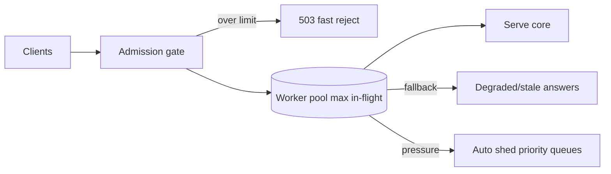

# Overload Protection

## 1. One-Line Definition
Overload protection keeps a system inside its capacity envelope by gating incoming work — admission control, bounded queues, concurrency limits, and shedding — so throughput stays high and latency stays sane when demand exceeds supply.

## 2. Why Do We Need It?
Demand is spiky and capacity is expensive. When demand exceeds capacity, unprotected systems don't "get slow" gracefully — they enter meltdown: queues balloon, latency climbs, retries pile on, clients time out, and throughput collapses *below* normal levels. Overload protection caps the admitted load at what the system can actually serve, protecting the very same work that's being shed.

## 3. Simple Intuition
A bakery sells 100 loaves an hour max. When a festival triples demand, the baker doesn't try to bake 300 loaves — she takes orders ahead, turns away clearly-impossible ones politely, and keeps quality perfect for the 100 she can make. Her system stayed sane by *admitting less*, which is the whole trick: refusing some work protects the work she keeps.

## 4. What Happens Without It?
Saturation → unbounded queues (see [[backpressure|Backpressure]]) → latency well past client timeouts → retries multiply the incoming dispatch → queued-but-invisible repeated work → everyone times out, throughput tanks to near zero, and even one overloaded endpoint contaminates the steady-state path. This is the "fail-better-under-load" phenomenon: exhaustion breeds more load.

## 5. Core Idea
- **Admission control:** decide at the door which requests enter the system at all. Classify (critical vs best-effort), set concurrency limits (max in-flight), and reject the excess with a cheap, explicit signal — the *admission* layer is upstream of every queue.
- **Concurrency, not QPS, is the real gate:** what kills a server is simultaneous in-flight work (CPU, memory, connections). Use max-in-flight limits and thread/worker pools sized to what the hardware can pay for.
- **Gate at every resource, not just one:** CPU, DB connections, memory, outbound sockets — an overload gate on one resource while another melts is theater. Apply the strictest constraint where the system is actually bound.
- **Queue with a cap, LIFO-serve:** bounded queues for smoothing bursts, and under pressure prefer LIFO (newest-first) with a small queue so requests don't queue-die; deep FIFO queues under overload are effectively dead requests breathing CPU (see [[backpressure|Backpressure]] on bounding).
- **Shed and fail fast:** under pressure, drop the least-important categories first (background jobs, analytics pings, non-critical writes) and return quick rejections instead of queueing (see [[graceful-degradation|Graceful Degradation]] for what stays served).
- **Feed the signal:** overload state must reach peers — LB weight down, circuit half-open, autoscaler urged up — so demand re-routes while the box sheds ([[autoscaling|Autoscaling]], [[circuit-breaker|Circuit Breaker]]).

## 6. Important Terminology

| Term | Simple Meaning |
|------|----------------|
| Admission control | The door: which requests enter the system |
| In-flight limit | Max simultaneously executing requests |
| Bounded queue | Finite wait-for-a-slot structure |
| LIFO under load | Serve newest-first to avoid queue-dying |
| Shedding | Active drop of low-priority work |
| Fail fast | Return quickly rather than queue to death |
| Retry pressure | Retries that re-admit dropped work |
| Capacity envelope | The safe region of load vs latency |

## 7. Basic Architecture



## 8. Request or Data Flow
1. Request reaches the admission gate; classification tags it (critical/best-effort).
2. If in-flight count is at the ceiling, the gate returns a fast, explicit rejection — no queueing.
3. Otherwise the request is admitted to a bounded worker pool sized to real capacity, and served behind concurrency limits.
4. Under extended pressure the shedder drops lowest-priority queues first; the critical path keeps serving, and latency stays within the envelope.
5. Overload telemetry updates weights/circuit state so healthy peers absorb the remainder.

## 9. Practical Example
**Payments API burst (assumptions):** steady 5k QPS, flash-sale to 40k.
- The admission gate caps in-flight payments at 300 concurrent executions — the DB's true ceiling is ~350 conns, so 50 headroom.
- The excess (35k QPS) gets immediate `503 Retry-After` with a classification that rejects analytics pings outright before anything else.
- Under sustained load, background report jobs go to a shed queue (retried later); checkout stays at full throughput and p99 stays under 600ms.

## 10. Scaling
- **What breaks:** gates tuned for one resource while another saturates; shedding orders that get themselves re-admitted via retries; queues sized to "nice" that become death queues under spikes.
- **What to do:** size gates from the *real* bottleneck (measure per-resource ceilings; recompute as hardware changes); set upward capacity lever via [[autoscaling|Autoscaling]] so admission drains pressure instead of just dropping; re-check on deploy if the bottleneck moved.
- **Distributed scale:** overload protection is only credible equipped with observability at every node — a box that sheds while its LB peers think it's quiet is mid-repoint (see [[golden-signals|Golden Signals]]).

## 11. Reliability and Failure Scenarios

| Failure | What Happens | Detection | Recovery | Trade-off |
|---------|--------------|-----------|----------|-----------|
| Demand spike | Admissions capped, p99 stays flat | Reject-rate metric | Autoscale + shed | drops vs meltdown |
| Dependency slows | In-flight ceiling saturates on slow calls | Concurrency queue depth | Circuit trip + shed that dependency | tail vs completeness |
| Retry re-admission | Shed work returns as its own retry storm | Duplicate/retry rate | Backoff + jitter + breaker on re-admit | smoothing |
| Mis-tuned limit | Legit traffic rejected early | False-reject rate | Calibrate vs reserve | headroom cost |
| Broker/dead letter | Shed work lost silently | Shed counters vs DLQ | Durable sheds, tracking | matching semantics |

## 12. Consistency and Correctness
Shed, reject, or degrade — but never commute correctness. Rejected requests may legitimately be retried (that's the contract), so the *rejection* must be idempotent-checkable and the *shed* must be restartable-without-double-effect (see [[idempotency|Idempotency]]). Ordering-sensitive critical writes should be admitted before best-effort reads even if the reads are cheaper — classification is a consistency choice as much as a capacity one.

## 13. Performance
- The design goal is a *flat* latency versus load curve: reject early (microseconds of path cost) rather than queue-die (seconds of wasted holding + amplification).
- Admission keeps throughput at the envelope ceiling — which *is* the max the system can do — while unwanted late-queueing normally drives throughput below it.
- Cost per rejection is tiny when done at the door; that's the point: cheap refusal beats expensive collapse.

## 14. Security
- The rejection surface is a metering bipartisan hob: an attacker who measures reject rates learns exact capacity — rate-limit the *reject* path and keep capacity numbers internal.
- Admission should run on classification derived server-side, not client-trusted tags (a client labeling itself "critical" approximately the whole world's best-effort to the back of the line).

## 15. Trade-Offs

| Gate | Advantages | Disadvantages | When to Use |
|------|------------|---------------|-------------|
| Max in-flight | Maps to real resource cost | Hard cap ignores request value | Any request serving |
| QPS-based reject | Simple math | Misleads when requests vary in cost | Coarse T-shirt sizing |
| Bounded queue + reject | Smooths bursts | Tail latency in the queue | Bursty but bounded work |
| LIFO serve on overload | Fresh requests win | Older work starves | Latency-critical, time-sensitive services |
| Priority shedding | Protects critical path | Complexity, fairness questions | Multi-class services |

## 16. Common Mistakes
- Gating QPS instead of in-flight — a slow-request tsunami still drowns a "5k QPS" gate.
- One gate per node while a shared resource (the DB) is the real ceiling — the node sheds in unison but the DB melts anyway.
- Shedding that re-admits itself as retries — drop by category AND teach clients backoff ([[retry-and-timeout|Retry and Timeout]]).
- Huge queues under the theory "we'll get to them" — deep queues under overload are time bombs (see [[backpressure|Backpressure]]).
- Not crossing the wire: protection without feeding LB weight, circuit, and autoscale signals is a box shouting alone in the dark.

## 17. HLD vs LLD Boundary
HLD: capacity envelope per tier, admission classification policy, in-flight ceilings, shed priorities, burst-queue sizing, LIFO-vs-FIFO under load, coupling to autoscale/circuit. LLD: the admission-gate implementation (semaphore/max-in-flight bookkeeping), queue types and their caps, shed-queue wiring, per-request classification tags, the observability metric plumbing for envelope state.

## 18. Interview Questions

### Beginner
- What is the difference between rate limiting and overload protection?
- Why is QPS the wrong number to gate on?

### Intermediate
- Diagram the admission gate placement for a single service with a shared DB — where does the true ceiling come from?
- How do you stop shed work from re-entering as retries?

### Advanced
- Design an admission system that degrades per-class (critical vs best-effort) across a fleet sharing one DB.
- How do LIFO under overload and bounded queues interact, and when is one better?

## 19. Interview Memory Summary

> [!abstract]- Interview Memory Summary

### Remember

- Gate in-flight, not QPS; concurrency is the true resource.
- Admission at the door, before queues; cheap rejection beats queue death.
- Bound the queues; under load serve LIFO, shed the low priorities.
- Feed peers the signal: LB weight, circuit, autoscale.
- Capacity is measured; gates are sized from the real bottleneck.

### 30-Second Explanation

Cap the system at its measured capacity envelope: admit requests at the door with a max-in-flight gate, bound any smoothing queue, and under pressure serve newest-first and shed the lowest-priority work first with explicit rejects. Feed that state to the LB, circuit breakers, and autoscaler so the fleet re-routes and scales while a node holds its latency flat — protection that works by admitting less.

### Interview Traps

- Gating QPS while slow tails tank everything.
- Gates per-node with a shared-host bottleneck (DB) left un-gated.
- Shed work returning as retries with no backoff.
- Deep queues after calling them "admission."
- Protection that never tells peers a box is shedding.

### Key Trade-Off

Overload protection buys throughput that stays high and latency that stays flat under spikes — at the price of intentionally dropping or deferring some work, plus the complexity of measuring capacity, sizing gates, and wiring the signal into the fleet.

## 20. Related Concepts

### Prerequisites

- [[backpressure|Backpressure]] — the bounded-queue and reject half of the same problem.
- [[latency-vs-throughput|Latency and Throughput]] — the envelope trade that admission controls.

### Commonly Used Together

- [[circuit-breaker|Circuit Breaker]] — trips the slow dependency so it can't consume in-flight you need.
- [[rate-limiter|Rate Limiter]] — the companion that paces normal ingress.
- [[graceful-degradation|Graceful Degradation]] — what gets served when you shed.
- [[autoscaling|Autoscaling]] — the capacity lever admission must pair with.
- [[retry-and-timeout|Retry and Timeout]] — the discipline that stops rejected work from returning as retries.

### Alternatives

- [[distributed-rate-limiter|Distributed Rate Limiter]] — when limiting must be coordinated fleet-wide.

### Advanced Concepts

- [[golden-signals|Golden Signals]] — the metrics envelope state is read and discharged from.
- [[adversarial-reliability|Adversarial Reliability]] — intentional overload as an attack shape.

Related planned topics (not authored yet): `load-shedding` and `bulkhead` as the mechanical companions.

## 21. References
Google SRE books — chapters on overload and load shedding; the "max in-flight" patterns from Finagle/Hystrix-era docs; CoDel and LIFO queueing under load (BDP literature). Verify current queueing behavior with library docs.

## 22. Active Recall

> [!question]- Why is gating on QPS dangerous, and what should you gate instead?
> A QPS gate trusts that requests cost about the same — but one slow, expensive request holding a DB connection for 10s chews 10x the capacity of a fast one, while a QPS-gated node admits both equally. Gate on max in-flight (concurrency) instead, since simultaneous executing work — CPU, memory, connections — is the real resource being spent.

> [!question]- Trade-off: bounded queue vs pure reject at the door — where does each win?
> A bounded queue smooths bursts: short spikes absorb into a small, tail-limited wait instead of instant rejection. Pure reject at the door wins when wait-for-a-slot costs more than rejection (enhanced, ultra-low-latency services) and there's nothing bursty worth absorbing. Under overload, neither should be a deep FIFO — LIFO-with-cap beats queue-die.

> [!question]- Failure scenario: a popular page overloads the fleet; DP load doesn't help because the shared DB is the ceiling. Fix the design.
> The gates are per-node but the bottleneck is shared — each node's in-flight cap matches its own hardware, so the fleet admits roughly infinitely and collectively melts the DB. Fix: size admission off the *shared* resource (total DB connectors, coordinated per class), plus a fleet-level admission that sheds across nodes, not node-by-node.

> [!question]- Why does shed work come back as retries, and how do you break the loop?
> A rejected or shed request is observed as "failed" by its producer, which naively retries, re-enter, re-reject — a retry storm that shoots at the same gate. Break it: serve Retry-After and honor backoff+jitter at producers ([[retry-and-timeout|Retry and Timeout]]), and let the circuit breaker open so re-admission stops entirely during the shedding window.

> [!question]- Interview scenario: flash-sale with 10x demand against a payments API. Walk the overload-protection design, tier by tier.
> 1) Admission at the gate: classify checkout (critical) vs analytics/best-effort (shed first). 2) In-flight ceiling sized from the DB's connection max with headroom. 3) Excess gets fast 503+Retry-After, never queueing. 4) Background jobs drop to a retry-later shed queue. 5) Autoscale up and lower the LB weight as the box sheds, so peers take the overflow while the critical path stays flat.

> [!question]- How do you combine per-node admission with the shared database reality, from the metrics side?
> Publish per-node and fleet totals separately: in-flight, queue depth, reject rate, shed counter, plus the shared resource's utilization (DB conns, CPU hot spots). Alert on "admission ceiling breached" and "true bottleneck saturation" — those are different incidents — and let the same feed drive autoscale rather than guessing from reject rate alone.

## 23. When Should I Use This?

### Use it when

- Demand exceeds capacity at times and latency must stay bounded through them.
- A shared resource (DB, downstream API) sets the real ceiling worth protecting.
- Some work matters more than other work (multi-class classification pays for itself).
- You can measure the bottleneck and size doors to it.

### Avoid it when

- Demand never nears capacity — a gate is complexity for nothing.
- Every request matters equally and total re-admission of shed work is unacceptable — then protection without shedding is just rejection.
- You can stipulate capacity must always win (buying headroom) and latency limits are soft.

### What problem does it solve?

It makes the system's behavior under excess demand *monotone*: admitted load is capped at capacity, so throughput holds at the envelope, latency stays flat, and the critical path serves — instead of queues and retries turning a spike into a meltdown.

### What problem does it NOT solve?

It can't create capacity (that's autoscaling), can't fix a slow dependency (circuit breaker's job), can't guess what to shed forever (classification needs revisiting), and rejection/having-shed comes from no extra headroom — if drops are unacceptable, you must provision above demand, not protect below it.

## 24. Decision Connections

Decisions that go together with overload protection:

- [[backpressure|Backpressure]] — bounding queues and rejection are the shared mechanism.
- [[circuit-breaker|Circuit Breaker]] — trips the slow dependency to protect in-flight.
- [[rate-limiter|Rate Limiter]] — normal-times pacing; overload keeps the ceiling.
- [[graceful-degradation|Graceful Degradation]] — the served subset that shed work supports.
- [[autoscaling|Autoscaling]] — the capacity lever that lets load in rather than rejecting for too long.
- [[retry-and-timeout|Retry and Timeout]] — the client discipline that stops re-admission storms.
- [[distributed-rate-limiter|Distributed Rate Limiter]] — fleet-coordinated limits when per-node isn't enough.

Decision tree:

```
Demand can exceed capacity at times?
    |
    +-- No — flat load, big headroom
    |      → skip gates; monitor [[golden-signals|Golden Signals]]
    |
    +-- Yes — spikes happen
    |      → [[overload-protection|Overload Protection]]
    |         |
    |         +-- Gate the real resource?        → max in-flight (not QPS)
    |         +-- Bursts to smooth?              → bounded queue; under load LIFO
    |         +-- Multi-class work?              → priority shedding (critical first)
    |         +-- Shared DB / dependency?        → gate fleet-wide, not per-node
    |         +-- Rejected work returns?         → backoff + jitter + [[circuit-breaker|Circuit Breaker]]
    |
    +-- Drops unacceptable?
           → provision above demand ([[autoscaling|Autoscaling]]) instead
```