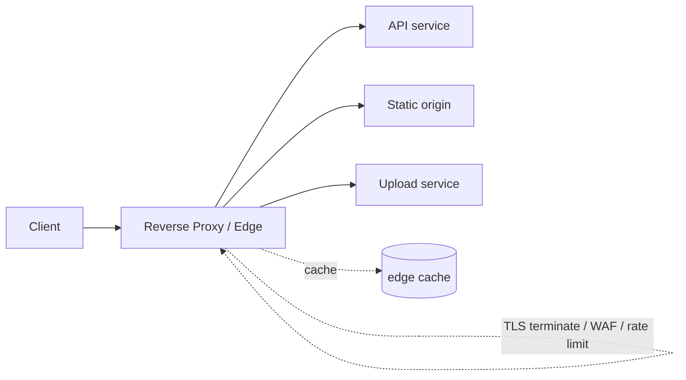

# Reverse Proxy

## 1. One-Line Definition
A reverse proxy is a server that sits in front of backend services and forwards client requests to them on the clients' behalf, hiding and protecting the internal servers.

## 2. Why Do We Need It?
Clients should never talk to origin servers directly: they need TLS termination, caching, compression, rate limiting, logging, and a stable entry point even as backends change. The reverse proxy provides a single ingress that secures, optimizes, and routes traffic.

## 3. Simple Intuition
A company receptionist: all visitors arrive at one front desk (reverse proxy) that checks IDs, announces them, and sends them to the right office — without visitors knowing office floor plans or wandering into the open-plan kitchen. Nobody gets the CEO's direct line.

## 4. What Happens Without It?
Every client would need to know and reach every backend: TLS certificates everywhere, no central place to set caching/security headers, uploads and downloads exposed to the internet directly, backends reachable at their true IPs, and no offload for gzip/TLS handling.

## 5. Core Idea
Reverse proxy terminology in one pass:
- **Ingress to internal services** — it *stands in front of* origins and *reverses* the "client → proxy → internet" direction of a forward proxy.
- **Termination/offload:** TLS, compression, HTTP/2 → backend gets plain, pre-negotiated traffic (less CPU).
- **Security:** hides backend topology, applies WAF rules, rate limits, input sanitizing, request/response header hardening.
- **Caching:** serves repeat/reverse-cached objects (with Cache-Control), sparing origins.
- **Routing:** host/path-based routing to different backends/services (a lightweight API gateway).
- **Logging/observability:** one choke point to stamp request IDs, metrics, and audit logs.

**Reverse proxy ≠ load balancer:** A LB distributes *within* a tier of identical backends; a reverse proxy often does that too but adds the enrich/secure/cache/route duties. Practically they overlap — most "LBs" (NGINX, Envoy, ALB) are really L7 reverse proxies. Think: LB = choose among equals; reverse proxy = the front door.

## 6. Important Terminology

| Term | Simple Meaning |
|------|----------------|
| Origin server | The real backend producing the payload |
| TLS termination | Proxy decrypts HTTPS; backend sees plaintext |
| Upstream | The backend the proxy forwards to |
| X-Forwarded-For | Header adding the real client IP (set by proxy) |
| Offload | Move expensive work (TLS/gzip) to the proxy |
| Edge caching | Proxy stores + serves repeated content |
| VHost/path routing | Choose upstream by Host header or URL path |
| Forward proxy | Opposite: sits in front of *clients* |

## 7. Basic Architecture



## 8. Request or Data Flow
1. Client → domain. The proxy terminates TLS (one certificate here, not per backend).
2. Proxy applies edge rules: WAF, rate limiting, CORS, request validation, compression negotiation.
3. Proxy routes by Host/path: `/api` → API cluster (via upstream pool + health), `/static` → static origin or CDN.
4. If cacheable, proxy serves from edge cache (honoring headers). Else it forwards, tags the response with a request/trace ID, and returns it.
5. Backend sees sanitized, normalized requests via trusted inner network; client never touches origins.

## 9. Practical Example
**Retail site (assumptions):** mixed static + dynamic + uploads.
- `/static/*` → edge-cached files with long TTL.
- `/api/*` → app cluster behind upstream pool, rate-limited per token.
- `/upload/*` → dedicated upload origin with body-size limits and signed-URL auth enforced *at the proxy*.
- Global/DDoS: the proxy tier runs across regions + CDN; overload → 503 (load shed) instead of origin meltdown.

## 10. Scaling
- **Proxy scale-out:** horizontally run proxy instances behind their own LB/anycast (edge). Stateless proxies = add freely.
- **TLS cost:** termination is CPU-heavy — offload to dedicated terminate nodes or let CDN do it; keep session resumption so repeat handshakes are cheap.
- **Caching tier:** proxies can cache; a shared edge-cache layer multiplies capacity for static/hot dynamic content.
- **Hotspot:** a viral endpoint saturates the origin despite the proxy — cache that path aggressively or rate-limit.

## 11. Reliability and Failure Scenarios
- **Proxy death:** stateless → LB/anycast reroutes; in-flight same-conn requests drop (keep them short).
- **Origin death:** proxy returns cached copy (stale-if-error) or 502/503 with a `Retry-After`.
- **Proxy overload:** backpressure — shed (503) or queue short; never let failed retries pile up.
- **Wrong route after config change:** proxy misrouting is global — config reviews, canary the proxy config, and monitor upstream error rates per route.
- **Detection:** proxy syslog/metrics (5xx-rate, upstream-connect failures, edge cache hit ratio), p99 at the proxy = user latency.

## 12. Consistency and Correctness
Edge caches make content *eventually consistent on purpose* (TTL/purge). Cache invalidation at the proxy/CDN must be explicit: purge on write or rely on `Cache-Control`/short TTLs. Never cache authenticated/user-specific data (Vary/private headers) or it will leak across users.

## 13. Performance
- Termination savings: TLS+gzip off the backend.
- Added hop: introduce proxy latency — keep it tiny (<5-10 ms) and use connection reuse (keep-alive) to upstreams.
- Keep-alive to origin = fewer origin connections; HTTP/2 at edge = fewer client connections.

## 14. Security
- **Hide topology** (remove `Server` headers, don't expose internal IPs).
- **Input sanitization** + request size limits + WAF integration.
- **Rate limiting/per-IP & per-token** at the edge; bot detection.
- **Header hygiene:** set `X-Forwarded-For` from trusted sources only, strip sensitive headers before forwarding.
- **TLS policies** (current ciphers, HSTS).

## 15. Trade-Offs

| Choice | Advantages | Disadvantages | When to Use |
|--------|------------|---------------|-------------|
| TLS at proxy | One cert, offload CPU | Proxy holds private keys, sees plaintext | General internet services |
| Edge caching | Huge read offload | Staleness, purge complexity, cache poisoning risk | Static + hot dynamic |
| Heavy WAF at edge | Strong protection | Latency, false positives | Public API, payments |
| Route-at-proxy (mini-gateway) | Simple, no extra infra | Logic sprawls into proxy config | Small org, few services |
| Separate API gateway | Clean policy/versioning home | Another component to run | Many services / external API |

## 16. Common Mistakes
- Calling any proxy "a load balancer" — names matter in interviews; distinguish responsibilities.
- Caching authenticated responses at the shared edge (cross-user leaks).
- Putting WAF/size limits *after* expensive origin work instead of at the proxy.
- Exposing origin IPs (backend reachable directly) — VPN/service mesh hide them.
- Keeping connections short and handshake-heavy instead of reusing upstream connections.

## 17. HLD vs LLD Boundary
HLD: ingress topology (CDN → proxy/gateway → services), TLS termination point, caching/security policy at the edge, routing table. LLD: a specific service's middleware (a filter/interceptor), reconfig logic, per-route handler wiring.

## 18. Interview Questions

### Beginner
- What is the difference between a reverse proxy and a load balancer?
- What security benefits does a reverse proxy provide?

### Intermediate
- How does a reverse proxy improve performance (caching, TLS, compression)?
- What can go wrong if you cache through a reverse proxy incorrectly?

### Advanced
- Design the ingress for a multi-service platform; where does the reverse proxy end and the API gateway begin?
- How do you fail over a reverse-proxy tier itself without downtime?

## 19. Interview Memory Summary

> [!abstract]- Interview Memory Summary

### Remember

- Reverse proxy = the front door to backends.
- It offloads TLS/gzip, hides origins, and applies edge rules (WAF, rate limits).
- Edge caching helps but needs careful invalidation and auth separation.
- The proxy tier must itself scale and be redundant.
- vs LB: an LB balances among equals; a proxy is the ingress — often the same box in practice.

### 30-Second Explanation

Run one stateless, redundant ingress that terminates TLS, filters, rate limits, caches, and routes to origins; keep the proxy tier horizontally scalable, share duties with the CDN in front, and make sure nothing bypasses it to the origin.

### Interview Traps

- "Cache everything at the proxy" — authenticated responses and any write need invalidation; never conflate cache with source of truth.
- Calling any proxy "a load balancer" — names matter; distinguish responsibilities.
- Caching authenticated responses at a shared edge → cross-user leaks.
- Putting WAF/size limits after expensive origin work instead of at the proxy.
- Exposing origin IPs — backends must not be reachable directly.

### Key Trade-Off

Concentrating TLS, caching, security, and routing in one choke point gives huge operational leverage and edge performance, but turns the proxy into a subsystem that you must scale, secure, fail over, and prevent anyone from bypassing.

## 20. Related Concepts

### Prerequisites

- [[http-and-https|HTTP and HTTPS]] — the protocol a reverse proxy terminates, caches, and routes.

### Commonly Used Together

- [[load-balancing|Load Balancing]] — the proxy often embeds an upstream pool + health checks; duties overlap.
- [[caching|Caching]] — edge caching needs TTL/invalidation and never-cache-per-user discipline.
- [[cdn|CDN]] — typically sits in front of the proxy for global static delivery and DDoS absorption.
- [[dns|DNS]] — clients reach the proxy through GeoDNS/Anycast; TTL bounds failover.

### Alternatives

- [[load-balancing|Load Balancing]] (when you only need distribution among identical nodes, with no edge duties)

### Advanced Concepts

- [[rate-limiter|Rate Limiter]] — per-IP/per-token limiting is enforced at this edge.
- [[web-vulnerabilities|Web Vulnerabilities]] — the WAF at the proxy is a defense-in-depth front line.
- [[authentication-vs-authorization|Authentication vs Authorization]] — the edge enforces authN for the services behind it.

Related planned topics (not authored yet): api-gateway, forward-proxy.

## 21. References
NGINX/HAProxy/Envoy documentation on reverse-proxy responsibilities; CDN edge-security docs (Cloudflare/AWS CloudFront). Verify current capabilities with vendor docs.

## 22. Active Recall

Test yourself before revealing each answer.

> [!question]- What is the difference between a reverse proxy and a load balancer?
> A load balancer distributes traffic *within* a tier of identical backends; a reverse proxy adds the enrich/secure/cache/route duties on top — hiding origins, terminating TLS, WAF, edge caching. In practice the same box (NGINX, Envoy, ALB) does both; LB = choose among equals, reverse proxy = the front door.

> [!question]- What security benefits does a reverse proxy provide?
> It hides backend topology (true origin IPs never exposed), terminates TLS in one place, applies WAF rules, rate limits, input sanitization, header hardening, and blocks bad bots/DDoS. Backends live on a trusted inner network and only ever see sanitized requests.

> [!question]- How does a reverse proxy improve performance?
> Three ways: TLS termination + gzip offload shift CPU off the backends, edge caching serves repeats without touching origins, and connection reuse (keep-alive to upstreams, HTTP/2 at the edge) cuts handshake and connection churn.

> [!question]- What can go wrong if you cache through a reverse proxy incorrectly?
> Cross-user leaks — caching authenticated or user-specific responses at a shared edge serves one user another's data. Also staleness: without explicit purge/Cache-Control, the proxy serves dead content. Never cache per-user/auth data; use Vary/private headers or skip caching.

> [!question]- Where does the reverse proxy end and an API gateway begin?
> The proxy stays close to transport: TLS, routing by host/path, caching, WAF, rate limits. An API gateway adds product policy: authN/Z, request/response transforms, versioning, quotas, per-API contracts. Small org: proxy is enough; many services/external APIs: add the gateway (or fold those duties into the proxy config deliberately).

> [!question]- How do you fail over a reverse-proxy tier itself without downtime?
> Run it stateless and horizontally, behind its own LB/Anycast: if one proxy dies, traffic reroutes to a healthy replica. Keep in-flight requests short (drain the rest), canary config changes (a misroute is global), and monitor upstream error rates per route.

> [!question]- Trade-off: the proxy terminates TLS and holds the private keys. What do you gain and pay?
> Gain: one certificate instead of per-backend, TLS CPU offloaded, a single provable choke point. Pay: the proxy sees all plaintext traffic and the keys become a prime target — restrict access, rotate keys, and keep it on hardened, least-privilege infrastructure (or let a CDN hold the public edge).

## 23. When Should I Use This?

### Use it when

- You want one ingress choke point for TLS, caching, security, and routing.
- Backends must never be reachable directly (hide origin topology).
- You need edge caching to offload origins and cut latency.
- Per-client rate limits / WAF must sit in one enforceable place.
- You run HTTP services behind a pool and want connection reuse and observability in one place.

### Avoid it when

- You only need distribution among identical nodes — a load balancer does it with less.
- You need complex per-API policy and versioning — a separate API gateway is the better home.
- Your traffic is small/static enough that the extra hop is pure overhead.
- You can't run it stateless and redundant — a single unreplicated proxy is a SPOF.

### What problem does it solve?

Problem: clients must not talk to origins directly, and backends shouldn't each handle TLS, caching, and security. Bottleneck: TLS+gzip on every backend, no central place for edge rules, origins reachable at true IPs. Solution: a reverse proxy is the single front door — it terminates TLS, offloads compression, applies WAF/rate limits, caches, and routes, behind a stateless, horizontally scalable tier.

### What problem does it NOT solve?

It doesn't fix backend statefulness or slow origins (cached paths help, other paths don't), doesn't give strong cache consistency (edge content is eventually consistent by design), isn't a full API gateway for complex multi-service policy, and can't protect an origin it can't shed — hot uncacheable paths still need rate limiting and load shedding.

## 24. Decision Connections

Decisions that go together with a reverse proxy:

- [[load-balancing|Load Balancing]] — the proxy embeds an LB upstream; decide where distribution ends and ingress duties begin.
- [[http-and-https|HTTP and HTTPS]] — the protocol the proxy terminates; HTTP/2/3 change the connection strategy at the edge.
- [[dns|DNS]] — GeoDNS/Anycast route clients to the proxy tier; TTL controls reroute speed.
- [[cdn|CDN]] — place the CDN in front for global static delivery and DDoS absorption, proxy at the region edge.
- [[caching|Caching]] — edge caches follow the cache playbook: TTL, invalidation, and never-cache-per-user.
- [[rate-limiter|Rate Limiter]] — the proxy is the natural enforcement point for per-IP/per-token limits.
- [[web-vulnerabilities|Web Vulnerabilities]] — WAF, header hardening, and CSRF controls live at this edge.

Decision tree:

```
Clients must reach internal services
    |
    +-- Only distribution among identical nodes?
    |      → [[load-balancing|Load Balancing]]
    |
    +-- Need TLS termination + caching + WAF + routing at one entry?
    |      → [[reverse-proxy|Reverse Proxy]]
    |         |
    |         +-- Global static content?         → [[cdn|CDN]] in front
    |         +-- Cacheable responses?           → edge cache + Cache-Control
    |         +-- Per-client limits?             → rate limiting at the proxy
    |         +-- Complex per-API policy?        → separate API gateway
    |         +-- Origin must stay hidden?       → lock origin to proxy-only traffic
    |
    +-- Small scale, single backend?
           → skip the proxy; add it when you need the front door
```