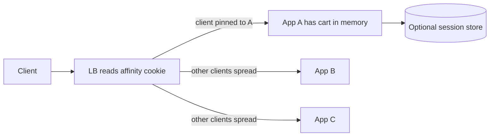

# Sticky Sessions / Session Affinity

## 1. One-Line Definition
Sticky sessions (session affinity) make a load balancer route all requests from one client to the same backend for the duration of a session, so backends can hold per-user state in memory instead of sharing or externalizing it.

## 2. Why Do We Need It?
Some applications keep session state (cart, auth context, upload progress, page-flow step) in the backend's memory. Replication or load balancing to a different node loses or corrupts that state. Sticky sessions pin the client to a node so the in-memory state is always reachable — a cheap fix when rewriting the app to stateless shared storage is not on the table.

## 3. Simple Intuition
One barber cuts your hair start to finish. As long as you always see the same barber, your half-finished haircut is exactly where you left it. Ask the receptionist to always seat you with a specific barber (sticky), and everything in-progress survives; switch barbers mid-cut and the new one has no idea what you asked for.

## 4. What Happens Without It?
Without affinity, each request may land on a different node. If state lives in node memory, sessions fragment: the cart written on node A can't be read on node B, the auth step completed on A doesn't exist on B, and users get random re-logins, lost carts, and broken multi-step flows. The alternative — externalizing all state — is the correct long-term fix but costs a rewrite and a dependency.

## 5. Core Idea
- **Mechanisms:** cookie-based (LB sets/stamps an affinity cookie, or reads an app cookie value to hash on) and source-IP based (same client IP → same node). Cookie is precise; source-IP is coarse (NAT pools break it).
- **Where the stickiness decision sits:** the LB owns routing; the session itself may still live in the app (see [[session-management|Session Management]]).
- **Costs, always:** sticky pins clients to nodes, so node churn (scaling, deploys, failures) forces re-pins; load skews by session popularity; a dead node takes its sessions' state with it unless state is externalized — stickiness doesn't make state durable, it only keeps it reachable.
- **Escape hatches:** copy session to shared store (Redis-style, see [[caching|Caching]]), or make nodes stateless and drop stickiness entirely (see [[stateless-vs-stateful-services|Stateless vs Stateful Services]]).
- **New-session vs existing-session:** clients without a cookie can be sent anywhere; once pinned, subsequent requests honor the cookie until expiry.

## 6. Important Terminology

| Term | Simple Meaning |
|------|----------------|
| Session | Client-scoped state valid for some period |
| Affinity cookie | Cookie that encodes the pinned node |
| Source-IP affinity | Hashing on client IP |
| Sticky deadline | TTL after which a client may be re-pinned |
| Re-pin | Moving a client to a new node |
| Apiary state | Node-local state that stickiness protects |
| Session store | Shared, externalized session holder |
| Cookie-jar / NAT problems | Affinity breaks where clients share IPs |

## 7. Basic Architecture



## 8. Request or Data Flow
1. First request has no affinity cookie → the LB routes by its normal algorithm and stamps an affinity cookie naming the node (or encodes the chosen node in a hash).
2. Subsequent requests carry the cookie → the LB routes to the same node regardless of algorithm.
3. Node dies → the cookie now points at a dead node → new requests must be re-pinned to a healthy node (which has no in-memory state — the session is lost unless externalized).
4. Cookie expires (sticky deadline) → client can be re-pinned to any node.

## 9. Practical Example
**Legacy checkout (assumptions):** cart and multi-step flow stored in node memory, no budget to externalize now.
- L7 LB uses a cookie from the app's session; sessions pin the user to one of 8 nodes.
- Users barely notice, deploys schedule drain (see [[connection-draining|Connection Draining]]) so pinned users finish before their node goes.
- The known weakness is stated plainly: if a node dies, that node's in-flight carts are gone — hence a background effort to move logs/progress to a shared store.

## 10. Scaling
- **Downsides first:** a pinned client can't be moved when the fleet shrinks; scale-down must drain sticky-session holders; load skews because session duration varies (long sessions cluster on a few nodes).
- **Better models:** externalize state and drop stickiness (the stateless end-state), or keep node-local sessions but treat nodes as disposable caches (accept loss, recover by re-login).
- **Cross-region:** sticky to a *region* or *cell* rather than a node — affinity should be coarse enough that a single node's failure doesn't strand a session chain.

## 11. Reliability and Failure Scenarios

| Failure | What Happens | Detection | Recovery | Trade-off |
|---------|--------------|-----------|----------|-----------|
| Pinned node dies | Sessions' state lost | Health check | Re-pin; users re-login | sticky depends on node luck |
| Node scales down | Pinned users stranded | Drain with sticky refusal | Refuse new pinned work; finish or re-pin | longer scale-down |
| Sticky cookie from prior LB | Traffic pins to wrong pool | Cookie validation | Rewrite/validate cookie at LB | complexity |
| Source-IP NAT | Many users pinned to one node | Skew metric | Drop source-IP affinity for cookie | NAT-bound users |
| Flapping node | Sessions bounce between nodes | Health flap | Sticky ties to health, not to flake | session churn |

## 12. Consistency and Correctness
Stickiness is a *routing* contract, not a consistency contract: it can't fix cross-node writes, split-brain sessions, or races between a user's concurrent devices. If correctness requires the state to survive a node's death, the state must live outside the node (shared store) — in which case you no longer need stickiness at all. As a rule: the more important the state, the less sticky routing should be the thing that guards it.

## 13. Performance
- Sticky routing is nearly free at the LB (hash or cookie read) and avoids the cost of re-fetching a sharded session store on every request.
- The hidden cost is imbalance: p95 long-session users skew pools, and a node leaving forces re-pin storms that momentarily hit the session store. Source-IP affinity concentrates NAT users, so cookie affinity has better load profiles at equal cost.

## 14. Security
- Affinity cookies are routing hints, not auth: never embed secrets in them, sign or validate them (clients can forge a cookie to pin onto any node), and never let a client choose a node for privilege reasons.
- Prefer using an existing session cookie value as the affinity key over inventing a new one — fewer moving parts, less spoofable surface.

## 15. Trade-Offs

| Choice | Advantages | Disadvantages | When to Use |
|--------|------------|---------------|-------------|
| Cookie affinity | Precise, per-user | Cookie handling, expiry policy | Most sticky cases |
| Source-IP affinity | Zero cookies | NAT aggregates skew load | Small LAN/ent-pools |
| Node in-memory only | Fastest, zero shared writes | State lost on node failure | Session-cache-only apps |
| Shared session store + NO stickiness | Truly stateless, elastic | One more dependency, store latency | Greenfield, high-availability apps |
| Sticky sessions | Minimal app change | Couples routing to state, hurts elasticity | Legacy/limited rewrite budget |

## 16. Common Mistakes
- Assuming stickiness makes state *durable* — it only keeps it reachable; node death still costs it.
- Using source-IP affinity behind NAT/proxies, pinning every user in an office to one node.
- Never re-pinning: clients stuck on a long-dead node until cookies expire (tie re-pin to health).
- Copying sessions to a store but keeping stickiness anyway — the store already removed the need.
- Treating sticky as an excuse to skip [[connection-draining|Connection Draining]] and threading nodes out mid-session.

## 17. HLD vs LLD Boundary
HLD: affinity mechanism (cookie vs source-IP), cookie policy/TTL, re-pin-on-health rules, interaction with drain and scaling, decision to externalize. LLD: the cookie insert/validate code, the LB's sticky configuration, session-store read/write in the app, expiry handling.

## 18. Interview Questions

### Beginner
- What problem do sticky sessions solve, and at what cost?
- Cookie affinity vs source-IP affinity — which and why?

### Intermediate
- A node dies under sticky sessions. What exactly do its users lose?
- Why do sticky sessions and horizontal scaling fight each other?

### Advanced
- Argue how to make a checkout system both sticky-tolerant and node-death-safe.
- Design affinity that survives a region failover without stranding users.

## 19. Interview Memory Summary

> [!abstract]- Interview Memory Summary

### Remember

- Sticky = all of a client's requests to one backend for the session.
- Cookie affinity is precise; source-IP is coarse and NAT-broken.
- Stickiness keeps state reachable — it does NOT make it durable.
- Costs: skew, worse elasticity, node-death state loss, re-pin storms.
- The stateless answer (shared session store) makes stickiness unnecessary.

### 30-Second Explanation

Pin a client to one backend (via an affinity cookie, or source-IP hash) so node-local session state stays reachable for the session's whole life. It fixes stateful legacy apps cheaply, but it couples routing to memory: scaling, draining, and failures then cost sessions, and a shared session store — making nodes stateless — removes the need for stickiness in the first place.

### Interview Traps

- Claiming stickiness adds durability — it adds reachability, not durability.
- Choosing source-IP affinity behind proxies/NAT and wondering why one node gets an office's whole load.
- Ignoring drain: pinned users need draining before their node goes.
- Keeping the store AND stickiness — you paid for statelessness already.

### Key Trade-Off

Sticky sessions solve node-local state cheaply and immediately, but they buy it by taxing elasticity and availability — the correct long-term replacement is a shared session store that makes any node safe to route to, and then stickiness is a legacy crutch.

## 20. Related Concepts

### Prerequisites

- [[stateless-vs-stateful-services|Stateless vs Stateful Services]] — why state exists and why stateless is the goal.
- [[session-management|Session Management]] — what the state actually is and how it is authenticated.

### Commonly Used Together

- [[load-balancing|Load Balancing]] — the router that enforces affinity.
- [[connection-draining|Connection Draining]] — the ritual before a pinned node leaves.
- [[health-checks|Health Checks]] — health and ree-pin must not fight.

### Alternatives

- [[consistent-hashing-load-balancing|Consistent Hashing Load Balancing]] (key-based affinity without cookies)
- [[caching|Caching]] and shared stores (externalize state instead of pinning)
- [[horizontal-vs-vertical-scaling|Horizontal vs Vertical Scaling]] (the failure case where stateful scaling hurts)

### Advanced Concepts

- [[availability|Availability]] — what stickiness costs when a node fails.
- [[failover|Failover]] — re-pinning semantics after node loss.

Related planned topics (not authored yet): `http-cookies` (each sticky mechanism's substrate), `redis` as the canonical shared session store.

## 21. References
AWS ELB/ALB sticky-session (target-group affinity) documentation; HAProxy and NGINX `cookie` / `ip-hash` directives; common session-store guidance from REST courseware. Verify current affinity knobs with vendor docs.

## 22. Active Recall

> [!question]- What exactly breaks when you don't use sticky sessions on a stateful backend?
> Requests for the same client scatter across nodes, and state written to node A's memory is absent on node B — carts vanish, auth steps get re-requested, multi-step flows desync. The state stays exactly where it was written; the router just doesn't know to go back there.

> [!question]- Which mechanisms pin a client, and what are their failure modes?
> Cookie affinity pins per-client precisely but needs cookie handling. Source-IP affinity needs no cookies but groups NAT'd offices and proxies into one bucket, overloading a single node. Cookie wins for correctness; source-IP only suits small or homogenous pools.

> [!question]- Trade-off: when is the shared session store actually the cheaper answer?
> When node failure or elastic scaling is more common than the legacy-migration cost: once sessions live in a shared store, any node can serve any client, so stickiness becomes unnecessary and replaces the pin-tax (skew, drain, re-pin) with one store dependency. For a stable, few-node LAN app, in-memory stickiness is cheaper.

> [!question]- Failure scenario: a pinned node dies mid-session. What do its users experience, and how do you limit the blast radius?
> They are re-pinned to a healthy node that has no trace of their in-memory state — re-login, lost cart. Limit it: shorten the affinity cookie TTL, drain+deploy so removals are scheduled, externalize the most precious of the state, and make the LB re-pin to *healthily* chosen nodes fast so re-entering users land correctly.

> [!question]- Interview scenario: a consistency-critical payments flow "works with stickiness" in staging. Walk what must change for production safety.
> In production, node churn is guaranteed. Move the authoritative payment state out of node memory into a durable store, keep affinity only as an optimization (node-local hot cache), make every node safe to handle a re-pinned session, and drive removals through drain — stickiness becomes a performance hint, not the correctness mechanism, and node failure stops costing money.

> [!question]- Basic understanding: why does elasticity fight stickiness?
> Elasticity means nodes join and leave freely. A pinned client can't be moved when its node scales down, session-bearing nodes skew the pool, and scale-in strands sessions; re-pinning on churn recreates exactly the state-loss stickiness was avoiding.

## 23. When Should I Use This?

### Use it when

- Session state lives in node memory and cannot be externalized soon.
- The workflow tolerates re-login on node loss (session is a cache, not a ledger).
- A stable, small-node backend can drain and deploy deliberately.
- Legacy migration to stateless + shared store is off the roadmap for now.

### Avoid it when

- State is correctness-critical and must survive node death (then externalize).
- Traffic must scale elastically — sticky distribution fights scale-out and scale-in.
- Clients already use a shared session store: remove stickiness, not add it.
- Affinity spoofing is a security concern you can't validate against.

### What problem does it solve?

It keeps node-local session state reachable across a multi-node fleet cheaply, and without rewriting the app — the pragmatic bridge for stateful services onto load-balanced infrastructure.

### What problem does it NOT solve?

It does not make that state durable, survive a node's death, or distribute load evenly; it actively hurts elasticity and adds re-pin logic. Anything requiring implied durability must move to a shared store, which then removes the need for stickiness.

## 24. Decision Connections

Decisions that go together with sticky sessions:

- [[stateless-vs-stateful-services|Stateless vs Stateful Services]] — the root question: why is there node-local state at all?
- [[session-management|Session Management]] — what the session holds and how it's identified.
- [[load-balancing|Load Balancing]] — the router that enforces affinity.
- [[connection-draining|Connection Draining]] — required before a pinned node departs.
- [[health-checks|Health Checks]] — must trigger clean re-pinning, not stranded sessions.
- [[consistent-hashing-load-balancing|Consistent Hashing Load Balancing]] — a mechanical no-cookie affinity alternative.
- [[caching|Caching]] — the shared-store escape hatch that makes stickiness unnecessary.

Decision tree:

```
Does any backend hold per-user state in memory?
    |
    +-- No: fully stateless
    |      → plain [[load-balancing|Load Balancing]], no affinity needed
    |
    +-- Yes, but state is a disposable cache (loss tolerable)?
    |      → [[sticky-sessions|Sticky Sessions]] with re-pin on health + drain on removal
    |
    +-- Yes, and state must survive node death?
    |      → externalize to shared store → no stickiness
    |         (see [[stateless-vs-stateful-services|Stateless vs Stateful Services]])
    |
    +-- Affinity without cookies in a homogeneous pool?
           → [[consistent-hashing-load-balancing|Consistent Hashing Load Balancing]]
```