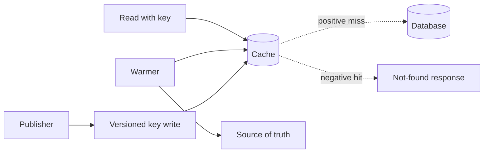

# Negative Caching / Warming / Versioning

## 1. One-Line Definition
Negative caching, cache warming, and versioning are three cache-refinement techniques that protect the source of truth: negative caching stores "does not exist" answers to stop miss-storms, warming pre-fills a cold cache before traffic arrives, and versioning names cache keys so updates never serve stale bytes.

## 2. Why Do We Need It?
A cache's raw hit ratio only wins when the *miss* is cheap — but the worst misses are the ones that aren't misses at all: requests for keys that don't exist re-query the DB every single time (cache penetration), a just-deployed cold cache lets a full stampede through (cache warming), and immutable-but-cached content serves deleted old versions forever (versioning). All three are the difference between "we have a cache" and "the cache survives its worst cases".

## 3. Simple Intuition
A school office runs a "didn't get it" register: when a parent asks for a form that doesn't exist, the office writes "not found — asked June 3" so the next question is answered in seconds without calling the supplier again (negative caching). Before day one, they pre-stock the popular shelves so the first students don't queue at the office (warming). And whenever a new textbook edition arrives, they sticker it "Edition 17" so nobody hands out Edition 16's old quizzes (versioning).

## 4. What Happens Without It?
Three failure modes: (1) an attacker (or a user) hammers non-existent IDs (typo'd user id, expired order) and every miss lands on the DB — the cache becomes decorative; (2) after a deploy/clear, the first wave of a million users all miss, stampede the DB, and a post-deploy "warming incident" triggers (see [[caching|Caching]] for the stampede); (3) a content publish leaves stale cached copies that linger for TTL seconds or hours until users report missing content that "should have been there".

## 5. Core Idea
- **Negative caching:** cache the *absence*. For keys that genuinely don't exist (or are unauthorized), store a sentinel ("none", or the 404) with a short TTL (seconds to a few minutes). This converts adversarial or long-tail misses that would always hit the DB into cache hits. Penetration dies when misses stop being the expensive path.
- **Warming:** populate the cache *before* the load arrives — after deploy, before a flash sale, at TTL refresh, or for a new shard. Sources: snapshot/scan of the previous cache, key-priority playback of the top-K with slow CPU, read-list build with a fence (blocking the read only until its data is loaded). Warming plus single-flight plus Jittered-expiry is the standard anti-stampede trio.
- **Versioning:** make the key carry the version/versioned content address (like `asset:js@v3`, or hashed filenames `app.3fa7b.js`). Old keys and new keys are different entries; updates never overwrite in-place, and a cache that serves "old" bytes is serving a *different, correct* key until it expires. Versioning makes invalidation a key-name problem, not a timing race.
- **They compose:** warm pushes popular keys, versioning keeps old/new distinct during a rolling deploy, negative caching protects the hot miss path — a production cache uses all three.

## 6. Important Terminology

| Term | Simple Meaning |
|------|----------------|
| Negative cache | Cached "this key does not exist" sentinel |
| Penetration | Always-missing keys hammering the source |
| Warming | Pre-filling a cold cache before load |
| Cold cache | Empty/just-deployed; every read is a miss |
| Single-flight | One refill; concurrent readers wait or get stale |
| Jittered TTL | Randomize expiry to avoid aligned stampede |
| Versioned key | Name carries version, e.g., `user:1:v3` |
| Content-addressed key | Key = hash of content; changes when content does |
| Key space migration | Rewriting keys to a new scheme across nodes |

## 7. Basic Architecture



## 8. Request or Data Flow
1. A read arrives. Cache check: positive hit → serve; positive miss → 2.
2. Negative check must distinguish "key not cached" from "key cached as not-existing" — a sentinel value or a "recorded missing" set answers without touching the DB.
3. Real miss → read source, populate with TTL; record sentinel for truly-absent keys with a short TTL so the next request for the same phantom is a hit.
4. On deploy: warmer runs before traffic (top keys in priority order) with single-flight on so concurrent readers don't add to the load.
5. On publish: writers write version `v+1`; readers that pinned `v` keep receiving it until their key expires — the old version decays naturally rather than being poisoned.

## 9. Practical Example
**Profile API (assumptions):** 1M user ids; attackers probe non-existent ids at 1k QPS against a cache that stores only found profiles.
- Without negative caching: 1k QPS of misses → 1k DB lookups/sec = churn and cost.
- Negative: cache `user:deadbeef` → sentinel, TTL 120 s. The 1k QPS becomes ~zero DB load; real users are unaffected; sentinel keys retire naturally.
- Versioning: profile content is `user:42:v5`; on verification, `v6` starts appearing; stragglers on v5 expire within their TTL, so no read ever fabricates a half-updated profile.
- Warming: after canary deploy, the top-20k-profile build (measured to be 95% of traffic) is warm before the 100% cutover.

## 10. Scaling
- **Negative cache size is bounded:** absent-key space can be infinite, so cap it with short TTLs and (if needed) a bounded LRU — never let phantoms evict real data.
- **Warming parallelism:** scan-load is bounded by source bandwidth; prioritize by measured traffic share, queue the rest. Big caches warm in "hot first, cold later" waves, not one sweep.
- **Versioning and scale:** content-addressed keys work for immutable media; mutable entities version by logical version fields. Rolling deploys and ring shards ([[consistent-hashing|Consistent Hashing]]) re-route keys — warming the new owner while the old drains is the migration habit.
- **Distributed stores:** Redis-based negative caching and warming are identical to cache-aside, but consistent-hash restarts wipe locality — cluster membership changes are warming events too.

## 11. Reliability and Failure Scenarios

| Failure | What Happens | Detection | Recovery | Trade-off |
|---------|--------------|-----------|----------|-----------|
| Sentinel storms (phantom ids) | Negative cache misses the probe rate | Miss ratio of negative keys | LRU + tiny TTL for sentinels | sentinel churn |
| Warm race after deploy | Stampede despite warmer | Post-deploy miss spike | Single-flight + gate the cutover | slower rollout |
| Wrong version read | Stale bytes for key `v` | Version drift audit | TTL bound, publish path fence | peak TTL staleness |
| Negative TTL too long | Genuinely-new data hidden as "missing" | Late-created key refugees | Short sentinel TTL, purge on create | small miss window |

## 12. Consistency and Correctness
Negative caching must not hide reality: when an entity is *created*, any sentinel for its key must be purged/invalidated or the new row is unreadable until the sentinel TTL expires — so creation writes to the cache too, not just the store. Versioning preserves correctness by making stale reads formally *pending* rather than *wrong*: an old version is genuinely the current-version-at-read time only if you also enforce ordering (version must be monotonic). Warming is a scheduling problem: warming must never serve data newer than the fence that validated it.

## 13. Performance
Each technique trades a tiny slice of cache RAM and latency for a huge miss reduction. Negative caching removes the worst-cost domain (repeated phantom misses); warming removes the cold-start stampede that ruins the p95 straight after deploys; versioning removes the revalidation round trips forced by in-place invalidation. Watch the cache's hit-ratio dashboard *split by these key classes* — sentinels, versions, warmed-hot — or the numbers hide which refinement is actually paying.

## 14. Security
- Negative caching is a penetration/DoS mitigator — it also *reveals keys exist* via timing (a cached key responds faster than a sentinel). Never store key-existence or not-found info for sensitive resources (user presence, email-lookup, account enumeration).
- Version keys can leak asset history; a signed version manifest prevents serving a tampered/older build as current.
- Warming jobs read the whole data space — they are high-privilege data movement and need the same authorization as the source of truth.

## 15. Trade-Offs

| Choice | Advantages | Disadvantages | When to Use |
|--------|------------|---------------|-------------|
| Negative caching | Kills penetration cost | Hides new data if TTL long; sentinel churn | Existence-lookup APIs, IDs |
| Full warming | No cold-start stampede | Bandwidth + source loading | Deploys, launches, shard adds |
| Priority/partial warming | Cheap, covers hot set | Long-tail cold misses | Steady-state ops |
| Versioned keys | No invalidation race | Old versions linger; key sprawl | Immutable/media/cache-forever |
| Content-address keys | Perfect immutability | Rewrites all references on change | Assets only |

## 16. Common Mistakes
- Negative caching with a TTL long enough to mask real creations (and no purge-on-create).
- Warming by *scanning everything* instead of hot-first priority — the cold tail eats deploy time the hot set never benefits from.
- In-place overwrite on publish with no versioning, then cache-poisoning races.
- Forgetting identity: sentinels and versions are separate key classes; if they share the LRU uncontrolled, phantoms evict the warm set.
- Deploy-time cache clear *with* warmer, but no single-flight — the first wave still stampedes.

## 17. HLD vs LLD Boundary
HLD: sentinel TTL policy, warming priority model, versioning scheme (when to version, key format), purge-on-create rule. LLD: implementing a sentinel value in one DAO, wiring a warming scan job's page loop, formatting the versioned key in a cache library.

## 18. Interview Questions

### Beginner
- What is cache penetration and why does negative caching fix it?
- Why warm a cache, and what order would you warm?

### Intermediate
- You publish a profile update; how does versioning keep readers consistent without a purge?
- An attacker probes 2k phantom ids/s. Design the negative-cache defense end to end.

### Advanced
- Design the warming flow for a 100-node Redis cluster during a rolling re-shard.
- When is content-addressed versioning wrong, and what replaces it?

## 19. Interview Memory Summary

> [!abstract]- Interview Memory Summary

### Remember

- Negative caching stores sentinels for absent keys; purge on create.
- Warming fills before load: hot-first priority, gate the cutover, single-flight.
- Versioning makes staleness pending, not wrong.
- Sentinel TTL is short (seconds-minutes); never mask real creations.
- All three are cache refinements on top of [[caching|Caching]].

### 30-Second Explanation

On top of cache-aside, protect the worst miss paths: cache "does not exist" answers as short-TTL sentinels so phantom reads never reach the DB, warm popular keys before deploys/launches with hot-first priority and single-flight, and version keys so updates are new entries instead of poisoned old ones. Purge sentinels on create; never let sentinel TTL hide real data.

### Interview Traps

- Negative caching without the purge-on-create rule.
- Warming everything at once and inflating the deploy.
- Overwriting keys in place instead of versioning.
- Letting phantoms share the LRU and evict the warm set.
- Deploying cache-clear + warmer with no single-flight.

### Key Trade-Off

These refinements trade a little cache memory, key-space hygiene, and TTL care for the elimination of the three expensive misses — repeated phantoms, cold-start stampedes, and in-place poison — which is worth nearly everything on read-heavy workloads.

## 20. Related Concepts

### Prerequisites

- [[caching|Caching]] — hit/miss, TTL, eviction, and the stampede they refine.

### Commonly Used Together

- [[redis|Redis]] — the common home for sentinels, warm sets, and versioned keys.
- [[http-caching|Browser / HTTP Caching]] — HTTP-level versioning via fingerprint-hashed asset URLs is the same pattern.
- [[cdn|CDN]] — purge + versioned objects at the edge; versioning is how CDN updates ship.
- [[memory-estimation|Memory Estimation]] — the RAM budget for the additional sentinel and version key space.

### Advanced Concepts

- [[request-deduplication|Request Deduplication]] — a sibling single-flight behavior at the API layer.
- [[idempotency|Idempotency]] — the write-side discipline that pairs with versioning on the read side.

Related planned topics (not authored yet): cache stampede drill-down, key migration tooling.

## 21. References
Standard HLD cache material (Alex Xu, Grokking caching chapters) covers penetration/stampede and their mitigations; CDN documentation covers purge orderings for versioned content. Verify sentinel mechanics against your cache store's TTL/namespacing behavior.

## 22. Active Recall

Test yourself before revealing each answer.

> [!question]- What is cache penetration and how does negative caching stop it?
> Penetration is the always-missing request: a key that never existed hits the cache (miss) then the DB every time, so an attacker or a typo spikes DB load regardless of cache size. Negative caching stores a sentinel for the absent key with a short TTL, converting the repeat phantom read into a cache hit and off the DB.

> [!question]- Why must sentinels be purged on entity creation?
> If a user's id was cached as "does not exist" and then a record is created, every read hits the sentinel and the fresh row is invisible until the sentinel TTL expires. Purge the sentinel (or version the creation) in the same transaction as the create, or the negative cache actively hides real data.

> [!question]- Interview scenario: a 100-node sharded cache is re-sharded, and the first request wave after re-shard hits 10x DB load. What was missed?
> Membership change == cache cold for the re-routed keyspace: [[consistent-hashing|Consistent Hashing]] moved keys to nodes that never had them. The fix is a warming pass scoped to the new owners (hot-first, prior to cutover) plus single-flight so concurrent readers don't multiply the load, then gate the routing switch.

> [!question]- Design decision: why hot-first priority warming instead of scanning everything?
> A full scan warms 100% of keys but the cold tail has near-zero traffic value and eats the deploy window the hot set most needs. Priority warming covers the measured top-K (often 95% of reads in 10% of keys) first; the rest loads lazily on miss. Predictable cost, immediate coverage.

> [!question]- Trade-off: versioned keys vs in-place invalidation.
> Versioned keys never race — the reader of `:v2` keeps a coherent, correct value until it expires; in-place overwrite can serve torn/partial writes. Versioning costs key-space sprawl and old-version residue; in-place costs a purge-and-fill cycle and the poison window. Version for immutables/long-lived, in-place for tiny mutable state.

> [!question]- When is content-addressed versioning wrong?
> When references to the versioned object are themselves mutable or billions-deep, rewriting all references on every change becomes the cost; and for user-private mutable entities the version is a logical field, not a hash. Content addressing is for immutable media and build assets — not per-record user data.

> [!question]- Failure scenario: after a publish, users mid-session still see the old featured content for TTL seconds.
> Diagnose: in-place overwrite with a long TTL served the old bytes; the "stale" event is formally *pending*, not wrong, if versioning were used — and the answer aligns: version the payload or shorten the TTL for editable flashing content. Versioning converts this class of bug into a scheduling decision.

> [!question]- Why must sentinel/version/warm keys be accounted as separate cache key classes?
> Same store, different lifetimes: sentinels are short and churny, versions are long and sprawling, warm keys are priority reads. Mixed into one LRU, phantoms evict hot reads and version residue squeezes the working set. Separate pools/namespaces and separate eviction policies keep each class honest.

## 23. When Should I Use This?

### Use it when

- Existence-lookup APIs (ids, usernames, order numbers) face phantom reads.
- Deploys, launches, or shard/rebalancing events cold the cache.
- Content is published and must appear without stale residue.

### Avoid it when

- The real problem is a missing hot key (a key that *should* exist but isn't cached) — that's plain caching/warming in the wrong place.
- Writes dominate — all three refinements assume read-heavy value.
- The miss path is already bounded and cheap; refinements would add complexity for no measurable miss.

### What problem does it solve?

Problem: caches have three expensive, invisible miss classes — phantom reads that always hit the DB, cold-start stampedes after cache events, and stale versions that linger past publish — and the raw hit ratio hides all three. Solution: sentinels, pre-warming with gated cutover, and versioned keys eliminate the misses and convert them into designed behavior.

### What problem does it NOT solve?

It does not replace invalidation for mutable data (the freshness contract stays with TTL + write strategy), does not increase raw hit ratio (the hot set problem belongs to sizing), and cannot protect a cache whose miss path is deliberately unbounded — the DB must still survive the true cold start while warming and single-flight degrade gracefully.

## 24. Decision Connections

Decisions that go together with these refinements:

- [[caching|Caching]] — the hit/miss/eviction base they all refine.
- [[redis|Redis]] — the usual implementation host for sentinels, warm sets, and versions.
- [[http-caching|Browser / HTTP Caching]] — HTTP fingerprint-versioning; the same idea at the browser tier.
- [[cdn|CDN]] — purge + versioned objects; versioning is how edge updates ship.
- [[request-deduplication|Request Deduplication]] — single-flight at the API layer, sibling of warming.
- [[memory-estimation|Memory Estimation]] — RAM budget for the added sentinel/version key space.

Decision tree:

```
Cache miss costs are visible
    |
    +-- Phantom reads hitting the DB?
    |      → negative caching: sentinels + purge-on-create
    |
    +-- Cold after deploy / launch / reshard?
    |      → warming: hot-first priority + single-flight + gated cutover
    |
    +-- Publishes leave stale bytes?
    |      → versioning: versioned keys (immutable) or short TTL (mutable)
    |
    +-- All three?
            compose: warm the popular keys, version the changes, sentinel the absent
```