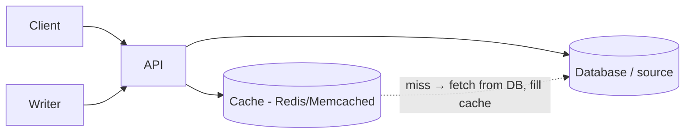

# Caching

## 1. One-Line Definition
Caching stores frequently-accessed data in a fast store (memory/edge) so repeat reads skip the slow source (disk database, upstream API), trading a little staleness for dramatically lower latency and load.

## 2. Why Do We Need It?
Databases and upstreams are the slowest hop and the common bottleneck; most workloads are **read-heavy with a small hot set** (20% of data serves 80% of traffic). Caching converts expensive repeated work into cheap memory hits — the single highest-leverage performance pattern in HLD.

## 3. Simple Intuition
A kitchen prep table: instead of fetching each ingredient from the warehouse (DB) every dish, the chef keeps the popular items on the counter (cache). Counter space is limited (eviction), some items go stale (TTL), and the day the warehouse closes must not kill dinner service (cache miss → DB).

## 4. What Happens Without It?
Every request hits the database/upstream: DB I/O, connections, and CPU saturate early; p99 balloons; a traffic spike (launch, sale) melts the DB; and every repeated read wastes money and time. Without caching, read-heavy systems die at a fraction of their potential capacity.

## 5. Core Idea
Cache mechanics in one pass:
- **Hit/miss:** cached copy served (hit) vs fetched from source and stored (miss).
- **TTL/expiration:** bounded freshness window; invalidation removes a key on write.
- **Eviction:** LRU (least recently used), LFU (least frequently used), FIFO — evicts when full.
- **Write strategies:**
  - **Cache-aside (lazy):** app reads cache → miss → reads DB → fills cache. Simple, cache can be lost safely.
  - **Read-through:** cache itself loads from source on miss.
  - **Write-through:** write DB + cache together (stronger freshness, write latency up).
  - **Write-back:** write cache, flush to DB later (fast writes, risk of loss on crash).
  - **Write-around:** write DB only, invalidate cache.
  - **Refresh-ahead:** proactively refresh hot keys before TTL expiry.
- **Topology:** local (per-node, fast, duplicated, no network) vs distributed (Redis/Memcached — shared, consistent, but one more network hop and a potential SPOF).

**Failure tax:** cache stampede (miss storm on expiry), penetration (queries for data that doesn't exist hammer the DB), avalanche (mass expiry → all at once). Mitigations: locking/stamping (single-flight), negative caching, randomized TTL, cache warming.

## 6. Important Terminology

| Term | Simple Meaning |
|------|----------------|
| Cache key | Unique identifier for a cached value (often URL/ID+version) |
| Hit / miss / hit ratio | Served from cache / not / % of requests served |
| TTL | Time a value stays valid |
| Eviction | Forcing something out when the cache is full |
| Cache-aside | App orchestrates: read cache, on miss read DB and fill |
| Write-through / write-back | Write to cache+DB / write to cache and flush later |
| Stampede | Simultaneous misses after expiry → source overload |
| Penetration | Queries for keys that don't exist → always miss |
| Negative caching | Cache "this doesn't exist" for a short TTL |

## 7. Basic Architecture



Hot reads: API → cache hit (fast). Cache miss: API → DB (slow, one-off) → fill cache → serve.

## 8. Request or Data Flow
1. Read arrives with key K (e.g., `user:123:profile`).
2. API checks cache: hit → return (p99 1-5 ms).
3. Miss → query DB, put K into cache with TTL, return.
4. Writes: update source of truth (DB), then invalidate/update cache.
5. Eviction keeps memory bounded; TTL bounds staleness.

## 9. Practical Example
**News feed (assumptions):** 90% of users read, 10% write, hot posts are identical for many users.
- Cache top-1000 posts per feed bucket (key = user bucket + page, TTL 60 s).
- Writer posts → write-through to DB, background invalidate of affected feed buckets.
- Single-flight on stampede: the first miss refills, others wait/fall back to stale.

## 10. Scaling
- **Local cache** (per instance): duplicated, fast, no network — good for identical hot objects; bounded by per-node memory; cache gets cold on deploy.
- **Distributed cache:** shared memory pool; scale nodes; key distribution via consistent hashing; hot keys → add replicas of the hot key or a dedicated shard.
- **Capacity estimate:** cache the hot working set — `memory = hot keys × value bytes × replicas`, plus headroom/TTL turnover.
- **Miss storms:** after a deploy or cache clear, prepare with warming + single-flight + DB protection (limited concurrency to DB).

## 11. Reliability and Failure Scenarios

| Failure | What Happens | Detection | Recovery | Trade-off |
|---------|--------------|-----------|----------|-----------|
| Cache node down | Misses → DB load | Hit-ratio drop, error spike | Retry w/ DB, rebuild slowly | DB must survive cache-less |
| Mass expiry | Stampede to DB | P95 spike at TTL boundary | Jitter TTL, single-flight | DB sizing |
| Hot key | One key saturates shard | Skewed latency/load | Replicate hot key, local cache it | Extra memory |
| Stale serve | Serves old data | Weight/checksum drift | Shorter TTL, invalidate on write | Freshness vs load |

## 12. Consistency and Correctness
Caches are **derived copies — never the source of truth**. Read bursts tolerate stale-by-TTL; writes must converge. Keep the define-the-truth decision at the DB: use invalidation on write (write-through/write-around) for freshness-critical data, longer TTLs where eventual staleness is fine. Never cache credentials, balances at faces of writes, or request-auth-dependent responses in shared caches.

## 13. Performance
Cache hits: 1-5 ms inner-DC. Your p95 is set by your **miss path** — design and load-test misses. Watch tail latency of Redis (single-threaded — a slow command blocks everything) and connection multiplexing (don't open hundreds of connections with keep-alives).

## 14. Security
- Don't cache per-user/authenticated responses in a shared cache (cross-user leak).
- Validate/allowlist cache keys (key injection/regex abuse).
- Cache stores need access control + TLS; never store raw secrets/tokens.
- Rate-limit churn endpoints so attackers can't force mass invalidations/cold cache.

## 15. Trade-Offs

| Choice | Advantages | Disadvantages | When to Use |
|--------|------------|---------------|-------------|
| Cache-aside | Simple, safe on cache loss | Stampede risk, app must fill | Most apps |
| Read-through | Centralized filling | Cache owns loading logic | Same fill logic everywhere |
| Write-through | Fresh cached data | Slower writes | Freshness-critical reads |
| Write-back | Fast writes | Data loss on crash | High write volume, tolerable loss |
| Local cache | Zero-latency, no network | Duplication, cold deploys | Identical hot objects per node |
| Distributed cache | Shared, consistent, big | Network hop, SPOF-ish | Cross-node hot data (sessions, feeds) |

## 16. Common Mistakes
- Caching everything then claiming "no staleness" — every cache is stale by definition; state TTL + invalidation.
- Not planning the **cache-miss storm** after deploy/clear.
- Ignoring **hot keys** (one key can melt a shard).
- Caching responses that vary per user/auth at a shared layer.
- Treating Redis death as negligible — a blind cache fail = DB surge = outage.

## 17. HLD vs LLD Boundary
HLD: which layers cache (browser/CDN/proxy/local/distributed), what keys, TTLs, eviction policy, write strategy, cache sizing, failure plan. LLD: implementing an LRU, lock granularity inside a cache library, TTL plumbing in a specific DAO.

## 18. Interview Questions

### Beginner
- What is a cache hit vs a cache miss, and what is a good hit ratio?
- Give an example of cache-aside and why the cache can be lost without breaking correctness.

### Intermediate
- How do you keep a cache consistent with the database on writes?
- What is a cache stampede and how do you stop it?

### Advanced
- A hot user floods one Redis shard. How do you redesign the cache?
- You clear the cache during a deploy and the DB dies. Walk through the fix.

## 19. Interview Memory Summary

> [!abstract]- Interview Memory Summary

### Remember

- A small hot set → huge savings (20% of data serves 80% of traffic).
- Cache is derived — never the source of truth.
- Hits are cheap; misses are the design.
- Write strategy + TTL + invalidation define staleness.
- Stampede / penetration / avalanche / hot-key are the failure curriculum.

### 30-Second Explanation

Cache-aside is the default: read cache, on miss read DB and fill, invalidate on write. Pick local vs distributed, size for the hot set, bound with LRU + TTL, and armor the miss path with single-flight + jittered TTL so expiry storms and cache loss can't melt the DB.

### Interview Traps

- "We use Redis, so reads are fast and consistent" — Redis doesn't fix your invalidation or stampede story; those are the actual questions.
- Caching everything then claiming "no staleness" — every cache is stale by definition; state TTL + invalidation.
- Not planning the cache-miss storm after a deploy/clear.
- Ignoring hot keys — one key can melt a shard.
- Caching per-user/auth responses at a shared layer (cross-user leaks).

### Key Trade-Off

Caching trades a little deliberately-sized staleness for dramatically lower latency and DB load — so freshness (TTL + invalidation + write strategy) is the entire bill you pay, and the miss path must always be survivable.

## 20. Related Concepts

### Prerequisites

- [[http-and-https|HTTP and HTTPS]] — Cache-Control/ETag provide the standard caching semantics.
- [[latency-vs-throughput|Latency vs Throughput]] — the exact performance goals caching is buying.

### Commonly Used Together

- [[cdn|CDN]] — the edge tier of the same cache hierarchy.
- [[reverse-proxy|Reverse Proxy]] — hosts the edge cache for dynamic + static content.
- [[load-balancing|Load Balancing]] — consistent-hash routing keeps per-node caches warm.
- [[database-replication|Database Replication]] — read replicas also relieve DB read load; combine when the cache isn't enough.

### Alternatives

- [[database-replication|Database Replication]] (scale reads at the DB layer instead of the application layer)
- [[database-indexing|Database Indexing]] (make the slow source faster instead of adding a cache)

### Advanced Concepts

- [[consistent-hashing|Consistent Hashing]] — spreads keys across a distributed cache with minimal churn.
- [[strong-vs-eventual-consistency|Strong vs Eventual Consistency]] — caches are always eventually consistent; choose the freshness window explicitly.

Related planned topics (not authored yet): redis, http-caching, cache-warming.

## 21. References
Redis/Memcached architecture docs; CAP-litmus rules for caching; standard HLD caching material (Grokking, Alex Xu). Verify current Redis cluster/eviction features.

## 22. Active Recall

Test yourself before revealing each answer.

> [!question]- What is a cache hit vs a miss, and what is a good hit ratio?
> A hit serves the value from cache; a miss fetches from the source (DB/API) and fills the cache. A good ratio depends on workload — read-heavy hot sets routinely run 90%+; what matters more is that your p95 is set by the miss path and that the DB can survive 100% misses.

> [!question]- Explain cache-aside and why losing the cache is safe.
> The app reads the cache; on miss it reads the DB, fills the cache with a TTL, and returns. Writes go to the DB (source of truth) and then invalidate/update the cache. Losing the cache is safe because the DB still holds everything — you just pay miss costs until it rebuilds.

> [!question]- How do you keep a cache consistent with the database on writes?
> Write to the DB as the source of truth, then invalidate (write-around) or update (write-through) the cache. For freshness-critical data use write-through/invalidation with short TTLs; for staleness-tolerant data prefer write-around + longer TTLs. Never update-cache-first — the DB must stay authoritative.

> [!question]- What is a cache stampede and how do you stop it?
> An expiry or cache clear makes many simultaneous requests miss and hammer the source. Counter with single-flight/locking (first miss refills, others wait or fall back to stale), randomized/jittered TTLs to de-phase mass expiry, cache warming before deploys, and limited DB concurrency as a backstop.

> [!question]- Trade-off: write-through vs write-back.
> Write-through writes cache+DB together — fresh reads, but every write pays DB latency and the cache adds little on the write path. Write-back writes the cache and flushes to the DB later — fast writes, but you can lose data on a crash. Use write-through when freshness beats write latency; write-back only when loss is acceptable.

> [!question]- A hot user floods one Redis shard. How do you redesign the cache?
> Options: replicate the hot key across multiple shard replicas, local-cache the hot key on app nodes (with invalidation), split the hot key into K sub-cache keys with suffixes, or move the data a layer up (CDN/edge). The robust fix attacks the source — the hot set must be spread or the value made cheap.

> [!question]- You clear the cache during a deploy and the DB dies. Walk through the fix.
> That's the miss-storm failure: 100% misses + stampede → DB meltdown. Fix order: fail over / scale the DB up, limit DB concurrency (throttle), re-enable single-flight + warming, rebuild the cache slowly (by key priority, not all at once), and make future deploys avoid wholesale cache clears.

> [!question]- Interview scenario: the news feed is read-heavy but slow. Where does the cache go?
> Cache the hot set: top posts per feed bucket (key = user bucket + page, TTL ~60s), cache-aside reads, single-flight on the first miss, write-through on publish with background invalidation of affected feed buckets. Local-cache the identical hot posts per node; use the distributed cache for shared/feed data.

## 23. When Should I Use This?

### Use it when

- Read-heavy workload with a small, well-defined hot set.
- The slow source (DB, upstream API) is the bottleneck on the hot path.
- Your latency budget needs single-digit-ms reads.
- The same data serves many users repeatedly (feeds, product pages, sessions).
- Traffic spikes must be absorbed without melting the database.

### Avoid it when

- Writes dominate — invalidation complexity buys little.
- Data changes faster than a useful TTL (freshness-critical, always-changing values).
- Shared-layer caching of per-user/private data (cross-user leak risk).
- The hot set is tiny and the DB is already fast — the cache is pure overhead + staleness.
- You can't operate the miss path — the DB must survive a full cache loss.

### What problem does it solve?

Problem: repeated reads hit the slowest hop — the DB/upstream — saturating I/O, connections, and CPU. Bottleneck: cheap cached work is repeated as expensive source work, so p99 balloons and a spike melts the DB. Solution: store the hot working set at the edge of the request (memory/edge), tune TTL/invalidation/write strategy to the freshness budget, and keep the miss path survivable with single-flight, jittered TTL, and DB backstops.

### What problem does it NOT solve?

It doesn't fix write-heavy bottlenecks (writes still hit the source), can't exceed the source's consistency model (caches are derived and eventual), introduces staleness you must budget for, and the cache dying must not take the system down — the DB path has to stand alone. It's also the wrong home for per-user/auth data at a shared layer.

## 24. Decision Connections

Decisions that go together with caching:

- [[cdn|CDN]] — the multi-region tier of the same cache hierarchy; same TTL/purge/signed-content laws.
- [[reverse-proxy|Reverse Proxy]] — hosts the edge cache; caching policy is an ingress decision.
- [[http-and-https|HTTP and HTTPS]] — Cache-Control/ETag decide what may be cached where; HTTP caching is the outermost tier.
- [[load-balancing|Load Balancing]] — consistent-hash routing keeps per-node caches warm; decide local vs distributed cache with routing in mind.
- [[database-replication|Database Replication]] — the complementary read-scaling lever; try caching first, add replicas for what the cache can't carry.
- [[consistent-hashing|Consistent Hashing]] — the mechanism that spreads keys across a distributed cache with minimal churn on membership change.
- [[strong-vs-eventual-consistency|Strong vs Eventual Consistency]] — a cache is eventual by construction; the TTL/invalidation setup is where you declare the freshness window.

Decision tree:

```
Reads too slow or the DB is saturated
    |
    +-- Same data re-read (hot set exists)?
    |      → [[caching|Caching]]
    |         |
    |         +-- Identical hot objects per node? → local cache (fast, duplicated)
    |         +-- Cross-node shared data?        → distributed cache ([[consistent-hashing|Consistent Hashing]])
    |         +-- Freshness-critical reads?      → write-through + invalidate on write
    |         +-- Fast writes, tolerable loss?   → write-back
    |         +-- Miss-storm risk?               → single-flight + jittered TTL
    |
    +-- Read-heavy but uncacheable (per-user data)?
    |      → [[database-replication|Database Replication]] + careful scoped caching
    |
    +-- Data scattered, no hot set?
           → index or move the source faster ([[database-indexing|Database Indexing]])
```