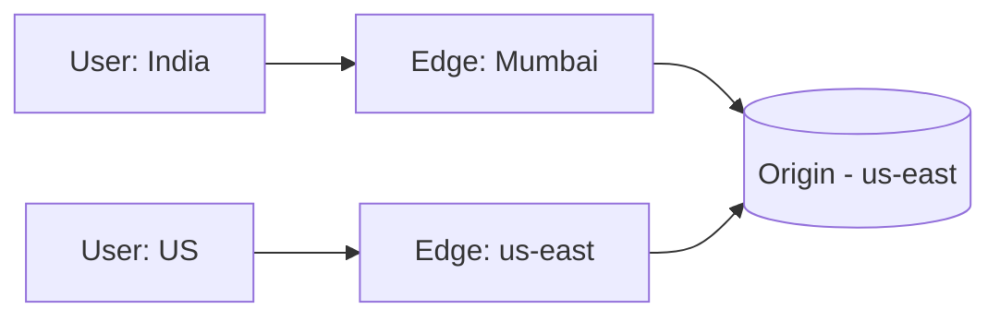

# CDN (Content Delivery Network)

## 1. One-Line Definition
A CDN is a globally distributed network of caching edge servers that delivers content (images, video, JS, CSS, and some dynamic data) from the location physically closest to the user.

## 2. Why Do We Need It?
Distance and bandwidth are the enemy: one origin datacenter means users on the other side of the planet wait 150-300 ms and the origin pays for every byte. CDNs put copies near users, which cuts latency and offloads massive egress, making video/static-heavy products viable and cheap.

## 3. Simple Intuition
Instead of every student walking to the single library downtown for the same textbook, the school puts a copy of the popular books in the classroom cupboard. Edge = classroom cupboard; origin = the library. Which books to store and how often to refresh = cache policy.

## 4. What Happens Without It?
Every image/video/HTML request travels from the client to one origin region: high latency worldwide, huge egress bills, and a thundering herd on the origin that scales poorly with content size. A single viral video goes global and the origin melts.

## 5. Core Idea
- **Edge servers** (PoPs) distributed worldwide cache content using standard HTTP caching (Cache-Control, TTL, purge).
- **Origin** is the source of truth; edges pull from it on miss (`Cache-Control: s-maxage` from origin or CDN rules).
- **Routing:** 1) GeoDNS returns the nearest PoP, or 2) Anycast advertises the same IP everywhere so the network routes to the nearest PoP. 
- **Pull vs push:** pull (default — edge fetches on first request) vs push (pre-upload hot/release content to edges).
- **Dynamic/API caching:** with careful Cache-Control, even small dynamic payloads can be edge-cached (with invalidations/purge), and "stale-while-revalidate" serves stale fast while fetching fresh.
- **Purge:** explicit invalidation (by URL/tag) removes stale copies — essential after publishes.

## 6. Important Terminology

| Term | Simple Meaning |
|------|----------------|
| PoP / Edge | A nearby CDN server that caches and serves |
| Origin | The real backend the edge pulls from |
| Miss / hit | Not cached / cached at edge |
| TTL / s-maxage | How long edges keep a copy |
| GeoDNS / Anycast | Nearest-edge routing mechanisms |
| Purge | Force-invalidate a cached object |
| Pull vs push | Fetch on demand vs pre-load to edges |
| Stale-while-revalidate | Serve old copy + refresh in background |

## 7. Basic Architecture



India user hits Mumbai edge; on miss it pulls from origin and caches; US user hits local edge. Both get local latency; origin gets one upstream fetch for hot content.

## 8. Request or Data Flow
1. DNS (GeoDNS/Anycast) maps the domain to the nearest PoP.
2. Edge checks its cache for `GET /video.mp4` → hit = stream from edge (fast, cheap egress local).
3. Miss → edge requests origin (thread-safe, lock to avoid stampede), caches with TTL, serves.
4. Origin publishes new content → purge old URLs (or new hashed filenames sidestep invalidation).

## 9. Practical Example
**Video platform (assumptions):** 5M DAU watching 10-min videos.
- Encoding pipeline outputs HLS chunks to object storage; object storage configured as a CDN origin.
- Edges cache segments (user sees sub-second start, egress moves to CDN).
- Login/API stays on origin (dynamic) but `/api/trending` is cached 60 s at edge for scale.
- Uploads: signed-URL direct-to-storage; CDN never sees them (security separation).

## 10. Scaling
- **Scale dimension:** PoP count buys latency and absorbs traffic; capacity = edges × caches.
- **Storage:** origin→edge goes up with miss rate; keep TTLs long for versioned assets (immutable URLs = cache forever, new hash = new object).
- **Egress:** the biggest bill—reduce with high hit ratio, compression, smaller encodings (AV1/HEVC).
- **Hotspot:** a viral video saturates one edge — edges fetch once, or pre-push to all PoPs; traffic experts re-route digest-level.
- **Dynamic rescue:** traffic spikes on dynamic pages → cacheable fragments (edge-slice) or fallback-on-origin overage.

## 11. Reliability and Failure Scenarios
- **Edge failure:** users' DNS reresolve to the next PoP (Anycast/GeoDNS) — effectively seamless.
- **Origin failure:** edges keep serving cached content (`stale-if-error`) → limited degradation; writes fail cleanly.
- **Purge propagation:** purges can lag — for release-critical content use cache-busting URLs (unique names) instead of purging.
- **Stampede on expiry:** many edges refetch simultaneously after TTL → limit refetch concurrency (edge thundering-herd protections).
- **Detection:** miss ratio, egress, error rate per PoP, origin upstream QPS; alert on origin spikes (cache wasn't absorbing).

## 12. Consistency and Correctness
CDN is the most eventual of caches — where a cache is derived-but-close, CDN copies are far. Accept staleness for public content (long TTLs). For correctness-critical: unique URLs on publish (versioned), short TTLs, or don't cache. Private/auth-dependent content must use signed URLs + your authorization check at the edge/origin — never cache per-user private data at shared edges without encryption+signed access.

## 13. Performance
The point of a CDN: **move bytes closer**. Region-to-region cross-continental RTT (150-300 ms each way) becomes 10-30 ms edge-local. Check: time-to-first-byte per region (was the right PoP hit?), hit ratio, TLS handshake at edge (edge terminates TLS), and cache miss latency budget.

## 14. Security
- **WAF/DDoS at edge:** CDN absorbs volumetric attacks far from origin; rate limiting per client.
- **Signed URLs/cookies:** access control for small-window/per-user content (expiring tokens).
- **TLS everywhere** (user→edge, edge→origin with cert origin auth).
- Origin is only reachable from CDN (block direct internet access to origin; use an allowlist/VPN).

## 15. Trade-Offs

| Choice | Advantages | Disadvantages | When to Use |
|--------|------------|---------------|-------------|
| Immutable URLs (cache forever) | Best hit ratio, no purge | Old versions pile up (GC) | Versioned assets |
| Short TTL public content | Always fresh enough | More origin traffic | News, live-ish data |
| Dynamic caching | Origin relief | Complex invalidation | Read-heavy dynamic |
| Signed URLs | Access control | Expiry-management overhead | Private/paid content |
| Push CDN | Zero first-load latency | Pre-compute/push costs | Known daily hot content |

## 16. Common Mistakes
- Caching auth-dependent or PII content publicly (leaks).
- Purge-based invalidation for everything (slow, error-prone) — prefer immutable versioned URLs.
- Ignoring origin cost when miss rate is high (cache config wrong, e.g., caching private data or leaking query params).
- Treating CDN as a no-op for dynamic APIs without planning fallback/edge-friendly refreshes.
- Forgetting origin lockdown — a CDN that can't hide the origin gives you speed but not security.

## 17. HLD vs LLD Boundary
HLD: CDN tier placement, caching/Cache-Control policy, purge strategy, signed URLs, region topology, egress costs. LLD: a specific asset pipeline emitting cache headers, a given framework's static-asset config.

## 18. Interview Questions

### Beginner
- What problem does a CDN solve?
- What's the difference between pull and push CDN?

### Intermediate
- Your CDN hit ratio is low; what config do you investigate?
- How do you safely handle private user content on a CDN?

### Advanced
- A flash-sale generates 100x normal dynamic traffic. How do you keep the origin alive?
- Design global origin relief with both media and API content.

## 19. Interview Memory Summary

> [!abstract]- Interview Memory Summary

### Remember

- CDN = the distance/bandwidth fix via edge servers.
- Nearest-edge routing via GeoDNS/Anycast.
- Cache policy (TTL / versioned URLs / purge) sets cost + freshness.
- The origin stays up because edges absorb traffic + DDoS.
- Private content = signed URLs; never cache it plainly.

### 30-Second Explanation

Global edges cache static + hot dynamic content, routed by GeoDNS/Anycast to the nearest PoP, with the origin locked behind the CDN. Use immutable versioned URLs, short TTLs for dynamic data, signed URLs for private content, and monitor hit ratio + origin QPS.

### Interview Traps

- "CDNs cache dynamic APIs too" without a plan for invalidation and per-user auth — that's the entrance to a cross-user leak incident.
- Caching auth-dependent or PII content publicly (leaks).
- Purge-based invalidation for everything — prefer immutable versioned URLs.
- Ignoring origin cost when miss rate is high (wrong Cache-Control / leaky query params).
- Forgetting origin lockdown — a CDN that can't hide the origin gives you speed but not security.

### Key Trade-Off

CDN buys worldwide latency and egress relief by copying content to edges; you pay in staleness (TTL/purge discipline), invalidation complexity, and the need for signed access to keep private content private.

## 20. Related Concepts

### Prerequisites

- [[caching|Caching]] — a CDN is a distributed cache; every TTL/eviction/invalidation law applies.
- [[dns|DNS]] — GeoDNS/Anycast pick the nearest edge PoP.

### Commonly Used Together

- [[http-and-https|HTTP and HTTPS]] — edges serve over HTTP with Cache-Control; TLS terminates at the edge.
- [[reverse-proxy|Reverse Proxy]] — the origin-side ingress behind the CDN; duties compose.
- [[load-balancing|Load Balancing]] — distributes the origin tier the CDN falls back to.

### Alternatives

- [[caching|Caching]] (a central or reverse-proxy edge cache when one region / a small audience makes global edges overhead)

### Advanced Concepts

- [[web-vulnerabilities|Web Vulnerabilities]] — edge WAF/DDoS absorption and signed-URL access guard the origin.

Related planned topics (not authored yet): geo-dns-anycast, object-storage.

## 21. References
CDN vendor architecture docs (Cloudflare, CloudFront, Fastly, Akamai); RFC 9111 (HTTP caching). Verify current feature sets with vendor docs.

## 22. Active Recall

Test yourself before revealing each answer.

> [!question]- What problem does a CDN solve, in one sentence?
> Distance and bandwidth are the enemy: one origin means users far away wait 150-300 ms and the origin pays for every byte. A CDN puts copies at edge servers (PoPs) near users, cutting latency and offloading egress.

> [!question]- What's the difference between pull and push CDN?
> Pull (default): the edge fetches content from the origin on first miss, then caches it. Push: you pre-upload known hot/release content to the edges, so there's zero first-load latency but a pre-compute/push cost — right for known daily hot content.

> [!question]- Your CDN hit ratio is low. What config do you investigate?
> Look at Cache-Control headers first (short/no-cache, private data, or leaked query params kill hit ratio), then TTLs — too short for versioned assets; check that hashed immutable URLs are actually used, and verify routing puts users on the right PoP with the copy populated.

> [!question]- How do you safely handle private user content on a CDN?
> Never cache it plainly at a shared edge. Use signed URLs/expiring tokens so only the authorized user can fetch within a small window, enforce your authorization check at the edge or origin, keep the origin locked down to CDN-only access, and hold TLS end-to-end (edge→origin with cert origin auth).

> [!question]- A flash sale generates 100x normal dynamic traffic. How do you keep the origin alive?
> Cache aggressively: edge-cache the trending/hot dynamic fragments with short TTLs (60s) + stale-while-revalidate, pre-push the flash-sale page to all PoPs, and let the CDN absorb the spike. Add origin load-shedding (throttle/429) and keep per-user uncacheable work off the hot path.

> [!question]- Trade-off: immutable versioned URLs vs purge-based invalidation.
> Versioned immutable URLs cache forever (best hit ratio, no purge, no coordination) and pay with old-version pile-up needing GC. Purge is on-demand and exact but slow to propagate and error-prone for release-critical content. Prefer versioned URLs; reserve purge for emergencies.

> [!question]- The origin fails while edges still hold TTLs. What happens?
> Edges keep serving cached content (stale-if-error), so reads degrade gracefully; writes fail cleanly. That's the resilience payoff of a CDN — but only for content already cached. Purges can also lag, so releases that must be correct immediately use new hashed URLs, not purge.

> [!question]- Interview scenario: global video platform — where does the CDN sit in the architecture?
> Encoding pipeline writes HLS chunks to object storage configured as a CDN origin; edges cache the segments (sub-second start, egress on the CDN), GeoDNS/Anycast route users to the nearest PoP, `/api/trending` is edge-cached ~60s, uploads go signed-URL direct-to-storage (the CDN never sees them), and the origin is locked down behind the CDN.

## 23. When Should I Use This?

### Use it when

- Users are spread worldwide and latency matters (static content, images, video).
- You serve large media where egress is a real bill.
- Content is cacheable — versioned assets, hot dynamic fragments.
- You want edge WAF/DDoS absorption without building it.
- Traffic can spike virally and the origin must not melt.

### Avoid it when

- Content is heavily per-user/private (needs signed URLs + tight config, or skip).
- Churn is so high caching never wins (hit ratio near zero).
- Your audience is one region / small enough that a central cache suffices.
- You can't maintain invalidation — the publish pipeline must version or purge reliably.

### What problem does it solve?

Problem: one origin serves every user everywhere — cross-continental RTT (150-300 ms each way) and egress billed at full rate. Bottleneck: the origin is both slow and thundering-herd-prone for hot content. Solution: distributed edge caches picked by GeoDNS/Anycast serve the bytes near each user; the origin gets one upstream fetch per hot object and its load drops to miss-rate only.

### What problem does it NOT solve?

It doesn't make the origin faster or fix dynamic write paths, can't serve private content safely without signed URLs + authorization plumbing, never guarantees freshness (it's the most eventual of caches), and doesn't hide the origin by itself — you must lock it down to CDN-only access or caching buys you speed without security.

## 24. Decision Connections

Decisions that go together with a CDN:

- [[caching|Caching]] — a CDN is a multi-region cache; every cache decision (TTL, eviction, miss path) applies.
- [[dns|DNS]] — GeoDNS/Anycast select the edge; DNS TTL bounds how fast a broken PoP reroutes.
- [[http-and-https|HTTP and HTTPS]] — Cache-Control/cache-busting and cacheable-or-not decisions + TLS termination at the edge.
- [[reverse-proxy|Reverse Proxy]] — the origin-side front door; decide what the CDN does vs the proxy tier.
- [[load-balancing|Load Balancing]] — the tier distributing origin traffic the CDN falls back to.
- [[web-vulnerabilities|Web Vulnerabilities]] — edge WAF/DDoS and signed-URL auth keep private content from leaking.

Decision tree:

```
Content must reach users across regions
    |
    +-- Static/hot cacheable content, global audience?
    |      → [[cdn|CDN]]
    |         |
    |         +-- Versioned immutable assets?  → cache forever, no purge
    |         +-- News/live-ish data?          → short TTL
    |         +-- Read-heavy dynamic APIs?     → edge-cache fragments w/ invalidation
    |         +-- Private/paid content?        → signed URLs
    |         +-- Known daily hot content?     → push CDN
    |
    +-- One region / small audience?
    |      → [[caching|Caching]] or [[reverse-proxy|Reverse Proxy]] edge suffices
    |
    +-- Origin must stay hidden?
           → lock origin to CDN-only access
```