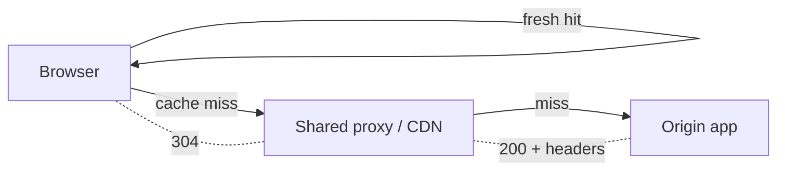

# Browser / HTTP Caching

## 1. One-Line Definition
HTTP caching is the outermost cache tier: the browser and intermediate proxies store responses using HTTP headers — `Cache-Control`, `ETag`, `Last-Modified` — so repeated requests for the same resource skip the network entirely or validate cheaply instead of re-fetching.

## 2. Why Do We Need It?
Most repeated traffic is the *same bytes* the user already received: images, CSS, JS, HTML, and API payloads. HTTP caching turns those repeats into either a zero-network hit (browser cache) or a cheap `304 Not Modified` round trip. It sits before the app, the CDN, and the database, so getting the headers right multiplies the capacity of every lower layer — and getting them wrong wastes the cheapest savings in the stack.

## 3. Simple Intuition
A student keeps the exam formula sheet in their binder (browser cache): today's question can be answered from the binder — no trip to the teacher. When the teacher says "the version changed" (ETag/Last-Modified), the student rechecks: "my copy is still current" gets a "yes, use it" with no new pages (304), and a changed version gets a small "here are the changes" instead of a re-print of the whole book.

## 4. What Happens Without It?
Every page load re-downloads every asset over the network: multi-second loads on slow links, gigabytes of re-transferred bytes, and the origin/CDN paying for all of it (see [[cost-estimation|Cost Estimation]] for the egress bill). Worse, with *wrong* headers the two classic bugs appear — stale content that refuses to update, and uncacheable content that re-downloads forever — so "not setting headers" isn't neutral; it's missing both the savings and the freshness machinery at once.

## 5. Core Idea
- **Two mechanisms:**
  - *Freshness:* `Cache-Control: max-age=3600` — for that long the copy is valid without rechecking. The strongest performance lever: a fresh hit is network-free.
  - *Validation:* `ETag`/`Last-Modified` — after max-age, revalidate; a `304 Not Modified` returns no payload body when unchanged.
- **`Cache-Control` is the one header to memorise:** `no-store` (never cache — PII), `no-cache` (must revalidate every use), `private` (user-specific, browser-only), `public` (shareable), `max-age=N`, `immutable` (never revalidate — fingerprinted assets), `stale-while-revalidate=N` (serve stale while fetching fresh), `s-maxage=N` (shared-cache/proxy override).
- **Static assets with fingerprinted names** (`app.3fa7b83.js`) get `public, max-age=31536000, immutable` — the version is in the URL, so a cache-forever policy is correct (this is HTTP versioning; see [[cache-warming|Negative Caching / Warming / Versioning]]).
- **Dynamic/API responses** are carefully bounded: `max-age=60` for a fast-changing feed, `no-cache` + strong ETag for "must be fresh", `no-store` for auth/personal data.
- **Where it lives:** browser memory/disk cache → shared proxies/edge → CDN (see [[cdn|CDN]]) → app. Each layer honors the same headers; `Vary` (e.g., by `Accept-Encoding`, `User-Agent`) tells caches when a cached copy is *not* valid for a given request.

## 6. Important Terminology

| Term | Simple Meaning |
|------|----------------|
| Cache-Control | The header dictating freshness, shareability, revalidation |
| max-age | Seconds a copy is fresh without rechecking |
| ETag | Weak/strong validator — content fingerprint for revalidation |
| Last-Modified | Heuristic/fallback validator (timestamp) |
| 304 Not Modified | Validator hit: resource unchanged, no body sent |
| no-cache vs no-store | "Revalidate before use" vs "never store at all" |
| Vary | Tells caches which request headers a copy depends on |
| Fingerprinted URL | Version/hash in the filename → safe cache-forever |
| stale-while-revalidate | Serve old, refresh in background (freshness-perception hack) |

## 7. Basic Architecture



## 8. Request or Data Flow
1. First GET: origin returns `200` plus headers (`ETag`, `Cache-Control: max-age`). All layers store the copy.
2. Repeat within freshness: browser serves from cache — zero network.
3. After max-age: browser sends `If-None-Match: <etag>`; if unchanged, origin replies `304` (headers only, no body) — cheap revalidation, network saved.
4. On change: origin returns `200` with the new body and ETag; caches replace the stored copy.
5. `no-store`/`private` directives block this flow for PII and per-user data at the shared layers.

## 9. Practical Example
**Storefront (assumptions):** 60 assets per page (CSS, JS, images), user loads a page 5x a day, 2 MB/asset-set.
- Fingerprinted static: `public, max-age=31536000, immutable` → after the first load, page weight is bytes the browser never re-fetches; only the HTML and API payloads hit the network.
- Product API: `public, max-age=30, stale-while-revalidate=60` in front of the CDN → most catalog hits never reach the app; stale serves keep UX snappy under revalidation churn.
- Auth/cart: `private, no-store` overall; session data explicitly out of the shared cache (see [[authentication-vs-authorization|Authentication vs Authorization]] for why per-user data is never HTTP-cacheable in shared tiers).

## 10. Scaling
- **The stack composes downward:** the better the headers, the less traffic every lower layer sees — browser caches absorb repeats (no bytes at all), CDN edges absorb geography, and the origin sees only genuine misses. The header policy is effectively a free scaling layer.
- **Autoscaling/capacity math should subtract the cache hit:** a 90% HTTP-cache hit means application capacity is sized to 10% of apparent traffic; estimate [[capacity-estimation|Capacity Estimation]] *after* header policy.
- **Revalidation storms:** when max-age expires for a viral object, thousands of if-none-match requests hit the origin at once — bounded by the freshness window, not eliminated; `stale-while-revalidate` and CDN shielding handle the bulk.
- **Vary-as-keyspace:** each `Vary` value multiplies stored copies — cache storage and hit ratio both shift; fewer vary headers mean more reuse.

## 11. Reliability and Failure Scenarios

| Failure | What Happens | Detection | Recovery | Trade-off |
|---------|--------------|-----------|----------|-----------|
| Wrong-infinite max-age | Content never updates | Reported stale screenshots | Bump asset version, purge | cache-bust |
| Cache-bust purge miss | Users served old JS/CSS | Console/asset version diff | Fingerprint bump + purge | coordination |
| Validator drift | 304 sent for changed content | Murmur of stale UI | Strong ETag on content hash | compute cost |
| Shared cache leaks | Private data cached for another | Varied-user leak report | Vary/private/no-store | cache share loss |

## 12. Consistency and Correctness
HTTP caching is explicit eventual consistency: the header *defines* the freshness window, so correctness is a policy you choose, not a property you hope for. `no-cache`+ETag gives near-strong revalidation (still a race unless validated at read), `max-age` gives bounded staleness, and `immutable` gives indefinite layering on versioned names. The rule that keeps it honest: PII and per-user state are never cacheable in shared layers, and anything that must be instantly current (quantities, prices at checkout) gets `no-store` or validation — never a blind long max-age.

## 13. Performance
HTTP caching is the cheapest performance win in the stack: a fresh browser hit is measured in microseconds and costs zero network bytes; a `304` costs one round trip instead of a full payload. Measure the gain by *cache hit ratio at each tier* and by bytes-served-per-request, not just request count. The p95 page-load story is usually dominated by cache misses and uncacheable personal data — fix headers before tuning servers.

## 14. Security
- The big rule: per-user, authenticated, and PII-bearing responses are `private` at most, `no-store` usually — a shared cache serving one user's data to another is the classic HTTP-cache vulnerability (`Vary: Authorization` is not enough on its own).
- Don't cache sensitive payloads in browser history either; pointers to cache keys can reveal data via timing/disk inspection.
- Cache-busting on deploys must not become a path-traversal key-injection vector — validate the asset name before it becomes a cache key.

## 15. Trade-Offs

| Choice | Advantages | Disadvantages | When to Use |
|--------|------------|---------------|-------------|
| Long max-age immutable | Zero re-fetch, instant repeat loads | Never updates without new URL | Fingerprinted static assets |
| max-age + revalidate | Fresh but cheap checks | Round trip per TTL expiry | HTML/API with bounded freshness |
| no-cache + ETag | Near-current always | Every use validates | Dynamic must-be-fresh |
| no-store | Zero stale, zero leak | Every request at full cost | PII/auth/payments |
| stale-while-revalidate | Stale-fast + background fresh | Keeps stale visible briefly | UX above exact freshness |

## 16. Common Mistakes
- `max-age=31536000` on *un-versioned* assets — a breaking change goes unfixed for a year.
- Setting no headers at all: browsers use heuristic caching (Last-Modified guessing) — undefined behavior instead of a policy.
- Caching `private nocache` PII in a shared tier anyway (leak class).
- A blanket `no-store` on everything — you give away the whole outermost layer.
- Believing a purge fixes stale caches everywhere; browsers ignore global purges — version-bump instead.

## 17. HLD vs LLD Boundary
HLD: header policy per resource class (static/versioned, HTML, API, private), tier placement (browser vs CDN vs proxy), stale-while-revalidate windows, cache-busting strategy. LLD: wiring `Cache-Control` into each route/middleware, generating ETags from content hashes, configuring one vendor's purge API.

## 18. Interview Questions

### Beginner
- Explain the difference between `no-cache` and `no-store`.
- What does a `304 Not Modified` save, and when does it happen?

### Intermediate
- Design the header policy for a storefront page: assets, HTML, product API, cart.
- A deploy ships new JS but half your users still get old code. Diagnose and fix.

### Advanced
- Design a versioning + cache policy that guarantees no user mixes old HTML with new JS after a rolling deploy.
- Your CDN revalidation storm at TTL expiry melts the origin. Architecture-level fix.

## 19. Interview Memory Summary

> [!abstract]- Interview Memory Summary

### Remember

- Freshness: `max-age`; validation: `ETag` + `304`.
- Fingerprinted assets → `max-age=31536000, immutable`.
- `no-cache` = revalidate; `no-store` = never store; `private` = browser-only.
- `Vary` multiplies stored copies; fewer varys = more reuse.
- HTTP cache is the outermost tier; header policy is free scaling below it.

### 30-Second Explanation

Set the freshness/validation policy per resource: fingerprinted static gets `max-age=31536000, immutable` (versioned names, correct forever), HTML/API gets a short max-age or ETag revalidation, PII/auth gets `no-store`/`private`. The browser serves fresh hits for free, revalidates cheaply via 304, and the whole stack below — CDN, app, DB — only sees the misses.

### Interview Traps

- Long `max-age` on un-versioned assets — the update that never lands.
- Blanket `no-store` — throwing away the whole free tier.
- Caching PII in a shared cache.
- Forgetting TCP/secondaries: browsers don't purge; version-bump instead.
- No header story at all — heuristic caching is behavior you didn't choose.

### Key Trade-Off

HTTP caching trades guaranteed freshness for the cheapest, furthest-out traffic savings there is — and the whole art is versioning immutable assets hard and bounding everything else's staleness explicitly, so the savings come without the stale-data bill.

## 20. Related Concepts

### Prerequisites

- [[http-and-https|HTTP and HTTPS]] — the protocol and header semantics this cache runs on.
- [[caching|Caching]] — hit/miss/invalidate theory at the outer tier.

### Commonly Used Together

- [[cdn|CDN]] — the shared edge cache that honors the same headers.
- [[cache-warming|Negative Caching / Warming / Versioning]] — versioning assets is HTTP cache-busting.
- [[dns|DNS]] — DNS/TLS firms the per-request cost that caching avoids.
- [[redis|Redis]] — the inner app-tier cache below the HTTP tier.

### Advanced Concepts

- [[compression|Compression]] — payload bytes multiplies with cache variants; compressed-cache interplay.

Related planned topics (not authored yet): Service Worker caching strategies, HTTP cache-busting matrix.

## 21. References
RFC 9111 (HTTP caching) and 9110 (ETag) define the semantics; MDN HTTP caching guidance is the practical reference. Verify vendor header handling against CDN/proxy docs.

## 22. Active Recall

Test yourself before revealing each answer.

> [!question]- `no-cache` vs `no-store`: what's the real difference?
> `no-cache` means "always revalidate before use" — the copy may be stored but never used without a validator round trip. `no-store` means "never store at all" — applicable only when revalidation itself would leak or burden. PII gets `no-store`; dynamic-but-valuable gets `no-cache`.

> [!question]- Why do fingerprint-versioned assets get `max-age=31536000, immutable`?
> The version lives in the URL (`app.3fa7b83.js`), so a given URL's content never changes — caching it forever is correct, and every new build is a new URL (HTTP versioning). Un-versioned assets with that header are the classic update-blocking bug.

> [!question]- Interview scenario: new JS ships, but users on the stable branch still execute old code for weeks.
> Either the asset URLs weren't fingerprinted and an old long-`max-age` header is still honored, or only some tiers were purged while browsers never honor external purges. Fix: version-bump the filenames (new URL = new content) and make the HTML (which is revalidated) reference the new versions.

> [!question]- Design decision: how do you keep old HTML from mixing with new JS on a rolling deploy?
> Version the entry point, not the bundle: emit a versioned `<script>` URL from the HTML, mark the HTML `no-cache`/short-max-age so it revalidates, mark assets `immutable`, and reference only one version per deploy. Old HTML holds old asset URLs — consistent old; new HTML holds new — consistent new; no cross-pollination.

> [!question]- Failure scenario: CDN TTL expires for a viral object and the origin melts under revalidation.
> The freshness window is a stampede amplifier: everyone revalidates at once. Fixes: `stale-while-revalidate` so stale serves while one background refetch happens, a shim/edge locking for single-flight refills, and strong ETags so unchanged content costs a 304 not a full body.

> [!question]- Trade-off: `Vary: Accept-Encoding` adds value or cost?
> It stores separate copies per encoding — more bytes, more correct (gzip vs identity must not be mixed). The rule: vary only on headers that genuinely change the bytes (`Accept-Encoding`, sometimes `Accept-Language`), because each vary dimension multiplies the cache key space and lowers hit reuse.

> [!question]- When is HTTP caching wrong for an API response?
> When the response is per-user/auth-scoped (leak risk), must be instantly current (prices, balances, checkout state), or is so rare that caching it wastes space for near-zero hit rate. Everything else on the read path is a candidate — the header policy, not the API layer, makes it safe.

> [!question]- Why is a header policy "free scaling" for the whole stack?
> A 90% browser/proxy hit means the CDN, app, DB, and network carry only 10% of user requests — capacity (see [[capacity-estimation|Capacity Estimation]]) is sized against residual misses, and egress (see [[cost-estimation|Cost Estimation]]) shrinks by the same factor. The layers below only ever see what the outermost tier chose not to serve.

## 23. When Should I Use This?

### Use it when

- The product serves static assets, HTML, or read-only API payloads.
- Byte-level and request-level repeat traffic is high and latency matters.
- You want the cheapest possible scaling tier before buying infra.

### Avoid it when

- Responses are per-user/private auth state — no-store wins.
- Freshness must be absolute (checkout, balances, admin) — validation, not long max-age.
- Test environments where stale behavior confuses debugging — or consistently short headers.

### What problem does it solve?

Problem: repeated traffic re-downloads identical bytes and re-executes requests the user already satisfied. Solution: header-driven tiers (browser, proxy, CDN) that serve fresh copies with zero network, revalidate cheaply via ETag/304, and version immutable assets so updates are new URLs — a policy that scales every layer below and shrinks egress cost.

### What problem does it NOT solve?

It does not make per-user private data cacheable (that's `no-store` territory), cannot fix servers that produce wrong/uncacheable responses (the header policy is upstream of correctness), and doesn't manage the app-tier cache internals — that's [[redis|Redis]]/Memcached and [[caching|Caching]] proper.

## 24. Decision Connections

Decisions that go together with HTTP caching:

- [[http-and-https|HTTP and HTTPS]] — the protocol whose headers carry this policy.
- [[caching|Caching]] — the shared hit/miss/invalidation theory at the outermost tier.
- [[cdn|CDN]] — the shared edge cache honoring the same headers.
- [[cache-warming|Negative Caching / Warming / Versioning]] — versioning assets is HTTP cache-busting in disguise.
- [[compression|Compression]] — compression + Vary interplay for stored copies and bytes served.
- [[redis|Redis]] — the app-tier inner cache the HTTP tier protects from load.
- [[cost-estimation|Cost Estimation]] — egress savings are usually the money-jackpot of header policy.

Decision tree:

```
What does this response cache like?
    |
    +-- Fingerprinted static asset?
    |      → public, max-age=31536000, immutable
    |
    +-- HTML or API with bounded freshness?
    |      +-- Can tolerate seconds of staleness?  → max-age=N, stale-while-revalidate
    |      +-- Must be near-current?              → no-cache + strong ETag, 304 flow
    |
    +-- Per-user / auth / PII?
    |      → private, no-store (never shared-cacheable)
    |
    +-- Updates expected? version the URL, not the TTL
           → [[cache-warming|Negative Caching / Warming / Versioning]]
```