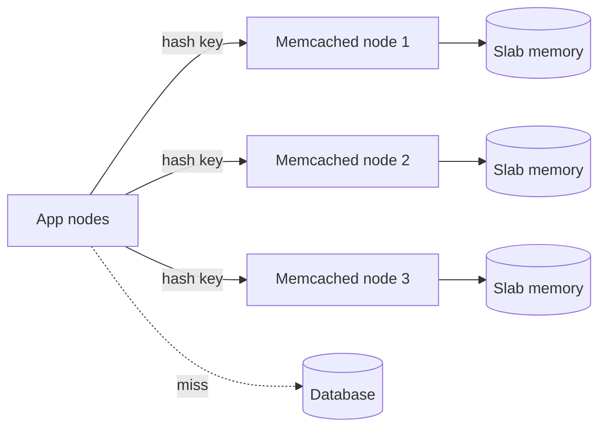

# Memcached

## 1. One-Line Definition
Memcached is a distributed, in-memory key-value cache with a deliberately tiny feature set — bare string values, LRU eviction, multi-threading, and no persistence — that caches database/API results in RAM across many nodes with minimal overhead.

## 2. Why Do We Need It?
Caching is routine; a cache itself should be boring and cheap. Memcached is the "boring" option: a massively parallel, in-memory key-value store whose whole contract is `GET`/`SET` on blobs with eviction, so it runs thousands of QPS on commodity memory with almost no moving parts. It is the default first cache for teams that answer "do we need data structures and persistence?" with "no — we have a database for that".

## 3. Simple Intuition
A warehouse's "popular-shelf" clipboard: write an item's drawing on a note (SET), tape it to the clipboard, hand it back (GET) until space runs out and the oldest note gets torn down (LRU eviction). Several clerks (worker threads) can use the clipboard at once without bumping into each other — but if the board is knocked over at lunch, every note is gone and someone re-asks the warehouse (DB). No notes about "how to build a shelf" (no structures), no ledger of past notes (no persistence).

## 4. What Happens Without It?
Without an in-memory KV tier you either read the DB for every repeated query (DB saturation, latency debt) or you build a distributed cache by hand — hashing a keyspace, handling gossip, eviction, hot keys — which is exactly the wheel Memcached already provides and uniquely provides with fingerprint simplicity. "We can just use Redis" is often true but heavier; Memcached exists for the case where the simplest contract wins.

## 5. Core Idea
- **Minimal contract = maximum simplicity:** key → value blob with atomic GETs/SETs, `delete`, `incr`/`decr` on counters, and a fixed max item size (1 MB default). No data types, no TTL-as-a-feature beyond `expirations`, no scripts, no pub/sub.
- **Distributed by hashing across clients:** Memcached nodes are dumb slabs of memory; clients pick a node by hashing the key (consistent hashing keeps the ring stable — see [[consistent-hashing|Consistent Hashing]]). Add/remove a node and only the re-mapped keys go cold.
- **Multi-threaded, memory-frugal:** per-core worker threads share the slab store; the slab allocator divides RAM into size classes so large and small items don't fragment each other — the classic `-m` tuning lever.
- **No persistence, by design:** losing Memcached must be survivable — cache-aside means a restart is a slow-but-fine refill, never data loss. The [[caching|Caching]] model it implements is exactly the disposable-cache one.
- **Where it fits vs Redis:** bare immutable cache blobs, high-QPS, "just give me GET/SET" — Memcached. Sessions with fields, sorted sets, locks, persistence, streams — Redis (see [[redis|Redis]]).

## 6. Important Terminology

| Term | Simple Meaning |
|------|----------------|
| Slab | Memory size-class where similar-size items live |
| Slab allocator | RAM divided into classes to limit fragmentation |
| LRU eviction | Oldest-least-used item makes room when full |
| Item size cap | Hard limit on value bytes (1 MB default) |
| Consistent hashing | Client-side key→node map that survives node changes |
| Multi-threading | Multiple worker threads serving ops in parallel |
| Cold / warm cache | Empty after restart vs pre-filled |
| Expiry | Per-key max age; Memcached evicts past it lazily |

## 7. Basic Architecture



## 8. Request or Data Flow
1. App calls a sharded cache client with `key`.
2. Client hashes to a node; `GET` returns the blob or a miss.
3. On miss, app reads the DB (or builds the expensive value), `SET`s it with an expiry, and returns.
4. When memory fills, LRU eviction frees space for the newest items — the cache heals itself; you only size it well enough to hold the hot set.
5. A `delete` on writes keeps the cache coherent with the source of truth (cache-aside + invalidation).

## 9. Practical Example
**Product-page cache (assumptions):** 5M SKUs, hot 800k; each page blob 2 KB; traffic read-heavy.
- Cache: 800k × 2 KB ≈ 1.6 GB + slab overhead — a small 3-node cluster at a few GB each.
- Hit ratio: 800k key products ≈ 95% of page views → DB load trivially low.
- Write path: product edits `delete product:<id>`; next read rebuilds. Node loss: only that node's hashed keys go cold for a few minutes of refill — no correctness impact.
- This is the canonical Memcached shape: simple blobs, cache-aside, in-memory, disposable.

## 10. Scaling
- **Node-count scaling:** add nodes and re-hash — only the moved keys go cold; consistent hashing bounds that churn (see [[consistent-hashing|Consistent Hashing]]).
- **No replication in classic Memcached:** each copy is a *separate* key space; if you need multiple copies for HA you run N independent caches (a trade-off teams usually accept because restarts are cheap refills).
- **QPS scales by nodes and threads:** multi-threaded Memcached naturally scales reads across cores; hot keys still pin one node — local-cache the very hot ones or replicate the shard client-side.
- **Memory-bound, not CPU-bound:** sizing is RAM math (see [[cache-size-estimation|Cache Size Estimation]]); keep total working set ≤ ~60-70% of cluster RAM to preserve eviction headroom.

## 11. Reliability and Failure Scenarios

| Failure | What Happens | Detection | Recovery | Trade-off |
|---------|--------------|-----------|----------|-----------|
| Node dies | Its keys go cold, DB load up | Client-aware misses | Cache-aside refills slowly | temporary load |
| Full memory | LRU thrashes hot keys | Miss-ratio spike | Size up, shrink values | cost |
| Slab misconfig | Large items waste whole classes | Memory utilization split | `-m`/slab tuning | tuning effort |
| Client hash stuck | One node busy, others idle | Skewed latency | Rebalance clients/ring | data COLD |

## 12. Consistency and Correctness
Memcached correctness is entirely cache semantics: it is disposable, so consistency = valid-per-TTL and invalidated-on-write. There is no persistence and no read-your-writes promise (a client uses its DB read for that). Never rely on Memcached for counter-critical state beyond its `incr/decr` (which is per-key atomic but distributed as a whole); the DB owns the truth and the cache owns speed ([[strong-vs-eventual-consistency|Strong vs Eventual Consistency]]).

## 13. Performance
Memcached is fast precisely because it does less: no serialization, no persistence on the write path, no command scripting — just RAM reads/writes served by many threads. Typical numbers run into the tens-of-thousands of simple ops/sec per node under `GET`-dominated loads. Pay attention to the 1 MB item cap (big blobs don't fit), the per-connection overhead (pool connections), and slotted RAM (sizing in slabs, not bytes).

## 14. Security
- Memcached was built for trusted internal networks; bind it privately, never expose it, and use TLS/auth client-to-server or a private network (VPN/VPC).
- It caches whatever you put in it — treat it like the secrets it might store: don't populate it with PII/tokens you wouldn't keep in a plaintext file, and scope access with a separate cluster per trust boundary if needed.

## 15. Trade-Offs

| Choice | Advantages | Disadvantages | When to Use |
|--------|------------|---------------|-------------|
| Memcached | Simple, fast, multi-threaded | No persistence, no structures | Bare blob caching |
| Redis | Structures, persistence, pub/sub | Single-threaded core, heavier | Sessions/queues/counters |
| Local cache | Zero-hop, instant | Not shared, cold on deploy | Identical hot objects |
| DB with indexes | Durable, correct | 100-1000x slower | Truth, not cache |

## 16. Common Mistakes
- Expecting Memcached to survive a restart — it is disposable by design; plan cache-aside refill.
- Putting sessions or counters in it and calling them durable — no.
- Treating 100% RAM as the design point; leave eviction headroom.
- Ignoring the 1 MB item cap, then watching big blobs silently not cache.
- Skipping graceful client hashing so a node outage miscalculates warm keys.

## 17. HLD vs LLD Boundary
HLD: where the cache sits, key format, hot-set sizing, expiry policy, eviction headroom, node count, invalidation on write. LLD: the slab class tuning, client library hashing config, connection pooling, and `-m` sizing for one deployment.

## 18. Interview Questions

### Beginner
- What does Memcached actually do, and what does it refuse to do?
- How does a cache restart affect the app in a cache-aside design?

### Intermediate
- When is Memcached a better choice than Redis?
- Your memcached hits 95% RAM and the hit ratio drops. Diagnose and fix.

### Advanced
- Design the client-side hashing that makes a two-node Memcached cluster survive one node loss gracefully.
- Size a Memcached tier for 4M sessions that must also survive a full cluster restart.

## 19. Interview Memory Summary

> [!abstract]- Interview Memory Summary

### Remember

- In-memory KV blobs: GET/SET/delete/incr, LRU eviction, no persistence.
- Multi-threaded, slab-allocated by size classes, 1 MB item cap.
- Client-side consistent hashing spreads keys; node loss only cools its keys.
- Disposable-by-design → cache-aside refill on restart is the plan.
- Bare blob cache = Memcached; structure/durability needs = Redis.

### 30-Second Explanation

Use Memcached for the simplest cache contract: key → blob, LRU eviction, distributed by client-side consistent hashing across nodes, sized by slab classes, disposable by design. It's the fastest path to a shared in-memory tier when you don't need structures or persistence — and the restart/refill path is the cache-aside flow you already have.

### Interview Traps

- Claiming Memcached is durable or searchable.
- No eviction-size plan — running at 100% RAM pretends the LRU will save you.
- Using it for sessions-and-persist scenarios Redis covers.
- Ignoring the restart-cold-reload cost ("cache is gone, so what") without the DB-survives-miss story.

### Key Trade-Off

Memcached trades durability, structure, and query capability for the smallest, fastest piece of plumbing that will solve "give me RAM caching distributed across nodes" — and when your cache needs to be more than blobs, the bill comes due in Redis-speak.

## 20. Related Concepts

### Prerequisites

- [[caching|Caching]] — the hit/miss/eviction/invalidation base Memcached implements.

### Commonly Used Together

- [[redis|Redis]] — the featureful sibling; choose by structure/durability needs.
- [[consistent-hashing|Consistent Hashing]] — the client-side key→node mapping.
- [[cache-size-estimation|Cache Size Estimation]] — sizing the hot-set RAM this tier needs.
- [[cache-warming|Negative Caching / Warming / Versioning]] — restart-refill and versioned keys apply here too.

### Advanced Concepts

- [[database-replication|Database Replication]] — the complementary DB read-scaling when the cache isn't enough.

Related planned topics (not authored yet): memcached-vs-redis decision table, slab tuning notes.

## 21. References
Memcached project documentation (protocol, slabs, storage) is the primary source; redis-vs-memcached comparison pages from the Redis team frame the trade. Verify item-size and eviction behavior against the deployed version.

## 22. Active Recall

Test yourself before revealing each answer.

> [!question]- What is Memcached's entire feature set, and what does it deliberately lack?
> GET/SET/delete/incr with LRU eviction and per-key expiry over in-memory blobs. It lacks data structures, persistence, pub/sub, streaming, and server-side scripting — each is a deliberate trade for speed and simplicity.

> [!question]- How does a Memcached node restart affect a cache-aside app?
> That node's keys all miss, so the app reads the DB and refills over time — a few minutes of elevated DB load and latency, no data loss, because the cache is disposable by design. The plan is exactly "DB survives total cache loss", never "Memcached persists".

> [!question]- When Memcached, when Redis?
> Bare immutable value blobs at very high QPS with a "keep it simple" contract → Memcached. Sessions with fields, sorted sets, queues, distributed locks, persistence, or pub/sub → Redis. The question is whether you need structures and durability, not which is "better".

> [!question]- Interview scenario: Memcached at 95% RAM, hit ratio dropping.
> The LRU is thrashing — the hot set exceeds available RAM, so hot keys get evicted before reuse. Fix: size up (or shrink values), separate hot-small and large items into different slab policies, and confirm the working-set estimate (see [[cache-size-estimation|Cache Size Estimation]]) was for the hot set, not the whole dataset.

> [!question]- Failure scenario: one of three Memcached nodes dies at peak.
> Only the keys hashed to that node go cold; consistent-hashing clients spread the survivors across the remaining two, so DB load rises by roughly the dead node's share. Recovery is cache-aside refill plus adding the node back (which re-maps a slice again). No corruption, no lost truth.

> [!question]- Why does consistent hashing matter to the client, not the server?
> Memcached has no routing brain — the client picks the node from the key hash. Consistent hashing keeps that map stable when nodes join/leave, so a single node change cools only the 1/N slice that moved instead of the entire cache. Getting this wrong makes every resize a full cache cold-start.

> [!question]- Trade-off: multi-threaded Memcached vs single-threaded Redis for the same cache.
> Memcached scales raw GET/SET across cores and memory classes with fewer sharp edges; Redis serializes a single loop but brings structures and durability. For identical blob-cache workloads Memcached is the quieter default; as soon as the keyspace has shape, Redis stops being the "heavier" option and becomes the right tool.

> [!question]- Design decision: can Memcached hold sessions?
> Only when sessions are disposable-blob state (re-login acceptable) and hot-set-sized; if they must survive restarts or carry evolving fields, sessions benefit from Redis hashes with persistence plus TTL. A "sessions in Memcached" design is really answering "what do we lose on restart?" before it commits.

## 23. When Should I Use This?

### Use it when

- The cache contract is bare key-value blobs from a DB/API result.
- You want the simplest, highest-threading cache and can afford no persistence.
- The working set fits RAM and cache-aside refill survivability is easy to argue.

### Avoid it when

- You need data structures, atomic multi-features, persistence, or pub/sub — Redis territory.
- The cached data is so critical that losing a copy is unacceptable (use a durable store or grouped replicas).
- The working set is huge; a memory tier is the wrong shape regardless of which KV you choose.

### What problem does it solve?

Problem: read-heavy workloads need shared in-memory cache; building one by hand is hard, and richer caches bring unwanted machinery. Solution: a tiny, multi-threaded, in-memory KV store whose only job is GET/SET/evict across nodes, distributed by client-side consistent hashing and disposable by design.

### What problem does it NOT solve?

It does not provide durability (data disappears on restart), structures (hashes/zsets etc.), pub/sub, or server-side logic — and it cannot fix a cache whose invalidation/stampede policy is wrong, because Memcached only stores blobs; the correctness of what's stored is still yours (see [[caching|Caching]]).

## 24. Decision Connections

Decisions that go together with Memcached:

- [[caching|Caching]] — the policy Memcached implements as a bare-blob cache.
- [[redis|Redis]] — the sibling to compare when needs grow beyond KV blobs.
- [[consistent-hashing|Consistent Hashing]] — the client-side map that distributes keys.
- [[cache-size-estimation|Cache Size Estimation]] — sizing the RAM the tier needs.
- [[cache-warming|Negative Caching / Warming / Versioning]] — restart-refill and key versioning still apply.
- [[database-replication|Database Replication]] — the DB-side read lever beyond the cache.

Decision tree:

```
Need a distributed cache?
    |
    +-- Bare key-value blobs, no persistence needed?
    |      +-- High QPS, simplest contract? → [[memcached|Memcached]]
    |      +-- May need structures later?   → [[redis|Redis]] now, avoid migrate
    |
    +-- Sessions, counters, locks, queues, persistence?
    |      → [[redis|Redis]]
    |
    +-- Working set too big for RAM?
           → not a cache-store problem → re-think the hot-set assumption
```