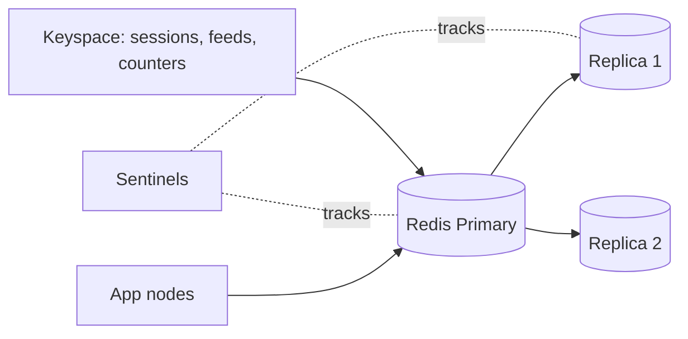

# Redis

## 1. One-Line Definition
Redis is an open-source in-memory key-value store with rich data structures, optional persistence, replication, and clustering — the standard distributed-cache and in-memory-data-layer backbone for sessions, feed caches, queues, counters, and rate limiting.

## 2. Why Do We Need It?
A plain `HashMap` is per-process and dies with the node; a database is correct but too slow for single-digit-millisecond reads. Distributed systems need a *shared, fast, durable-enough* store that many app nodes can hit at once — that is Redis's slot: sub-millisecond local operations, data structures shaped for real workloads (sets for dedupe, sorted sets for leaderboards, hashes for sessions, streams for queues), and cluster modes that scale past a single node (see [[cache-size-estimation|Cache Size Estimation]] for the memory side).

## 3. Simple Intuition
A hotel's front-desk board: every concierge (app server) can consult it in a split second — current guests (sessions), keys being held (locks), today's counts (counters) — and the hotel keeps a backup log (persistence) in case someone knocks the board over. It is faster than walking to the archive (DB) for every question, but it is still not the archive: if the board falls, you lose some short-lived facts.

## 4. What Happens Without It?
Without a shared fast store you either (a) keep state in each server's memory — sessions break, caches duplicate, consistency dies — or (b) read/write the database for everything, serializing traffic on the DB and blowing the latency budget. Redis is what most read-heavy architectures use so their precious hot reads never touch the DB, sessions survive rolling deploys, and locks/queues/rate-limiters have a single shared home.

## 5. Core Idea
- **In-memory by design — speed is the point.** A single-threaded command loop keeps operations simple and consistent; values live in RAM (plus optional RDB snapshots / AOF append-only log for recovery).
- **Data structures do the work:** string (cache values, counters), hash (session/object fields), list (recent activity, simple queues), set (dedupe, tags), sorted set (leaderboards, feed pagination, rate-limit windows), bitmap/hyperloglog (analytics, distinct counts), stream (lightweight event/queue log).
- **Ops that matter for HLD:** TTL/expire (cache semantics), `INCR`/`DECR` (atomic counters), `NX` options (distributed locks — see [[distributed-locks|Distributed Locks]]), pub/sub (tiny fan-out), Lua scripts / transactions (atomic multi-step).
- **Topology ladder:** single node → replication (replicas for read scale + failover) → sharded cluster via [[consistent-hashing|Consistent Hashing]] slots (16384 slots) → sentinel-managed HA. Pick the smallest rung that fits the working set.
- **Eviction policies matter:** `allkeys-lru`, `volatile-lru`, `noeviction` — the choice declares whether the cache evicts (cache semantics) or refuses writes (state semantics).
- **Not a replacement for the DB:** persistence is a recovery convenience; durability budget belongs to the source of truth (see [[caching|Caching]] for invalidation discipline).

## 6. Important Terminology

| Term | Simple Meaning |
|------|----------------|
| Key / value | The addressable pair; key often `object:id` |
| Data structure | String/hash/list/set/zset/stream behavior built in |
| TTL | Time-to-live — auto-deletes a key |
| RDB / AOF | Snapshot dump / append-only log persistence |
| Sentinel | HA manager: failover, discovery |
| Cluster | Sharding across nodes by hash slots |
| Pub/Sub | Channel broadcast to subscribers |
| Single-threaded loop | One command at a time per instance — no races |
| MGET / pipeline | Batch reads / grouped commands (latency wins) |

## 7. Basic Architecture



## 8. Request or Data Flow
1. App computes a key: `session:42`, `feed:region:100`, `limits:user:42`.
2. It issues a data-structure op: `GET`, `INCR`, `ZADD`, `SET ... EX 60` — sub-millisecond locally.
3. On cache miss, the app falls back to the DB and backfills with TTL (cache-aside), or Redis read-through does the load.
4. Writes that must survive a crash choose AOF with a configured fsync policy; RDB snapshots give quick-restart recovery.
5. On primary failure, a sentinel or the replica-promotion process elects a new primary and re-points the app with minimal disruption.

## 9. Practical Example
**Session + feed + rate-limit stack (assumptions):** 10M sessions at ~600 B each on a 2-node cluster; feed hot-set cached with TTL 60 s; auth rate limit per user via `INCR` + `EXPIRE`.
- Session: `SET session:42 "{...}" EX 86400` — survives deploy only if persistence enabled or if loss-only-forces-login is acceptable.
- Leaderboard for a contest with 1M scores: `ZADD board score member` + `ZREVRANGE` — one structure, O(log n), no joins.
- Rate limit: `INCR key; EXPIRE key 60` — atomic, one round trip.
- Sizing check (see [[memory-estimation|Memory Estimation]]): these working sets fit one node comfortably; cluster mode is only needed past that point.

## 10. Scaling
- **Read scaling:** add replicas, or cluster slots spread reads; but Redis is memory-scale first — the cluster exists so the *keyspace* fits, not only the QPS.
- **Write scaling:** the single-threaded loop caps writes per node; cluster shards keyspace writes across nodes (hot keys still collide — see [[caching|Caching]] hot-key talk).
- **Atomicity vs sharding:** cross-key transactions work only within one node; a cluster forces multi-key ops onto the same slot or into Lua on one slot — scaling Redis costs atomicity scope.
- **Membership events are events:** slots migrate, replicas sync, caches re-warm. Cluster resize, like any [[consistent-hashing|Consistent Hashing]] ring, redistributes a slice and needs warming (see [[cache-warming|Negative Caching / Warming / Versioning]]).

## 11. Reliability and Failure Scenarios

| Failure | What Happens | Detection | Recovery | Trade-off |
|---------|--------------|-----------|----------|-----------|
| Primary dies | Writes blocked until election | Sentinel/failover signal | Promote replica, re-sync | small loss window |
| Node OOM | Maxmemory → eviction or hard errors | Memory latency trigger | Grow node, tier data, evict | data loss of evicted |
| AOF corrupt | Restart replays partial log | Boot diagnostics | `redis-check-aof`, RDB restore | recovery gap |
| Big key / slow command | Single-thread loop stalls for all | Latency spike on every command | Split key, pipeline, read-only replica | design |

## 12. Consistency and Correctness
Redis trades durability for speed on purpose: AOF with `appendfsync everysec` can lose up to ~1 s of writes on crash; RDB-only loses a full snapshot window. That is fine for caches and sessions, wrong for ledgers and money — put source-of-truth data elsewhere and treat Redis as derived/recoverable state ([[strong-vs-eventual-consistency|Strong vs Eventual Consistency]]). Cluster ops guarantee per-key atomicity but cross-slot transactions need slot co-location or a Lua script; single-node operations are serialized by the loop, which is where most interview correctness questions actually land.

## 13. Performance
Redis is fast (100k+ simple ops/s single node) because it skips disk on the hot path and its loop avoids races; the dangers are all design-caused: big keys (MB-sized blobs serialize and stall the loop), slow commands (`KEYS`, full `SMEMBERS` scans), no pipeline (per-op round trips amortized badly at high QPS), and connection sprawl. Watch p99 and hit-ratio together — a hot-key storm on one shard shows up as p99 even when average CPU looks fine.

## 14. Security
- Redis historically trusts its network: bind internal-only, TLS in transit, auth via ACLs with least privilege, and never expose it publicly.
- Keys can leak or be injected if unvalidated user input becomes a key (key-injection); validate/allowlist.
- Never cache secrets/credentials/tokens in a shared Redis; use dedicated stores and rotation. A Redis compromise is instant data exfiltration of whatever is cached — scope it.

## 15. Trade-Offs

| Choice | Advantages | Disadvantages | When to Use |
|--------|------------|---------------|-------------|
| Redis | Rich structures, op speed | Memory-bound, no rich queries | Cache/session/counter/queue |
| Memcached | Chewable, multi-threaded simple KV | No persistence, no structures | Plain KV cache only |
| Postgres/DB | Durable, queryable, correct | 100-1000x slower reads | Source of truth |
| Local cache | Zero-hop, no CPU on Redis | No sharing, cold on deploy | Identical hot objects |

## 16. Common Mistakes
- Treating Redis as the source of truth — durability is a recovery convenience, not a ledger guarantee.
- Letting big keys/slow commands ride the shared single-thread loop.
- No eviction policy — a "cache" running `noeviction` fails closed at capacity.
- Ignoring hot keys: one key can pin a shard regardless of total RAM.
- Believing cluster mode makes keys atomic across slots — it doesn't.

## 17. HLD vs LLD Boundary
HLD: which keyspace (sessions/feeds/queues/rate-limits), topology (single/replica/cluster), eviction + persistence policy, memory sizing, hot-key strategy. LLD: key naming, Lua script speed, pipeline batching, a specific `INCR`+`EXPIRE` rate-limit implementation.

## 18. Interview Questions

### Beginner
- Why is Redis fast, and what is the trade for that speed?
- When would you persist Redis and in what form?

### Intermediate
- Design a session store and a feed cache in Redis with eviction + TTL policy.
- A hot key melts one Redis shard. Fix it.

### Advanced
- When is Redis the wrong cache and what replaces it?
- Design a Redis-backed distributed lock and explain why naive SETNX is unsafe without expiry.

## 19. Interview Memory Summary

> [!abstract]- Interview Memory Summary

### Remember

- In-memory single-threaded loop = speed + serialized ops.
- Strings, hashes, sets, zsets, streams map to sessions, dedupe, leaderboards, queues.
- TTL + eviction policy make Redis a cache; persistence is recovery, not truth.
- Single node → replicas → cluster; cluster costs cross-slot atomicity.
- Big keys, slow commands, hot keys are the p99 killers.

### 30-Second Explanation

Redis is the shared in-memory layer that app nodes hit in sub-millisecond for sessions, caches, counters, queues, and locks. Size it to the hot working set (a cache, so eviction+TTL are friends), pick the topology the keyspace needs (replica for reads, cluster for size), choose RDB/AOF persistence as a recovery story — and never forget durability lives in the DB, not here.

### Interview Traps

- Calling Redis "the database" in a design.
- No eviction/TTL story — "we just store everything".
- Counting on cross-key transactions in cluster mode.
- Ignoring hot keys and big values until p99 blows.
- Exposing Redis publicly / caching secrets.

### Key Trade-Off

Redis trades durability and query capability for unmatched in-memory speed and convenient structures — the entire art is keeping source-of-truth data out of it while letting it eat the hot path that the DB can't afford.

## 20. Related Concepts

### Prerequisites

- [[caching|Caching]] — Redis is the standard distributed-cache implementation.
- [[cache-size-estimation|Cache Size Estimation]] — the RAM sizing behind the cluster rung.

### Commonly Used Together

- [[memcached|Memcached]] — the simpler KV alternative; know when each fits.
- [[consistent-hashing|Consistent Hashing]] — the sharding math Redis cluster slots use.
- [[distributed-locks|Distributed Locks]] — the canonical Redis-backed lock (SET NX + expiry).
- [[distributed-rate-limiter|Distributed Rate Limiter]] — Redis counters as shared rate-limit state.
- [[cache-warming|Negative Caching / Warming / Versioning]] — what happens around deploys and resharding.

### Advanced Concepts

- [[message-queue|Message Queue]] — Redis streams/lists as a lightweight queue tier.
- [[session-management|Session Management]] — Redis sessions as the stateful-service pattern.

Related planned topics (not authored yet): redis-cluster slot migration drill, AOF-vs-RDB recovery drills.

## 21. References
Redis official documentation (data types, persistence, cluster, sentinel) is the source of truth; sizing/eviction guidance cross-references HLD cache material. Verify structure semantics against current Redis behavior.

## 22. Active Recall

Test yourself before revealing each answer.

> [!question]- Why is Redis fast, and what commodity is that speed bought with?
> It keeps the hot data in memory and processes commands in a single-threaded loop — no disk on the path, no locking, no races. The bill: memory is expensive, durability is limited (RDB/AOF recoveries), and one slow command (big key, KEYS scan) stalls every other client.

> [!question]- Design decision: session store with rolling deploys. What Redis config do you need?
> Sessions must survive a deploy but aren't worth durability — you may even *want* expiry. Use TTLs (EX 86400), pick `volatile-lru` eviction so old sessions drain before new ones fail, and enable AOF everysec so a crash costs logged-out users at worst. The DB remains the identity source.

> [!question]- A hot key melts one shard of a Redis cluster. Fix.
> Replicate the hot key across replicas, local-cache it on app nodes with invalidation, or split it into K suffixed sub-keys; a cluster only spreads *different* keys, so one hot key still pinpoints a single slot. The real fix is making the hot value cheap — compute it once, fan out.

> [!question]- Interview scenario: leaderboard for a 1M-user contest.
> ZADD score member then ZREVRANGE: one sorted set, O(log n) upserts and range reads, leaderboard top-100 in microseconds. Prefer the structure to a relational query — this is exactly the workload Redis structures exist for.

> [!question]- Failure scenario: Redis primary dies at midnight. What does the app experience?
> With replicas + sentinel, election happens in seconds and writes resume on the promoted node — a brief write stall, and whatever wasn't fsynced since the AOF interval may be lost (a few seconds, or more under RDB-only). Because Redis is a cache, the app degrades to DB misses until the new primary re-warms.

> [!question]- Trade-off: Redis vs Memcached for a cache tier.
> Redis wins on structures (hashes/sets/zsets/persistence/pubsub) and is the default for anything beyond bare KV; Memcached wins on simplicity, multi-threading, and predictable slab memory. Bare immutable KV blobs → Memcached; anything interactive or state-shaped → Redis.

> [!question]- Why is naive SETNX a broken distributed lock?
> SETNX alone locks forever if the holder crashes — no expiry. Correct: SET key value NX EX 30 with a token value, renewing under the lock and deleting only if the token matches. Redis locks are up to lease semantics and split-brain risk (see [[distributed-locks|Distributed Locks]]); that's why the lock question is about the expiry, not the SETNP call.

> [!question]- When is Redis the wrong cache?
> When durability/queries/tiering are required of the cache layer (use a real DB), when the working set has no hot-shape (Redis just becomes an expensive HashMap), when data is per-user-private and must not live in a shared store, or when single-node atomicity isn't enough and the problem is genuinely transactional.

## 23. When Should I Use This?

### Use it when

- Shared state must be fast and multi-node (sessions, caches, counters, locks).
- You need data structures (sets, zsets, streams) that would be SQL gymnastics.
- You can size the working set to fit memory and tolerate its durability limits.

### Avoid it when

- Data is small and per-node (a local cache or in-JVM store is simpler and faster).
- Durability or rich queries are non-negotiable (that's a database).
- The working set won't fit memory economically — Redis is not a storage tier.

### What problem does it solve?

Problem: shared state fast enough for hot paths. Databases are too slow, per-node memory isn't shared, and persistence is a frequent requirement. Solution: a shared in-memory store with useful structures, TTLs and eviction, replication, cluster sharding, and just-enough persistence — so sessions, caches, counters, and queues live at single-digit-millisecond latency without hammering the DB.

### What problem does it NOT solve?

It does not provide durability or rich indexing (that's a DB), does not scale atomicity across slots (cluster ≠ distributed transactions), and does not remove the cache-invalidation doctrine — Redis still serves stale data happily unless TTL/invalidation say otherwise (see [[caching|Caching]]).

## 24. Decision Connections

Decisions that go together with Redis:

- [[caching|Caching]] — the policy (eviction, TTL, invalidation) Redis implements.
- [[cache-size-estimation|Cache Size Estimation]] — sizing the keyspace decides the topology rung.
- [[memcached|Memcached]] — the do-you-need-structures comparison.
- [[consistent-hashing|Consistent Hashing]] — the slots that make Redis cluster scale.
- [[distributed-locks|Distributed Locks]] — Redis as lock lease backend.
- [[distributed-rate-limiter|Distributed Rate Limiter]] — Redis counters as shared rate state.
- [[session-management|Session Management]] — Redis as the session tier in stateful servers.

Decision tree:

```
Need shared fast state?
    |
    +-- Bare key-value cache blobs?
    |      → [[memcached|Memcached]] (simpler) — or Redis if you'll need more
    |
    +-- Structures, sessions, counters, locks, queues?
    |      → [[redis|Redis]]
    |         +-- Working set fits one node?    → single (replicas for reads)
    |         +-- Larger than one node?         → cluster via [[consistent-hashing|Consistent Hashing]]
    |         +-- Needs atomicity cross-key?    → stay single-node or Lua-slot
    |
    +-- Durability/queries mandatory?
           → keep the DB as source of truth; Redis only as cache
```