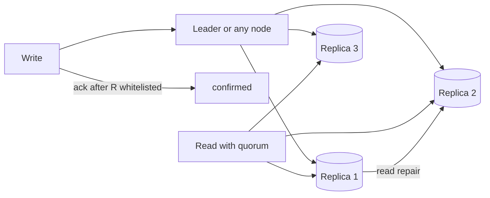

# BASE

## 1. One-Line Definition
BASE — Basically Available, Soft state, Eventually consistent — is the pragmatic consistency contract of distributed NoSQL systems: keep serving reads and writes across partitions (availability), let state drift temporarily, and converge to a consistent view over time instead of refusing work.

## 2. Why Do We Need It?
Strong, ACID-style global consistency is expensive and often impossible across partitioned, replicated stores: it needs coordination, quorums, and blocking, and it sacrifices availability during partitions. BASE exists for workloads that prefer serving *something* now (even if slightly stale or conflict-risky) over serving *nothing* — feeds, carts, counters, clickstreams, recommendations — where the correctness bar is eventual convergence plus idempotent repair.

## 3. Simple Intuition
A temperature map with one sensor per city shows each city's number, even if two cities disagree while the network blips. Nobody shows a blank map because "we couldn't get a globally consistent temperature." During the blip, values diverge (soft state); once connectivity returns, the sensors sync and the map converges (eventual consistency). That is BASE in a store.

## 4. What Happens Without It?
Force ACID semantics onto a partitioned system and you get these failure modes: writes rejected whenever quorum is lost, multi-region round-trip latency on every update, or a "distributed transaction" that stalls while a replica is down — i.e., availability you pay for and can't use. The alternative extreme is ignoring consistency entirely: lost/duplicated writes, negative balances, and silent divergence without a repair story. BASE is the tuned middle.

## 5. Core Idea
- **Basically Available:** the system answers requests under partitions — maybe from a lagging replica, maybe with a partial result — instead of refusing them.
- **Soft state:** there is no instant-frozen invariant; the stored state may change without input (replication, compaction, rebalancing) and nodes may disagree.
- **Eventual consistency:** once writes stop arriving at a location, replicas converge to a single value, *eventually* — the delay is unbounded-ish but bounded in practice by replication lag.
- **How it's engineered:** quorum reads/writes (R + W > N) trade strength for availability; LWW or vector clocks resolve concurrent writes; versioning + retry make repairs safe; read-repair and anti-entropy heal stale replicas in the background.
- **Scope matters:** BASE is per-request/per-operation, not a personality — the same cluster can do quorum-strong reads and eventual writes (see [[strong-vs-eventual-consistency|Strong vs Eventual Consistency]]).

## 6. Important Terminology

| Term | Simple Meaning |
|------|----------------|
| Basically available | Keeps answering even when a partition happens |
| Soft state | State may drift while replicas sync |
| Eventual consistency | Replicas converge once writes stop |
| Quorum | R + W > N rule that makes reads see the newest write |
| LWW (last-write-wins) | Tie-break concurrent writes by timestamp |
| Vector clock / version | Track causal history of conflicting values |
| Read repair | Fix a stale replica opportunistically on a read |
| Replication lag | Delay before a follower reflects a leader write |

## 7. Basic Architecture



## 8. Request or Data Flow
1. A write goes to the node owning the key (or the chosen replica).
2. The node replicates to N replicas; the client gets an ack once the configured W agrees.
3. A read hits the N replicas (or a single one for eventual) and merges the versions by LWW/vector clock; read-repair fixes stale copies.
4. During a partition, the minority can still serve its own writes and reconcile later — divergence is stored, not hidden, and anti-entropy converges it.

## 9. Practical Example
**Shopping-cart service (assumptions):** 50M users, cart updates from web and mobile, network blips between 3 regions.
- Write to the local region, ack fast instead of syncing all 3 (availability first).
- A partition between regions: the user's cart diverges (soft state) — mobile sees 2 items, web sees 3.
- On reconnect, concurrent writes merge by item-version vectors; the final cart converges. Rare conflicts (removed vs added-to a line) surface to the app for a deterministic rule — e.g., item-level LWW.
- The user never saw a spinner or lost their cart — the BASE trade paid off.

## 10. Scaling
- **Availability grows** with replica factor and region count; consistency cost (lag, conflicts) grows with distance and write rate.
- **Quorum tuning:** R + W > N gives read-your-writes-ish strength and still tolerates a minority partition — the dial between "strong-ish" and "fast-ish".
- **Hot keys:** a popular key concentrates version conflicts and quorum traffic — same key design discipline as sharding.
- **Anti-entropy:** periodic reconciliation scales poorly on huge clusters; layer it with read repair and periodic full resyncs.

## 11. Reliability and Failure Scenarios

| Failure | What Happens | Recovery | Trade-off |
|---------|--------------|----------|-----------|
| Region partition | Divergence accumulates | Merge on reconnect | conflicts surface |
| Node fails mid-write | Write may be partial | Quorum read/probe repair | temporary weak read |
| Replica lag spike | Stale reads | Read repair + lag alerts | consistency vs speed |
| Clock skew (LWW) | Wrong winner chosen | Vector clocks / NTP discipline | version complexity |

## 12. Consistency and Correctness
- Ordering: replicas converge on a final value, but *which* concurrent write wins may be arbitrary (LWW by clock) or causal (vector clocks expose the graph). Never assume serializable history.
- Staleness: "read-your-write" is not default — a quorum read is, an eventual read is not. Design APIs to choose per request.
- Idempotency: repair and retry are the BASE answer to double-writes; dedupe in the application layer (see [[idempotency|Idempotency]]).
- Counter/balance invariants (e.g., "sum must equal x") are *not* guaranteed mid-flight — enforce them at read/merge time, not stored invariant time.

## 13. Performance
- Availability is bought with latency on quorum paths (multiple round trips) and background cost (read repair, anti-entropy, version merging).
- Eventual reads are single-hop: the fastest path in distributed stores.
- Conflict-heavy keys amortize slow merge logic per access — another reason to avoid single hot keys.

## 14. Security
BASE does not weaken at-rest encryption, TLS, or access control — those are orthogonal. What changes: stale replicas may serve data to reads during convergence, so authorization must be enforced at serve-time per replica (not cached at the leader), and tombstones/LWW merging must not resurrect deleted rows (ACL-revoked users) — check delete semantics under divergence.

## 15. Trade-Offs

| Choice | Strengths | Costs | When to Use |
|--------|-----------|-------|-------------|
| Quorum strong reads | Read-your-writes-ish | Multi-hop latency | Accounts, critical reads |
| Eventual reads | Fastest | Stale data | Feeds, previews, rankings |
| LWW | Simple merge | Loses causal history | Counters, non-critical scalar state |
| Vector clocks | Correctness under concurrency | Merge complexity, growth | Carts, multi-writer documents |
| No conflicts (partition by writer) | Zero merge cost | Idle nodes, hot keys | Tenant-isolated single-writer data |

## 16. Common Mistakes
- Treating BASE as "no consistency to think about" — conflicts, staleness, and repair still need design.
- Using eventual as a blanket claim without a merge policy: guaranteeing convergence requires defining how conflicts resolve.
- LWW with unreliable clocks: the wrong write wins forever (unless you add versions).
- Breaking a money invariant inside a BASE store and calling it eventual — some things need ACID.
- Not setting an explicit stale threshold; "eventually" becomes "after the weekend".

## 17. HLD vs LLD Boundary
HLD: which stores are BASE vs ACID per data domain, quorum settings, conflict-resolution policy per entity, stale-read thresholds, idempotency contract. LLD: one merge function, the LWW timestamp comparison in one DAO, the idempotency key plumbing for one API.

## 18. Interview Questions

### Beginner
- What do the letters in BASE stand for?
- What is the practical difference between eventual and strong consistency for a cart?

### Intermediate
- When a partition splits a BASE store, what exactly happens to a user's cart and how does it heal?
- Quorum reads: why does R + W > N help, and what does it cost?

### Advanced
- Design the conflict-resolution policy (LWW vs vector clocks vs per-field merge) for a collaborative document store — and the deterministic rule for inventing fields.
- Your BASE store loses a write after a partition merges. Walk the exact failure and the idempotent repair you'd ship.

## 19. Interview Memory Summary

> [!abstract]- Interview Memory Summary

### Remember

- BASE = basically available + soft state + eventually consistent.
- It's the availability-first answer to CAP's partition choice.
- Quorum reads make BASE "stronger"; eventual reads make it "faster".
- Conflicts are surfaced, merged (LWW/vector clocks), or designed away.
- Staleness and idempotency are your contracts to manage, not the store's.
- Money stays ACID; feeds/carts/counters can be BASE.

### 30-Second Explanation

For workloads that must answer under partitions, prefer a BASE store: keep serving from local replicas, let versions diverge while split, and converge via quorum/read-repair with an explicit merge policy. Set staleness thresholds and idempotency keys yourself — "eventually" is only safe when you define how convergence happens and repair any residue.

### Interview Traps

- Saying "BASE = no consistency" — convergence and merge policy are your design.
- Using eventually for money flows without a repair story.
- Letting an LWW with bad clocks win forever.
- Forgetting that "available" includes serving *stale or conflicted* data.

### Key Trade-Off

You keep answering during partitions and scale reads cheaply at the cost of bounded staleness, surfaced conflicts, and merge/repair engineering you must own.

## 20. Related Concepts

### Prerequisites

- [[transactions-and-acid|Transactions and ACID]] — the contract BASE deliberately relaxes; compare directly.
- [[sql-vs-nosql|SQL vs NoSQL]] — ACID-strict SQL vs BASE-ish NoSQL is the parent framing.

### Commonly Used Together

- [[strong-vs-eventual-consistency|Strong vs Eventual Consistency]] — where BASE's consistency knob really lives.
- [[cap-theorem|CAP Theorem]] — BASE is the "available" side of the partition choice.
- [[database-replication|Database Replication]] — replicas and lag are what make BASE states possible.

### Alternatives

- [[transactions-and-acid|Transactions and ACID]] — when correctness must not degrade.
- [[idempotency|Idempotency]] — the tool that makes BASE retries safe.

### Advanced Concepts

- [[replication-lag|Replication Lag]] — the "eventually" time constant you must bound.
- [[distributed-transactions|Distributed Transactions]] — the heavy alternative for cross-node atomicity.

Related planned topics (not authored yet): conflict resolution in detail, CRDT-based convergence, LWW/vector-clock internals.

## 21. References
Brewer's CAP paper and its elaborations; DynamoDB and Cassandra docs on consistency/quorum levels; Kleppmann *Designing Data-Intensive Applications* ch. 5 (replication lag and consistency borders). Verify semantics per engine.

## 22. Active Recall

Test yourself before revealing each answer.

> [!question]- Basic understanding: what do the three letters of BASE actually commit to?
> Basically Available — the system keeps answering under partitions; Soft state — stored state may change without new input, nodes may disagree; Eventually consistent — replicas converge once the writes stop, so long as you define the merge.

> [!question]- Design decision: cart data in one region, network split across regions. What do you serve?
> Serve the local replica's cart (availability), accept that it diverges from the other region's view (soft state), then merge on reconnect with item-level vector clocks or LWW plus an app-side deterministic tie-break rule.

> [!question]- Trade-off: quorum strong reads vs eventual reads in a BASE store.
> Quorum (R + W > N) gives read-your-writes-ish and a tighter bound on staleness at multi-round-trip latency; eventual gives one-hop reads with unbounded staleness. Choose per-request: critical reads quorum, previews/feeds eventual.

> [!question]- Failure scenario: after a partition the "wrong" concurrent write wins and a user's edit vanishes. Root cause?
> LWW picked a winner by clock, and skewed clocks reversed causality, or a versioned merge dropped intent. Recovery is by design: switch to causal versions (vector clocks/LWW-HLC), surface conflicts instead of auto-discarding, and ship the deterministic rule before another partition.

> [!question]- Interview scenario: "Can we run payments on our eventual-consistency store?" Respond.
> Money needs bounded staleness, atomicity, and an invariant like "balance equals sum of entries" that BASE doesn't hold mid-flight. Keep payments on [[transactions-and-acid|Transactions and ACID]]; use BASE for the cart and metrics around them, with idempotent reconciliation at the boundary.

> [!question]- Interview scenario: your BASE store is "eventually" inconsistent for too long. Fix it.
> Measure actual replication lag (see [[replication-lag|Replication Lag]]), tighten quorum settings on critical keys, add read repair and anti-entropy frequency, and set a staleness SLO with a repair job that converges lingering keys — deny it only if the workload demands strong consistency.

## 23. When Should I Use This?

### Use it when

- Availability under partitions beats strict consistency for the data at hand.
- Feeds, carts, counters, rankings, recommendations, session-ish state, telemetry.
- Reads can tolerate bounded staleness; writes can reconcile conflicts.
- You can own idempotency and merge/repair logic in the app.

### Avoid it when

- Money, inventory, ledger invariants — bounded staleness is a hard no.
- Cross-entity atomicity matters more than availability.
- You cannot define a merge policy or a staleness bound.
- The team expects "eventual" to mean "no design".

### What problem does it solve?

The problem: strong consistency across partitions means refusing work during partitions or paying multi-region coordination on every write. Bottleneck: availability and latency for non-critical state. Solution: BASE keeps the system answering, stores divergence, and converges with quorum/read-repair plus an explicit merge policy — the availability-first corner of the CAP choice.

### What problem does it NOT solve?

It does not give read-your-writes or serializability by default, does not protect money/balances (bounded staleness ≠ atomics), and does not remove the need for idempotency, conflict resolution, or a staleness SLO. When those are requirements, ACID or a hybrid per-read quorum is the answer.

## 24. Decision Connections

Decisions that go together with BASE:

- [[transactions-and-acid|Transactions and ACID]] — the contract BASE relaxes; used for the invariants that must not.
- [[sql-vs-nosql|SQL vs NoSQL]] — BASE is the NoSQL-family consistency stance.
- [[strong-vs-eventual-consistency|Strong vs Eventual Consistency]] — per-request knob that realizes BASE.
- [[cap-theorem|CAP Theorem]] — the partition choice BASE is the answer to.
- [[database-replication|Database Replication]] — replicas plus lag are the substrate for soft state.
- [[replication-lag|Replication Lag]] — the time constant defining "eventually".
- [[idempotency|Idempotency]] — makes BASE retries and repairs safe.

Decision tree:

```
Does this data need bounded-strong correctness?
    |
    +-- Money / ledgers / cross-entity invariants?
    |      → [[transactions-and-acid|Transactions and ACID]] (ACID)
    |
    +-- Must keep serving through partitions?
    |      → BASE
    |         +-- Reads must be current?  → quorum strong reads
    |         +-- Stale-ok previews?     → eventual reads
    |         +-- Multi-writer conflicts? → vector clocks + merge rule
    |         +-- Single writer?          → partition by writer, no conflict
    |
    +-- Can tolerate neither availability loss nor staleness?
           → hybrid: quorum per request or distributed tx
```