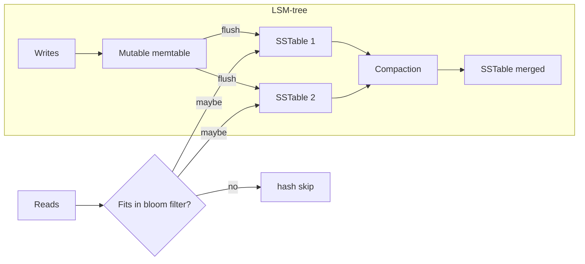

# B-Tree / LSM-Tree / Hash Index

## 1. One-Line Definition
The B-tree, LSM-tree, and hash index are the three core ways a storage engine keeps keys findable fast — respectively optimized for balanced reads plus ranges, for very high write throughput, and for O(1) point lookups — and choosing between them is the first real storage-engine decision.

## 2. Why Do We Need It?
A database is only as fast as its ability to find a row without scanning everything. The index structure decides whether writes amp the disk (B-tree), whether reads pay to merge (LSM), or whether ranges are impossible (hash). Understanding these three lets you predict performance from the access pattern instead of discovering it in production.

## 3. Simple Intuition
- **B-tree:** a phone book kept perfectly sorted with a layered index — find any name in a few jumps, and range pages come free. Every insertion re-sorts a little in place.
- **LSM-tree:** a clerk who never files papers immediately — they stack new papers on the desk (fast), and a cleaner occasionally merges stacks into tidy drawers (compaction). Writing is instant; finding an old paper means checking a few piles.
- **Hash index:** a coat-check counter — exact match on your token is one hop; nobody can ask "give me everything from A to M".

## 4. What Happens Without It?
Writes hit one slow random-write location per row (B-tree done badly), reads scan entire logs (LSM kept as an append log), or range queries that should take a page read turn into full scans (hash used for range workloads). The result is a database whose behavior contradicts its advertised workload — the classic "we moved to X and it got slower" story.

## 5. Core Idea
- **B-tree:** keeps keys sorted in fixed-size pages, branching factor 100s-1000s, balanced height ~3-5. Updates overwrite in place (with a WAL for durability). Point and range reads are both ~log(page count) with good locality. Writes rewrite the leaf page and its ancestors — random writes unless the DB does batched sequential inserts.
- **LSM-tree (Log-Structured Merge):** appends go to an in-memory memtable, flushed as immutable Sorted String Tables (SSTables) on disk; a background *compaction* merges overlapping SSTables. Reads check memtable, then newest-to-oldest SSTables (plus bloom filters). Writes are cheap and sequential; reads and space have amplification; tombstones mark deletes until merged away.
- **Hash index:** an in-memory hash map key→file offset (or on-disk hash table). O(1) exact-match gets and puts, no ordering, no prefix/range scans. Classic in KV stores and the hot-path index of log-structured stores.
- **Where each lives:** B-tree → Postgres/MySQL InnoDB/SQLite; LSM → Cassandra, RocksDB/LevelDB, HBase, Bigtable, Scylla; hash → Redis (primary structure), Bitcask (Riak), and Bloom-gated bloom layers in LSMs.

## 6. Important Terminology

| Term | Simple Meaning |
|------|----------------|
| Page | Fixed-size unit of a B-tree (typically 8K KB, read in one I/O) |
| Branching factor | How many children each node points to (hundreds-several thousand) |
| Memtable | The in-memory write buffer of an LSM |
| SSTable | Immutable sorted file on disk holding a segment of an LSM |
| Compaction | Merging SSTables to remove redundancy and tombstones |
| Write amplification | Physical bytes written vs one logical write — high in LSM compaction and B-tree page rewrites |
| Read amplification | Logical reads needed per lookup — high on LSM without bloom filters |
| Bloom filter | Compact probabilistic "might contain" check that skips IO on misses |
| Tombstone | A delete marker in an LSM, held until compaction removes it |

## 7. Basic Architecture



## 8. Request or Data Flow
1. A write arrives: LSM appends to the memtable (in-memory, fast, ordered), which periodically flushes a sorted SSTable; B-tree finds the right leaf page and overwrites the slot (WAL first); hash just maps key to a slot and stores/overwrites.
2. A point read arrives: LSM consults the bloom filter, then scans memtable and SSTables newest-first, merging the first match (or a delete tombstone); B-tree descends the tree to one leaf; hash is a single map lookup.
3. A range read arrives: B-tree walks leaves left-to-right (excellent); LSM merges SSTables that overlap the range (expensive); hash simply cannot answer it.

## 9. Practical Example
**Event-ingest service (assumptions):** write 100K events/sec of telemetry, read rarely, per-key point lookups occasionally, never range queries.
- Cassandra/RocksDB (LSM) absorbs the writes sequentially — memtable batches turn 100K random writes into large sequential flushes, with bloom filters keeping the rare point lookups cheap.
- Replacing that with Postgres (B-tree) forces random 8K page rewrites per row and a fsynced WAL per commit group — the write path saturates far earlier.
- Replacing with Redis (hash) gives the fastest lookups but no disk durability and no ranges for the "give me all metric X in the last hour" reporting queries — so you pair it with a TS store (see [[time-series-at-scale|Time Series at Scale]]).

## 10. Scaling
- **B-tree:** capacity scales with disk; writes scale poorly under high random-insert QPS. Mitigate with batching (bulk inserts, group commit), partitioning so the working set fits in cache (see [[partitioning-vs-sharding|Partitioning vs Sharding]]).
- **LSM:** the write star — first choice for write-heavy ingest. Scaling wrinkles: compaction competes with foreground IO (tune, throttle, use leveled L0+L1), space amplifier (up to 1.5-10x with over-provisioning), and read latency tails on cold SSTable lookups.
- **Hash:** memory-bound by the map itself (RAM for offsets or the values); perfect when the whole index fits RAM. Scale by partitioning the key space (sharding).

## 11. Reliability and Failure Scenarios

| Failure | What Happens | Recovery | Trade-off |
|---------|--------------|----------|-----------|
| B-tree page corruption | Checksums detect torn pages | Rebuild from WAL/backup, page repair | slower recovery window |
| LSM memtable lost | Unflushed writes lost | Replay WAL; re-div else accept loss | durability vs latency |
| LSM compaction stalls | Space grows, reads slow | Throttle writes, add IO, tune table count | less compaction = more SSTables |
| Hash map memory spike | OOM, evictions | Reduce TTL, add nodes | capacity planning |

## 12. Consistency and Correctness
B-trees and LSM trees both use a write-ahead log so acknowledged writes survive crash; the LSM's in-memory memtable is the only loss window and must replay the WAL. Hash stores in Redis rely on AOF/RDB for durability. B-tree gives strict read-your-writes per row naturally; LSM can serve a *slightly older* snapshot if compaction lags — point-in-time isolation is fine, just be precise about what "latest" means. None of these are transaction mechanisms themselves — isolation comes from the engine's concurrency layer (see [[transactions-and-acid|Transactions and ACID]]).

## 13. Performance
- **B-tree:** great read locality, ranges cheap, ~log(height) I/O; write amplification ~2-10x from page and ancestor rewrites.
- **LSM:** sequential writes beat random (100x-1000x on spinning/media disks); read amplification 10-100x without, ~1-2 I/O with bloom filters; compaction bubbles 20-50% of sustained write throughput.
- **Hash:** O(1) both ways when in RAM; perfect for counters and single-key loads. No ordering, and range/sort queries force a full scan.

## 14. Security
Indexes mirror data — access control applies at query time, not in the structure. Watch the ops surface instead: crash-recovery WAL files contain plaintext rows, so at-rest encryption should cover WAL and SSTables, not just the main store. Compaction and rebuild jobs need I/O quotas so one tenant's maintenance can't starve others.

## 15. Trade-Offs

| Structure | Read style | Write style | Amplification | When to Use |
|-----------|------------|-------------|---------------|-------------|
| B-tree | Point + range, local | Random-ish in-place | Moderate write | General OLTP-relational, reads matter |
| LSM-tree | Point (bloom) + merge-skewed ranges | Sequential, batched | Write-heavy, read/space | High-ingest events, telemetry |
| Hash | Point only | Fast in-memory | Minimal (RAM-bound) | KV hot lookups, counters, sessions |

## 16. Common Mistakes
- Choosing B-tree for a write-amplifying append-only workload, then blaming Postgres.
- Using LSM without bloom filters — read amplification surprises at scale.
- Assuming range queries are fine on an LSM or hash store — they are the expensive merge or nonexistent case.
- Ignoring compaction as a live production cost (it is CPU and IO you must budget).
- Confusing the *index type* with the database — engines can mix (LSM with a B-tree primary, hash indexes inside MySQL).

## 17. HLD vs LLD Boundary
HLD: which storage-engine family per workload (write-amplified vs read-heavy vs memory-cache), compaction/space budget, tiering, WAL durability settings. LLD: one query's index choice, a specific compaction knob, implementing a get-set in a KV client.

## 18. Interview Questions

### Beginner
- What are the three index structures and one engine each?
- Why does the B-tree handle range queries and the hash index not?

### Intermediate
- Compare write amplification between B-tree and LSM for a log-ingest table.
- How do bloom filters fix the LSM read problem?

### Advanced
- Design a storage tier that ingests 1M events/sec, serves rare point lookups and occasional time-range reads — name structures, numbers, and the trade-offs.
- Walk the crash-recovery path for LSM (memtable + WAL) and explain the loss window.

## 19. Interview Memory Summary

> [!abstract]- Interview Memory Summary

### Remember

- B-tree: sorted pages, ranges free, writes overwrite in place.
- LSM: memtable flush + compaction, sequential writes win, reads pay unless bloom-filtered.
- Hash: O(1) point, no ordering, RAM-bound.
- Write amplification vs read amplification is the core trade.
- WAL durability applies to B-tree and LSM alike; memtable is the LSM loss window.
- Pick by workload: ingest-heavy to LSM, read-heavy or range to B-tree, hot key loads to hash.

### 30-Second Explanation

Match the structure to the I/O pattern: batching sequential writes and read-rare workloads → LSM; balanced reads with range queries and in-place updates → B-tree; pure point lookups and counters that fit memory → hash index. Budget the amplification the choice creates and the compaction it implies.

### Interview Traps

- Claiming LSM is "just faster" without admitting read/space amplification.
- Forgetting B-tree random page writes when a table has no ordered PK.
- Assuming a hash store can do ranges or prefix scans.
- Treating compaction as irrelevant to capacity planning.

### Key Trade-Off

B-tree buys read locality and ranges at the cost of in-place random writes; LSM buys sequential writes at the cost of read and space amplification plus compaction; hash buys O(1) lookups at the cost of ordering and memory footprints.

## 20. Related Concepts

### Prerequisites

- [[database-indexing|Database Indexing]] — indexes in general; this deep-dives the structures.
- [[database-keys|Database Keys]] — what keys actually get indexed.

### Commonly Used Together

- [[sql-vs-nosql|SQL vs NoSQL]] — the family choice hides a structure choice underneath.
- [[oltp-vs-olap|OLTP vs OLAP]] — B-trees for OLTP, analytical engines for OLAP.
- [[partitioning-vs-sharding|Partitioning vs Sharding]] — partitions keep index trees small and cacheable.

### Alternatives

- [[caching|Caching]] — when even the best index isn't enough, an in-memory layer helps.
- [[time-series-at-scale|Time Series at Scale]] — where LSM-style structures shine.

### Advanced Concepts

- [[consistent-hashing|Consistent Hashing]] — how hashed key placement interacts with hot-spot-free scaling.
- [[capacity-estimation|Capacity Estimation]] — rating write/read amplification into disk and IO budgets.

Related planned topics (not authored yet): SSTable/blob format internals, compaction strategies, buffer pool/page eviction internals.

## 21. References
Kleppmann *Designing Data-Intensive Applications* ch. 3 covers B-tree, LSM, and hash structures authoritatively. Verify specifics with current engine docs: Postgres (B-tree), RocksDB/Cassandra (LSM), Redis (hash). Bloom-filter sizing follows standard false-positive math.

## 22. Active Recall

Test yourself before revealing each answer.

> [!question]- Basic understanding: why does a B-tree handle range queries natively?
> Keys live sorted in leaf pages connected left-to-right, so a range read is "descend once, then walk sibling leaves" — strictly sequential page reads. The hash index has no concept of order, so the same query is a full scan.

> [!question]- Design decision: log ingestion at 100K events/sec — B-tree or LSM and why?
> LSM. Appends batch in the memtable and flush sequentially, turning 100K random page rewrites into large sequential writes. A B-tree would rewrite random 8K pages per row and saturate IO far sooner (see write amplification).

> [!question]- Trade-off: what do you give up choosing LSM over B-tree?
> Read amplification (several SSTables to check plus merges) and space amplification (overlapping tables up to compaction) plus a live compaction CPU/IO cost; bloom filters cut the read tax, documented over-provisioning absorbs the space tax.

> [!question]- Failure scenario: a Cassandra node restarts and "loses" writes the app already acked. Diagnose.
> Check whether the memtable had been flushed; if not and the WAL was replayable, those writes should survive. If they were lost, durability config kept the flush rate low or the commit log was misconfigured — the memtable is the only genuine loss window in an LSM.

> [!question]- Interview scenario: "Redis is our database" for a reporting feature. Respond.
> Redis (hash) gives O(1) lookups and no ordering — time-range aggregations and prefix scans are the exact opposite of its strengths. Treat it as a hot-key cache/derived store and put the durable, range-query data in a B-tree or time-series store.

> [!question]- Interview scenario: a MySQL write-heavy table is slow. Where do you look first?
> Random-insert page rewrites and index bloat from UPDATE/DELETE (B-tree amplification). Mitigations: batch writes, group commit, avoid updating indexed columns, and if the workload is truly append-mostly, move it to an LSM-family engine or time-partitioned table.

## 23. When Should I Use This?

### Use it when

- You need to justify an engine choice by its I/O pattern, not its brand.
- The workload is write-heavy-with-rare-reads (LSM) or read-heavy-with-ranges (B-tree).
- You are sizing disks and IO budgets and must account for write/read amplification.

### Avoid it when

- You're choosing a database by habit; confirm the pattern first.
- You expect range queries or secondary-index scans from a hash store.
- You assume one structure solves compaction, caching, and durability automatically — those are separate engineering.

### What problem does it solve?

The problem: "which storage structure" is the hidden answer to most why-is-it-slow questions. Bottleneck: mismatched structure converts the workload's natural I/O into amplified random writes or reads. Solution: map workload to structure (sequential-write → LSM, balanced-read/range → B-tree, point/RAM → hash) and budget the amplification.

### What problem does it NOT solve?

It does not set isolation or transaction semantics (that's the concurrency layer, see [[transactions-and-acid|Transactions and ACID]]). It does not pick partition keys or handle hot keys, and it does not make a hash store do ranges or an LSM do cheap ad-hoc joins.

## 24. Decision Connections

Decisions that go together with B-tree / LSM / Hash Index structures:

- [[database-indexing|Database Indexing]] — the general index framework these structures implement.
- [[database-keys|Database Keys]] — PK/clustered choice decides which tree gets the writes.
- [[sql-vs-nosql|SQL vs NoSQL]] — relational engines favor B-trees; scale-out NoSQL favors LSM/hash.
- [[oltp-vs-olap|OLTP vs OLAP]] — B-tree/point workloads are OLTP; analytic scans want other engines.
- [[partitioning-vs-sharding|Partitioning vs Sharding]] — small per-partition trees keep the working set in cache.
- [[time-series-at-scale|Time Series at Scale]] — a workload where LSM-style structures are dominant.
- [[capacity-estimation|Capacity Estimation]] — turning amplification ratios into disk and IO numbers.

Decision tree:

```
What does the workload's I/O look like?
    |
    +-- Mostly appends, rare reads?
    |      → LSM-tree
    |         +-- Point lookups rare?  bloom filters optional
    |         +-- Point lookups matter? → bloom filters on SSTables
    |
    +-- Balanced reads/writes + range queries?
    |      → B-tree
    |
    +-- Pure point lookups, hot keys, counters?
    |      → Hash index (memory-bound)
    |
    +-- Mixed (appends + ranges)?
    |      → LSM primary + time-partition or TS derivation
    |
    +-- Still not sure?
           → [[database-indexing|Database Indexing]] then [[capacity-estimation|Capacity Estimation]]
```