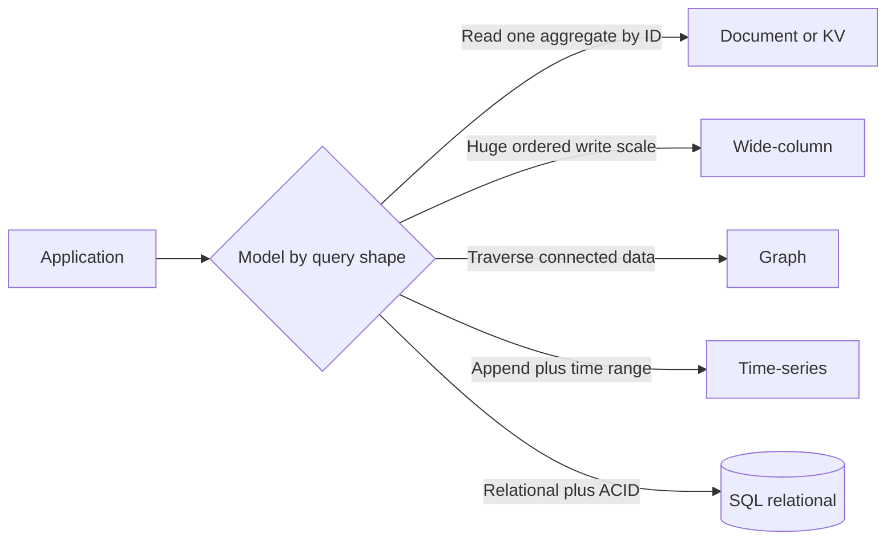

# Data Model Types (Doc / KV / Wide / Graph / TS)

## 1. One-Line Definition
The data model is how a database represents related information — document, key-value, wide-column, graph, and time-series are five families with different shapes, query styles, and scaling behavior — and choosing the model is the deepest architectural decision before any SQL-vs-NoSQL or engine pick.

## 2. Why Do We Need It?
The model determines what queries are natural, what operations are expensive, and how far the store scales. Modeling a chat history as a graph forces slow traversals for a simple "list recent messages"; modeling a recommendation graph as JSON makes every hop a scan. Getting the model right first makes the rest (indexes, partitioning, consistency) fall into place; getting it wrong produces workarounds that never feel right.

## 3. Simple Intuition
- **Document:** a filing cabinet of self-contained folders — each folder holds whatever fields that item needs.
- **Key-Value:** a coat-check counter — hand over a token, get exactly one object back, nothing else.
- **Wide-column:** an infinitely long spreadsheet — many rows, many columns, most cells empty, rows sorted by a key.
- **Graph:** a subway map — the value is in the connections, and questions are "which stations connect".
- **Time-series:** a stock ticker tape — endless appends stamped with time, almost never updated.

You wouldn't model a wardrobe as a subway map; you pick the representation that matches the questions you actually ask.

## 4. What Happens Without It?
Wrongly shaped data becomes unqueryable: every access needs expensive joins or client-side stitching, rigid schemas force migrations for fields that never existed, or the write pattern (append-heavy, update-heavy, traversal-heavy) fights the engine until the database is the bottleneck. Teams end up reimplementing the join/traversal/tiering logic the storage should have provided, in application code nobody can maintain.

## 5. Core Idea
- **Document (MongoDB, CouchDB, DocumentDB):** self-describing JSON/BSON units. Related data is *embedded* by default or *referenced* by ID. Schema is per-document, so shapes evolve without ALTER. Natural queries: read one aggregate, filter on nested fields.
- **Key-Value (Redis, Memcached, Riak):** an opaque key maps to an opaque value (or small typed values in Redis). No query language, no relations — the only question is "give me the thing for this key". Fastest, most portable, least expressive.
- **Wide-column (Cassandra, HBase, Bigtable):** tables with a partition key and a sort key; columns are flexible and optional per row. Optimized for massive write scale-out and ordered scans within a partition. Reads by full primary key are one hop; anything else is a scan.
- **Graph (Neo4j, Neptune):** nodes and typed edges. Queries traverse relationships: "friends of friends", "shortest path", "what accesses what". Expressive for connected data, wasteful when data is mostly flat.
- **Time-series (InfluxDB, TimescaleDB, Prometheus):** values keyed by timestamp plus tags/labels. Append-heavy, ordered by time, optimized for range scans and downsampling. Updates are rare; retention and tiering are first-class.
- **The hybrid reality:** real products hold several models at once — a relational core for money, a document/cache layer for reads, a search index, a time-series log. Polyglot persistence is the norm, not the exception.

## 6. Important Terminology

| Term | Simple Meaning |
|------|----------------|
| Embed vs reference | Store related data inside the doc vs point to another doc by ID |
| Partition key | The field that decides which node owns a row or document |
| Sort key / clustering key | The field ordering rows within a partition (wide-column) |
| Tombstone | Delete marker left until compaction sweeps it (wide-column) |
| Edge / traversal | Graph connection between nodes / following connections |
| Tag / label | Named dimension used to filter time-series |
| Downsampling | Aggregating old ts data so it stays but shrinks |
| Polyglot persistence | Using several models and engines for different data domains |

## 7. Basic Architecture



## 8. Request or Data Flow
1. Requirements give the access pattern: read a whole aggregate by ID to document/KV; write billions of ordered events to wide-column; traverse relationships to graph; windowed aggregation of metrics to time-series.
2. Route or plan: document goes by shard key (single hop if the key matches); wide-column does a partition-plus-sort-key seek; graph runs a bounded traversal; time-series scans a time range.
3. The returned shape matches the model naturally — a nested doc, a value, an ordered row range, a path, a downsampled series — so no client-side reassembly is needed.

## 9. Practical Example
**E-commerce platform (assumptions):** 20M users, 5M products, 1B events/day.
- Product catalog → **document** store: flexible variants per product, read whole card by `product_id` within a few ms.
- Cart and session → **KV**: get-by-key, TTL-evicted.
- Order lines and payments → **SQL relational**: ACID, joins across orders, lines, inventory.
- "Which sellers does this user follow" + recommendations → **graph** store for two-hop traversals.
- Latency and sales metrics → **time-series** store, downsampled after 30 days.
The throughput and query types only work because each concern uses its natural model.

## 10. Scaling
- **Document:** shard by key (single-hop by design); global queries need secondary-index stores or scatter-gather.
- **KV:** trivially horizontal; memory or disk bound per node; add nodes with consistent hashing.
- **Wide-column:** built for scale-out — writes spread by partition key; hot partitions are the main enemy (add nodes, fix the key).
- **Graph:** hardest to shard — traversals cross partitions, so most graph stores favor single-node scale-up or bounded traversals.
- **Time-series:** partition by time plus tags, tier to cold storage, downsample old data; reads rarely need more than a recent window.

## 11. Reliability and Failure Scenarios

| Failure | What Happens | Mitigation | Trade-off |
|---------|--------------|-----------|-----------|
| Document/KV node dies | Subset of aggregates unavailable | Replica per partition (see database-replication) | read/write cost |
| Wide-column node dies | Its partitions lost if unreplicated | RF=3, hinted handoff | consistency tuning |
| Time-series disk fills | Writes stall | Retention, tiering, downsample | history loss |
| Graph store corrupts | All traversals unreliable | Backups + rebuild from source of truth | extra store to keep |

The family shapes the failure mode: KV and document lose a *shard* at a time, wide-column loses partitions, graph and time-series usually fail whole-node and need source-of-truth replay.

## 12. Consistency and Correctness
- Document/KV: tunable — strong by request or eventual; keep authoritative data single-node-per-key or accept stale reads.
- Wide-column: quorum- and conflict-based (LWW); no transactions across partitions by default.
- Graph: transactional and ACID within one engine, but "transaction" scope rarely spans the whole graph.
- Time-series: mostly append-only, so ordering is natural; the risk is *gaps* (lost samples), not undone writes.
Correctness comes from your consistency setting, not the brand — same rule as [[strong-vs-eventual-consistency|Strong vs Eventual Consistency]] everywhere.

## 13. Performance
- KV: O(1) single-hop, microsecond-to-ms — the fastest family.
- Document: fast aggregate reads by key; nested-field filters cost scans unless indexed.
- Wide-column: excellent ordered scans and write throughput; bad multi-key queries (they become all-partition scans).
- Graph: traversal cost grows with hops, not with data size — great local, terrible global.
- Time-series: superb tight time-window reads; full scans and arbitrary multi-tag filters are painful.
Indexes and partition boundaries, not the engine brand, decide most of this — see [[database-indexing|Database Indexing]].

## 14. Security
Every family: TLS, at-rest encryption, least-privilege roles, injection-safe queries ($where-style filters apply to NoSQL too), and tenant isolation via the partition key. Graph exposes relationships as data — access controls must follow edges, not just nodes. Time-series data is often raw operational telemetry; mask PII before storing and watch who can read metric dimensions.

## 15. Trade-Offs

| Model | Advantages | Disadvantages | When to Use |
|-------|------------|---------------|-------------|
| Document | Flexible shape, fast aggregate reads | Weaker joins and transactions | Profiles, catalog, content |
| Key-Value | Simplest, fastest, easy sharding | No query expressiveness | Sessions, configs, hot lookups |
| Wide-column | Massive write scale, ordered partitions | Complex modeling, tombstones | Events, telemetry, feed data |
| Graph | Traversal expressiveness | Hard to shard, niche ops | Social, permissions, dependency |
| Time-series | Time-range reads, compaction | Only time-shaped queries | Metrics, logs, sensor data |
| Relational | Joins, ACID, universal | Rigid schema, scale ceiling | Money, anything needing integrity |

## 16. Common Mistakes
- Forcing one model across every data domain ("we only use MongoDB").
- Embedding too much (documents grow unboundedly) or referencing too much (every read is N round trips).
- Picking a partition key with a few hot values → hot partitions.
- Treating a graph store as a document store and never traversing; treating an event log as a relational table.
- Ignoring tombstone/compaction cost in wide-column stores (delete-heavy → read amplification).
- Believing a time-series store handles arbitrary JSON-shaped data efficiently.

## 17. HLD vs LLD Boundary
HLD: which model per data domain, partition-key design, consistency setting, retention/tiering policy, and how derived stores (search, cache, analytics) are fed. LLD: document schema for one entity, DAO/API specifics, one migration of a shape, per-query filter/index construction.

## 18. Interview Questions

### Beginner
- Name the five data model families and one engine for each.
- When is a KV store the right model?

### Intermediate
- Model a social feed: which model for posts, who-you-follow, and notifications?
- What does "polyglot persistence" mean and what problem does it solve?

### Advanced
- Your recommendation graph is too big for one node. Shard it and explain the traversal cost.
- Convert a heavily joined relational schema into a document store without data loss, and explain what you lose.

## 19. Interview Memory Summary

> [!abstract]- Interview Memory Summary

### Remember

- Five families: document, KV, wide-column, graph, time-series.
- Match the model to the query shape, not the other way around.
- KV = one hop; document = aggregate reads; wide-column = write scale; graph = traversal; TS = time windows.
- The partition key decides placement, hotspots, and query cost.
- Consistency is a knob you set — the brand does not decide it.
- Real systems are polyglot: relational core + derived stores.

### 30-Second Explanation

Look at the access pattern: read an aggregate by ID, write massive ordered streams, traverse relationships, or window metric ranges — then pick document/KV, wide-column, graph, or time-series and design the partition key. Keep the authoritative core relational where integrity matters, and let derived stores lag.

### Interview Traps

- Saying "NoSQL" without naming the family or the query type that fits.
- One engine for everything because "keeping it simple".
- Ignoring the partition key, then blaming the store for hot partitions.
- Assuming all NoSQL is eventual — consistency is per-engine and per-request.

### Key Trade-Off

You buy natural queries and scale for one access pattern and pay with rigidity for every other pattern — which is why mature products use several models, each owning the part it fits.

## 20. Related Concepts

### Prerequisites

- [[database-fundamentals|Database Fundamentals]]
- [[database-keys|Database Keys]]

### Commonly Used Together

- [[sql-vs-nosql|SQL vs NoSQL]] — the choice framework this deep-dive sits under.
- [[normalization-vs-denormalization|Normalization vs Denormalization]] — embed vs reference mirrors denormalize vs join.
- [[database-indexing|Database Indexing]] — every family still needs index design.

### Alternatives

- [[oltp-vs-olap|OLTP vs OLAP]] — interactive row access vs analytic scans.
- [[data-patterns|Data Access Patterns]] — the access-pattern lens to pick a model.

### Advanced Concepts

- [[time-series-at-scale|Time Series at Scale]] — what the TS family becomes at production size.
- [[sharding|Sharding]] — how any of these models divides across nodes.
- [[elasticsearch|Elasticsearch]] — the inverted-index model used as a derived store.

Related planned topics (not authored yet): per-family deep dives for document modeling, wide-column key design, graph schema design.

## 21. References
Kleppmann *Designing Data-Intensive Applications* ch. 2-3 (data models and storage). Verify engine-specific behavior with current vendor docs: MongoDB, Redis, Cassandra, Neo4j, InfluxDB/TimescaleDB.

## 22. Active Recall

Test yourself before revealing each answer.

> [!question]- Basic understanding: name the five families and one engine each.
> Document (MongoDB), Key-Value (Redis), Wide-column (Cassandra), Graph (Neo4j), Time-series (InfluxDB) — plus the relational model (PostgreSQL).

> [!question]- Design decision: which model for a shopping cart, and why?
> Key-Value wins: read and write are get-by-key operations, one hop, TTL for abandoned carts, trivially shardable. Relational or document adds query power the cart never uses.

> [!question]- Trade-off: embed vs reference a user's addresses inside their profile document.
> Embed if each profile is small and addresses only change with the profile; reference if addresses are shared, huge, or independently queried. Embedding saves joins but can bloat documents and breaks when children are queried across parents.

> [!question]- Failure scenario: a wide-column store shows massive read amplification after deletes.
> Deletes leave tombstones; without enough/scheduled compaction the tombstones accumulate and reads must skip them. Fix with compaction tuning, TTL-based deletions, and monitoring tombstone ratio per table.

> [!question]- Interview scenario: the recommendation graph outgrew one node. Walk the options.
> Shard by user so one-hop traversals stay local, keep two-hop bounded, or push recommendations to a precomputed derived store (document/KV built offline) and let graph handle low-fanout interactive traversal.

> [!question]- Interview scenario: "We'll use Cassandra for the entire app." Respond.
> Cassandra is a wide-column write-scale engine — list the workloads it serves poorly (joins, transactions, small random reads, graph traversals) and propose the relational core plus per-domain models instead.

## 23. When Should I Use This?

### Use it when

- You are choosing a store and need to reason about shape, queries, and scale first.
- Multiple data domains in one product need different models (polyglot persistence).
- You need to defend a specific engine family in an interview or design review.

### Avoid it when

- One model is being force-fitted to every workload out of habit or preference.
- The requirement is a single join-heavy, ACID-critical domain — relational is still the base case.
- You assume a model family implies a consistency or durability guarantee — verify per engine.

### What problem does it solve?

The problem: "which database should I use" is unanswerable until you know what shape the data is and what questions you'll ask it. Bottleneck: guessing wrong produces slow queries and brittle application workarounds. Solution: map each data domain to the family whose natural query style matches the workload, keeping relational for integrity-critical cores.

### What problem does it NOT solve?

It does not pick your partitions, indexes, consistency settings, retention policy, or failure story — each family still needs all of those engineered. It also does not make mismatched workloads fast; a graph store asked to do flat list queries is as wrong as a KV asked to join.

## 24. Decision Connections

Decisions that go together with Data Model Types:

- [[sql-vs-nosql|SQL vs NoSQL]] — the parent choice; this file deep-dives the NoSQL families.
- [[database-fundamentals|Database Fundamentals]] — storage, concurrency, and recovery live under every model.
- [[normalization-vs-denormalization|Normalization vs Denormalization]] — embed/reference is the denormalization decision inside documents.
- [[database-indexing|Database Indexing]] — each family's index strategy, still required.
- [[database-keys|Database Keys]] — partition and sort keys decide placement and hotspots.
- [[time-series-at-scale|Time Series at Scale]] — the TS family at production scale.
- [[sharding|Sharding]] — how any chosen model splits across nodes.

Decision tree:

```
What does the workload ask of the data?
    |
    +-- Read one aggregate by ID?
    |      → Document or KV
    |         +-- Shape varies, nested filters? → document model
    |         +-- Opaque blob, TTL, counter?    → KV
    |
    +-- Massive write scale-out, ordered partitions?
    |      → Wide-column (row key design decides)
    |
    +-- Relationship traversals dominate?
    |      → Graph store (bounded hops)
    |
    +-- Append-heavy metrics over time ranges?
    |      → Time-series store with retention
    |
    +-- Joins, ACID, referential integrity?
           → [[sql-vs-nosql|SQL vs NoSQL]] relational core
```