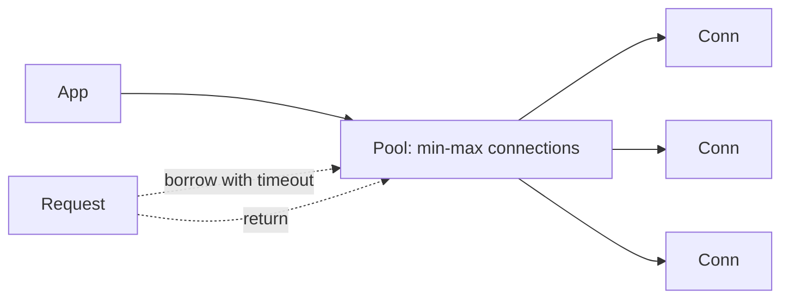

# Database Connection Pooling

## 1. One-Line Definition
A connection pool maintains a small, reused set of already-open database connections that application threads borrow for a request and return, instead of opening/closing a new connection per query.

## 2. Why Do We Need It?
Opening a DB connection is expensive (TCP + TLS + auth + memory) and databases can only sustain a limited number of concurrent connections. Under load, connection-per-request burns both server CPU and DB capacity, and connection exhaustion is a classic cascade-failure trigger.

## 3. Simple Intuition
A taxi fleet instead of ordering a new taxi for every passenger. The app (dispatcher) keeps a fleet of cabs (pooled connections) ready; each request borrows one, uses it briefly, and returns it. You keep just enough cabs for peak busy hours; a fleet that's too small queues passengers, too big sits idle burning fuel (DB memory).

## 4. What Happens Without It?
Every query does: connect → auth → use → close. That's 10-100ms++ of overhead per op and thousands of sockets churning. Worse, at high concurrency the DB chokes on connection count, timeouts cascade, apps retry, connections double — the classic **connection storm**: error rate spikes until nothing works.

## 5. Core Idea
- **Pool lifecycle:** pre-warmed connections created on startup/need, checked out per operation, returned and reused, validated (stale connections replaced), closed on pool drain/shutdown.
- **Size tuning:** `max` = usable for a single node; over-size wastes DB memory. Rule of thumb: start ~10-30 per node; tune against measured latency/queue-depth, not guesses.
- **Queueing:** pool exhausted → requests wait (borrow timeout) → must fail fast (timeout) rather than pile up (MTTF of the DB is already poor under flood).
- **Backpressure link:** pool timeout → app-level circuit breaker / 503 (don't infinite-wait). This is the relay from DB saturation to graceful HTTP failure.

## 6. Important Terminology

| Term | Simple Meaning |
|------|----------------|
| Pool size | Max/fixed number of open connections |
| Borrow/return | Check out/in a connection for one operation |
| Borrow timeout | How long a request waits for a free connection |
| Idle | Connections sitting unused |
| Stale connection | Died silently (timeout/NAT); validated before reuse |
| Connection storm | Cascade: failure → retries → more connections → meltdown |
| Shrink/grow | Pool can adjust with load (bounded) |

## 7. Basic Architecture



## 8. Request or Data Flow
1. Request needs DB → borrows a pooled connection (waits ≤ borrow timeout).
2. Runs query; on success or exception the connection is returned to the pool.
3. Pool validates (ping) if it suspects staleness, else reuses.
4. Burst exceeds pool → graceful timeout → the app fails the request fast (retry/backoff or 503) instead of queueing forever.

## 9. Practical Example
**Checkout service (assumptions):** 4 DB nodes, 100 QPS per node, p99 latency 50ms, request uses 1 tx.
- 1 node supports ~30-50 concurrent connections before queueing; run pool ~20-30 per node with `borrowTimeout = 200ms`.
- Saturating DB → pool timeouts at 200ms → app returns 503 with `Retry-After` instead of a retry-storm.
- Scale: rather than increasing pool per node, scale *instances* or *replicas* (pools are per-instance).

## 10. Scaling
- **Instance scale-out:** pool is per instance; total capacity = instance_count × pool_max. Scaling nodes scales DB connections — but DB has its own per-node connection cap; coordinate.
- **Read scale:** read replicas each have their own pool fee — point read traffic at a replica pool, keep primary pool for writers.
- **Idle cost:** connections consume DB memory — the pool is a resource, not free capacity.
- **Hotspot:** a hot row causes pool-holding (long tx) → pool starvation even at healthy QPS. Short transactions protect the pool.

## 11. Reliability and Failure Scenarios

| Failure | What Happens | Detection | Recovery | Trade-off |
|---------|--------------|-----------|----------|-----------|
| DB slow/restart | Pool fills with waiting/old conns | Borrow-timeout rate spike, stale-conn errors | Fail fast, retry via circuit breaker; let pool slowly re-establish | Graceful 503 vs retries |
| Connection leak (bug) | Pool drains to zero over hours | Pool count plateaus at 0, errors | Fix code path; bounded TTL per connection to force recycle | —
| Network blip | Half-open connections | Stale validation catches | Discard + re-create | Small validation cost |
| Mis-tuned max | Too many → DB OOM | DB memory alert | Lower pool; add instances not conns | —

## 12. Consistency and Correctness
Pooling doesn't change DB consistency — but it interacts with transactions: never hold a transaction/connection across an async op; a "borrowed" connection checkpointed between awaits is a pool leak by another name. Return-on-time no matter the outcome.

## 13. Performance
- Hit path: pooled reuse saves the 10-100ms handshake — meaningful per request.
- Monitor: `active/total/idle`, `waiting`, `borrow timeout` — waiting is the **queueing** metric (p95 correlation).
- Tuning knob: pool too small → p95 spikes (queuing); too big → DB memory waste. Curve-fit, don't cargo-cult numbers.

## 14. Security
- Connections carry DB credentials with the app's role — least-privilege, secret-injection via pool config, not app logs.
- Pooled connections inherit the *first client's* session context; keep session semantics per-op or reset session on borrow (session reuse leaks tenant context).
- Rate limit connection-creation path itself (DDoS toward DB ports).

## 15. Trade-Offs

| Choice | Advantages | Disadvantages | When to Use |
|--------|------------|---------------|-------------|
| Aggressive pool (high max) | No queuing for healthy table | Idle DB memory, slow failures at saturation | Cheap DB, no read burst |
| Conservative pool + short timeout | Fast failure, protects DB | Unnecessary 503s at small blips | High-cost shared DB |
| Read replica pool | Isolates read from write pool | Extra infra, lag | Read-heavy |
| Transaction-bound pool (minimal) | Frees capacity | Fiddlier code | OLTP-heavy |

## 16. Common Mistakes
- `max` sized "so we never wait" → DB OOM on real bursts.
- No borrow timeout → threadpile of waiters that doubles under failure.
- Leaks: connection fetched once, never returned (async, exceptions).
- Holding pooled connections inside long transactions "to keep the DB steady".
- Forgetting per-instance pools stack: 100 nodes × 50 = 5000 connections to a max-2000 DB.

## 17. HLD vs LLD Boundary
HLD: pool sizing policy per tier (per node, per replica), borrow-timeout + fail-fast wiring (circuit breaker), connection-count budgeting with DB caps. LLD: exact pool library config (connectionTimeout/maximumPoolSize), return-in-finally patterns in one service.

## 18. Interview Questions

### Beginner
- Why do we pool DB connections instead of opening one per query?
- What's the cost of opening a single DB connection?

### Intermediate
- Your DB CPU is fine but p99 explodes at peak. What pool pitfalls would you check?
- How do you keep a connection storm from taking down the DB?

### Advanced
- Design pooling so 500 service instances don't exhaust a 1000-connection DB.
- A pool of 50 connections with 2000 concurrent requests: describe queueing, timeout, and your sizing rationale.

## 19. Interview Memory Summary

> [!abstract]- Interview Memory Summary

### Remember

- Opening a DB connection is expensive (TCP + TLS + auth); reuse is cheap.
- Pool = pre-warmed shared set, borrowed per operation, returned for reuse.
- Borrow timeout = the app's fail-fast control.
- Total capacity = instances × pool_max — the DB's connection cap is the real ceiling.
- Storms: never queue forever; shed load (503/retry) instead.

### 30-Second Explanation

Small warm pool per node, short borrow-timeouts, fail fast to 503/retry, and size with the DB's connection budget in mind.

### Interview Traps

- Assuming pool size = concurrency budget by itself — pool stacks across instances.
- `max` sized "so we never wait" → DB OOM on real bursts.
- No borrow timeout → threadpile of waiters that doubles under failure.
- Connection leaks (async, exceptions) that drain the pool.
- Holding pooled connections inside long transactions "to keep the DB steady."

### Key Trade-Off

Pool size trades queuing risk at peak (too small → p95 spikes) against idle DB memory and slow failure at saturation (too big); the sweet spot is sized against measured latency and the DB's total connection cap, not guesses.

## 20. Related Concepts

### Prerequisites

- [[database-fundamentals|Database Fundamentals]]
- [[http-and-https|HTTP and HTTPS]]

### Commonly Used Together

- [[transactions-and-acid|Transactions and ACID]]
- [[database-replication|Database Replication]]

### Advanced Concepts

- [[rate-limiter|Rate Limiter]]
- [[circuit-breaker|Circuit Breaker]]
- [[retry-and-timeout|Retry and Timeout]]
- [[bottleneck-identification|Bottleneck Identification]]

## 21. References
HikariCP and standard pool docs; PostgreSQL `max_connections` guidance. Verify pool behavior with current library/DB docs.

## 22. Active Recall

Test yourself before revealing each answer.

> [!question]- Why do we pool connections instead of opening one per query?
> Opening a DB connection costs TCP + TLS + auth + memory — roughly 10-100ms of overhead per op. A pool keeps pre-warmed connections ready, borrowed per operation and returned, so most requests skip the handshake and the app never exhausts the DB's connection budget.

> [!question]- What's the cost of opening a single DB connection?
> A full connect = TCP handshake + TLS + authentication + server-side memory allocation, taking ~10-100ms+. Under load, doing that per query burns server CPU and DB capacity and quickly drains the DB's `max_connections` — the breeding ground for connection storms.

> [!question]- Design decision: size a pool for a checkout service with known QPS and latency.
> Measure, don't guess: with ~100 QPS/node and ~50ms p99 per request, start ~20-30 connections/node with a `borrowTimeout` (~200ms), then tune against measured queue depth and latency. Oversizing wastes DB memory; undersizing spikes p95 via queuing.

> [!question]- Trade-off: what's the real ceiling on pool capacity?
> Capacity = instances × pool_max, but the DB has its own connection cap. 500 instances × 50 = 5000 connections to a DB that supports 2000 will exhaust it. Scale *instances/replicas*, not pools, and budget connections against the DB's limit.

> [!question]- Failure scenario: DB slows down or restarts. What does the pool do?
> Pool fills with waiting/old connections; borrow-timeouts spike, stale connections surface. Recovery: fail fast (timeout → circuit breaker), let the pool slowly re-establish, and retry with backoff — graceful 503s instead of piling up waiters that double the load under failure.

> [!question]- Interview scenario: "pool size = concurrency budget, so size it large." How do you respond?
> Pool size isn't the whole budget — the DB's `max_connections` is the real ceiling, and pools stack across instances. A pool "so we never wait" sets the DB up to OOM at the first burst; size to measured latency, add borrow timeouts, and shed load.

> [!question]- Interview scenario: p99 explodes but DB CPU is fine. What pool pitfalls do you check?
> Check queue depth and borrow-timeout rate (waiting = queuing), look for connection leaks (async/exception paths not returning connections), long transactions holding pooled connections, and stale connections failing validation. Pool too small → queuing spikes p95 before CPU ever rises.

## 23. When Should I Use This?

### Use it when

- App instances talk to a database on the hot path.
- You want to avoid per-query connect overhead (10-100ms each).
- You need backpressure against DB saturation (fail fast, not queue forever).
- You're budgeting connections against the DB's `max_connections`.

### Avoid it when

- The workload is one-off batch where pooled reuse saves nothing.
- You can't size it (pool too big = idle DB memory; too small = p95 spikes).
- You'd hold connections across async boundaries or long transactions (leaks/starvation).
- You expect the pool to double as the system's total concurrency budget — it doesn't.

### What problem does it solve?

Problem: opening a connection per query is slow and databases cap total connections. Bottleneck: connection-per-request burns CPU and memory, and exhaustion triggers a retry-storm cascade (connection storm). Solution: a pre-warmed pool with borrow-timeouts and fail-fast backpressure keeps connections steady and turns DB saturation into graceful 503/retry.

### What problem does it NOT solve?

It doesn't scale the DB itself (add replicas/instances for that), doesn't prevent long-transaction starvation, and doesn't remove the DB's `max_connections` ceiling — the pool is a conduit, not capacity.

## 24. Decision Connections

Decisions that go together with Database Connection Pooling:

- [[database-fundamentals|Database Fundamentals]] — pooling is the entry ramp to any DB.
- [[transactions-and-acid|Transactions and ACID]] — long transactions held in a pooled connection starve the pool.
- [[database-replication|Database Replication]] — read replicas each get their own pool.
- [[bottleneck-identification|Bottleneck Identification]] — queue depth/lag is the metric to watch.
- [[retry-and-timeout|Retry and Timeout]] — the fail-fast + backoff pattern behind pools.
- [[circuit-breaker|Circuit Breaker]] — the app-level cut for when the DB is saturated.
- [[rate-limiter|Rate Limiter]] — shedding load before it reaches the pool.

Decision tree:

```
App instances hit a shared database
    |
    +-- Per-query connections today?
    |      → [[database-connection-pooling|Database Connection Pooling]] (size to latency)
    |
    +-- Pool exhausted during bursts?
    |      → add borrow timeout + fail fast ([[retry-and-timeout|Retry and Timeout]])
    |
    +-- DB saturated / slow?
    |      → [[circuit-breaker|Circuit Breaker]] instead of infinite waiting
    |
    +-- Connections snowball into a storm?
    |      → [[rate-limiter|Rate Limiter]] to shed load
    |
    +-- Instances × pool > DB cap?
    |      → scale [[database-replication|Database Replication]] replicas, not pool size
```