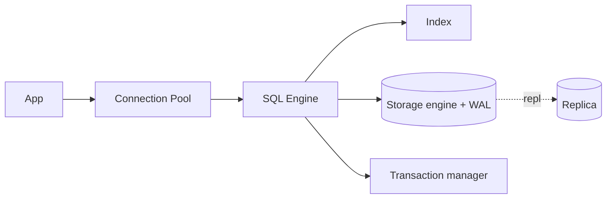

# Database Fundamentals

## 1. One-Line Definition
A database is a durable, queryable, concurrent store for the application's data — the systems' source of truth that persists data and answers reads and writes under concurrency.

## 2. Why Do We Need It?
Applications need data to survive restarts, to be shared by many processes, and to answer complex questions (queries) at scale. In-memory app data dies with the process; files are unstructured and not concurrent-safe. Databases centralize durability, querying, concurrency control, and recovery.

## 3. Simple Intuition
A library with a catalog: books (data) sit on shelves (storage), the catalog (index) finds them in seconds instead of walking, and a checkout desk (transactions/concurrency) makes sure two people don't borrow the same book. The library keeps working even when the lights flicker (durability/recovery).

## 4. What Happens Without It?
You keep data in RAM and files: a process crash or machine reboot loses everything; two servers writing the same file corrupt it; "find all orders of this customer" means scanning everything. Every feature becomes a hard, inconsistent, non-concurrent mess.

## 5. Core Idea
A database handles:
- **Storage engine** — how bytes are laid out + written durably (WAL, redo logs) so acknowledged writes survive crashes.
- **Indexes** — B-tree / LSM / hash structures making lookups fast (logarithmic instead of full scans).
- **Query engine** — parses SQL/API calls, plans execution, optimizes (use index vs scan).
- **Concurrency** — transactions with isolation, locks, MVCC ensuring parallel writers don't corrupt each other.
- **Replication & recovery** — copies (replicas), backups, crash recovery (rollback uncommitted, reapply committed).

**The big split — SQL vs NoSQL:** SQL = strong schema, ACID, relational joins, flexible queries. NoSQL = schemaless/flexible, horizontal partitioning by design, weaker or tunable consistency, specialized access patterns.

## 6. Important Terminology

| Term | Simple Meaning |
|------|----------------|
| Table / collection | Collection of rows / documents |
| Schema | The shape of records (columns/types or document rules) |
| Query | Request to read/transform data |
| Index | Structure making lookups fast at write cost |
| Transaction | Group of ops that commit or roll back together |
| ACID | Atomicity, Consistency, Isolation, Durability |
| Storage engine | How stored bytes + durability are implemented |
| Replica | Copy of the database for reads/HA |
| Normalization | Splitting data to avoid redundancy |

## 7. Basic Architecture



## 8. Request or Data Flow
1. App checks out a pooled connection.
2. Query parsed → planner picks a plan (index scan vs full scan).
3. Executor reads/writes via storage engine; writes first go to WAL then apply to pages (durability).
4. Transaction boundary: on commit, changes are durable; concurrent readers see consistent snapshots (MVCC).
5. Replication ships committed changes to replicas.

## 9. Practical Example
**E-commerce catalog (assumptions):** 1M products, reads heavy.
- SQL DB with indexes on `id`, `category_id`, `(price, rating)`.
- Reads via replicas + Redis; writes routed to primary.
- Transactions wrap inventory decrement + order insert so both succeed or neither.
- Sketches of scale: single primary OK to ~100k QPS reads; beyond → read replicas, then cache, then partition.

## 10. Scaling
- **Read scaling:** replicas + cache; joins/transactions stay on primary.
- **Write scaling:** queue + async writes; partition/shard by a key that matches business queries; consider CQRS to separate read/write shapes.
- **Storage scaling:** partition/archive, tier storage (cheap SSDs/object storage), prune old data.
- **Connection scaling:** pooling + connection limits; DBs die on connection bombs during retry storms.
- **Hotspot:** one hot user/row serializes via locks/one-hot-shard — cache it or shard smarter.

## 11. Reliability and Failure Scenarios

| Failure | What Happens | Detection | Recovery | Trade-off |
|---------|--------------|-----------|----------|-----------|
| DB process crash | In-flight txs lost; rest intact | Health check | WAL replay → consistent state | fsync cost |
| Disk full | Writes fail, maybe partial | Space alerts | Add disk, archiving, compaction | — |
| Primary death | Writes fail | Repl lag/heartbeat | Promote replica | Async = possible loss |
| Corruption | Wrong reads/writes | Checksums, repl diff | Restore from backup | RPO window |
| Connection storm | Pool exhausted → cascading | Error rates | Shed load, limit connections | Availability |

## 12. Consistency and Correctness
The DB is the **source of truth** for HLD purposes. Consistency choices live between the app, cache, and replicas: cache must be invalidated on writes; replicas lag; transactions scope correctness (one statement vs multi-row vs distributed). Decide per operation: money ops strongly consistent and transactional; analytics tolerant of lag.

## 13. Performance
- Reads: index + cache boots QPS; avoid full scans and N+1 queries.
- Writes: WAL/fsync cost, index write amplification, replica shipping.
- Rule of thumb for interviews: single node handles ~1k-100k's of QPS depending on complexity; always measure.
- Tail latency: connection pool exhaustion is a *latency* failure first (queuing) — monitor pool depth, not just CPU.

## 14. Security
- AuthN (DB creds via secrets manager, not code), authZ (roles), least privilege.
- Encrypt at rest + in transit (TLS).
- Parameterized queries (SQL injection); field-level masking for PII; audit logs; backups encrypted.
- Tenant isolation: separate DBs/schemas/row-level keys per tenant for SaaS.

## 15. Trade-Offs

| Choice | Advantages | Disadvantages | When to Use |
|--------|------------|---------------|-------------|
| SQL | Joins, ACID, ecosystem | Schema rigidity, less horizontal | Money, relational data |
| NoSQL (document) | Flexible schema, easy shard | Weaker joins/transactions | Content, profiles, feeds |
| Read replicas | Cheap read scale | Staleness | Read-heavy |
| Denormalized caches | Fast hot reads | Consistency burden | Hot paths |
| Single primary | Simple correct | Write cap | Most writes |

## 16. Common Mistakes
- Treating the DB as a cache / the cache as a DB (cache is volatile derived state; DB is truth).
- One connection-per-request without pooling (connection storms).
- Forgetting indexes on query columns → full-scan at scale.
- Expecting the primary DB to absorb all reads at any scale.
- "We're on Postgres, so it auto-shards" — partitioning/sharding is a design decision, not a toggle.

## 17. HLD vs LLD Boundary
HLD: which DB type, schema shape, index strategy, replication/sharding, capacity, migrations. LLD: repositories/DAOs, ORM mapping, transaction boundaries in one service, migration scripts for one feature.

## 18. Interview Questions

### Beginner
- What does ACID guarantee stand for?
- What is the difference between a table scan and an index lookup?

### Intermediate
- How do indexes speed reads and why do they cost writes?
- You have 1M DAU reads and a single DB; name two ways to scale reads before sharding.

### Advanced
- When would you choose a NoSQL DB over SQL for a financial system? Defend the trade-off.
- Design a schema + index plan for a hot read path that must never full-scan.

## 19. Interview Memory Summary

> [!abstract]- Interview Memory Summary

### Remember

- DB = durability + query + concurrency + recovery, all in one system.
- Indexes trade write cost for read speed.
- ACID = what "correct" means for stateful operations.
- SQL vs NoSQL is a requirements choice, not a trend pick.
- Scale reads with replicas/cache before touching writes.
- Sharding is for writes/storage, and it's a design decision, not a toggle.

### 30-Second Explanation

The DB is the source of truth: pool connections, index hot queries, replicate reads, migrate schema carefully; shard only when writes/storage demand it.

### Interview Traps

- Treating the DB as a cache or the cache as a DB.
- One connection-per-request without pooling → connection storms.
- Forgetting indexes on query columns → full-scan at scale.
- Expecting the primary DB to absorb all reads at any scale.
- "We're on Postgres, so it auto-shards" — partitioning/sharding is a design decision, not a toggle.

### Key Trade-Off

Single-node correctness (ACID, joins, strong consistency) trades directly against horizontal write/storage scale: replicas cheaply scale reads, but writes and storage only grow by sharding, which taxes joins and transactions.

## 20. Related Concepts

### Prerequisites

- [[system-design-fundamentals|System Design Fundamentals]]
- [[functional-vs-non-functional-requirements|Functional vs Non-Functional Requirements]]

### Commonly Used Together

- [[sql-vs-nosql|SQL vs NoSQL]]
- [[database-indexing|Database Indexing]]
- [[transactions-and-acid|Transactions and ACID]]
- [[database-connection-pooling|Database Connection Pooling]]

### Advanced Concepts

- [[database-replication|Database Replication]]
- [[sharding|Sharding]]
- [[cap-theorem|CAP Theorem]]

## 21. References
PostgreSQL and MySQL official docs; "Designing Data-Intensive Applications" (Kleppmann) as the authoritative reference. Verify current engine behavior with official docs.

## 22. Active Recall

Test yourself before revealing each answer.

> [!question]- What four jobs does a database perform?
> It provides **durability** (acknowledged writes survive crashes via WAL/redo logs), **querying** (SQL/API parsing, planning, indexed lookups), **concurrency control** (transactions, isolation, locks/MVCC so parallel writers don't corrupt each other), and **recovery** (rollback uncommitted, reapply committed on restart).

> [!question]- Why do indexes speed up reads but slow down writes?
> Indexes (B-tree/LSM/hash) turn O(n) full scans into O(log n) lookups, so reads get much faster. But every INSERT/UPDATE/DELETE must also update each index on the table — so each index is extra write work and storage. This index-count-vs-write-cost balance is the central indexing trade-off.

> [!question]- Design decision: a read-heavy catalog with ~100k QPS reads. How do you scale reads before sharding?
> 1) Index hot query columns; 2) add read replicas (reads off primary); 3) add a cache (Redis) in front of hot reads; 4) pool connections so connections aren't the bottleneck. Sharding is for write/storage scale — not the first read trick.

> [!question]- Trade-off: SQL vs NoSQL for an e-commerce system — how do you decide per workload?
> Money, inventory, and strongly relational data need SQL (ACID, joins, rigid schema). Flexible content, profiles, feeds, and read-by-key patterns suit document/KV stores. Search gets a dedicated search engine. State the requirements (shape, query type, consistency, scale) first; the engine follows.

> [!question]- Failure scenario: the process crashes mid-transaction. What does recovery do?
> The WAL/redo log is replayed on restart: committed transactions are reapplied (durable), uncommitted/partial work is rolled back. Nothing acknowledged to a client is lost — that's what durability means and why the WAL is written before pages are flushed.

> [!question]- Interview scenario: "We're on Postgres, so it auto-shards." How do you respond?
> Partitioning/sharding is a design decision, not a toggle — you must choose the shard key, plan rebalancing, and live with hotspots and cross-shard scans. For read scale, replicas + cache come first; sharding is justified only when writes or total storage exceed one node.

> [!question]- Interview scenario: a bank wants to use Cassandra for everything "because it scales." What's your answer?
> Cassandra gives massive write scale but weaker transactions/consistency. Money data needs ACID and often secondary indexes/joins — a source-of-truth relational DB (with replicas) fits better. Match the engine to the data domain's consistency and query requirements, not to scale alone.

## 23. When Should I Use This?

### Use it when

- You need durable, queryable, concurrent state that must survive restarts.
- Data is relational and correctness (ACID) matters.
- Reads dominate and can be served by indexes + replicas + cache.
- You're designing any layer above the DB (connection pooling, indexing, transactions, replication, sharding).

### Avoid it when

- Data is ephemeral and cheap to rebuild (use a cache or in-memory store).
- You need massive write scale or storage beyond one node's ceiling.
- Data shape is volatile and per-content (a document store is lighter).
- Full-text search or streaming is the primary need (dedicated engines fit).

### What problem does it solve?

Problem: apps need state that survives process death, is shared across processes, and can be queried at scale. Bottleneck: RAM and files lose data on crash and aren't concurrency-safe. Solution: the DB centralizes durability, querying, concurrency control, and recovery into one system with indexes, transactions, and replication.

### What problem does it NOT solve?

It does not solve read scalability alone (needs cache + replicas), write/storage scalability (needs sharding), or all query shapes (full-text search, graph traversal, and analytics need dedicated engines). It's the source of truth, not every access pattern.

## 24. Decision Connections

Decisions that go together with Database Fundamentals:

- [[sql-vs-nosql|SQL vs NoSQL]] — the first engine choice on top of the fundamentals.
- [[database-indexing|Database Indexing]] — decides read performance on that engine.
- [[transactions-and-acid|Transactions and ACID]] — defines what correctness means for writes.
- [[database-connection-pooling|Database Connection Pooling]] — keeps connections from becoming the bottleneck.
- [[database-replication|Database Replication]] — adds availability and read scale.
- [[sharding|Sharding]] — the move when writes/storage outgrow one node.
- [[caching|Caching]] — offloads hot reads before touching the DB.
- [[cap-theorem|CAP Theorem]] — the constraint that governs once data is replicated.

Decision tree:

```
Application needs persistent, queryable, concurrent state
    |
    +-- Is data relational / money / join-heavy?
    |      → [[sql-vs-nosql|SQL vs NoSQL]] (usually SQL)
    |
    +-- Are hot reads the bottleneck while data fits one node?
    |      → [[database-indexing|Database Indexing]]
    |      → [[caching|Caching]]
    |      → [[database-replication|Database Replication]]
    |
    +-- Does one node lack write capacity or storage?
    |      → [[sharding|Sharding]]
    |
    +-- Do writes must be correct under concurrency/crash?
           → [[transactions-and-acid|Transactions and ACID]]
```