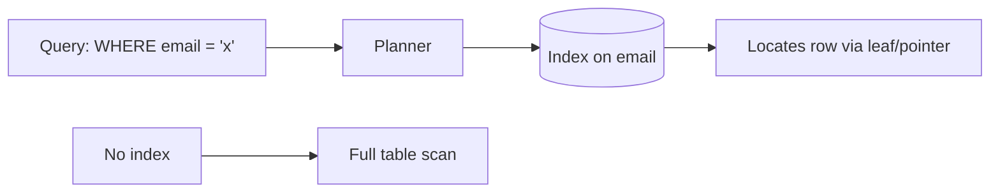

# Database Indexing

## 1. One-Line Definition
An index is a separate data structure (typically a B-tree) that lets the database find rows for a given column value without scanning the whole table, at the cost of extra write work and storage.

## 2. Why Do We Need It?
Without an index, a "find by email" query reads every row (full table scan). At 1M rows that's slow; at 100M rows it's unusable. Indexes turn O(n) scans into O(log n) lookups and are the single most important read-performance lever in databases.

## 3. Simple Intuition
A recipe book's index lists "Lasagna — page 87". Finding lasagna = read the index, jump to page 87, not flip through 400 pages. Every time you add a new recipe you must also update the index (your write gets slightly slower) — that's the trade-off.

## 4. What Happens Without It?
Every query full-scans: p99 latency explodes as the table grows, the CPU is pegged on I/O, and the same query repeated by thousands of users costs thousands of scans. You end up "solving" performance with hardware instead of an index, and sharding/index-less tables make every query a distributed full scan.

## 5. Core Idea
- **B-tree index:** sorted, balanced tree on the indexed column(s). Leaves point to rows. Range queries (`>`, `BETWEEN`), and prefix lookups are natural. Default in most SQL DBs.
- **Clustered vs non-clustered:** clustered = rows physically ordered by the index (one per table, primary key default) — no extra pointer hop; non-clustered = a separate tree pointing to the row (pointer/row-id hop).
- **Composite index:** on `(a, b, c)` — helps queries filtering `a`, `a+b`, `a+b+c` (leftmost prefix rule).
- **LSM-tree (write-optimized, e.g., Cassandra/LevelDB):** append batches in memory, flush sorted segments, periodic compaction. Great write throughput, but read requires merge-checks and tombstones.
- **Hash index:** O(1) exact-match lookups; no range support; used in KV stores.
- **Covering index:** an index that already contains all columns the query needs → no row fetch at all.

**Write cost:** every INSERT/UPDATE/DELETE updates each index — index count heats side of the write path. Too many indexes kill write performance and storage.

## 6. Important Terminology

| Term | Simple Meaning |
|------|----------------|
| Full table scan | Read every row to answer a query |
| B-tree | Sorted tree — balanced lookups + ranges |
| Clustered index | Row storage order follows this index |
| Non-clustered index | Separate tree; lookup then fetch row |
| Composite index | Index on multiple columns (leftmost prefix) |
| Covering index | Index holding everything the query needs |
| LSM-tree | Write-optimized segment-merged index |
| Cardinality / selectivity | How many distinct values / how much an index filters |
| Explain plan | How the DB actually runs your query (did it use the index?) |

## 7. Basic Architecture



## 8. Request or Data Flow
1. Planner chooses a plan: if an index matches the predicate → index seek.
2. B-tree descend (log2 of page count) to the leaf with the row pointer/slot.
3. Fetch row (or use covering index if fully satisfied).
4. If no usable index → full scan (O(n)) — this is the "why is my query slow" answer.

## 9. Practical Example
**User service (assumptions):** 50M users, login via email, admin list by `created_at`.
- PK on `id` = clustered. Index on `email` (unique) — login stable O(log n).
- Composite `(created_at, id)` for admin pagination with stable sort.
- Never index low-selectivity columns (a `status` with 2 values) — useless reads, wasted writes.

## 10. Scaling
- **Read scaling:** correct indexes are the cheapest lever; covering indexes avoid row fetches.
- **Write scaling:** fewer/leaner indexes for write-heavy tables (log tables!). Consider partitioning by time so indexes stay small per partition.
- **Index maintenance at scale:** heavy writes bloat indexes — reorganize/rebuild; monitor bloat.
- **Hotspot:** high-write hot rows suffer from leaf-page contention on the index — batch writes or hash the key.
- **Cold vs hot:** move old/archive data out of the live table (partition + detach) → indexes shrink with the working set.

## 11. Reliability and Failure Scenarios
- **Corrupt index:** DB detects via checksums → rebuild index offline / auto on open.
- **Lock contention during index rebuild:** online vs offline rebuild; online is slower but non-blocking — know your DB's option.
- **Wrong-index regression after release:** a new query pattern that bypasses the index — compare EXPLAIN plans before/after release in CI or the review process.
- **Index bloat:** deleted/updated rows leave dead index entries until VACUUM/compaction → run maintenance; bloat symptoms = disk + slow scans.

## 12. Consistency and Correctness
Indexes are **derived, redundant copies** of the data; the DB keeps them in sync transactionally (never assign them your own correctness responsibility). Treat index fallback (a scan) as a correctness risk under load — you serve the same data, just slowly.

## 13. Performance
- Lookup is ~log(rows)-ish page reads. A covered point lookup with an app-level cache can hit <5 ms.
- Range/sort queries love the natural ordering of a B-tree.
- Don't over-index hot write tables; don't under-index hot read tables; validate plans with EXPLAIN then re-check after schema changes.

## 14. Security
- Indexes must never store raw secrets (don't index full tokens/hashes-derived-fields for lookup without policy justification).
- Restrict who can create indexes (malicious `CREATE INDEX` on a big table locks/DOS).
- Audited migrations should be review-gated (an accidental index creation on a 1B-row table can take the DB down).

## 15. Trade-Offs

| Choice | Advantages | Disadvantages | When to Use |
|--------|------------|---------------|-------------|
| Index every column | Fast lookups anywhere | Writes + storage blow up | Never — be selective |
| Composite index | Multi-column fast path | Update cost across columns | Matches real query patterns |
| Covering index | No row fetch | Redundancy / storage | Hot analytic-ish read templates |
| LSM (write-optimized) | Fast writes | Read amplification, compaction | Write-heavy ingest (logs/events) |
| No index | Fast writes, small | Full scans | Logs/append-only (or with time-partition) |

## 16. Common Mistakes
- Indexing columns never filtered/sorted (pure write cost).
- Forgetting the **leftmost prefix** rule of composite indexes (`(a,b)` won't optimally serve queries on `b` alone).
- Relying on index for `LIKE '%x%'` (leading-wildcard can't use B-tree prefix) — that's a scan or trigram.
- Not using EXPLAIN — the "index exists" belief vs the actual plan.
- Creating indexes as one-off add-ons without a migration/review process (accidental DDL storms).

## 17. HLD vs LLD Boundary
HLD: index *strategy* (which columns, composite orders, covering sets), index/partitioning interplay, write-vs-read cost budget, rebuild/archival. LLD: writing a migration script for one feature, how a specific DAO query uses/un-uses an index.

## 18. Interview Questions

### Beginner
- Why does an index speed up reads?
- What's the difference between a clustered and non-clustered index?

### Intermediate
- How do indexes hurt write-heavy workloads?
- A query is slow; how do you prove it's not using your index?

### Advanced
- Design indexes for a feed table with `(user_id, created_at)` writes and reads; then zip through leftmost-prefix misuse.
- How would you index a write-heavy event table that also needs range queries?

## 19. Interview Memory Summary

> [!abstract]- Interview Memory Summary

### Remember

- Index = look-up structure (usually B-tree): O(n) scan → O(log n) seek.
- Clustered vs non-clustered; composite needs leftmost prefix.
- Covering index skips the row fetch entirely.
- Every index costs writes/storage — budget it.
- Validate with EXPLAIN, not belief.
- Selectivity matters: low-selectivity indexes are a read no-op and a write tax.

### 30-Second Explanation

Index the hot predicates (equality first, then range), composite for combined filters, one clustered PK, verify with EXPLAIN, leaner for write-heavy tables.

### Interview Traps

- "We added an index so it's fast" — check selectivity/leftmost-prefix/EXPLAIN.
- Indexing columns never filtered or sorted (pure write cost).
- Forgetting the leftmost prefix rule of composite indexes.
- Relying on an index for `LIKE '%x%'` (leading wildcard can't use B-tree).
- Creating indexes ad-hoc without a migration/review process (DDL storms).

### Key Trade-Off

Read speed (O(log n) lookups, covered scans) is bought with write amplification and storage on every indexed column — so you trade write throughput and disk against query latency, spending only where hot queries justify it.

## 20. Related Concepts

### Prerequisites

- [[database-fundamentals|Database Fundamentals]]
- [[database-keys|Database Keys]]

### Commonly Used Together

- [[database-connection-pooling|Database Connection Pooling]]
- [[normalization-vs-denormalization|Normalization vs Denormalization]]

### Alternatives

- [[caching|Caching]]

### Advanced Concepts

- [[sharding|Sharding]]
- [[partitioning-vs-sharding|Partitioning vs Sharding]]
- [[consistent-hashing|Consistent Hashing]]
- [[sql-vs-nosql|SQL vs NoSQL]]

Related planned topics (not authored yet): B-tree/LSM/hash index comparison, query optimization.

## 21. References
PostgreSQL/MySQL index docs ("Physical Storage & Indexes"), Kleppmann *Designing Data-Intensive Applications* ch. 3. Verify with current DB docs.

## 22. Active Recall

Test yourself before revealing each answer.

> [!question]- Why does an index speed up reads, and what does it cost?
> An index (typically a B-tree) turns an O(n) full table scan into an O(log n) seek on the indexed column(s). The cost: every write must also update each index, consuming write throughput and storage — the more indexes, the heavier the write path.

> [!question]- What's the difference between clustered and non-clustered indexes?
> A clustered index physically orders rows by that index (one per table, usually the PK) — no extra pointer hop. A non-clustered index is a separate tree holding pointers/row-ids to the data — a lookup then fetch hop. Covering indexes skip the fetch by storing everything the query needs.

> [!question]- Design decision: indexes for a user service where login is by email and admin lists by created_at.
> PK on `id` (clustered). Unique index on `email` for stable O(log n) logins. Composite `(created_at, id)` for paginated admin listings with a stable sort. Avoid indexing low-selectivity columns like a 2-value `status` — useless for reads, pure write tax.

> [!question]- Trade-off: why does a composite index with a "leftmost prefix" rule matter?
> An index on `(a, b, c)` serves filters on `a`, `a+b`, and `a+b+c` but not `b` alone — you must lead with the most selective/always-used column. Building a composite without respecting the prefix rule gives the illusion of an index while the query full-scans.

> [!question]- Failure scenario: a query is slow. How do you prove the index isn't being used?
> Run EXPLAIN and read the plan: if it shows a seq scan or fails to use your index, check leftmost-prefix violations, leading-wildcard `LIKE '%x%'`, low selectivity, or a covering-index mismatch. The plan is the truth — "an index exists" is not proof it's used.

> [!question]- Interview scenario: "We added an index, so it's fast." How do you evaluate that claim?
> Check three things: selectivity (does it filter enough?), leftmost prefix (does the composite lead correctly?), and the EXPLAIN plan (does the planner actually use it?). A wrong or low-selectivity index is a write-side tax and a read-side no-op.

> [!question]- Interview scenario: index a write-heavy event table that also needs range queries.
> Use an LSM or time-partitioned structure so indexes stay small per partition. Index only the columns range queries filter on; keep the table lean — every extra index multiplies write amplification on the write-heavy ingest path.

## 23. When Should I Use This?

### Use it when

- Queries filter on columns not covered by the PK (lookup by email, status, date).
- Range/sort/ORDER BY patterns need natural ordering (B-tree).
- Hot reads need O(log n) or covered point lookups.
- You can validate plans with EXPLAIN.

### Avoid it when

- The table is write-heavy (log/event ingest) — indexes amplify every write.
- Columns are low-selectivity (a status with two values).
- Queries use leading-wildcard LIKE or functions on the column (index can't apply).
- You index without a migration/review process (accidental DDL storms on big tables).

### What problem does it solve?

Problem: without indexes, every query reads every row — O(n) scans that explode with table size. Bottleneck: slow p99s, pegged I/O, and wasted hardware. Solution: B-tree/LSM/hash structures turn lookups into O(log n) seeks, turning "find by email at 100M rows" from unusable to fast.

### What problem does it NOT solve?

It doesn't solve write amplification (indexes make writes slower — that's inherent), doesn't help leading-wildcard/fuzzy search (needs trigram/full-text), and doesn't fix low-selectivity queries (the index won't filter enough). Bloat needs maintenance, not just creation.

## 24. Decision Connections

Decisions that go together with Database Indexing:

- [[database-fundamentals|Database Fundamentals]] — indexing is the core read-perf lever in any DB.
- [[database-keys|Database Keys]] — keys create indexes automatically; strategy starts here.
- [[normalization-vs-denormalization|Normalization vs Denormalization]] — when joins can't be indexed away, denormalize.
- [[transactions-and-acid|Transactions and ACID]] — indexes update inside transactions, adding write cost.
- [[database-connection-pooling|Database Connection Pooling]] — pooled connections keep reads from stalling.
- [[sharding|Sharding]] — per-shard indexes and global index design.
- [[consistent-hashing|Consistent Hashing]] — how placement interacts with per-node indexes.
- [[caching|Caching]] — the layer that often fixes the hot reads indexes alone can't.

Decision tree:

```
Slow query?
    |
    +-- No usable index? Fine-tune
    |      → [[database-indexing|Database Indexing]]
    |         +-- Low selectivity / leftmost prefix wrong / 'LIKE %x%'? → fix predicate
    |         +-- Still joins? → [[normalization-vs-denormalization|Normalization vs Denormalization]]
    |
    +-- Index exists but not used? Run EXPLAIN
    |      → verify prefix rule + selectivity
    |
    +-- Write-heavy table? Lean indexes
    |      → LSM/time-partition; fewer indexes
    |
    +-- Reads still too hot at scale?
    |      → [[caching|Caching]]
    |      → [[database-replication|Database Replication]]
    |
    +-- Writes/storage exceed one node?
           → [[sharding|Sharding]]
```