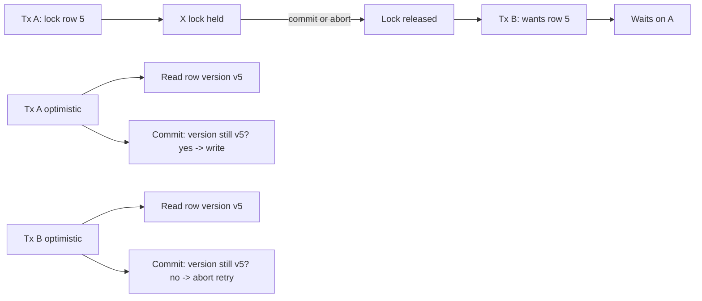

# Locking (Optimistic / Pessimistic / Deadlock)

## 1. One-Line Definition
Database locking controls how concurrent transactions coordinate access to shared rows — pessimistically holding locks before touching data (safe, blocking, deadlock-prone) or optimistically checking for conflicts at commit time (fast when conflicts are rare) — and deadlock is the cyclic-wait failure both styles must detect and recover from.

## 2. Why Do We Need It?
When two transactions read-modify-write the same row, the second overwrite silently clobbers the first unless the engine coordinates. Locking is the coordination: row locks for writers, range locks for phantoms, optimistic version checks for casual concurrency. Without it, updates, balances, and inventories race — and with the wrong style, you pay in blocked throughput, deadlocks, or aborted commits.

## 3. Simple Intuition
- **Pessimistic:** reserving a seat at a table before you sit — nobody else can take it while you hold it; if two people reserve the same two tables in opposite order, they deadlock waiting on each other.
- **Optimistic:** publishing a paper draft and only checking "did anyone else rewrite my section?" right before printing — if they did, you print again from their version. Fast when few people edit the same section.

## 4. What Happens Without It?
A bank balance read by two tellers, each deducting the same amount: both write their result, one deduction is lost. Inventory decrements race into negative stock, bookings double-book, counters always under-count. When concurrency meets shared mutable rows with no coordination, the state silently corrupts — and SQL/DML without locking is exactly that.

## 5. Core Idea
- **Pessimistic locking:** acquire a lock on the rows you'll touch *before* the read-modify-write; hold until commit. Shared (S) locks let multiple readers coexist; exclusive (X) blocks all; intention locks guard hierarchical intent. Prevents conflicts by construction but holds locks through slow paths and invites deadlock.
- **Optimistic locking (MVCC/version-based):** read old versions and a version/row version; at commit, verify no one changed the row since your read; if changed, abort and retry. Fast reads, no blocking, but a conflict storm aborts everyone when contention is high.
- **Deadlock:** two or more transactions wait on each other's locks in a cycle. Databases detect cycles and abort one victim; the app sees a deadlock error and must retry (with randomized backoff).
- **Lock scope:** row, index-range (for phantoms), table, gap locks — wider is safer but more blocking. `SELECT ... FOR UPDATE` is the explicit pessimistic tool; version columns/CAS emulate optimistic.
- **Livelock & starvation:** retrying an optimist who keeps losing can starve; a pessimist holding a hot row starves waiters. Timeouts cap both.

## 6. Important Terminology

| Term | Simple Meaning |
|------|----------------|
| Shared lock (S) | Many readers allowed; blocked by writers |
| Exclusive lock (X) | One writer; blocks everyone else |
| Intention lock | Table-level hint that rows below are locked |
| Gap / range lock | Locks future rows to prevent phantoms |
| Version / row-version column | Number compared at optimistic commit |
| CAS (compare-and-set) | Conditional write only if value unchanged |
| Deadlock | Cyclic wait; DB aborts one victim |
| Livelock | Nobody makes progress; repeated abort/retry |
| Lock timeout | Give-up on waiting to avoid unbounded blocking |
| Point-in-time (MVCC) read | Lock-free snapshot read |

## 7. Basic Architecture



## 8. Request or Data Flow
1. Pessimistic: `SELECT ... FOR UPDATE` takes X locks on the rows; the transaction sees their latest committed state; every other writer blocks until commit/rollback releases the locks.
2. Optimistic: regular reads; the row carries `version`; the write is `UPDATE ... SET version = version + 1 WHERE id = ? AND version = <read>`, which affects 0 rows if someone changed it in between → treat 0-rows as conflict, retry.
3. Either way a deadlock is possible; the DB picks a victim, aborts it, and the app retries idempotently with jitter.

## 9. Practical Example
**Ticket inventory (assumptions):** 1,000 seats, 10K concurrent buyers.
- Pessimistic: each buy does `SELECT ... FOR UPDATE` on the seat row — no double sell, but latency under load climbs and deadlocks appear when carts reserve tickets in different orders (fix: fixed lock order or a single-row reserve).
- Optimistic + counter: `UPDATE seats SET available = available - 1 WHERE available > 0` with a check on rows-affected — sub-millisecond, no locks, retry on 0 rows.
- Real answer: seat-granular optimistic with a small retry budget; the version check migrates only during a hot flash-sale to a pessimistic per-seat lock with strict lock ordering. Numbers: 10K buyers, <1% conflict → optimistic wins almost every round.

## 10. Scaling
- **Pessimistic at scale:** every held lock is a serialization point and a long-tail risk; hot rows (celebrity, one inventory line) become bottlenecks; scale by sharding the hot key or batching.
- **Optimistic at scale:** conflicts grow superlinearly with contending writers on one row — beyond a handshake of writers it degrades from "aborts" to "aborts all"; mitigate with atomic single-statement ops (counters), buckets, or sharding.
- **Lock manager:** distributed engines replicate the lock story per shard; the coordination cost stacks with replicas — that's the tax [[distributed-locks|Distributed Locks]] and [[distributed-transactions|Distributed Transactions]] spell out.

## 11. Reliability and Failure Scenarios

| Failure | What Happens | Detection | Recovery |
|---------|--------------|-----------|----------|
| Deadlock | Cyclic wait; victim aborted | DB's deadlock detector | App retry with backoff |
| Lock starvation | Hot row eternally re-locked | Wait-time metrics | Timeouts, fair queues |
| Stale version (optimistic) | Retry storm | Abort-rate spike | Backoff, shrink tx, per-row ops |
| Crash mid-transaction | Held locks vanish | Engine rolls back | Reconnect; retry idempotently |
| Timeout | Tx gives up waiting | Lock-wait alerts | Shrink tx, lock order discipline |

## 12. Consistency and Correctness
- Locks implement isolation: row locks → no dirty/non-repeatable writes; gap locks → no phantoms; full serializable ordering is the extreme (see [[transactions-and-acid|Transactions and ACID]]).
- Optimistic locking guarantees "no lost update" (compared to blind writes) but not serializability — write skew still possible unless you lock at commit.
- Idempotency is your safety net for retries: a user retried after a deadlock abort must not double-charge (see [[idempotency|Idempotency]]).
- Version columns must be monotonic; row version = commit counter on that row, updated in the same txn as the write.

## 13. Performance
- Pessimistic has low conflict cost at low contention but long waits and deadlocks at high; each lock is memory + a wait queue.
- Optimistic is O(1) reads and one conditional UPDATE; per-row version check costs one index seek; under 1-5% conflict it beats pessimistic at high concurrency because it never blocks.
- Short transactions are the cheap half of both strategies — lock/version lifespan disciplines everything else.

## 14. Security
Locks are latency, not access control: they don't prevent an authorized writer from clobbering a row another process expects. If two subjects may write the same row, authorization alone is not enough — use row-level ownership (tenant key in the PK), so "your" lock protects your rows and nobody can lock the admin's. Never put secrets in lock/version metadata you log.

## 15. Trade-Offs

| Style | Strengths | Costs | When to Use |
|-------|-----------|-------|-------------|
| Pessimistic (FOR UPDATE) | Guarantees no races, simple reasoning | Blocking, deadlocks, hot-row bottleneck | Low contention, correctness-critical small scope |
| Optimistic (version/CAS) | Non-blocking, scales on reads | Conflicts abort, retry storms | Read-mostly, low write contention |
| Atomic statement | Fastest, no lock | Only single-row transforms (counters) | increments, decrements, flags |
| Gap/range locks | Prevents phantoms | Blocks adjacent inserts | Serializable guarantees |
| Table/DB locks | Simplest | Kills concurrency | Maintenance, batch imports |

## 16. Common Mistakes
- Holding locks across HTTP calls or user prompts — lock lifetime becomes user lifetime.
- Optimistic locking without a retry loop → user-visible failures on a conflict.
- Using Serializable/hot-row FOR UPDATE for counters instead of an atomic increment.
- Non-uniform lock ordering (A then B vs B then A) → systematic deadlocks.
- Blind DELETE/UPDATE where a version check should exist (prefer CAS).
- Zero backoff on retry → livelock at high contention.

## 17. HLD vs LLD Boundary
HLD: locking style per workload class, lock-ordering discipline, retry/backoff policy, hot-row treatment (atomic ops, shards), lock-wait timeout budgets. LLD: the version-column migration, the CAS SQL in one DAO, one FOR UPDATE usage, the retry wrapper around one method.

## 18. Interview Questions

### Beginner
- Difference between pessimistic and optimistic locking?
- What causes a deadlock and what does the database do about it?

### Intermediate
- Design locking for a ticket-sale counter under 10K concurrent buyers. Pessimistic or not, and why?
- How does a version column prevent lost updates, and what happens when the check fails?

### Advanced
- Walk a scenario where optimistic locking guarantees no lost update yet still double-books — and the fix.
- Your team sees a retry storm on a hot row. Diagnose and design the fix (backoff, atomic ops, sharding, or pessimistic escape).

## 19. Interview Memory Summary

> [!abstract]- Interview Memory Summary

### Remember

- Pessimistic = lock before touch; optimistic = verify before commit.
- S/X locks, intention locks, gap locks are the pessimistic vocabulary.
- Version column + conditional UPDATE is optimistic (CAS).
- Deadlock = cyclic wait; DB aborts a victim; you retry with backoff.
- MVCC gives lock-free snapshot reads; writes still coordinate.
- Hold locks short; order locks consistently; never cross HTTP.

### 30-Second Explanation

For single-row hot mutations, prefer atomic statements or optimistic version/CAS (non-blocking, retry on zero rows). Pessimistic `SELECT ... FOR UPDATE` only where a multi-row invariant must serialize. Either way: short transactions, consistent lock order, idempotent retry with backoff, and timeouts so deadlocks/starvation surface instead of hanging.

### Interview Traps

- Confusing MVCC "no readers block writers" with "no coordination at all".
- Claiming optimistic locking is serializable — write skew remains.
- Retrying immediately on deadlock (thundering herd) vs backoff+jitter.
- Holding a lock across an HTTP call or user decision.

### Key Trade-Off

Pessimistic guarantees progress-in-order and blocks everyone else; optimistic never blocks but aborts late — so the choice is really "bounded wait" vs "thrown-away work", decided by how hot the row is.

## 20. Related Concepts

### Prerequisites

- [[transactions-and-acid|Transactions and ACID]] — isolation semantics locking implements.
- [[database-connection-pooling|Database Connection Pooling]] — pools determine how long locks live in the app.

### Commonly Used Together

- [[retry-and-timeout|Retry and Timeout]] — the recovery loop for deadlocks and optimistic aborts.
- [[idempotency|Idempotency]] — makes retries after aborts safe.
- [[database-fundamentals|Database Fundamentals]] — the concurrency engine beneath.

### Alternatives

- [[distributed-locks|Distributed Locks]] — same discipline, across processes.
- [[distributed-transactions|Distributed Transactions]] — coordinating locks across databases/nodes.

Related planned topics (not authored yet): isolation-level-specific lock matrices, MVCC internals, and per-engine lock modes.

## 21. References
PostgreSQL docs on `FOR UPDATE`, support for SERIALIZABLE; MySQL InnoDB lock modes and deadlock detection; SQL Server locking/optimistic vs pessimistic concurrency docs. Kleppmann *Designing Data-Intensive Applications* ch. 7 (lost updates, write skew, 2PL vs optimistic concurrency).

## 22. Active Recall

Test yourself before revealing each answer.

> [!question]- Basic understanding: what does a deadlock do and what's the correct app response?
> The DB detects a cyclic wait and aborts one "victim" transaction to break it. The app must catch the deadlock error, roll back its own work, and retry with randomized backoff (and an idempotency key) rather than retry immediately or give up.

> [!question]- Design decision: a seat-granular ticket sale with 10K buyers and <1% conflict. Which style?
> Optimistic: read seat version, conditional UPDATE, treat zero-rows as conflict and retry. At <1% conflicts it almost never aborts, never blocks, and outruns pessimistic locking. Escalate to a pessimistic per-seat lock (fixed order) only for flash-sale bursts.

> [!question]- Trade-off: optimistic locking "prevents lost updates" — what does it NOT prevent?
> Write skew: two transactions read different-but-overlapping rows (no version overlap) and both write; neither's version changed, both commit, yet the combination violates an invariant. Fix requires serializability or locking the shared predicate (FOR UPDATE on the range).

> [!question]- Failure scenario: optimistic retries are failing harder every second. Diagnose.
> Retry without backoff at high contention — every wave re-crashes the moment others commit. Fix: exponential backoff + jitter, shrink transaction scope, and where possible replace version-CAS rows with atomic single-statement ops or shard/bucket the hot key.

> [!question]- Interview scenario: "We lock the whole booking table during checkout for safety." Respond.
> Table locks serialize every checkout — throughput collapses and the lock degrades into a queue. Scope to the seat rows (or optimistic CAS), keep transaction short, and add a secondary constraint (unique seat/time booking) as the real invariant guard.

> [!question]- Interview scenario: payments keep double-deducting at Read Committed without locks. Explain + fix.
> Blind `UPDATE account SET balance = balance - X` re-reads and rewrites lose the competitor's deduction. Fix: conditional write with a version (CAS) on the balance row, or `SELECT ... FOR UPDATE`, or a single atomic `UPDATE ... WHERE balance >= X` returning affected rows; then idempotency-key the retry.

## 23. When Should I Use This?

### Use it when

- Shared rows are mutated concurrently and a lost update is unacceptable.
- A multi-row invariant must hold under concurrency (locking the predicate).
- You must choose between blocking (pessimistic) and retry (optimistic) for a hot path.

### Avoid it when

- The mutation is a pure counter/flag — use atomic statements instead.
- Locks would live across network/user boundaries (hold time = caller patience).
- Contention is so high that aborts outnumber commits — restructure (shard/bucket) rather than tune.

### What problem does it solve?

The problem: concurrent read-modify-write on shared rows silently loses updates and breaks invariants. Bottleneck: coordination cost between reads and writes. Solution: pessimistic locks serialize writers (certainty, blocking), optimistic versions abort-and-retry (no blocking, clever), atomic statements cover the trivial case — each with retry/backoff discipline.

### What problem does it NOT solve?

It does not make spans across nodes/services atomic (that's [[distributed-transactions|Distributed Transactions]]), does not by itself give serializability (optimistic still has write skew), and does not kill starvation — a hot row still starves or storms without sharding, batching, or fair queues.

## 24. Decision Connections

Decisions that go together with Database Locking:

- [[transactions-and-acid|Transactions and ACID]] — the correctness contract locking serves.
- [[retry-and-timeout|Retry and Timeout]] — the recovery half of every deadlock/abort.
- [[idempotency|Idempotency]] — safe retries after aborted writes.
- [[database-connection-pooling|Database Connection Pooling]] — pooled sessions extend lock lifespans; size with that in mind.
- [[distributed-locks|Distributed Locks]] — process-level coordination using the same semantics.
- [[distributed-transactions|Distributed Transactions]] — lock-style coordination beyond one DB.

Decision tree:

```
What is the mutation doing?
    |
    +-- Pure counter or flag?
    |      → atomic single-statement op, no lock
    |
    +-- Single row read-modify-write?
    |      → version + CAS (optimistic), retry on conflict
    |
    +-- Multi-row invariant under concurrency?
    |      → SELECT FOR UPDATE on the predicate
    |        +-- Contention high?  → shard/bucket the key
    |        +-- Deadlocks?        → fixed lock order + backoff
    |
    +-- Spans processes or nodes?
           → [[distributed-locks|Distributed Locks]] or distributed tx
```