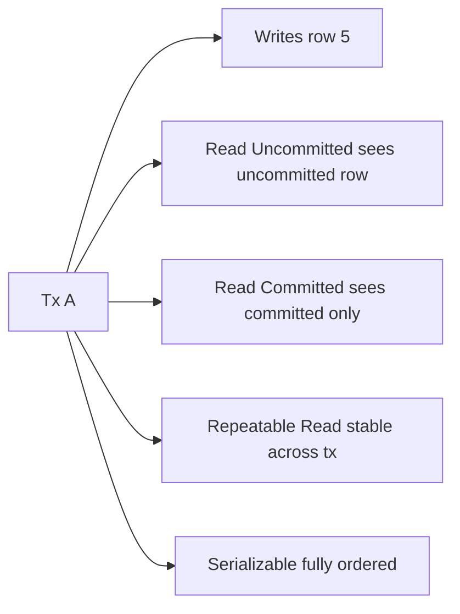

# Isolation Levels and Anomalies

## 1. One-Line Definition
An isolation level defines how much a transaction can see of other concurrent transactions' changes — from seeing uncommitted data (Read Uncommitted) to fully serializable execution — and each level permits a specific set of known anomalies (dirty reads, non-repeatable reads, phantoms), so choosing the level is choosing which anomalies you can tolerate.

## 2. Why Do We Need It?
Without a chosen isolation level, a database either blocks everything (terrible throughput) or lets transactions interleave arbitrarily (corrupted reads). The level is the explicit dial: how fast and concurrent you are allowed to be vs how protected your reads are. It also determines *which bugs you'll have* — a money report built on Read Committed will show different numbers mid-load, while one on Serializable won't.

## 3. Simple Intuition
Observing a practice session through a window: with no curtains you see every correction (dirty reads); with a one-way mirror you see how people looked when you started (snapshot); with frosted glass you see them change shape but not details (repeatable read anomalies). Serializable is watching a locked rehearsal where nobody enters or leaves until it's done — consistent but empty of useful concurrency.

## 4. What Happens Without It?
Transactions interleave unpredictably: a transaction reads a half-updated row (dirty), re-reads a row and finds it changed (non-repeatable), or sees a range's membership change mid-iteration (phantom). Reports double-count mid-flight transfers, inventory queries miss rows a concurrent insert added, retry loops fight phantom rows. You ship a "concurrent" system that is wrong under concurrency.

## 5. Core Idea
- **Anomalies (what you're avoiding):**
  - *Dirty read:* seeing another transaction's uncommitted change.
  - *Non-repeatable read:* the same row changes between two reads in one transaction (committed by someone else in between).
  - *Phantom read:* a range query's membership changes between two executions (rows inserted/deleted by others).
  - *Lost update / write skew:* two transactions each write based on a read the other invalidates — the isolation classics beyond the three textbook anomalies.
- **The five levels (ANSI + snapshot):**
  - Read Uncommitted — no protection; dirty reads allowed.
  - Read Committed — each statement reads a fresh committed snapshot; no dirty reads; non-repeatable reads and phantoms allowed.
  - Repeatable Read — one snapshot for the whole transaction; stable row reads; phantoms still possible in stock implementations.
  - Serializable — executes as if transactions ran one after another; all anomalies excluded.
  - Snapshot Isolation (a common engine default, e.g., PostgreSQL default RR and MySQL's) — a transaction reads a point-in-time snapshot; no dirty/non-repeatable/phantom, but *write skew* is possible.
- **Implementation:** locking (pessimistic) per level vs MVCC snapshots (optimistic, lock-free reads) — covered in depth under the Locking concept (planned); most modern DBs do MVCC.

## 6. Important Terminology

| Term | Simple Meaning |
|------|----------------|
| Dirty read | Reading another tx's uncommitted data |
| Non-repeatable read | Row changes between two reads in one tx |
| Phantom read | Range membership changes mid-tx |
| Lost update | Two txs overwrite each other's change |
| Write skew | Two txs read then write overlapping data inconsistently |
| Snapshot isolation | Fixed point-in-time view for the whole tx |
| MVCC | Version-based concurrency so readers never block writers |
| First-committer wins | Snapshot tx aborts if the row changed after its read |
| Isolation level | The anomaly-tolerance dial per tx |

## 7. Basic Architecture



## 8. Request or Data Flow
1. A transaction begins at its configured level.
2. Every statement executes under that level's rule: Read Committed takes a fresh snapshot per statement; Repeatable Read freezes one snapshot; Serializable adds locks/conflict checks at commit.
3. On commit, MVCC engines apply first-committer-wins: if a version changed after your snapshot, you abort (or block) instead of overwriting blind.
4. The app receives commit/abort and retries with backoff (see [[database-connection-pooling|Database Connection Pooling]] and retry guidance in [[transactions-and-acid|Transactions and ACID]]).

## 9. Practical Example
**Analytics dashboard (assumptions):** a nightly report reads 10M rows while users keep placing 200 orders/sec.
- Read Committed: each table read is a different moment — the "total orders" and "total revenue" columns can describe slightly different time points. Acceptable for dashboards.
- Repeatable Read (snapshot): the whole report sees one consistent moment — no inter-column skew, no phantom products appearing mid-report.
- Serializable: safe but slowest — it would block or abort against the volatile order writes.
The correct pick here is Repeatable Read/snapshot, not Serializable — the extra cost buys no business correctness for a report.

## 10. Scaling
- Higher isolation → more blocking/aborts → less concurrency; hot rows become serialization points.
- Under load, Serializable kills a hot-row counter table (every writer waits); Read Committed keeps the write path flowing.
- Distributed/scale-out: isolation levels *per node* don't compose globally — cross-shard transactions need [[distributed-transactions|Distributed Transactions]], and cluster consistency is a separate dial (see [[strong-vs-eventual-consistency|Strong vs Eventual Consistency]]).

## 11. Reliability and Failure Scenarios

| Failure | What Happens | Detection | Recovery |
|---------|--------------|-----------|----------|
| Abort storm at high isolation | Txs keep failing → throughput cliff | Abort rate, retry counts | Lower level, shrink tx, backoff |
| Deadlock | Two txs wait cyclically | DB detects cycle | Abort one; app retries (see locking) |
| Slow tx holding snapshot | Debris bloat, logs grow | Snapshot age metric | Short txs, avoid long idle connections |
| Lost-update on payment | Double-spend in a read-modify-write | Reconciliation | Serializable or compare-and-set row |

## 12. Consistency and Correctness
- Each level is a *contract*: if you claim Read Committed, users may legitimately see non-repeatable reads — design reports/aggregators to tolerate or require a snapshot.
- MVCC means readers never block writers, which is why most stacks pick Read Committed or Repeatable Read as the default; blocking is the cost of Serializable's correctness.
- Write skew is the classic sneaky one: two txs each check "no active shift for me" then both insert — snapshots don't prevent it; Serializable or explicit locking does.
- Retry semantics: an abort is not a failure of the level, it is the level doing its job — the app must retry idempotently.

## 13. Performance
- Read Uncommitted ≈ reading without any MVCC tax (fastest, nearly never correct).
- Read Committed ≈ per-statement snapshot (small overhead, good concurrency).
- Repeatable Read ≈ one snapshot held (memory for versions grows with tx duration).
- Serializable ≈ locks/validation at commit (throughput drops with contention).
Rough rule for OLTP: the practical default is Read Committed/Repeatable Read with short transactions; escalate only where an invariant demands it.

## 14. Security
Isolation isn't a security boundary: a "consistent snapshot" can still expose to one tenant the committed rows of another if access control isn't row-level. Enforce tenant filters at query time; isolation only guarantees *temporal* correctness of what you're allowed to see, never *which* rows you're allowed to see.

## 15. Trade-Offs

| Level | Anomalies allowed | Concurrency | When to Use |
|-------|-------------------|-------------|-------------|
| Read Uncommitted | Dirty + all below | Max | Probing/diagnostics only |
| Read Committed | Non-repeatable + phantom | High | Default OLTP reports |
| Repeatable Read (snapshot) | Phantoms possible, write-skew | Good | Consistent multi-row reads |
| Snapshot Isolation | Write skew only | Good | MVCC engines' pragmatic strong |
| Serializable | None | Low under contention | Money invariants, low hot rows |

## 16. Common Mistakes
- Assuming the engine's default is Serializable — most defaults (Postgres RR, MySQL RR) are snapshot-style, fine for most reads, wrong assumption for invariants.
- Holding a transaction/snapshot open across HTTP calls (lock + bloat + aborts).
- Treating a report at Read Committed as "consistent" — its columns describe different instants.
- Believing snapshot isolation prevents write skew — it does not.
- Escalating to Serializable globally for one invariant query, instead of scoping the strong level to that transaction.

## 17. HLD vs LLD Boundary
HLD: isolation-level policy per workload class (reports snapshot, writes Read Committed, money Serializable), tx-scope guidance (keep short, single DB), retry policy for aborts. LLD: choosing `SET ISOLATION LEVEL` in one session, one retry wrapper, one `SELECT ... FOR UPDATE` where the invariant is.

## 18. Interview Questions

### Beginner
- What is a dirty read, and which level prevents it?
- Why do MVCC-based systems prefer repeatable reads over blocking locks?

### Intermediate
- Your dashboard report and live writes run together. Which level and why? What anomalies remain?
- What is write skew and why doesn't snapshot isolation stop it?

### Advanced
- Model a booking system invariant under snapshot isolation, show the skew that breaks it, and design the Serializable/locking fix.
- A payment double-spend reached production on "Repeatable Read". Walk the exact interleaving and the fix.

## 19. Interview Memory Summary

> [!abstract]- Interview Memory Summary

### Remember

- Levels = anomaly dial: RC no dirty, RR no non-repeatable, Serializable none.
- MVCC snapshots replace blocking for readers-writers.
- Snapshot isolation still allows write skew — its famous blind spot.
- Defaults are engine-specific; Postgres RR and MySQL RR are not ANSI-Serializable.
- Isolation is temporal, not a security or tenant boundary.
- Keep transactions short; long idle snapshots bloat MVCC.

### 30-Second Explanation

Pick the isolation level by the invariant: Read Committed for most OLTP (fresh per statement, no dirty reads), Repeatable Read/snapshot for consistent multi-row reports, Serializable only where an invariant must survive concurrency — and remember MVCC snapshots stop readers blocking writers but not write skew, so validate the booking/payment interleavings yourself.

### Interview Traps

- Assuming every DB defaults to Serializable.
- Hyping MVCC as "concurrency for free" — write skew remains.
- Reporting "consistent" numbers from Read Committed reads.
- Confusing isolation (one DB) with cluster-wide consistency.

### Key Trade-Off

Higher isolation trades throughput and concurrency against anomaly safety — escalations to Serializable buy correctness only where an invariant genuinely lives, and snapshot isolation buys most of that at a far lower cost except for skew.

## 20. Related Concepts

### Prerequisites

- [[transactions-and-acid|Transactions and ACID]] — isolation is the I in ACID; the parent contract.
- [[database-fundamentals|Database Fundamentals]] — concurrency control basics.

### Commonly Used Together

- [[database-replication|Database Replication]] — replicas can serve different snapshot ages; read consistency gets murkier.
- [[database-connection-pooling|Database Connection Pooling]] — pooled idle transactions hold snapshots and locks.
- [[replication-lag|Replication Lag]] — a replica read may be older than your snapshot.

### Alternatives

- [[strong-vs-eventual-consistency|Strong vs Eventual Consistency]] — the cluster-level dial isolation complements.

### Advanced Concepts

- [[distributed-transactions|Distributed Transactions]] — when the invariant spans nodes, per-DB isolation stops being enough.
- [[cap-theorem|CAP Theorem]] — the availability boundary that isolation scopes to one node.

Related planned topics (not authored yet): Locking (optimistic/pessimistic/deadlock) mechanisms that implement these levels.

## 21. References
ANSI SQL standard isolation table plus engine docs: PostgreSQL "Transaction Isolation", MySQL "InnoDB isolation levels", SQL Server/MSSQL isolation docs. Kleppmann *Designing Data-Intensive Applications* ch. 7 explains anomalies and write skew rigorously. Verify defaults per engine.

## 22. Active Recall

Test yourself before revealing each answer.

> [!question]- Basic understanding: which anomaly does each level allow?
> Read Uncommitted allows dirty reads, non-repeatable reads, phantoms; Read Committed prevents dirty but allows non-repeatable/phantom; Repeatable Read prevents dirty + non-repeatable but can allow phantoms; Serializable prevents all.

> [!question]- Design decision: a 10M-row report running against live writes — level?
> Repeatable Read/snapshot: one consistent point-in-time view, no inter-column skew, no phantoms in the report. Read Committed would desync its own columns; Serializable adds blocking cost the report doesn't need.

> [!question]- Trade-off: why do modern DBs prefer MVCC snapshots over locking for reads?
> Readers never block writers and vice versa — read statements see their snapshot instantly. Locking serializes reads against writes (or needs real-time coordination). The cost: old versions accumulate until no snapshot references them, and write skew isn't detected.

> [!question]- Failure scenario: a booking system under snapshot isolation double-books the last seat. Explain.
> Two transactions each read "no booking for seat, time" from their snapshots, both insert — first-committer-wins detects row-version conflicts only if the same row changed; an insert into an unchanged range is invisible to the other's snapshot. Fix: Serializable, or a `SELECT ... FOR UPDATE`/constraint that blocks the race.

> [!question]- Interview scenario: payment double-spend reached production at Repeatable Read. Walk the fix.
> The read-modify-write (check balance, deduct) read an old version; the competing tx did the same. Fix: make the deduction conditional on the read version (CAS) within Serializable or `SELECT ... FOR UPDATE`, keep the tx short, and add an idempotency key for retries.

> [!question]- Interview scenario: "We use Serializable everywhere; it's safe." Respond.
> Serializable guarantees per-transaction correctness but costs throughput under contention, extends lock/snapshot lifetimes, and does nothing for cross-node invariants. Scope it to where an invariant actually lives; default the rest to Read Committed/repeatable snapshot with short transactions.

## 23. When Should I Use This?

### Use it when

- You need to state which anomalies a workload may observe.
- Reports need a single consistent point-in-time view.
- Money/booking invariants require serializable behavior — scoped to those transactions.

### Avoid it when

- Hot-row counters need peak concurrency (escalating isolation serializes the row).
- Transactions span long HTTP calls — locks/snapshots held too long.
- You need cluster-level consistency that one node's isolation cannot provide (that's replication/quorum).

### What problem does it solve?

The problem: concurrent transactions corrupt or skew each other's reads and writes unless the engine interleaves them deliberately. Bottleneck: correct isolation can block everything; none can corrupt. Solution: a per-level anomaly dial — snapshots for consistent reads, per-statement freshness for OLTP, serializable only for the invariants — with MVCC keeping readers unblocked.

### What problem does it NOT solve?

It does not guarantee consistency across nodes (that's replication depth, quorums), does not protect cross-service atomicity (sagas/outbox instead), and snapshot isolation specifically does not solve write skew — that needs serializability or explicit locking at the invariant.

## 24. Decision Connections

Decisions that go together with Isolation Levels:

- [[transactions-and-acid|Transactions and ACID]] — the contract the anomaly dial sits inside.
- Locking (optimistic/pessimistic, deadlock) and MVCC — the mechanical underpinning (planned topic).
- [[database-replication|Database Replication]] — replicas drift, changing what "consistent" means for a read.
- [[database-connection-pooling|Database Connection Pooling]] — pooling interacts with how long snapshots/locks live.
- [[strong-vs-eventual-consistency|Strong vs Eventual Consistency]] — the cluster-level knob layered on top.
- [[distributed-transactions|Distributed Transactions]] — the span these levels stop covering.
- [[cap-theorem|CAP Theorem]] — the availability constraint behind every isolation compromise.

Decision tree:

```
What does the transaction require?
    |
    +-- Fresh committed data, tolerant of re-reads?
    |      → Read Committed (default OLTP)
    |
    +-- One consistent view across many rows?
    |      → Repeatable Read / snapshot
    |
    +-- Exact invariants under concurrency?
    |      → Serializable
    |         +-- Contention high? → scope to the invariant tx only
    |         +-- Skew still possible? → add SELECT FOR UPDATE / CAS
    |
    +-- Invariant spans nodes or services?
           → [[distributed-transactions|Distributed Transactions]] or saga/outbox
```