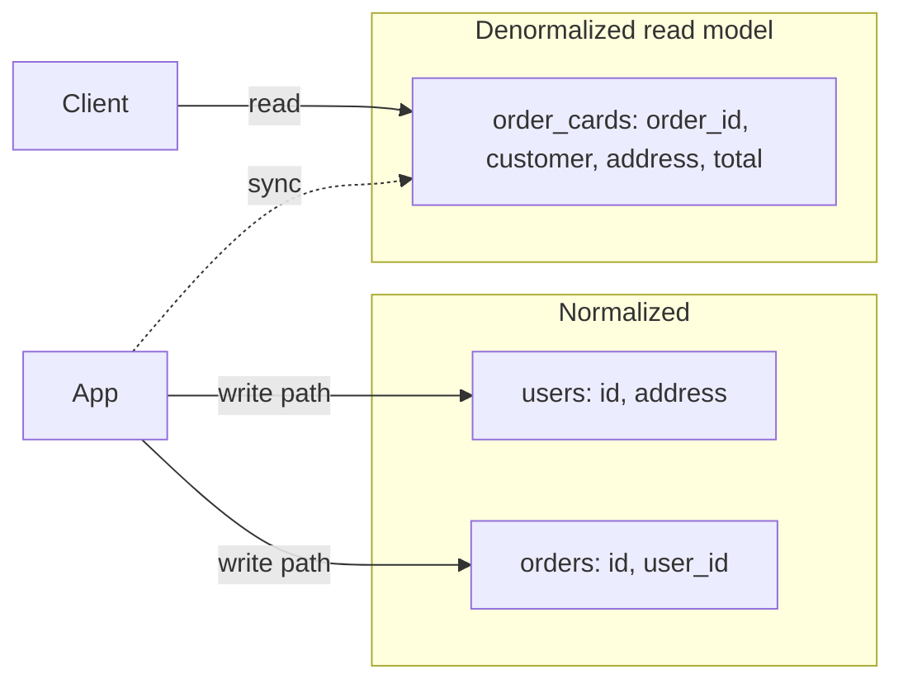

# Normalization vs Denormalization

## 1. One-Line Definition
Normalization eliminates duplicated data by splitting it into related tables (each fact stored once); denormalization intentionally duplicates/aggregates data to make specific reads fast.

## 2. Why Do We Need It?
A relational schema that stores everything in one wide table repeats data (same customer address on 500 orders) → anomalies when data changes (edit address = update 500 rows) and wasteful storage. But perfectly normalized schemas force multi-table joins for every render — slow at scale. Balancing them is core schema design.

## 3. Simple Intuition
- **Normalized:** a government registry where your address exists in exactly one place; any document you sign references it. Change address once → everything updates. But every "show my forms" means assembling references (joins).
- **Denormalized:** each form you sign also prints your address on it. Reading a form requires no lookups — but move house and every printed form is stale.

## 4. What Happens Without It?
A fully denormalized single-table schema: hundreds of duplicate columns, update anomalies (inconsistent copies), storage bloat, and locks spanning many rows on every edit. A fully normalized schema: every UI render is 8 joined queries — p50 great? No: slow, and at scale the join tax dominates.

## 5. Core Idea
**First normal form (1NF):** atomic values, no repeating groups.
**Second (2NF):** + no partial dependency on part of a composite key.
**Third (3NF):** + no transitive dependency on a non-key column.
These forms eliminate duplication and anomaly risk. DBAs usually stop at 3NF in OLTP and denormalize deliberately for hot read paths.

**Denormalization techniques:**
- **Precomputed columns/aggregates** (counts, totals) maintained on write.
- **Embedded/duplicate fields** (address printed on the order row).
- **Cache-as-a-form-of-denormalization:** materialized views, Redis, or read models — same idea, different implementation.

**The rule:** normalize for *write correctness*, denormalize for *read performance* where staleness is acceptable or controllable.

## 6. Important Terminology

| Term | Simple Meaning |
|------|----------------|
| Normal form (1NF/2NF/3NF) | Formal rules eliminating duplication levels |
| Anomaly (insert/update/delete) | Data inconsistency caused by duplication |
| Join | Reassembling a normalized view at read time |
| Denormalized | Deliberate duplication/precomputation for reads |
| Materialized view | Precomputed query result stored as a table |
| Aggregate field | Stored count/sum maintained on writes |
| Fan-out / read amplification | One logical view requiring many physical reads |

## 7. Basic Architecture



## 8. Request or Data Flow
- **Write path (normalized):** update one row in `users` — `address` is correct everywhere instantly.
- **Read path (denormalized):** read a pre-built `order_card` row — zero joins, low latency.
- Between them, a maintainer (transactional update / materialized view / CDC) keeps the denormalized copy fresh.

## 9. Practical Example
**Order history UI (assumptions):** 
- OLTP core stays normalized (`users`, `orders`, `order_items`).
- A denormalized `order_summary` read model (customer name+address+total+status snapshot) serves the customer Orders page — one row per order, sub-ms.
- Rebuild on core change via CDC or outbox event → eventual consistency (seconds), staleness acceptable for display.

## 10. Scaling
- **Normalized core:** writes stay single-row friendly, transactions scoped tight → scales writes reasonably.
- **Read scaling:** denormalized read models (postgreSQL materialized views, Elasticsearch index, Redis aggregates) absorb read QPS with no joins — move them off the primary.
- **Write scaling:** every denormalized copy is extra write work — update storms if ×N subscribers. Batch/async propagation (streaming) instead of synchronous fan-out.
- **Hotspot:** a hot "customer with 1M orders" row in a read-model is fine (read-only); in normalized core it locks.

## 11. Reliability and Failure Scenarios

| Failure | What Happens | Detection | Recovery | Trade-off |
|---------|--------------|-----------|----------|-----------|
| Read model stale (CDC lag) | Displays older data | Lag metrics, freshness checks | Backfill from source | Staleness vs latency |
| Read model corruption | Wrong aggregates | Checksum/diff, reconciliation | Rebuild from normalized source | Rebuild cost |
| Write turn on normalization | 3 rows/table touched → locks | Latency on update paths | Keep core writes narrow; mimic with CQRS | — 

## 12. Consistency and Correctness
Normalized core = source of truth. Read models are **derived views** — eventually consistent by default. The correctness rule: *a read model may lag, never write back to it as truth*. Writes reconcile through the normalized core (a write to a read model corrupts the derivation chain).

## 13. Performance
- Denormalized reads: 1-row point reads → sub-ms, huge QPS for free (no joins).
- Write cost: propagation/tombstones/multiple stores — measure the maintenance price before denormalizing hot paths.
- Use EXPLAIN: if a "read model" query still joins — you've hidden the cost, not removed it.

## 14. Security
Denormalized copies multiply data exposure: a shipped `order_card` must respect the same access control (encrypt/N/A flags, tenant isolation) as the normalized core. ACLs must be rechecked at *every* copy, and PII copied into read models must be purged/redacted consistently.

## 15. Trade-Offs

| Choice | Advantages | Disadvantages | When to Use |
|--------|------------|---------------|-------------|
| 3NF (normalized) | No duplication, clean writes | Joins slow at scale | OLTP source of truth |
| Denormalized read model | Fast reads, high QPS | Staleness, extra write/store | Hot read paths |
| Materialized view | Declarative, DB-managed | Refresh cost/latency, full-rebuild risk | Periodic analytics/rollups |
| Embedded duplicated field | A single query renders | Update anomalies on that path | Rarely-changing, denormalized-by-habit columns |
| Aggregate counters | O(1) display | Increment complexity, drift | Feeds/likes counts |

## 16. Common Mistakes
- Fully denormalizing the "source of truth" (multi-table anomalies, write floods).
- Normalizing everything and joining 8 tables at p99-check time.
- Believing denormalization must be **synchronous** — async + eventual is the scalable mode.
- No rebuild story for read models (they're derived; they'll need rebuilding).
- Mixing read/post-CDC correctness into the same transaction as the core write (fine for few— breaks at fan-out).

## 17. HLD vs LLD Boundary
HLD: normalize-the-truth + denormalize-the-hot-reads, read-model propagation (CDC/events), read model rebuilding, staleness budget. LLD: a specific view/entity table migration, one DAO that reads/writes the model, mapping code.

## 18. Interview Questions

### Beginner
- What problem does normalization solve?
- What is denormalization and why do it?

### Intermediate
- Orders page needs customer name+address+total+items in one response. Model it normalized vs denormalized and pick one.
- How do you rebuild a denormalized read model after a schema change?

### Advanced
- Design write-then-read where reads must be sub-10ms at 100k QPS with zero joins, but writes must never be lost. Walk the propagation design.
- When should a polyglot read model beat SQL materialized views?

## 19. Interview Memory Summary

> [!abstract]- Interview Memory Summary

### Remember

- Normalization = store each fact once → no anomalies.
- Aim for 3NF in the OLTP core.
- Denormalization = duplication/precompute for read speed.
- Normalized = truth; read models = derived & eventually consistent.
- Hot reads denormalize; core writes normalize.
- The rule: normalize for write correctness, denormalize for read performance where staleness is acceptable.

### 30-Second Explanation

Keep the core normalized/transactional; denormalize your hottest read shapes into maintained read models (cache/CDC/events); accept staleness, keep a rebuild path.

### Interview Traps

- Fully denormalizing the "source of truth" → write floods and anomalies.
- Normalizing everything and joining 8 tables at p99 time.
- Believing denormalization must be synchronous — async + eventual is the scalable mode.
- No rebuild story for read models (they're derived; they'll need rebuilding).
- Building the read model in the same write transaction as the core — that's a write-taxed read model.

### Key Trade-Off

Write correctness (normalized, one fact per place) and read performance (denormalized, zero joins) pull in opposite directions: the balance is a normalized truth store plus asynchronously-maintained denormalized read models, paid for with staleness and propagation machinery.

## 20. Related Concepts

### Prerequisites

- [[database-fundamentals|Database Fundamentals]]
- [[database-keys|Database Keys]]
- [[database-indexing|Database Indexing]]

### Commonly Used Together

- [[transactions-and-acid|Transactions and ACID]]
- [[caching|Caching]]

### Advanced Concepts

- [[sql-vs-nosql|SQL vs NoSQL]]
- [[message-queue|Message Queue]]
- [[outbox-pattern|Outbox Pattern]]
- [[event-driven-architecture|Event-Driven Architecture]]

Related planned topics (not authored yet): CQRS / event sourcing, materialized views (OLTP vs OLAP).

## 21. References
Classic normalization theory (Codd); Kleppmann ch. 3 (storage/derived data). Verify materialized-view semantics per engine.

## 22. Active Recall

Test yourself before revealing each answer.

> [!question]- What problem does normalization solve?
> It eliminates duplicated data by splitting facts into related tables (each fact stored once), preventing update/insert/delete anomalies and storage bloat. The cost: reads must re-join tables.

> [!question]- How do 1NF, 2NF, 3NF differ?
> 1NF = atomic values, no repeating groups. 2NF = no partial dependency on part of a composite key. 3NF = no transitive dependency on a non-key column. OLTP systems usually stop at 3NF and denormalize deliberately afterward.

> [!question]- Design decision: an Orders page needs name + address + total in one response. Normalized vs denormalized?
> Keep the core normalized (`users`, `orders`, `order_items`) as truth; build a denormalized `order_summary` read model (one row per order, customer snapshot) for the page. Reads become zero-join, sub-ms; the write path maintains the model via CDC/events asynchronously.

> [!question]- Trade-off: why is denormalization "free" reads but a write tax?
> Denormalized reads hit one pre-built row (no joins) → huge QPS on hot paths. But every denormalized copy is a subscriber on write — update storms if you do it synchronously ×N places. The scalable move is async propagation (streaming/CDC), accepting short staleness.

> [!question]- Failure scenario: the read model becomes stale or corrupt. How do you recover?
> Read models are derived views, so the fix is rebuild — recompute/backfill from the normalized source of truth and reapply recent changes. Never treat the read model as truth; a write to it corrupts the derivation chain. Freshness metrics tell you when it's falling behind.

> [!question]- Interview scenario: a candidate claims "our read model is denormalized, reads are instant." What's the trap?
> If the denormalized model is maintained inside the same write transaction as the core, it's a write-taxed read model — every write now touches N copies synchronously and blocks under fan-out. The scalable mode is async propagation into derived stores.

## 23. When Should I Use This?

### Use it when

- You need zero-join, low-latency reads on hot paths.
- Writes are scoped and can fan out asynchronously (CDC/events).
- Staleness of seconds is acceptable for read models.
- One logical view is read far more often than its underlying rows change.

### Avoid it when

- Writes must be cheap and synchronous (denormalized copies amplify them).
- You can't maintain a rebuild/backfill path for the read model.
- Reads can afford joins (small tables, or indexes make joins cheap).
- Every copy needs strict immediate consistency — staleness isn't tolerable.

### What problem does it solve?

Problem: fully normalized schemas force multi-table joins on every render, which are slow at scale. Bottleneck: each logical view fans out into many physical reads (read amplification). Solution: denormalize the hottest read shapes into pre-built read models (duplicated fields, aggregates, materialized views) maintained asynchronously, giving sub-ms point reads.

### What problem does it NOT solve?

It does not make writes free — every copy adds write work. It does not eliminate eventual consistency (models lag, by design). It doesn't replace the normalized source of truth and it doesn't fix queries that still join after denormalization (you hid the cost, not removed it).

## 24. Decision Connections

Decisions that go together with Normalization vs Denormalization:

- [[database-fundamentals|Database Fundamentals]] — the storage/engine context this pattern lives in.
- [[database-keys|Database Keys]] — the identity backbone the normalized core relies on.
- [[database-indexing|Database Indexing]] — the alternative lever that can make joins cheap.
- [[transactions-and-acid|Transactions and ACID]] — the write-correctness contract of the read model.
- [[caching|Caching]] — the same idea (derived store) implemented as a cache.
- [[message-queue|Message Queue]] — the async channel that propagates read-model updates.
- [[outbox-pattern|Outbox Pattern]] — how to reliably emit the changes that feed read models.
- [[event-driven-architecture|Event-Driven Architecture]] — the overall pattern for derived stores.

Decision tree:

```
One hot read that must avoid joins
    |
    +-- Underlying rows change often?
    |      → starve the copy; prefer [[database-indexing|Database Indexing]] on the core
    |
    +-- Staleness of seconds acceptable?
    |      → denormalize into a read model (async)
    |         |
    |         +-- Need reliable change feed? → [[outbox-pattern|Outbox Pattern]]
    |         +-- Need async propagation?   → [[message-queue|Message Queue]]
    |
    +-- Hot read, rarely-changing data?
           → embed the duplicated field or precomputed aggregate
```