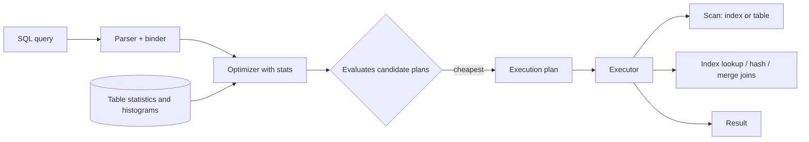

# Query Optimization / Planner

## 1. One-Line Definition
The query optimizer (planner) translates a declarative query into a physical execution plan — choosing join orders, index usage, and access paths — so that identical SQL can run 1000x faster or slower purely based on that plan, which makes understanding it the highest-leverage database-performance skill.

## 2. Why Do We Need It?
Users write what they *want*, not how to *get it*. Without an optimizer, the database would execute queries in source order, joining tables innermost-first with full scans — usable for a toy database, lethal at millions of rows. The optimizer turns "give me all orders for these customers" into the cheapest sequence of index seeks, joins, sorts, and hash lookups, and it is the mechanism behind EXPLAIN plans.

## 3. Simple Intuition
A delivery driver doesn't drive the route in the order addresses were listed on the form; they sort by neighborhood and sweep. The planner is that driver: it measures the street lengths (row counts), the shortcuts (indexes), and produces the order that takes the fewest minutes (I/O) — even though the customer specified the same destinations.

## 4. What Happens Without It?
Every query full-scans every table involved, joins in the worst order, sorts instead of using an index, and re-scans correlated subqueries key by key. A query that should read 20 rows reads 20 million. Users see multi-second p99s, the DB saturates IO, and nothing changed except the data size — the classic "it was fine until last month" query regression.

## 5. Core Idea
- **Parse → bind → plan:** the optimizer rewrites the query (predicate pushdown, view inlining, subquery decorrelation), then enumerates candidate plans and costs each with statistics (row counts, histograms, index selectivity, correlation).
- **Access path:** index seek, index scan, or full table scan — decided by predicate shape and selectivity (see [[database-indexing|Database Indexing]]).
- **Join strategies:** Nested Loop (fine for tiny outer, each row probes inner via index), Hash Join (build a hash table on one side, probe with the other; no index needed), Merge Join (both sides sorted; merges in order).
- **Join order:** the optimizer picks which pair to join first; wrong order makes the intermediate result blow up exponentially. Statistics decide.
- **EXPLAIN:** the human interface — the plan shows every access path, join, and the optimizer's estimated cost/rows. Always validate planner assumptions against reality.
- **When the optimizer guesses wrong** (stale stats, correlated columns, missing stats on expressions), the plan is bad — you then hint, ANALYZE, or restructure.

## 6. Important Terminology

| Term | Simple Meaning |
|------|----------------|
| Plan / execution plan | The concrete steps to run a query (indexes, joins, sorts) |
| Cardinality estimate | Optimizer's guess of rows produced at each step |
| Selectivity | Fraction of rows a predicate filters out |
| Nested loop join | For each outer row, probe the inner (needs inner index) |
| Hash join | Build hash table on smaller side, probe with larger |
| Merge join | Binary-merge two already-sorted inputs |
| Predicate pushdown | Filtering earlier in the plan so less data flows on |
| EXPLAIN / ANALYZE | Show the plan (and actually run it for real row counts) |
| Parameter sniffing | Plan compiled for the first-seen value can be wrong later |
| Query hints | Forcing a specific join or index against the optimizer |

## 7. Basic Architecture



## 8. Request or Data Flow
1. The query is parsed and bound to real tables/columns.
2. The optimizer asks the catalog for statistics (table size, index selectivity, histograms) and enumerates plans: which order to join, seek vs scan per table, whether to sort.
3. It picks the lowest *estimated* cost plan and hands it to the executor.
4. The executor runs scans, joins, and filters; if the estimates were wrong, the plan performs poorly — that is when you EXPLAIN and fix the input (stats, index, hints, rewrite).

## 9. Practical Example
**Order-reporting service (assumptions):** `orders` has 50M rows index `(customer_id, created_at)`; `customers` has 1M rows.
- Query: "orders for customer 1234 in the last month, joined to customer name".
- Bad plan: full-scan orders (50M rows), join with customers by scanning it (1M), sort. Latency: seconds, 51M row reads.
- Good plan: seek `customer_id=1234` and range on `created_at` (~2K rows), index probe on customers PK (1 access), merge by created_at order. Latency: milliseconds, tens of row reads.
- The join order and access path turn a 1000x difference — not the SQL language, the plan.

## 10. Scaling
- **Statistics freshness:** as tables grow and data skews, stale stats mislead the optimizer — schedule ANALYZE and watch plan drifts after large loads.
- **Wide/sparse queries:** anything not covered by an index makes the plan fan out rows; keep hot templates slim (covering indexes).
- **Parameter sniffing:** a plan compiled for a rare first value can be wrong for the common one; mitigate with recompile, plan guides, or range-widening rewrites.
- **Vertical scale:** optimizer cost models assume one node; across shards the plan itself changes — see [[sharding|Sharding]] and avoid global joins.
- **Budget plans:** treat "query is slow" as a plan problem first — EXPLAIN before adding hardware or an index.

## 11. Reliability and Failure Scenarios

| Failure | What Happens | Detection | Recovery |
|---------|--------------|-----------|----------|
| Stale statistics | Wrong join order, huge intermediates | EXPLAIN rows vs actual | ANALYZE, monitor plan regressions |
| Parameter sniffing | Same query, wildly different latency | Latency clusters by value | Recompile/plan-guides, generic plans |
| Missing stats on expression | Cardinality guess 10x off | Estimate vs actual disparity | Expression indexes, extended stats |
| Planner chooses scan despite index | Sudden slow p99 | EXPLAIN shows seq scan | Fix predicate shape, hint carefully |

## 12. Consistency and Correctness
The optimizer never changes *what* a query returns, only *how* quickly — correctness lives in the executor's isolation semantics (see [[transactions-and-acid|Transactions and ACID]]). One subtlety: reads at different isolation levels can see different snapshots, so a "faster plan" must not change which rows a REPEATABLE READ snapshot sees. Ordering of sorts, ties, and floating-point aggregations can differ across join orders — matters only for exact-value contracts.

## 13. Performance
- A well-planned query does log-scale I/O (index seeks, ~tens of buffers). A bad one scans everything: O(n) per table, plus a sort.
- Hash joins need memory for the build side; overspill to disk multiplies I/O. Nested loops are great when the outer is tiny (~hundreds) and the inner is indexed.
- Covering indexes and predicate pushdown remove work entirely instead of making it faster — the largest accessible wins (see [[database-indexing|Database Indexing]]).

## 14. Security
EXPLAIN and plans can leak shape/volume data to users with read access — restrict plan visibility to DBAs (analyzers/insights features are DBA-grade). Planner inputs (statistics) must come from trusted internal sources; nobody untrusted should trigger expensive ANALYZE on large tables (a resource-exhaustion vector, same as unvetted `CREATE INDEX`).

## 15. Trade-Offs

| Choice | Advantages | Disadvantages | When to Use |
|--------|------------|---------------|-------------|
| Trust optimizer | Adaptive, no code cost | Wrong on stale/bad stats | Typical OLTP |
| Regex/query rewrite | Fixes the shape of the problem | Maintenance, may break semantics | Predicate pushdown, decorrelation |
| Hints/plan guides | Force a known-good plan | Hard-codes today's schema/stats | Faceplate irreversible planner errors |
| Index-based access | Orders of magnitude faster | Write cost (see indexing) | Hot read templates |
| Disable-specific features | Predictable behavior | Loses optimizer features | Specialized appliances |

## 16. Common Mistakes
- "We added an index; the slow query is fixed" without re-checking the plan (index may be unused).
- Judging a query slow without EXPLAIN — guessing at scans, joins, sorts.
- Rewriting a query when the actual fix is a planner stat or predicate shape.
- Forgetting the optimizer is estimates-driven: correlated columns (city + zip) give wild cardinality errors.
- Over-using hints so the schema can't evolve without breaking plans.

## 17. HLD vs LLD Boundary
HLD: index/statistics strategy per hot template, EXPLAIN-review in deploy gates, parameter-sniffing policy, avoiding cross-shard joins in the plan. LLD: writing one query, one EXPLAIN diagnostic, one covering-index migration, one hint.

## 18. Interview Questions

### Beginner
- What does EXPLAIN show you and why is it the first step?
- Why can the same SQL produce two very different execution strategies?

### Intermediate
- A join is slow. How do you decide whether to add an index vs change join order?
- What makes a join plan turn a 2-row answer into a 2-million-row intermediate?

### Advanced
- Design the optimizer inputs (statistics, histograms, selectivity) for a 100x user table with a skewed tenant column.
- Your p99 spiked after a schema change but the query text didn't change. Diagnose the plan-level cause and two fixes.

## 19. Interview Memory Summary

> [!abstract]- Interview Memory Summary

### Remember

- Planner = parse, bind, cost with statistics, pick cheapest plan.
- Access paths: index seek, index scan, full scan — selectivity decides.
- Joins: nested loop (small outer + indexed inner), hash (build + probe), merge (sorted inputs).
- Join order is the explosion point — intermediate size decides.
- EXPLAIN is the truth each time, not beliefs from last year.
- Stale stats and parameter sniffing are the two silent plan-killers.

### 30-Second Explanation

Run EXPLAIN first: read which access paths and join orders the optimizer chose, then check whether they match reality (an index seek for a selective predicate, a hash join on the smaller side). Fix the input — stats, index, predicate shape — before touching SQL or hardware, and add plan-review to deploys.

### Interview Traps

- Claiming "it's fixed" without a plan diff.
- Blaming SQL when it's the stats/index/plan.
- Ignoring that hash joins need memory and overspill to disk.
- Trusting "the optimizer is smart" in the face of stale statistics.

### Key Trade-Off

You buy optimal execution by investing in the planner's inputs — current statistics, selective indexes, sane query shapes — and anything that misleads those inputs silently converts a fast plan into a full scan.

## 20. Related Concepts

### Prerequisites

- [[database-indexing|Database Indexing]] — the access paths the planner chooses between.
- [[database-keys|Database Keys]] — primary keys and how they shape index choices.

### Commonly Used Together

- [[database-fundamentals|Database Fundamentals]] — planning sits inside every engine.
- [[database-connection-pooling|Database Connection Pooling]] — pooled waits hide planner spills.
- [[oltp-vs-olap|OLTP vs OLAP]] — short indexed plans vs long analytic scans.

### Alternatives

- [[data-warehouse-lake|Data Warehouse and Data Lake]] — where "slow join" queries belong instead.
- [[normalization-vs-denormalization|Normalization vs Denormalization]] — denormalizing to kill joins the planner can't fix.

### Advanced Concepts

- [[sharding|Sharding]] — global joins vanish; the planner's problem changes to scatter-gather.
- [[latency-vs-throughput|Latency vs Throughput]] — what a good plan contributes to each.

## 21. References
PostgreSQL and MySQL optimizer/EXPLAIN docs (current versions), plus the classic "use the index, Luke!" guidance. Kleppmann ch. 3 covers access paths. Re-verify statistics and hint syntax against your engine's docs.

## 22. Active Recall

Test yourself before revealing each answer.

> [!question]- Basic understanding: why can two identical SQL strings run 1000x apart?
> Because the text isn't the plan. The optimizer (with statistics) independently picks access paths, join order, and strategies; stale stats, a missing index, or parameter sniffing each produce a plan that reads 50M rows instead of 2K.

> [!question]- Design decision: which join strategy for a 5-row outer and a 50M-row indexed inner?
> Nested loop — for each of the 5 outer rows, one index probe on the inner. A hash join would build a huge hash table unnecessarily; a merge join would sort a side that's already tiny.

> [!question]- Trade-off: index vs query rewrite to fix a slow correlated subquery.
> An index makes the probe cheap but doesn't change the shape; rewriting to a join (or LATERAL/window) lets the planner decorrelate and possibly skip expensive per-row evaluations. Usually both: fix the shape, then index what remains.

> [!question]- Failure scenario: overnight load and the app's main query suddenly full-scans despite an index.
> The index exists but isn't chosen — nearly always a predicate-shape or statistics problem (leading-wildcard LIKE, function-wrapped column, or the histogram missed the new value range). EXPLAIN shows why; ANALYZE and normalize the predicate.

> [!question]- Interview scenario: p99 spiked after a deploy with no SQL change. Diagnose.
> Check the plan of the hot query in the new environment: schema changes (new index, altered stats, new partition) shifted the optimizer's choice. Fix the input — fresh stats, plan-guide, or predicate cleanup — not the kitchen-sink SQL.

> [!question]- Interview scenario: "Why is our analytics query slow on the OLTP DB?" 
> Because the planner built joins/aggregations for interactive workloads; an analytic scan over the same tables wants a columnar/Warehouse shape (see [[oltp-vs-olap|OLTP vs OLAP]]). The right fix is often moving the query, not tuning the planner.

## 23. When Should I Use This?

### Use it when

- A query is slow and you are about to guess why — run EXPLAIN first.
- You are adding an index, rewriting a query, or changing schema and want to prove impact.
- You are designing the DB-maintenance story (statistics freshness, plan review).

### Avoid it when

- The bottleneck is connection churn, locking, or resource saturation — plans matter after those are stable.
- You are hand-forcing hints on every query; prefer fixing the inputs (stats, indexes).

### What problem does it solve?

The problem: identical user intent can be executed by million-dollar plans or million-row scans. Bottleneck: the optimizer guesses from statistics, and wrong guesses cost exponentially. Solution: give the planner fresh stats and selective indexes, read the plans it actually makes, and review them at deploy time.

### What problem does it NOT solve?

It doesn't fix missing resources (RAM, disks), contention in the concurrency layer, or query shapes that are analytic against an OLTP store — those need retry/lock strategy or a warehouse. It also cannot make a no-index full scan fast; you still need indexes and clean predicates.

## 24. Decision Connections

Decisions that go together with Query Optimization:

- [[database-indexing|Database Indexing]] — the core lever the planner's access-path decisions use.
- [[database-keys|Database Keys]] — clustered/PK design determines what seek paths exist.
- [[database-fundamentals|Database Fundamentals]] — planner behavior differs by engine; know yours.
- [[database-connection-pooling|Database Connection Pooling]] — a slow plan under pools amortizes poorly across waits.
- [[normalization-vs-denormalization|Normalization vs Denormalization]] — removing joins the planner can't cheaply resolve.
- [[oltp-vs-olap|OLTP vs OLAP]] — knowing when a plan belongs on another engine.
- [[latency-vs-throughput|Latency vs Throughput]] — what a healthy plan buys in each metric.

Decision tree:

```
Slow query?
    |
    +-- First: EXPLAIN
    |      +-- Seq scan on a huge table?    → index or predicate shape
    |      +-- Wrong join order?            → stats fresh? ANALYZE
    |      +-- Hash join spilling?          → memory or join rewrite
    |
    +-- Estimator believes vs reality wrong?
    |      → stale stats / correlated cols → ANALYZE, extended stats
    |
    +-- Same SQL, variable latency?
    |      → parameter sniffing → plan guides / recompile policy
    |
    +-- Cannot fix the plan at all?
    |      → [[normalization-vs-denormalization|Normalization vs Denormalization]]
    |      → [[oltp-vs-olap|OLTP vs OLAP]] if analytic
```