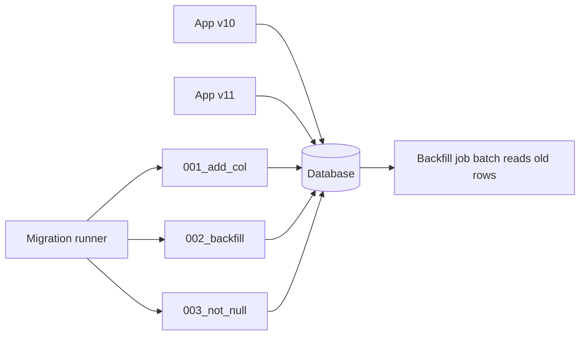

# Schema Migration / Evolution

## 1. One-Line Definition
Schema migration (evolution) is the controlled, ordered, reversible-enough changing of a database's structure — adding/removing columns and constraints, renames, splits — executed safely against a live system so old code, new code, and in-flight data all stay consistent, roll-forward without downtime, and never corrupt the old rows.

## 2. Why Do We Need It?
Applications evolve; schemas must follow, but a 1B-row table cannot tolerate a naive `ALTER`. Migration is the discipline that keeps schema version N and application version N+1 interoperating during rolling deploys, lets the DB change while writes keep flowing, and makes rollback an option instead of a religious belief. Every product feature eventually means a column, table, or constraint change — the question is only whether it happens by design or by incident.

## 3. Simple Intuition
Renovating an office building while employees keep working: you don't knock out a load-bearing wall and leave everyone to navigate the rubble. You stage changes floor by floor (expandable columns first), keep doors usable in between (dual reads/writes), and only remove the old stairwell once nobody uses it. Migrations are the construction schedule — sequenced, reversible, tested against a live workforce.

## 4. What Happens Without It?
Two flavors of disaster: a "big bang" migration locks the table for hours (production freezes), or ad-hoc ALTERs pile up with no ordering (nobody knows which schema the DB has). Old application versions crash on missing columns, new versions crash on unknown ones, backups no longer match the current structure, and "rollback" means restoring from tape. Small feature → full incident.

## 5. Core Idea
- **Versioned migrations:** every change is a sequential, tested, forward-only change-set (001_..., 002_...) with a state record in the DB; tooling (Flyway, Liquibase, Django/Postgres ecosystem) tracks which ran.
- **Expand-contract (expand → migrate → contract):** make the schema accept both shapes first (add column, backfill it), keep writing both paths, then remove the old — the rolling-deploy-safe recipe.
- **Backward compatibility:** new schema must be readable by old code and vice versa — add-not-require-first, never drop before both sides are done (see [[api-versioning|API Versioning]] for the same rule up the stack).
- **Data backfills:** a new column with a default is cheap; deriving it from existing rows is a migration job of its own — do it in batches, monitor, and only then make it NOT NULL.
- **Lock avoidance:** most ALTERs on big tables lock (Postgres add-column-with-default, MySQL InnoDB DEFAULT, index rebuilds). Use online DDL, renaming trick (create new table, double-write, swap, drop), or dual-read until cutover.
- **Pitfall-aware randomness:** renames, type changes, and NOT NULL additions are the risky ones; constraint additions (FK, unique) rebuild/lock huge ranges.

## 6. Important Terminology

| Term | Simple Meaning |
|------|----------------|
| Migration / change-set | One versioned, ordered schema change |
| Expand-contract | Add both shapes, migrate data, then drop the old |
| Backfill | Populating a new column from existing data |
| Online DDL | ALTER that runs without blocking reads/writes |
| Lock-free swap | Build new table, double-write, switch reads, drop |
| Dual read/write | Writing to old+new shape during transition |
| NOT NULL / FK addition | Constraint changes that lock large ranges |
| Rename | Dangerous op — breaks every run-time query referencing it |
| Rollback migration | A documented down-migration, often optional |
| Squash | Collapsing many old migrations for fresh databases |

## 7. Basic Architecture



## 8. Request or Data Flow
1. A feature needs a new `discount` column: migration 001 adds it nullable with a default (no lock, old code still works).
2. 002 backfills existing rows in batches; 003 sets NOT NULL once backfill is verified.
3. Deploy order: the new app version reads/writes the new column first, old version unaffected (both see it).
4. On release the old column is dropped only after every running version has moved — contract phase completes last.

## 9. Practical Example
**Payments service (assumptions):** 200M-transactions table, `status` string needs to become a proper enum-like type; rolling deploys run two app versions.
1. Expand: add `status_code int` nullable; app writes both `status` and `status_code` (dual write).
2. Migrate: batch job converts existing `status` → `status_code` in 10K-row batches, tolerant of writers (it locks per batch, retries conflicts).
3. Contract: once reads depend only on `status_code`, drop the old column in a maintenance window, rolling back to dual-write if anything misbehaves.
Numbers: backfill 200M rows at 10K rows/sec ≈ under an hour in the background, zero downtime, zero app-stall.

## 10. Scaling
- Big-table ALTERs dominate the cost — online-DDL (indexes, DEFAULT) vs staged-table-build for the rest; keep migrations in terms of "how long will this lock for".
- Backfills are a throughput job: batch size vs lock duration vs replication lag (see [[database-replication|Database Replication]]) — a 1M-row UPDATE per batch keeps replicas from dragging.
- Many services/microservices each own a schema: per-service migrations, no shared-table ALTERs, and a registry to prevent two teams changing the same table.
- Fresh installs use squashed migrations so a 4-year-old change-set still runs in seconds.

## 11. Reliability and Failure Scenarios

| Failure | What Happens | Detection | Recovery |
|---------|--------------|-----------|----------|
| Backfill crashes midway | Partial data | Version marker + batch log | Resume idempotently |
| ALTER holds lock hours | Reads block, timeouts | Lock-wait alerts | Kill, use online DDL/swap |
| New code hits old schema | Missing-column SQL errors | Deploy/version skew | Dual-write path, hold releases |
| Constraint addition fails | Duplicate rows violate unique | Constraint error | Pre-clean dupes, retry |
| Rollback needed | Old app vs new schema | Feature-flag off | Contract never dropped yet |

## 12. Consistency and Correctness
- Migrations must be idempotent-enough to resume from mid-failure; the version table is the source of truth.
- Expand-contract keeps *both* readers correct during the transition — old code, new code, and in-flight requests all see a valid shape.
- Backfills and app writes race: prefer "backfill idempotent re-run" over "write both with cross-checks".
- A migration that changes semantics (retype status) can silently reinterpret old rows — verify row conversions in pre-production on a cloned-schema dataset.

## 13. Performance
- Cost metrics: lock duration, rows per batch, rejection rate under load, replica lag during backfill.
- Online DDL (typed add default, index) runs in the background but still consumes IO/CPU — budget it.
- The cheapest fix is usually shape-first: make the schema accept both shapes before the data movement and the phase-out, so every phase is simple rather than one heroic ALTER.

## 14. Security
Schema changes must ride an audited pipeline: who ran which ALTER, when, and with what rollback — unvetted DDL on a big table is a DoS vector (see [[database-indexing|Database Indexing]] on the same theme). Never put secrets in migration defaults or migration scripts committed to repos; encrypt data-classified columns during the migration, not after.

## 15. Trade-Offs

| Approach | Strengths | Costs | When to Use |
|----------|-----------|-------|-------------|
| Online DDL in place | Simple, no schema churn | Slow on huge tables, long lock | Most additive changes |
| Expand-contract | Zero-downtime, reversible | Dual-write complexity | Any table right on the hot path |
| New table + swap | Clean, lock-free | Double-write forever, app complexity | Risky type/constraint changes |
| Big-bang (offline) | Simplest mental model | Downtime proportional to table size | Low-traffic tables, maintenance windows |
| Squashed fresh installs | Fast cold starts | Divergence from prod history | CI, new environments |

## 16. Common Mistakes
- Dropping the old column "to save space" while old code still runs — instant crash on the next deploy.
- Adding NOT NULL with a default on a big table assuming it's lock-free in the engine you chose.
- Backfilling in one giant UPDATE → lock + replica lag + retry storms.
- Renaming a column and updating only some queries; a hand-written SQL string you missed breaks at runtime.
- No rollback path at all — priming for the "impossible" restore-from-backup conversation.

## 17. HLD vs LLD Boundary
HLD: migration strategy per schema (online vs swap vs offline), backfill sizing, deploy/release ordering, squashing cadence, ownership of shared tables. LLD: one migration file's SQL, the batch backfill loop for one column, one FK addition's lock budget.

## 18. Interview Questions

### Beginner
- What does expand-contract mean, and why is it safe for rolling deploys?
- Why is a NOT NULL addition riskier than adding a nullable column?

### Intermediate
- Design a zero-downtime migration that replaces a wide `status` string with a typed code on a 200M-row table.
- A backfill job keeps getting blocked by users. Fix the batch/lock/retry interplay.

### Advanced
- Predict the lock and lag profile of an index build on a hot 1B-row table and design the safe sequence.
- Your team must rename a column used by four services. Walk the ordering that avoids any downtime.

## 19. Interview Memory Summary

> [!abstract]- Interview Memory Summary

### Remember

- Migrations are versioned, ordered, reversible-enough change-sets.
- Expand-contract: accept both shapes, move data, then drop.
- Add non-required first; NOT NULL/FK/rename are the risky ops.
- Backfills are batch jobs with locks + replica-lag budgets.
- Deploy order is part of the migration — apps lag the schema by design.
- Rollback is a decision, made easy by never dropping early.

### 30-Second Explanation

Treat every schema change as a phased operation: expand (add nullable column or new table), migrate (batched backfill with idempotent re-runs), contract (drop the old shape only when all versions moved). Choose online DDL for additive changes and new-table+swap for the risky ones, and size backfill batches against lock duration and replication lag.

### Interview Traps

- "I added the column, done" — forgetting backfill + NOT NULL + rollback path.
- Assuming `ADD COLUMN ... DEFAULT` is lock-free in every engine.
- Dropping columns before every running app version is off it.
- One giant backfill UPDATE on a live table.

### Key Trade-Off

The cheaper the migration (additive, nullable, online) is the slower it gets data-complete; the faster it is (big ALTER, drop) the more availability it risks — so you trade backfill-work and dual-write complexity for zero downtime.

## 20. Related Concepts

### Prerequisites

- [[database-fundamentals|Database Fundamentals]] — DDL and schema semantics.
- [[database-keys|Database Keys]] — the constraints migrations create.

### Commonly Used Together

- [[api-versioning|API Versioning]] — the same expand-contract rule at the service boundary.
- [[deployment-strategies|Deployment Strategies]] — rolling releases determine which versions coexist.
- [[database-replication|Database Replication]] — backfills must not outrun replicas.

### Alternatives

- [[normalization-vs-denormalization|Normalization vs Denormalization]] — modeling changes create migrations.

### Advanced Concepts

- [[outbox-pattern|Outbox Pattern]] — a migration-safe way to publish data changes onward.
- [[immutable-storage|Immutable Storage]] — when old shapes must never change, append instead.

Related planned topics (not authored yet): CDC-based data migration, backward-compatibility contracts, event-versioning for outbox payloads.

## 21. References
Flyway and Liquibase docs (migrations), PostgreSQL "DDL in production" and online-DDL guidance, MySQL ALTER TABLE algorithm docs. Kleppmann ch. 3 covers storage-level implications; verify lock behavior per engine version.

## 22. Active Recall

Test yourself before revealing each answer.

> [!question]- Basic understanding: why is adding a nullable column cheap and adding NOT NULL not?
> A nullable column with a default touches only the catalog — no row rewrite, no lock. A NOT NULL constraint requires either validating existing rows (scan + possible lock) or a backfill first; the moment you change a column's invariants you're rewriting rows instead of declaring them.

> [!question]- Design decision: replace a status string with a typed code on a hot 200M-row table.
> Expand: add nullable `status_code`; dual-write both fields. Migrate: batch-convert `status`→`status_code` at 10K rows/batch, idempotent, tolerant of concurrent writers. Contract: reads switch, then drop `status` in a window. Rollback = stop the contract phase.

> [!question]- Trade-off: online DDL vs new-table swap for a big index build.
> Online DDL keeps the app on one table (simple wiring) but consumes background IO/CPU for hours with a possible lock window. New-table + swap is lock-free and clean but requires dual-writes until cutover and a second schema to maintain — worth it only for truly risky changes.

> [!question]- Failure scenario: backfill keeps stalling when users are active. Diagnose + fix.
> Batch locks conflict with live transactions, and the retry loop is naive. Fix: smaller batches with lock-wait timeouts and rejection-based retry with backoff, run during a predicted lull, and make the job resumable by an idempotency marker (re-run skips done rows).

> [!question]- Interview scenario: must rename `created` → `created_at` across four services.
> Phase it: add `created_at` alongside (expand), backfill and dual-write, move services one at a time in deploy order, verify reads, then contract-drop `created` only after the last service ships — never rename the column the same day you release.

> [!question]- Interview scenario: "We can just recreate the table; it's only 2M rows." 
> For 2M rows offline-in-window that's fine. The discipline is the same as big tables: versioned change-set, backfill, both-readers-valid state, rollback path — so the cheap version is a squashed, tested migration, not a recreate-by-hand.

## 23. When Should I Use This?

### Use it when

- Any ALTER must run against a live, traffic-carrying database.
- Rolling deploys mean two app versions run the same schema.
- You need a repeatable, auditable way for teams to evolve shared storage.

### Avoid it when

- The table is a temporary mismatch — fix the code, not the schema.
- You can't run the migration twice idempotently (design it so you can).
- A "recreate from upstream" is genuinely cheaper (dev/test DBs) — then squash, still keep it versioned.

### What problem does it solve?

The problem: live databases must change shape while apps keep serving. Bottleneck: naive DDL locks, backfills throttle, old/new code drift. Solution: ordered, idempotent change-sets with expand-contract, batched backfills, online-DDL/swap choices — schema and app evolve together with a rollback contract.

### What problem does it NOT solve?

It does not fix application-level compatibility issues (that's API versioning and code), does not make two teams editing one table safe (ownership does), and cannot make an inherently locking migration lock-free — it only lets you choose the least-disruptive container for it.

## 24. Decision Connections

Decisions that go together with Schema Migration:

- [[api-versioning|API Versioning]] — the service-facing mirror of expand-contract.
- [[deployment-strategies|Deployment Strategies]] — which app versions coexist decides the contract window.
- [[database-replication|Database Replication]] — backfill and DDL must be replica-lag-aware.
- [[database-keys|Database Keys]] — constraints added or removed by the migration.
- [[normalization-vs-denormalization|Normalization vs Denormalization]] — the modeling change behind many migrations.
- [[outbox-pattern|Outbox Pattern]] — publishing schema-relevant events without transactional coupling.
- [[immutable-storage|Immutable Storage]] — append-style evolution when rewriting is expensive.

Decision tree:

```
Schema change on a live system?
    |
    +-- Additive, nullable, no data derivation?
    |      → online DDL add (cheap)
    |
    +-- Needs derived/backfilled values?
    |      → expand (add nullable) → batch backfill → NOT NULL
    |
    +-- Rename / type change / risky constraint?
    |      → dual-write to new shape → swap reads → drop old
    |
    +-- Big index build?
    |      → online DDL or new-table swap, budgeted IO
    |
    +-- Low-traffic maintenance window available?
           → offline migrate (squashed, still versioned)
```