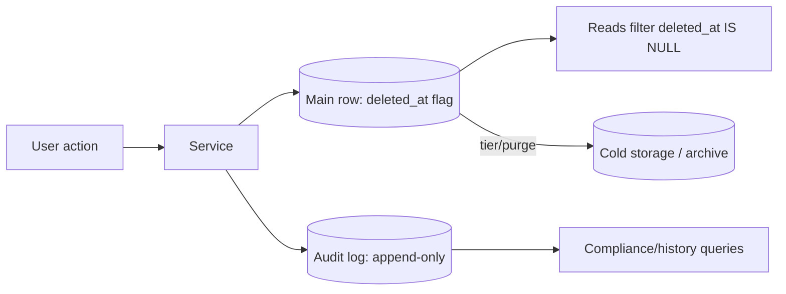

# Soft Delete / Audit Tables

## 1. One-Line Definition
Soft delete marks a row as deleted with a flag/`deleted_at` instead of removing it, and audit tables (or log stores) append an immutable record of what changed, when, and by whom — so deletion is reversible, history is queryable, and "what happened" is never destroyed with the row.

## 2. Why Do We Need It?
Users mis-click delete; regulations (GDPR, SOX, finance) require you to prove what happened; debugging "who changed this?" needs a trail that outlives the current row state. Hard DELETE destroys both the record and its history in one statement. Soft delete + audit gives you recoverability, forensics, undo, and compliance reporting — the two mechanisms solve "a row that shouldn't have vanished" and "who did what to a row that still exists".

## 3. Simple Intuition
- **Soft delete:** putting a file in the recycle bin instead of shredding it — the file is "gone" from listings, still restorable, still physically there.
- **Audit table:** a notary's ledger — every deed copy is appended with who signed it and when, so later investigation reads the ledger, not the current deed.

## 4. What Happens Without It?
A support ticket: "I deleted my project by mistake" — no way to restore, because the row is gone. A compliance audit: "show us who updated these balances in March" — the balance is current, the history evaporated. A bug: "the status flips on its own" — hard deletes and silent updates leave no trail by which to answer. Every one of these is a 30-minute fix later, or a legal problem sooner.

## 5. Core Idea
- **Soft delete pattern:** a `deleted_at timestamp NULL` (or `is_deleted` + audit added in tandem) column; queries filter `WHERE deleted_at IS NULL`; "restore" is `UPDATE deleted_at = NULL`. Composite PK or business-unique constraints must include the deleted marker so re-creating doesn't collide.
- **Audit tables:** each mutate (INSERT/UPDATE/DELETE for a business key) appends a row: entity id, old values, new values, actor, timestamp, source request id. Append-only, nothing overwritten — the closest the relational world gets to [[immutable-storage|Immutable Storage]] for rows.
- **Where it lives:** same-DB audit table (transactional, cheap, adds write load/space), shadow/log table per entity (cheap), or an append-only event store/log-broker (decoupled, replayable — see patterns like the outbox).
- **Retention interplay:** soft-deleted rows and audit logs both grow forever — tier them ([[storage-tiering|Storage Tiering]]) and honor real-delete/redaction obligations (GDPR erasure) while keeping the audit trail legally required.

## 6. Important Terminology

| Term | Simple Meaning |
|------|----------------|
| Soft delete | Flag/`deleted_at` marks a row deleted instead of removing it |
| Hard delete | Physical removal of the row |
| Tombstone | Any marker that a row existed but is gone |
| Audit record | Immutable append: what/actor/when for one change |
| Actor / principal | The user or service that made the change |
| Immutable/append-only | Never updated or deleted once written |
| Retention policy | How long soft-deleted and audit data must live |
| Purge job | Batch hard-deletes of expired soft-deleted rows |
| Redaction | Scrubbing PII from retained data without breaking the audit |
| CDC | Change-data-capture feeding audit-like logs automatically |

## 7. Basic Architecture



## 8. Request or Data Flow
1. User "deletes" a project: service sets `deleted_at = now()` (soft) and appends an audit row (entity=project, action=delete, actor, new deleted_at).
2. Reads apply the filter; the row disappears from listings but still exists.
3. Support wants restore: an update clears `deleted_at`, another audit row records the restore.
4. Compliance asks who changed it: search the audit table, that's the trail; retention then tiers old soft-deleted rows to cold storage.

## 9. Practical Example
**Collaboration tool (assumptions):** 40M docs, 200K soft-deleted docs/month, 30-day compliance window.
- `docs` table: `deleted_at`; `doc_versions` table: one append per save (author, timestamp, patch).
- Listing query: `WHERE deleted_at IS NULL AND ...` on a partial index `(id) WHERE deleted_at IS NULL` → index stays tiny (see [[database-indexing|Database Indexing]]).
- Compliance: "which users touched doc X in Q1" = a range scan on `doc_versions` by doc id + time, no data destroyed.
- After 90 days the purge job hard-deletes expired soft-deleted docs to archive, and the audit references survive under the legal retention.

## 10. Scaling
- The `deleted_at IS NULL` filter is why partial/functional indexes exist — a global index on `deleted_at` helps the purge job, but the listing filter needs the sparse index.
- Soft-deleted rows accumulate: a delete-heavy system is actually a growing storage system; budget the tier.
- Audit log grows at write rate × row size — separate it from hot reads (separate table/log store), batch-write it (append-friendly), and tier by age.
- Purge/archive jobs must run with the same batch discipline as backfills (locks, replica lag).

## 11. Reliability and Failure Scenarios

| Failure | What Happens | Detection | Recovery |
|---------|--------------|-----------|----------|
| Purge job removes too much | Real data loss | Reconciliation counts | Backups/archive; throttle job |
| Audit write dropped | Missing trail | Trail gap detection | Appends via same tx or outbox |
| Soft-deleted rows leaked | Listing shows deleted | Filter regression test | Fix predicate; review history |
| Unique-key collision after restore | Create blocked | Constraint error | Include deleted marker in uniqueness |
| Legal hold conflicts with purge | Erased despite need | Hold flags | Skip purge for held ids |

## 12. Consistency and Correctness
- Keep main-row mutation and audit append in the same transaction (or both through an outbox/broker with the same atomicity) or the trail and the row diverge.
- Soft delete vs real delete: read paths must be explicit about which to honor; GDPR-style erasure wants both gone, finance wants both retained — resolve per data class, not globally.
- Idempotent audit appends: a retried write can double-log if the key isn't `(entity, version/request id)` — dedupe by request id.
- Timestamps must be trustworthy (source of the clock) because they *are* the evidence.

## 13. Performance
- Listing with `deleted_at IS NULL` on a sparse partial index performs like a table that never grew — an index per active set.
- Soft delete writes are the same cost as an UPDATE +audit-row insert; audit writes maximize throughput with append ordering.
- History queries hit the audit table (write-optimized append order, id+time range seek) — keep them off the main row reads.

## 14. Security
Audit data often outlives the actor's account: separate access (only compliance/support, least-privilege), never let the audit table be editable by the same role that writes the main table. Encrypt classified fields in audit rows (see [[encryption-and-keys|Encryption and Keys]]). Erasure obligations must not delete the *audit of the erasure* — keep identifiers hashed so the trail survives redaction.

## 15. Trade-Offs

| Approach | Strengths | Costs | When to Use |
|----------|-----------|-------|-------------|
| Soft delete flag | Reversible, no schema break | Storage + filter discipline | Most product entities |
| Hard delete + backup | Simple schema | Irreversible | Data we're required to erase |
| Same-tx audit table | Transactional consistency | Write amplification on hot path | Money, low write-rate |
| Outbox/event audit | Decoupled, replayable | Eventually-consistent trail lag | High-write, non-ledger |
| Tier + purge | Bounded storage | Retention/legal risk if sloppy | Long-running products |

## 16. Common Mistakes
- Soft-deleting cascade children by flattening a row and losing dependent history.
- Filtering momentum: some queries forget `deleted_at IS NULL` → "deleted" data appears in reports (or support listings).
- No purge/retention at all — the database silently triples in size.
- Auditing only updates, not deletes or restores → a hole in the story.
- Using soft delete when regulations demand actual deletion.

## 17. HLD vs LLD Boundary
HLD: which entities are soft vs hard deleted, audit log placement (same-DB vs stream), retention/tiering policy, unique-key handling with tombstones, purge scheduling. LLD: the `deleted_at` column + one query filter, the transaction that writes the audit row, one redaction function.

## 18. Interview Questions

### Beginner
- What is the difference between soft delete and an audit table?
- Why does the `deleted_at IS NULL` filter need a special index?

### Intermediate
- Design soft delete + restore for a file-sharing service with unique document names. Where does the uniqueness break?
- How do you keep the audit trail consistent with the row change that triggered it?

### Advanced
- GDPR erasure meets mandatory audit retention: design the data-flow that satisfies both.
- Your purge job erased rows a legal hold required. What went wrong and what's the safety design?

## 19. Interview Memory Summary

> [!abstract]- Interview Memory Summary

### Remember

- Soft delete = reversible removal via flag/`deleted_at`.
- Audit = immutable append of what/actor/when per change.
- Keep audit + row mutation in the same transaction or an atomic outbox.
- Partial index on the active set keeps listing fast ([[database-indexing|Database Indexing]]).
- Retention/purge/tiering must be designed, or storage balloons.
- Legal erasure and audit retention are opposed — resolve per data class.

### 30-Second Explanation

Decide per entity: soft-delete the reversible ones, hard-delete the legally-erasable ones, and append an audit record within the same atomic unit for every mutation. Use a sparse index on the live set, separate audit storage from hot reads, and run purges with batch discipline and legal-hold awareness.

### Interview Traps

- Quietly forgetting one query's `deleted_at` filter, resurrecting deleted rows in reports.
- "Soft delete + no purge" = the table that never shrinks.
- Audit ledger not in the mutation transaction → trail diverging from truth.
- Applying soft delete where the law demands real erasure.

### Key Trade-Off

Soft delete and audit buy reversibility, forensics, and compliance at the cost of unbounded growth and storage/retention complexity, which you pay down with tiering and disciplined purge jobs.

## 20. Related Concepts

### Prerequisites

- [[database-keys|Database Keys]] — unique constraints interact with soft-delete tombstones.
- [[database-indexing|Database Indexing]] — the partial/functional index trick for the active set.

### Commonly Used Together

- [[immutable-storage|Immutable Storage]] — audit tables are the relational expression of append-only immutability.
- [[storage-tiering|Storage Tiering]] — aging soft-deleted and audit data to cold tiers.
- [[encryption-and-keys|Encryption and Keys]] — protecting classified columns in the audit trail.

### Alternatives

- [[data-patterns|Data Access Patterns]] — read models vs the write-side ledger.
- [[time-series-at-scale|Time Series at Scale]] — when history is really an append stream, TS-style storage fits.

### Advanced Concepts

- [[distributed-id-generation|Distributed ID Generation]] — ordering, dedupe keys for audit appends across nodes.
- Planned: event sourcing/CQRS — audit as the source of truth, not a side table.

Related planned topics (not authored yet): CDC-driven auditing, event-sourced audit, GDPR erasure pipelines.

## 21. References
PostgreSQL partial-index docs (the `WHERE deleted_at IS NULL` pattern), GDPR articles 17/30 (right to erasure vs audit records) with local counsel, and append-only audit guidance from cloud DB docs (CloudTrail, RDS audit logs). Verify retention-law specifics in your jurisdiction.

## 22. Active Recall

Test yourself before revealing each answer.

> [!question]- Basic understanding: what's the difference between soft delete and audit?
> Soft delete keeps the current row and marks it gone (reversibility). Audit records the *history* of changes as immutable appends (forensics/compliance). They answer different questions: "where did my doc go" vs "who changed it and when".

> [!question]- Design decision: file-sharing with unique doc names — why does soft delete break uniqueness?
> If uniqueness is on the bare name, restoring a deleted "report.pdf" collides with a newly created "report.pdf". Fix: unique on `(name, deleted_at)` treating NULL as its own value, or a separate tombstone that holds deleted names, so the active set and the grave set never collide.

> [!question]- Trade-off: same-transaction audit vs outbox-driven audit.
> Same-tx: trail is guaranteed consistent with the row at write cost and coupling to the hot path. Outbox: decoupled and replayable, but the trail can lag the row. For money/low-write-rate pick same-tx; for high-write non-ledger, stream it.

> [!question]- Failure scenario: the purge job erased data under a legal hold. What failed?
> Purge wasn't hold-aware: it should skip any entity id on a legal-hold list, and the policy must be enforced at the boundary of the job (a cut, not a review). Defense: hold flags checked before each batch, reconciliation counts, and never purge what the policy hasn't cleared.

> [!question]- Interview scenario: GDPR right-to-erasure vs mandatory financial audit records. Design it.
> Separate the obligations per data class: personal metadata is hard-deleted and redacted (hashed actor ids remain), while transaction-level audit records without identifying payloads survive fully hashed. The deletion itself is audited (who asked, when, which ids) without storing the deleted payload.

> [!question]- Interview scenario: the main employee list query began returning deleted employees in reports. Root cause?
> One code path dropped the `deleted_at IS NULL` predicate — the classic soft-delete leak. Fix at three levels: the query contract (DAO always applies the filter), a partial index that makes the filter the only fast path, and a regression test asserting deleted rows never appear.

## 23. When Should I Use This?

### Use it when

- Deletion mistakes are user-experience-critical and restore is a feature.
- Compliance, forensics, or debugging demands a change history.
- "Who did what, when" is a product or legal requirement.

### Avoid it when

- The law requires real erasure (preserve only per-obligation).
- The data is ephemeral/derived (logs re-derivable — delete freely).
- You have no retention/purge plan — soft delete without purge is a growing tax.

### What problem does it solve?

The problem: deletion destroys reversibility and history in one statement, and mutations leave no trail. Bottleneck: every "oops" is unrecoverable and every "who did this" is unanswerable. Solution: soft-delete flags for reversible removal plus append-only audit within the same atomic write, with sparse indexes and tiered retention so neither idea bankrupts storage.

### What problem does it NOT solve?

It does not make deletion regulatory-compliant by itself (erasure vs retention are per-jurisdiction engineering), does not prevent queries that forget the active-set filter, and does not make audit growth free — tiering and purging are mandatory, not optional.

## 24. Decision Connections

Decisions that go together with Soft Delete / Audit Tables:

- [[database-keys|Database Keys]] — unique constraints are the soft-delete collision risk.
- [[database-indexing|Database Indexing]] — partial indexes keep the live set fast.
- [[immutable-storage|Immutable Storage]] — the paradigm audit tables implement on rows.
- [[storage-tiering|Storage Tiering]] — aging soft-deleted + audit data to cheaper tiers.
- [[data-patterns|Data Access Patterns]] — when read models diverge from the write-side truth.
- [[distributed-id-generation|Distributed ID Generation]] — dedupe/order keys that audit appends need.

Decision tree:

```
Does deleting a row need to be reversible?
    |
    +-- Yes (user data, mistakes, restore UX)
    |      → soft delete + audit in same tx
    |         +-- Unique names?      → unique on (name, deleted_at)
    |         +-- Listing hot?       → partial index on active set
    |         +-- Legal erasure?     → redaction/purge per data class
    |
    +-- No (laws require deletion / ephemeral derived data)
    |      → hard delete, log deletion events
    |
    +-- Do we need a change history?
    |      → audit table / append stream ([[immutable-storage|Immutable Storage]])
    |         +-- Money/low writes?  → same-transaction audit
    |         +-- High writes?       → outbox/stream audit with lag budget
    |
    +-- Growth strategy?
           → [[storage-tiering|Storage Tiering]] + hold-aware purge jobs
```